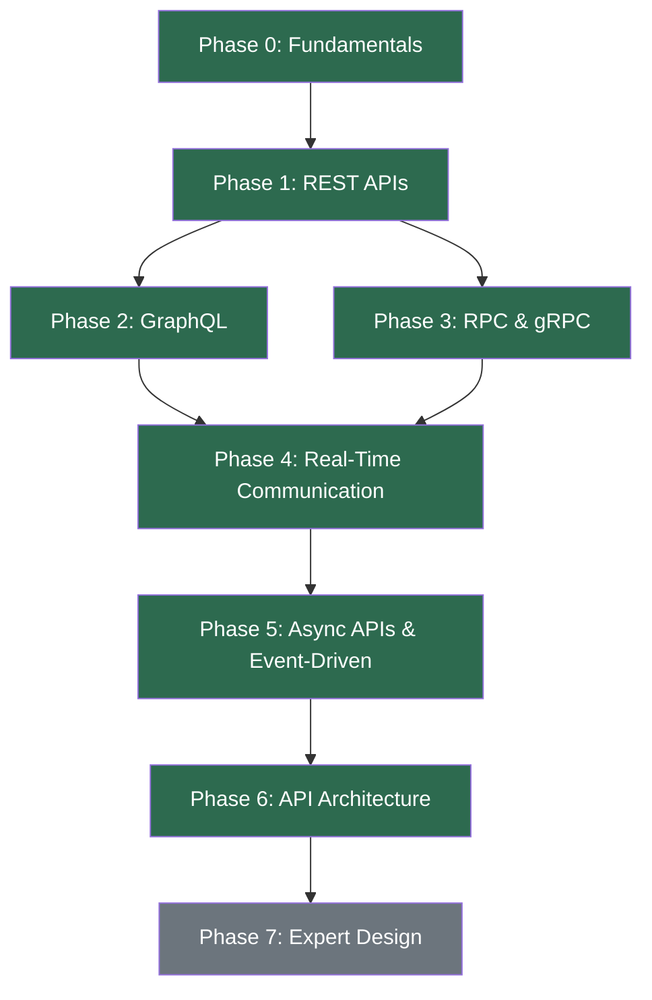
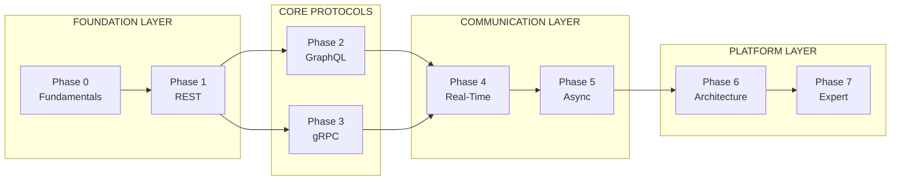

# 🌐 API Communication: Zero to Hero

> **A definitive guide to API communication** — from first principles to production-grade distributed system design. Built for developers who want to truly understand how modern systems talk to each other.

---

## 📖 What This Repository Is

This is a structured, progressive learning journey through **every major API communication method** used in modern software engineering. It covers the *why* behind each technology, not just the *how*.

Whether you're a junior developer building your first REST endpoint or a senior engineer designing multi-region event-driven architectures — this guide meets you where you are and takes you further.

---

## 🗺️ Learning Roadmap



---

## 📊 Current Progress

| Phase | Topic | Status | Document |
|-------|-------|--------|----------|
| 0 | Fundamentals | ✅ 100% | [00-FUNDAMENTALS.md](docs/00-FUNDAMENTALS.md) |
| 1 | REST APIs | ✅ 100% | [01-REST-APIS.md](docs/01-REST-APIS.md) |
| 2 | GraphQL | ✅ 100% | [02-GRAPHQL.md](docs/02-GRAPHQL.md) |
| 3 | RPC & gRPC | ✅ 100% | [03-RPC-AND-GRPC.md](docs/03-RPC-AND-GRPC.md) |
| 4 | Real-Time Communication | ✅ 100% | [04-REALTIME-COMMUNICATION.md](docs/04-REALTIME-COMMUNICATION.md) |
| 5 | Async APIs & Events | ✅ ~95% | [05-ASYNC-APIS.md](docs/05-ASYNC-APIS.md) |
| 6 | API Architecture | ✅ 100% | [06-API-ARCHITECTURE.md](docs/06-API-ARCHITECTURE.md) |
| 7 | Expert API Design | ❌ Coming Soon | [07-SENIOR-DESIGN-GUIDE.md](docs/07-SENIOR-DESIGN-GUIDE.md)¹ |

> ¹ The Senior Design Guide contains the comprehensive decision framework. Phase 7's dedicated expert-level content (API Evolution, Multi-Region, Sagas, Abuse Prevention, etc.) will be added as a future document.

**Overall Completion: ~90%**

---

## 🎯 Recommended Learning Path



**If you're starting fresh**, follow this order:
1. Fundamentals → REST (you need this foundation everywhere)
2. GraphQL + gRPC (understand alternatives to REST)
3. Real-Time (WebSocket, SSE, Push, WebRTC)
4. Async APIs (Queues, Kafka, Event-Driven Architecture)
5. API Architecture (Gateway, BFF, Service Mesh, Backpressure)
6. Senior Design Guide (the capstone decision framework)

**If you're a senior dev seeking a refresher**, start with the [Senior Design Guide](docs/07-SENIOR-DESIGN-GUIDE.md) and dive into specific phases as needed.

---

## 🧭 Quick Navigation

### By Topic

| I want to learn about... | Go to |
|--------------------------|-------|
| What APIs are, basic vocabulary | [Fundamentals](docs/00-FUNDAMENTALS.md) |
| REST resources, HTTP methods, status codes | [REST APIs](docs/01-REST-APIS.md) |
| Pagination, caching, idempotency | [REST APIs](docs/01-REST-APIS.md) |
| Client-driven data fetching, schemas | [GraphQL](docs/02-GRAPHQL.md) |
| N+1 problem, DataLoader, Federation | [GraphQL](docs/02-GRAPHQL.md) |
| Protocol Buffers, HTTP/2, streaming | [RPC & gRPC](docs/03-RPC-AND-GRPC.md) |
| WebSocket, SSE, long polling | [Real-Time](docs/04-REALTIME-COMMUNICATION.md) |
| Push notifications (FCM/APNS) | [Real-Time](docs/04-REALTIME-COMMUNICATION.md) |
| WebRTC, STUN/TURN/ICE | [Real-Time](docs/04-REALTIME-COMMUNICATION.md) |
| Kafka, RabbitMQ, SQS | [Async APIs](docs/05-ASYNC-APIS.md) |
| Delivery guarantees, DLQ, Saga | [Async APIs](docs/05-ASYNC-APIS.md) |
| Event sourcing, CQRS, Outbox | [Async APIs](docs/05-ASYNC-APIS.md) |
| API Gateway, BFF, Load Balancing | [API Architecture](docs/06-API-ARCHITECTURE.md) |
| Service Mesh, OpenAPI, Backpressure | [API Architecture](docs/06-API-ARCHITECTURE.md) |
| Choosing between REST/GraphQL/gRPC/WS | [Senior Design Guide](docs/07-SENIOR-DESIGN-GUIDE.md) |
| System design interview preparation | [Senior Design Guide](docs/07-SENIOR-DESIGN-GUIDE.md) |

### By Use Case

| I'm building... | Read these |
|-----------------|-----------|
| A public CRUD API | [REST](docs/01-REST-APIS.md) → [Architecture](docs/06-API-ARCHITECTURE.md) |
| A mobile app backend | [REST](docs/01-REST-APIS.md) → [GraphQL](docs/02-GRAPHQL.md) → [Architecture](docs/06-API-ARCHITECTURE.md) |
| Internal microservices | [gRPC](docs/03-RPC-AND-GRPC.md) → [Async](docs/05-ASYNC-APIS.md) → [Architecture](docs/06-API-ARCHITECTURE.md) |
| A chat/real-time app | [Real-Time](docs/04-REALTIME-COMMUNICATION.md) → [Async](docs/05-ASYNC-APIS.md) |
| A payment system | [REST](docs/01-REST-APIS.md) → [Async](docs/05-ASYNC-APIS.md) → [Senior Guide](docs/07-SENIOR-DESIGN-GUIDE.md) |
| An event-driven platform | [Async](docs/05-ASYNC-APIS.md) → [Architecture](docs/06-API-ARCHITECTURE.md) |

---

## 🏗️ Architecture at a Glance

The following diagram represents a mature API communication architecture — the kind you'll fully understand by the end of this journey:

```mermaid
graph TB
    subgraph Clients ["Clients"]
        Web[Web App]
        Mobile[Mobile App]
        Partner[Partners/IoT]
    end
    
    subgraph Edge ["Edge Layer"]
        CDN[CDN]
        GLB[Global Load Balancer]
    end
    
    subgraph Gateway ["Gateway Layer"]
        GW[API Gateway<br/>Auth | Rate Limit | Route | TLS]
    end
    
    subgraph Frontend_APIs ["Frontend APIs"]
        REST[REST APIs]
        GQL[GraphQL BFF]
        WS[WebSocket Gateway]
    end
    
    subgraph Services ["Internal Services"]
        US[User Service]
        CS[Course Service]
        PS[Payment Service]
        NS[Notification Service]
    end
    
    subgraph Async ["Async Layer"]
        Kafka[Kafka / Event Bus]
        Queue[Task Queues]
    end
    
    subgraph Consumers ["Event Consumers"]
        Analytics[Analytics]
        Email[Email/Notifications]
        Recs[Recommendations]
    end
    
    subgraph Observe ["Observability"]
        Logs[Logs + Metrics + Traces]
    end
    
    Clients --> CDN --> GLB --> GW
    GW --> REST & GQL & WS
    REST & GQL --> US & CS & PS
    WS --> NS
    US & CS & PS -->|gRPC| US & CS & PS
    US & CS & PS -->|Events| Kafka
    Kafka --> Analytics & Email & Recs
    PS -->|Jobs| Queue
    
    Services -.->|Telemetry| Logs
```

---

## 📐 The Senior Decision Framework

> *A senior engineer does not say: "REST is best" or "gRPC is faster, so use gRPC everywhere."*
>
> *A senior engineer asks: **Who is calling whom, how often, how quickly do they need a response, how reliable must delivery be, and who controls the client?***

| Question | If Yes → |
|----------|----------|
| Does the caller need an immediate answer? | REST / GraphQL / gRPC |
| Is the API mostly for frontend/mobile? | REST or GraphQL |
| Is it internal service-to-service? | gRPC |
| Does the server need to push updates? | SSE or WebSocket |
| Can work happen later? | Queue / Event Stream |
| Does another system need to notify you? | Webhook |

Full decision framework: [Senior Design Guide →](docs/07-SENIOR-DESIGN-GUIDE.md)

---

## 🔮 Coming Soon: Phase 7 — Expert API Design

Phase 7 will transform understanding from Senior Engineer to Staff/Principal level:

```
Module 7.1 — API Evolution (Backward/Forward Compatibility, Schema Evolution)
Module 7.2 — Consumer Driven Contracts (Pact, Contract Testing)
Module 7.3 — Multi-Region APIs (Geo Routing, Active-Active, DR)
Module 7.4 — Latency Budgets (SLO, SLI, SLA)
Module 7.5 — Distributed Transactions (2PC, Saga, Outbox, Compensation)
Module 7.6 — API Abuse Mitigation (DDoS, Bots, Credential Stuffing)
Module 7.7 — Production Incidents (Retry Storms, Cache Stampede, Thundering Herd)
```

---

## 📚 Sources & References

This documentation draws from and references:
- *Designing Data-Intensive Applications* by Martin Kleppmann
- Official documentation: [gRPC](https://grpc.io), [GraphQL](https://graphql.org), [OpenAPI](https://swagger.io)
- RFCs: WebSocket (RFC 6455), HTTP/2 (RFC 7540)
- MDN Web Docs (Server-Sent Events)
- Real-world architecture patterns from Netflix, Meta, Uber, Amazon, LinkedIn

---

## 🤝 How to Use This Repository

1. **Follow the phases in order** if you're building foundational knowledge
2. **Jump to specific topics** using the navigation tables above
3. **Use the Senior Design Guide** as your reference during system design interviews
4. **Each document is self-contained** — you can read any single doc without the others

---

<p align="center"><em>Real systems do not use only one communication method. The expert-level mindset is knowing when to use each.</em></p>
