# Phase 0 — Fundamentals

[← Back to Main README](../README.md) | [Next: REST APIs →](01-REST-APIS.md)

---

> **What you'll learn:** What is an API, what is a client, what is a server, what is a request, what is a response, what is a protocol, what is HTTP, and why APIs exist in system design.

---

## Quick Reference Card

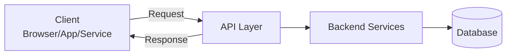

| Term     | Meaning                                               |
| -------- | ----------------------------------------------------- |
| Client   | The system that asks for something                    |
| Server   | The system that receives requests and sends responses |
| Request  | A message from client to server                       |
| Response | A message from server to client                       |
| Protocol | A rulebook for communication (HTTP, TCP, WebSocket)   |
| API      | A controlled doorway into a system                    |

---

## Table of Contents

- [1. What is an API?](#1-what-is-an-api)
- [2. Why do APIs exist?](#2-why-do-apis-exist)
- [3. Basic API vocabulary](#3-basic-api-vocabulary)
- [4. What are API communication methods?](#4-what-are-api-communication-methods)
- [5. Beginner mental model](#5-beginner-mental-model)
- [6. The core problem API methods solve](#6-the-core-problem-api-methods-solve)
- [7. Requirements and estimations](#7-requirements-and-estimations-for-api-communication-design)
- [8. Sample API design problem](#8-sample-api-design-problem)
- [9. Step-by-step design thinking](#9-step-by-step-design-thinking-from-monolith-to-distributed)
- [10. Main communication methods explained](#10-main-communication-methods-explained)
- [11. Comparison table](#11-comparison-table)
- [12. How a senior engineer chooses](#12-how-a-senior-engineer-chooses-the-right-api-method)
- [13. Requirements and estimations example](#13-requirements-and-estimations-example)
- [14. Edge cases and failure modes](#14-edge-cases-and-failure-modes)
- [15. Popular solutions](#15-popular-solutions-and-why-one-might-be-chosen)
- [16. Final polished architecture](#16-final-polished-architecture-diagram)
- [17. One realistic end-to-end flow](#17-one-realistic-end-to-end-flow)
- [18. Real-world lessons and pitfalls](#18-real-world-lessons-and-pitfalls)
- [19. The senior engineer checklist](#19-the-senior-engineer-checklist-for-api-design)
- [20. Beginner-to-hero summary](#20-beginner-to-hero-summary)

---

## Introduction

Absolutely, Irfan — we'll treat API communication methods as a full system design topic, not just "REST vs GraphQL vs RPC". Since you're learning this for the first time, I'll make it zero-to-hero, slowly structured, with simple words first and expert trade-offs later.
I also checked your enterprise/internal learning context and found relevant material: Designing Data-Intensive Applications discusses why RPC should not pretend a network call is the same as a local function call, why REST is popular for public APIs, and why RPC frameworks like gRPC are commonly used for internal service-to-service communication. I also found internal API learning resources in Percipio Skill Benchmarks, including API development fundamentals, REST/SOAP APIs, API management, error handling, OpenAPI, and Postman-related API testing. There is also an internal Services with GraphQL page that lists several services using GraphQL endpoints, which means this topic is directly relevant to real backend/platform work, not only interviews. [Designing...plications | PDF] [Percipio S...Benchmarks | PDF] [Services w...th GraphQL | Confluence (skillsoftdev)]

---

## API Communication Methods: Zero-to-Hero Roadmap

We will learn this in phases, because if we try to learn REST, RPC, GraphQL, WebSockets, gRPC, SOAP, webhooks, API gateways, protocols, scaling, security, failures, and real-world designs all at once, it becomes confusing.

### Full learning roadmap

**Phase 0 — Fundamentals**

You will learn:

- What is an API?
- What is a client?
- What is a server?
- What is a request?
- What is a response?
- What is a protocol?
- What is HTTP?
- Why APIs exist in system design.

**Phase 1 — REST APIs**

You will learn:

- Resources
- URLs
- HTTP methods
- Status codes
- Headers
- JSON
- Pagination
- Filtering
- Versioning
- Idempotency
- Caching
- Rate limiting
- REST trade-offs

**Phase 2 — RPC and gRPC**

You will learn:

- What is RPC?
- Why RPC feels like calling a function
- Why remote calls are dangerous
- gRPC
- Protocol Buffers
- HTTP/2
- Unary calls
- Server streaming
- Client streaming
- Bidirectional streaming
- RPC vs REST

The official gRPC documentation describes gRPC as a model where a client can directly call a method on a server application on another machine as if it were a local object, while defining services and methods with parameters and return types. Protocol Buffers are described as language-neutral, platform-neutral, extensible mechanisms for serialising structured data, similar to JSON but smaller and faster, with generated language bindings. [grpc.io] [protobuf.dev]

**Phase 3 — GraphQL**

You will learn:

- Why frontend teams wanted GraphQL
- Schema
- Query
- Mutation
- Resolver
- Over-fetching
- Under-fetching
- N+1 problem
- Federation
- GraphQL caching challenges
- GraphQL vs REST

The official GraphQL site describes GraphQL as an open-source query language for APIs and a server-side runtime, using a strongly typed schema to define relationships between data and allowing APIs to evolve over time. The GraphQL specification defines the language, type system, introspection, validation, execution, and response format. [graphql.org] [github.com]

**Phase 4 — Real-time communication**

You will learn:

- Polling
- Long polling
- Server-Sent Events
- WebSockets
- WebRTC basics
- Push notifications
- When WhatsApp-like systems need persistent connections

**Phase 5 — Asynchronous APIs**

You will learn:

- Message queues
- Kafka
- RabbitMQ
- SQS
- Webhooks
- Event-driven architecture
- Exactly-once myth
- Retry and dead-letter queues

**Phase 6 — API architecture in distributed systems**

You will learn:

- API Gateway
- Backend-for-Frontend
- Service mesh
- Load balancer
- Authentication
- Authorisation
- API contracts
- OpenAPI
- Observability
- Circuit breakers
- Timeouts
- Retries
- Backpressure

The OpenAPI Specification defines a standard, language-agnostic interface for HTTP APIs, allowing both humans and computers to understand a service without needing source code, extra documentation, or inspecting network traffic. OpenAPI documents can be used for documentation generation, code generation, testing tools, and other API lifecycle use cases. [swagger.io]

**Phase 7 — Expert-level API design**

You will learn:

- API evolution
- Backward compatibility
- Schema evolution
- Consumer-driven contracts
- Multi-region APIs
- Latency budgets
- Cross-service transactions
- API monetisation
- Abuse prevention
- Production incidents
- Design interview patterns

---

## Today's Lesson: Phase 0 + Big Picture

Let's begin from absolute basics.

---

## 1. What is an API?

### Simple explanation

An API is a way for two software systems to talk to each other.

Think of it like this:

```
You go to a restaurant.

You do not enter the kitchen.
You do not open the fridge.
You do not cook the food.

You talk to the waiter.
The waiter takes your order to the kitchen.
The kitchen prepares food.
The waiter brings the food back.

You = client
Waiter = API
Kitchen = backend/server
Food = response/data
Menu = API contract/documentation
```

So an API is a controlled doorway into a system.

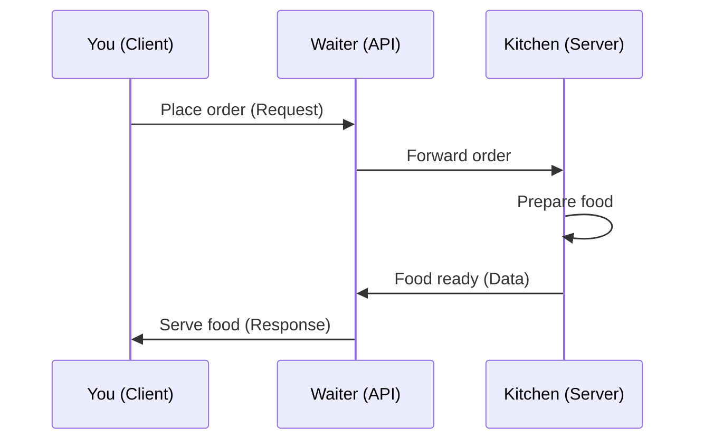

---

## 2. Why do APIs exist?

Imagine you are building an e-commerce app.

You need:

- User login
- Product search
- Cart
- Payment
- Order tracking
- Notifications
- Recommendations

The frontend/mobile app should not directly access the database.

**Bad design:**

```
Mobile App ---> Database
Web App -----> Database
Admin App ---> Database
```

Why is this bad?

Because:

- Database credentials may leak.
- Every app needs to understand database structure.
- Changing the database breaks all clients.
- No central security.
- No validation.
- No rate limiting.
- No audit logging.

**Better design:**

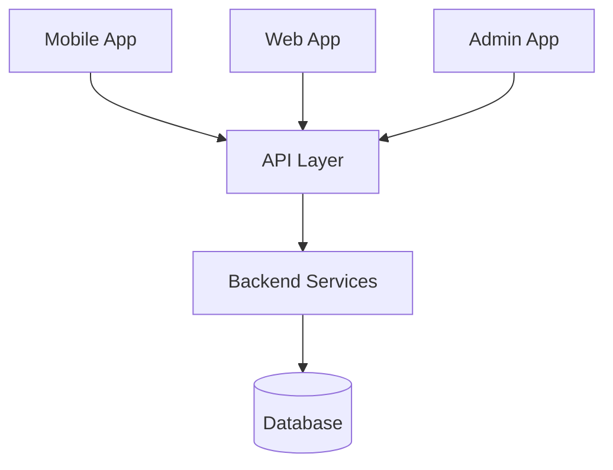

```
Mobile App
Web App       →  API Layer  →  Backend Services  →  Database
Admin App
```

The API layer protects the backend.

---

## 3. Basic API vocabulary

Let's build the dictionary first.

### Client

The system that asks for something.

Examples:

- Browser
- React app
- iOS app
- Android app
- Another backend service
- Postman
- CLI script

### Server

The system that receives the request and sends a response.

Examples:

- Node.js backend
- Java Spring service
- Python FastAPI service
- Go microservice

### Request

A message from client to server.

Example:

```http
GET /users/123
```

Meaning: "Please give me user 123."

### Response

A message from server to client.

Example:

```json
{
  "id": 123,
  "name": "Irfan"
}
```

Meaning: "Here is the user data."

### Protocol

A protocol is a rulebook for communication.

Examples:

- HTTP
- HTTPS
- TCP
- WebSocket
- gRPC over HTTP/2
- SMTP
- MQTT

If API is the "conversation", protocol is the "language grammar".

---

## 4. What are API communication methods?

API communication methods are different styles of talking between systems.

**Main styles:**

1. REST
2. RPC
3. gRPC
4. GraphQL
5. SOAP
6. WebSocket
7. Server-Sent Events
8. Webhooks
9. Message queues/events

Each style answers a different question:

```
REST     → I want resources using HTTP.
RPC      → I want to call remote functions.
gRPC     → I want fast typed service-to-service calls.
GraphQL  → I want client-controlled data fetching.
WebSocket→ I want real-time two-way communication.
Webhook  → Notify me when something happens.
Queue    → Process work asynchronously and reliably.
SOAP     → Enterprise XML contract-heavy communication.
```

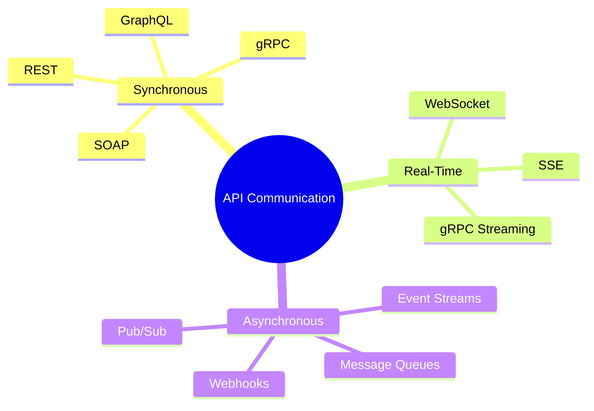

---

## 5. Beginner mental model

Let's compare them using everyday examples.

| Method    | Real-world analogy                            | Best for                          |
| --------- | --------------------------------------------- | --------------------------------- |
| REST      | Ordering from a menu                          | Public CRUD APIs                  |
| RPC       | Calling a person and asking them to do a task | Internal service calls            |
| gRPC      | High-speed office intercom with strict format | Microservices                     |
| GraphQL   | Buffet where you pick exactly what you want   | Frontend/mobile apps              |
| WebSocket | Phone call that stays connected               | Chat, live games, trading         |
| Webhook   | Doorbell notification                         | Payment success, GitHub events    |
| Queue     | Letterbox/task queue                          | Background jobs, async processing |

---

## 6. The core problem API methods solve

When two systems communicate, they must agree on five things:

```
1. Where to send the request?
2. What action is being requested?
3. What data format is used?
4. How will errors be represented?
5. How will the system scale and handle failures?
```

Different API styles solve these differently.

---

## 7. Requirements and estimations for API communication design

Before choosing REST, GraphQL, RPC, or WebSocket, a senior engineer asks requirements.

### Functional requirements

These are about what the API must do.

Example:

- Create user
- Login user
- Fetch user profile
- Search products
- Place order
- Send message
- Upload image
- Show recommendations

### Non-functional requirements

These are about how well the API must work.

Example:

- Low latency
- High availability
- High throughput
- Strong security
- Backward compatibility
- Easy debugging
- Easy documentation
- Mobile-friendly
- Works across languages
- Supports real-time communication

---

## 8. Sample API design problem

Let's take a small example:

**Design APIs for a learning platform like Skillsoft/Percipio where users browse courses, start courses, track progress, and receive recommendations.**

### Functional requirements

1. User can view course catalogue.
2. User can search courses.
3. User can open course details.
4. User can start a course.
5. User progress is saved.
6. User receives recommendations.
7. Admin can create/update courses.

### Non-functional requirements

1. Course browsing should be fast.
2. Search should handle many filters.
3. Progress update should be reliable.
4. Recommendations may call multiple services.
5. Mobile app should avoid unnecessary data.
6. Public APIs should be easy to document.
7. Internal services should communicate efficiently.

Already, we can see one API style may not be enough.

**Possible choices:**

```
REST     → Course CRUD, admin APIs
GraphQL  → Mobile/web course detail pages
gRPC     → Internal recommendation/profile/progress service calls
WebSocket→ Live classroom/chat if needed
Webhook  → Notify external LMS when course completed
Queue    → Background analytics/progress events
```

> **Key Insight:** Real systems do not use only one communication method.

---

## 9. Step-by-step design thinking: from monolith to distributed

Now let's think like a system designer.

### Stage 1 — Simple monolithic API

At the beginning, you may build one backend.

```
React / Mobile App
        |
        v
  Monolithic Backend
        |
        v
  Single Database
```

Example APIs:

```http
GET  /courses
GET  /courses/123
POST /courses/123/start
POST /courses/123/progress
GET  /recommendations
```

This is simple.

#### Why REST is good here

REST is easy to understand, debug, test with Postman/cURL, document with OpenAPI, cache through HTTP, and expose publicly. Designing Data-Intensive Applications notes that RESTful APIs are good for experimentation and debugging, supported across mainstream languages/platforms, and have a large ecosystem of servers, caches, load balancers, proxies, monitoring, debugging, and testing tools. [Designing...plications | PDF]

#### Stage 1 architecture

```
+------------------+
| Web / Mobile App |
+--------+---------+
         |
         | HTTPS REST/JSON
         v
+------------------+
| Monolith API     |
| Node.js/Java/etc |
+--------+---------+
         |
         v
+------------------+
|   SQL Database   |
+------------------+
```

**Pros:**

- Easy to build
- Easy to debug
- Easy to deploy
- Easy for frontend developers
- Good for small teams

**Cons:**

- App becomes large
- One deployment affects everything
- Scaling one feature means scaling whole app
- Different teams block each other

---

### Stage 2 — Split into services

As the product grows, the monolith may split.

```
        API Gateway
             |
    +--------+--------+--------+--------+
    |        |        |        |        |
  User    Course  Progress  Recommend  Search
 Service  Service  Service   Service   Service
```

Now services must talk to each other.

**Question:** Should internal services use REST, RPC, or gRPC?

**Design thinking:**

REST is still possible:

```
Course Service    ---> GET /users/123
Progress Service  ---> GET /courses/123
Recommendation    ---> GET /progress/user/123
```

But internal service calls may need:

- Lower latency
- Strong schema
- Code generation
- Streaming
- Contract safety
- Multi-language support

That is where RPC/gRPC becomes attractive.

Designing Data-Intensive Applications says REST seems predominant for public APIs, while the main focus of RPC frameworks is requests between services owned by the same organisation, typically within the same datacentre. [Designing...plications | PDF]

#### Stage 2 architecture

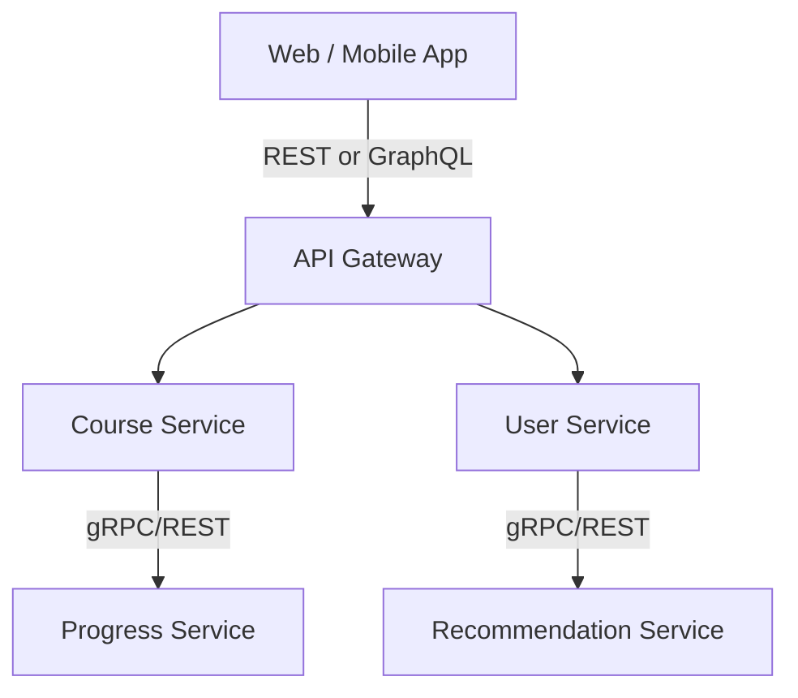

```
+------------------+
| Web / Mobile App |
+--------+---------+
         |
         | HTTPS REST or GraphQL
         v
+------------------+
|   API Gateway    |
+---+----------+---+
    |          |
    |          |
    v          v
+--------+ +-------------+
| Course | |    User     |
|Service | |   Service   |
+---+----+ +------+------+
    |              |
    | gRPC/REST    | gRPC/REST
    v              v
+----------+ +-------------+
| Progress | | Recommend   |
| Service  | | Service     |
+----------+ +-------------+
```

---

### Stage 3 — Add GraphQL for frontend flexibility

Suppose the course detail page needs:

- Course title
- Course author
- Progress
- Recommendations
- Ratings
- Skills
- Similar courses

With REST, frontend might call:

```http
GET /courses/123
GET /courses/123/author
GET /users/me/progress/123
GET /courses/123/ratings
GET /courses/123/skills
GET /recommendations?courseId=123
```

That is many calls.

GraphQL lets frontend ask:

```graphql
query {
  course(id: "123") {
    title
    author {
      name
    }
    progress {
      percentComplete
    }
    ratings {
      average
    }
    recommendations {
      title
    }
  }
}
```

GraphQL is useful when the client wants exactly shaped data. The official GraphQL site describes its model as allowing clients to ask for what they want and get predictable results shaped like the query. [graphql.org]

Meta publicly describes Mobile GraphQL as a framework used to fetch data in mobile applications using GraphQL, and says it handles data fetching for apps like Facebook and Instagram. [engineering.fb.com]

#### Stage 3 architecture

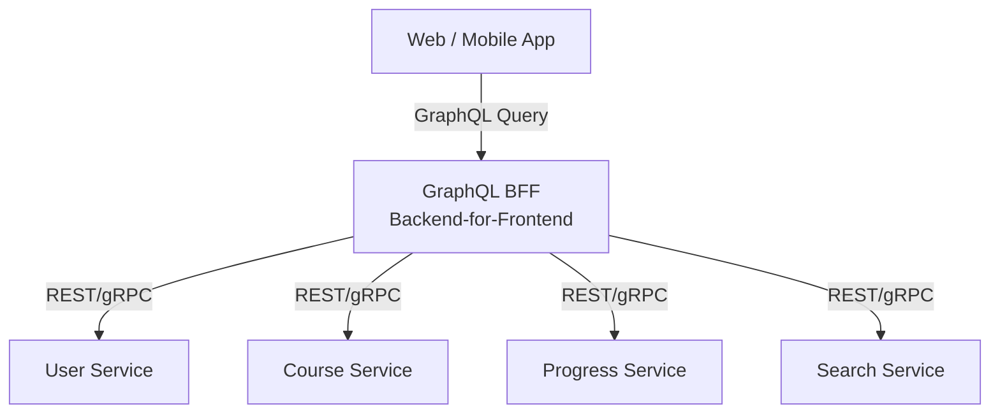

```
+------------------+
| Web / Mobile App |
+--------+---------+
         |
         | GraphQL Query
         v
+------------------+
|  GraphQL BFF     |
|  Backend-for-    |
|  Frontend        |
+--------+---------+
         |
         | REST/gRPC/internal calls
         v
+--------+---------+----------------+
| User | Course | Progress | Search |
+------+--------+----------+--------+
```

---

### Stage 4 — Add async APIs/events

Some work should not happen during the user request.

Example: When user completes a course:

1. Save progress immediately.
2. Update achievement badge.
3. Send notification.
4. Update analytics.
5. Trigger recommendation refresh.
6. Notify external system.

If all happen synchronously, the API becomes slow and fragile.

**Better:**

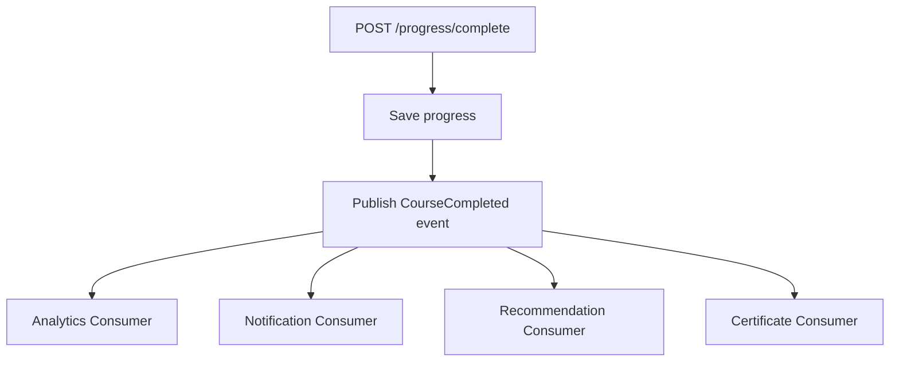

```
POST /progress/complete
        |
        v
  Save progress
        |
        v
  Publish CourseCompleted event
        |
    +---+---+---+
    |   |   |   |
    v   v   v   v
Analytics  Notification  Recommendation  Certificate
Consumer   Consumer      Consumer        Consumer
```

Architecture:

```
+-------------+
| API Service |
+------+------+
       |
       | publish event
       v
+-------------+
| Kafka/Queue |
+------+------+----------------+
       |            |          |
       v            v          v
  Analytics   Notification  Recommendation
  Service     Service       Service
```

---

## 10. Main communication methods explained

Now we'll introduce each method clearly.

### 10.1 REST

REST is an architectural style for web APIs.

REST thinks in **resources**.

Examples:

- User
- Course
- Order
- Payment
- Message
- Comment

REST usually uses HTTP methods.

```http
GET    /courses       → list courses
GET    /courses/123   → get one course
POST   /courses       → create course
PUT    /courses/123   → replace course
PATCH  /courses/123   → partially update course
DELETE /courses/123   → delete course
```

Roy Fielding's REST dissertation describes REST as an architectural style for distributed hypermedia systems and explains constraints such as client-server, statelessness, cache, uniform interface, layered system, and optional code-on-demand. [roy.gbiv.com]

**When REST is best:**

- Public APIs
- CRUD systems
- Simple client-server apps
- Easy documentation
- Easy testing
- HTTP caching
- Browser-friendly APIs

**REST strengths:**

- Simple
- Human-readable
- Works everywhere
- Easy with Postman/cURL
- Easy with API Gateway
- Easy to cache GET requests
- Easy to document using OpenAPI

**REST weaknesses:**

- Can over-fetch data
- Can under-fetch data
- Multiple round trips for complex screens
- No strict schema by default
- Versioning can become messy
- Not ideal for very high-performance internal calls

---

### 10.2 RPC

RPC means Remote Procedure Call.

Instead of thinking in resources, RPC thinks in **actions/functions**.

Example:

```
getUser()
createOrder()
chargePayment()
sendMessage()
calculateRecommendation()
```

REST style:

```http
GET  /users/123
POST /orders
POST /payments
```

RPC style:

```http
POST /GetUser
POST /CreateOrder
POST /ChargePayment
```

Or:

```protobuf
service UserService {
  rpc GetUser(GetUserRequest) returns (UserResponse);
}
```

#### Important warning

A remote function call is **not** the same as a local function call.

| Local call       | Remote call                 |
| ---------------- | --------------------------- |
| Fast             | Can timeout                 |
| Same memory      | Can fail                    |
| Usually reliable | Can be slow                 |
| No network       | Can be retried accidentally |
|                  | Can duplicate side effects  |
|                  | Can cross datacentres       |
|                  | Can fail halfway            |

Designing Data-Intensive Applications explicitly warns that there is no point trying to make a remote service look too much like a local object because it is fundamentally different, and notes that modern RPC frameworks are more explicit about remote calls being asynchronous actions that may fail. [Designing...plications | PDF]

**When RPC is best:**

- Internal microservice communication
- Clear command/action APIs
- Strong contracts
- Low-latency service calls
- Multi-language environments

---

### 10.3 gRPC

gRPC is a modern RPC framework.

It commonly uses:

- HTTP/2
- Protocol Buffers
- Strong service contracts
- Code generation
- Streaming support

Official gRPC documentation says gRPC can use Protocol Buffers as both the Interface Definition Language and the message interchange format. [grpc.io]

Example .proto file:

```protobuf
syntax = "proto3";

service CourseService {
  rpc GetCourse(GetCourseRequest) returns (CourseResponse);
}

message GetCourseRequest {
  string course_id = 1;
}

message CourseResponse {
  string id = 1;
  string title = 2;
  int32 duration_minutes = 3;
}
```

**gRPC call types:**

```
1. Unary
   One request, one response.

2. Server streaming
   One request, many responses.

3. Client streaming
   Many requests, one response.

4. Bidirectional streaming
   Many requests, many responses.
```

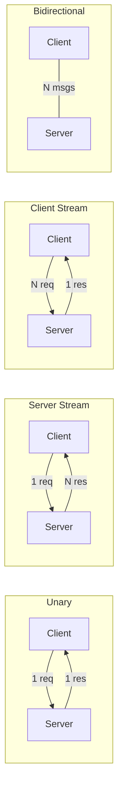

Designing Data-Intensive Applications notes that gRPC supports streams where a call can consist of a series of requests and responses over time. [Designing...plications | PDF]

**When gRPC is best:**

- Internal service-to-service APIs
- High-performance APIs
- Polyglot microservices
- Streaming service calls
- Strongly typed contracts

**gRPC weaknesses:**

- Harder to debug manually than REST
- Browser support requires extra handling
- Not as human-readable as JSON
- Requires generated clients
- Schema evolution discipline is required

---

### 10.4 GraphQL

GraphQL lets the client ask for exactly the data it needs.

**Example REST problem:**

```
Mobile screen needs:
- user name
- avatar
- latest 3 courses
- progress
- recommendations

REST may need many endpoints.
```

**GraphQL solution:**

```graphql
query {
  me {
    name
    avatarUrl
    courses(limit: 3) {
      title
      progress
    }
    recommendations {
      title
    }
  }
}
```

**GraphQL strengths:**

- Avoids over-fetching
- Avoids under-fetching
- Great for frontend/mobile apps
- Strong schema
- Introspection
- Good developer experience
- Allows frontend and backend teams to work independently

**GraphQL weaknesses:**

- Caching is harder than REST
- Query complexity can hurt backend
- N+1 resolver problem
- Needs depth limits and cost limits
- File upload is less natural
- Error handling can be nuanced

**Real-world note:** Meta says Mobile GraphQL is used for data fetching in mobile applications and handles data fetching for Facebook and Instagram. This is a good lesson: GraphQL became popular because complex mobile apps need flexible, efficient data fetching. [engineering.fb.com]

---

### 10.5 WebSocket

WebSocket keeps a connection open.

**REST:**

```
Client asks.
Server answers.
Connection may close.
```

**WebSocket:**

```
Client connects.
Connection stays open.
Both sides can send messages anytime.
```

Useful for:

- WhatsApp-like chat
- Live typing indicators
- Online presence
- Multiplayer games
- Stock prices
- Live dashboards

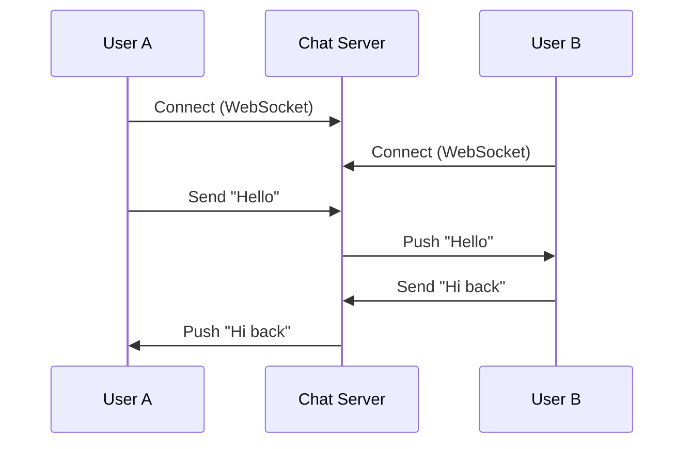

**WebSocket strengths:**

- Real-time
- Bidirectional
- Low latency after connection established

**WebSocket weaknesses:**

- More complex scaling
- Connection state must be managed
- Load balancing needs sticky/session-aware design
- Harder failure recovery
- Mobile networks frequently disconnect

---

### 10.6 Webhooks

A webhook is: "Call my API when something happens."

Example:

```
Payment succeeded → Payment provider calls your webhook
GitHub push event → GitHub calls your webhook
Course completed  → LMS calls your webhook
```

Request:

```http
POST /webhooks/payment-success
```

Payload:

```json
{
  "event": "payment.succeeded",
  "paymentId": "pay_123",
  "amount": 5000
}
```

**Webhook strengths:**

- Event-driven
- No polling needed
- Good for integrations

**Webhook weaknesses:**

- Receiver may be down
- Need retries
- Need signature verification
- Need idempotency
- Events can arrive late or duplicated

---

### 10.7 Message queues/events

Message queues are not exactly "API" in the HTTP sense, but they are a communication method.

Instead of:

```
Service A calls Service B directly
```

You do:

```
Service A publishes event
Service B consumes later
```

Example:

```
Order Service → OrderCreated event → Email Service
```

**Strengths:**

- Decoupling
- Better resilience
- Handles spikes
- Background processing
- Retry support

**Weaknesses:**

- Eventual consistency
- Harder debugging
- Duplicate events possible
- Ordering can be tricky
- More moving parts

---

## 11. Comparison table

| Style       | Communication model    | Data format        | Best for                    | Main weakness                   |
| ----------- | ---------------------- | ------------------ | --------------------------- | ------------------------------- |
| REST        | Resource-based         | Usually JSON       | Public CRUD APIs            | Over/under-fetching             |
| RPC         | Function/action-based  | JSON/binary/etc.   | Internal operations         | Can hide network complexity     |
| gRPC        | Strongly typed RPC     | Protobuf           | Microservices               | Harder browser/manual debugging |
| GraphQL     | Client-specified query | Usually JSON       | Frontend/mobile aggregation | Caching/query complexity        |
| WebSocket   | Persistent two-way     | JSON/binary        | Real-time apps              | Connection scaling              |
| Webhook     | Event callback         | JSON               | External integrations       | Retry/security/idempotency      |
| Queue/Event | Async messaging        | JSON/Avro/Protobuf | Background workflows        | Eventual consistency            |
| SOAP        | XML contract           | XML                | Legacy enterprise systems   | Verbose/complex                 |

---

## 12. How a senior engineer chooses the right API method

Use this decision guide.

### Choose REST when

- API is public
- CRUD-focused
- You want simple HTTP semantics
- You want easy caching
- You want OpenAPI docs
- Consumers are many and unknown

Example: `GET /users/123`, `GET /courses`, `POST /orders`

### Choose GraphQL when

- Frontend needs flexible data
- Mobile bandwidth matters
- Multiple backend services are aggregated
- Product UI changes frequently

Example: Course detail page aggregating course, progress, author, recommendations.

### Choose gRPC when

- Services are internal
- Performance matters
- Strong schema matters
- You control both client and server
- Multi-language services communicate

Example: Recommendation service calls user-profile service.

### Choose WebSocket when

- Server must push data instantly
- Real-time bi-directional communication is required

Example: WhatsApp messages, reactions, typing indicators.

### Choose queue/events when

- Work can happen later
- You want resilience
- You need decoupling
- Traffic spikes should be absorbed

Example: Send email after order placement.

### Choose webhook when

- External system needs to notify you
- You do not want to poll repeatedly

Example: Stripe/payment success notification.

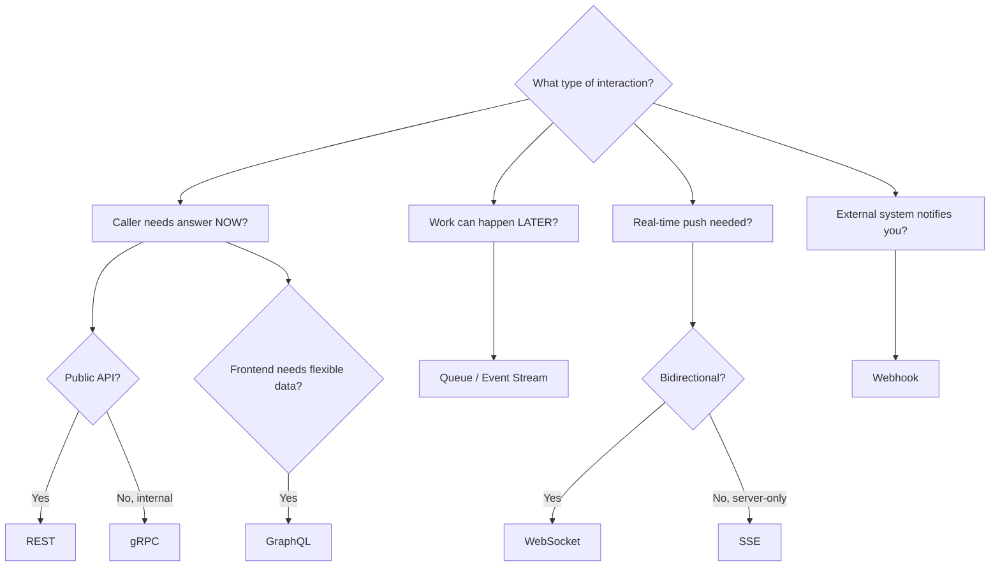

---

## 13. Requirements and estimations example

Let's design API communication for a social app like Instagram.

### Assumptions for learning only

These are illustrative assumptions, not claims about Instagram's real numbers.

```
Users: 10 million daily active users
Feed reads: 100 million/day
Post creations: 5 million/day
Likes/comments: 50 million/day
Chat messages: 200 million/day
Notifications: 100 million/day
```

### Traffic shape

```
Feed reads are read-heavy.
Posts are write-heavy but less frequent.
Chat needs real-time delivery.
Notifications can be async.
Analytics can be async.
```

### API style selection

| Use case              | API method          |
| --------------------- | ------------------- |
| Login/profile         | REST                |
| Feed screen           | GraphQL or REST BFF |
| Internal feed ranking | gRPC                |
| Chat                  | WebSocket           |
| Notifications         | Queue + Push        |
| Payment/subscription  | Webhook             |
| Analytics             | Event stream        |

---

## 14. Edge cases and failure modes

This is where beginner design becomes senior design.

### 14.1 Timeout

**Problem:**

```
Client calls API.
Server takes too long.
Client gives up.
But server may still process the request.
```

Example: `POST /payments` — client times out and retries.

**Risk:** User may be charged twice.

**Solution:** Use idempotency keys.

```http
POST /payments
Idempotency-Key: abc-123
```

Server says: If I already processed abc-123, return same result. Do not repeat side effect.

### 14.2 Retry storm

**Problem:**

```
Service B is slow.
Service A retries aggressively.
Many clients retry.
Service B gets even more load.
System collapses.
```

**Solution:**

- Exponential backoff
- Jitter
- Circuit breaker
- Retry budget
- Timeouts

### 14.3 Partial failure

**Problem:**

```
Order created.
Payment succeeded.
Notification failed.
```

Should order fail? Usually no.

**Solution:** Use async events. Retry notification separately.

### 14.4 Duplicate requests

**Problem:** Mobile app sends same request twice due to network issue.

**Solution:**

- Idempotency key
- Unique constraints
- Deduplication table

### 14.5 Out-of-order events

**Problem:** Event 2 arrives before Event 1.

Example: MessageRead event arrives before MessageDelivered.

**Solution:**

- Sequence numbers
- Timestamps
- Version numbers
- Partition by entity ID

### 14.6 Backward compatibility

**Problem:**

Old mobile app expects:

```json
{ "name": "Irfan" }
```

New API returns:

```json
{ "fullName": "Irfan Mohammad" }
```

Old app breaks.

**Solution:**

- Add fields, do not remove suddenly
- Keep old fields during transition
- Version APIs
- Use schema compatibility checks

Designing Data-Intensive Applications notes that adding optional request parameters and adding new fields to response objects are usually considered compatible changes for REST-style JSON APIs. [Designing...plications | PDF]

### 14.7 GraphQL expensive query

**Problem:**

Client sends deeply nested query that may destroy backend performance.

**Solution:**

- Query depth limit
- Query cost analysis
- Rate limiting
- Persisted queries
- Timeouts
- DataLoader batching

### 14.8 WebSocket disconnect

**Problem:** Mobile network disconnects.

**Solution:**

- Reconnect logic
- Heartbeats/ping-pong
- Message acknowledgements
- Offline queue
- Last seen sequence ID

### 14.9 Webhook replay attack

**Problem:** Attacker resends old webhook.

**Solution:**

- Signature verification
- Timestamp validation
- Event ID deduplication

---

## 15. Popular solutions and why one might be chosen

### REST + OpenAPI

Best when:

- Public API
- External consumers
- Documentation matters
- Client generation needed

OpenAPI is useful because it formally describes HTTP APIs and can be used by documentation generation tools, code generation tools, and testing tools. [swagger.io]

### GraphQL

Best when:

- UI needs flexible fields
- Mobile optimisation matters
- One screen aggregates many services

Meta's public engineering post says Mobile GraphQL handles data fetching for apps like Facebook and Instagram, which shows GraphQL's value for complex mobile products. [engineering.fb.com]

### gRPC + Protobuf

Best when:

- Internal services
- Strong typing
- Low latency
- Streaming
- Polyglot microservices

gRPC documentation says clients and servers can communicate across environments and supported languages, and the client uses a stub that provides the same methods as the server service definition. [grpc.io]

### WebSocket

Best when:

- Real-time two-way communication

Example: WhatsApp, live collaboration, trading, multiplayer games.

### Kafka/Queue

Best when:

- Decoupled background processing
- Event-driven architecture
- Stream processing

Example: Analytics, notifications, recommendations, audit logs.

---

## 16. Final polished architecture diagram

Let's design a modern large-scale API communication architecture.

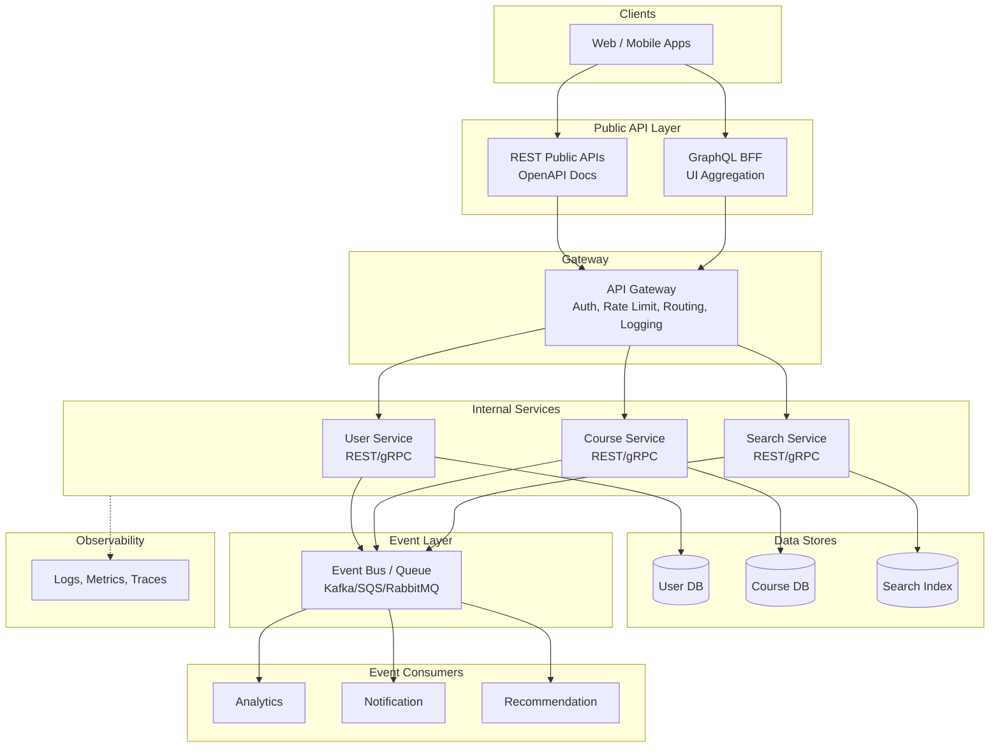

```
+----------------------+
|  Web / Mobile Apps   |
+----------+-----------+
           |
  +--------+--------+
  |                 |
  v                 v
+------------------+ +------------------+
| REST Public APIs | | GraphQL BFF      |
| OpenAPI Docs     | | UI Aggregation   |
+--------+---------+ +--------+---------+
         |                    |
         +--------+-----------+
                  |
                  v
+----------------------+
|     API Gateway      |
| Auth, Rate Limit,    |
| Routing, Logging     |
+----------+-----------+
           |
   +-------+-------+-------+
   |       |       |       |
   v       v       v       v
+------+ +------+ +------+ +------+
| User | |Course| |Search| | ...  |
| Svc  | | Svc  | | Svc  | |      |
+--+---+ +--+---+ +--+---+ +------+
   |        |        |
   v        v        v
+------+ +------+ +------+
|UserDB| |CrsDB | |Index |
+------+ +------+ +------+

           |
           v
+----------------------+
| Event Bus / Queue    |
| Kafka/SQS/RabbitMQ   |
+----------+-----------+
           |
   +-------+-------+-------+
   |       |       |       |
   v       v       v       v
Analytics  Notification  Recommendation
Consumer   Consumer      Consumer

+----------------------+
|    Observability     |
| Logs, Metrics, Trace |
+----------------------+
```

---

## 17. One realistic end-to-end flow

### User opens course detail screen

```
1. Mobile app sends GraphQL query.
2. GraphQL BFF receives request.
3. BFF calls Course Service for course info.
4. BFF calls Progress Service for user progress.
5. BFF calls Recommendation Service for related courses.
6. Internal calls may use gRPC.
7. BFF combines data.
8. Mobile receives exactly required fields.
```

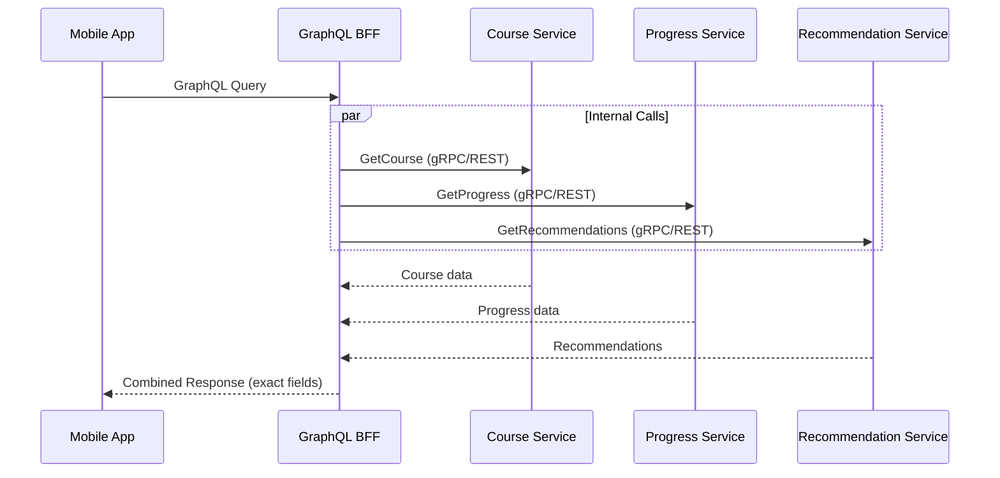

### User completes course

```
1. Mobile sends POST /progress/complete.
2. API validates user.
3. Progress Service saves completion.
4. Event is published: CourseCompleted.
5. Notification Service sends congratulations.
6. Analytics Service records event.
7. Recommendation Service refreshes recommendations.
8. Certificate Service generates certificate.
```

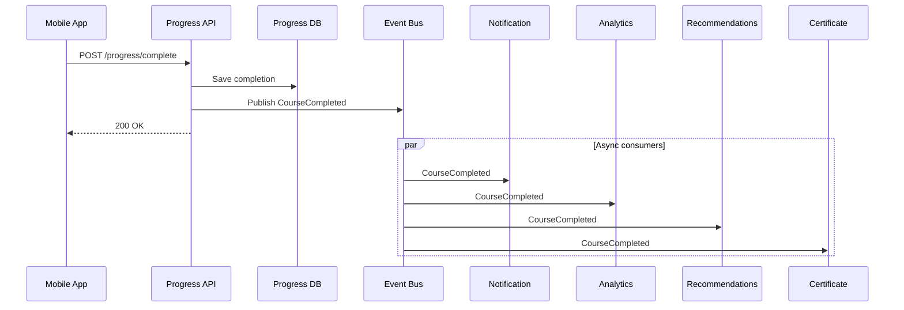

> **This is a professional distributed-system pattern:** synchronous for user-critical work, asynchronous for side effects.

---

## 18. Real-world lessons and pitfalls

### TinyURL / Bitly-style URL shortener lesson

A URL shortener has two main user-visible operations:

1. Create short URL.
2. Redirect short URL to long URL.

The redirect path is usually much more frequent than the creation path.

**Design lesson:**

- Optimise reads first.
- Use cache.
- Keep redirect path tiny.
- Move analytics async.

A public Bitly system design article highlights this exact idea: URL shortening is read-heavy, redirects must be extremely fast, analytics should be decoupled asynchronously, and abuse prevention is important because shorteners are targets for phishing and malware. [educative.io]

**API method mapping:**

```
POST /shorten           → REST
GET  /abc123            → REST redirect
Analytics pipeline      → Async events
Internal operations     → gRPC/queue
```

### WhatsApp-style chat lesson

Chat needs:

- Real-time delivery
- Online presence
- Last seen
- Message acknowledgement
- Offline delivery

REST alone is not enough.

**Better:**

```
REST      → Login, contacts, profile
WebSocket → Real-time messages
Queue     → Offline delivery and fanout
gRPC      → Internal service calls
```

**Pitfall:** Do not store all connection state in one server. If server dies, users disconnect. Need reconnect and message sync.

### Instagram/Facebook-style feed lesson

Feed systems need:

- Mobile-friendly data fetching
- Many backend sources
- Ranking
- Media metadata
- User state
- Comments
- Likes

GraphQL/BFF can help frontend request the exact data needed. Meta states that Mobile GraphQL handles data fetching for Facebook and Instagram mobile applications. [engineering.fb.com]

**Pitfall:** GraphQL does not magically make backend fast. Bad resolvers can create N+1 service/database calls.

**Solution:**

- Batching
- Caching
- Persisted queries
- Query cost limits
- DataLoader pattern

### Facebook-scale internal communication lesson

At large company scale:

- Public APIs optimise developer experience.
- Internal service APIs optimise performance and reliability.
- Event pipelines handle analytics and non-critical side effects.
- API gateways enforce cross-cutting concerns.

This aligns with the pattern described in Designing Data-Intensive Applications: REST is dominant for public APIs, while RPC frameworks are commonly used for internal service-to-service communication owned by the same organisation. [Designing...plications | PDF]

---

## 19. The "senior engineer" checklist for API design

Whenever you design an API, ask:

### Product questions

1. Who is the consumer?
2. Is it public or internal?
3. Is it frontend, mobile, backend, or third-party?
4. Is data read-heavy or write-heavy?
5. Is real-time communication needed?

### Technical questions

1. What latency is acceptable?
2. What throughput is expected?
3. Is strong typing required?
4. Is caching important?
5. Is browser support required?
6. Are clients controlled by us?
7. How will versioning work?
8. What happens on timeout?
9. What happens on retry?
10. How do we prevent duplicate side effects?

### Operational questions

1. How do we log requests?
2. How do we trace across services?
3. How do we rate limit?
4. How do we authenticate?
5. How do we authorise?
6. How do we monitor errors?
7. How do we roll out breaking changes?
8. How do we test contracts?

---

## 20. Beginner-to-hero summary

If you remember only this today:

```
REST:
  Best for resource-based public APIs.

RPC:
  Best for action/function-style internal APIs.

gRPC:
  Best for fast, strongly typed service-to-service communication.

GraphQL:
  Best when frontend/mobile wants flexible data shape.

WebSocket:
  Best for real-time two-way communication.

Webhook:
  Best when external systems notify you about events.

Queue/Event:
  Best when work can happen asynchronously and should be resilient.
```

**The expert-level mindset is:**

```
Do not ask "Which API style is best?"

Ask:
"For this use case, who is the consumer, what latency is needed,
how much data is transferred, how often will it change,
how will it fail, and who owns both sides?"
```

---

## 21. What we should study next

Next, we should go deep into REST from zero to hero, because REST is the foundation you'll see everywhere.

The next lesson should cover:

1. What is HTTP?
2. What are resources?
3. HTTP methods: GET, POST, PUT, PATCH, DELETE
4. Status codes: 200, 201, 400, 401, 403, 404, 409, 429, 500
5. Headers
6. Query params vs path params
7. Request body vs response body
8. Pagination
9. Filtering
10. Sorting
11. Idempotency
12. REST API design mistakes
13. Production-grade REST API architecture

**Continue to:** [Phase 1 — REST APIs →](01-REST-APIS.md)

---

[← Back to Main README](../README.md) | [Next: REST APIs →](01-REST-APIS.md)
