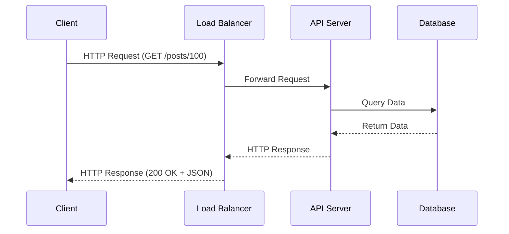
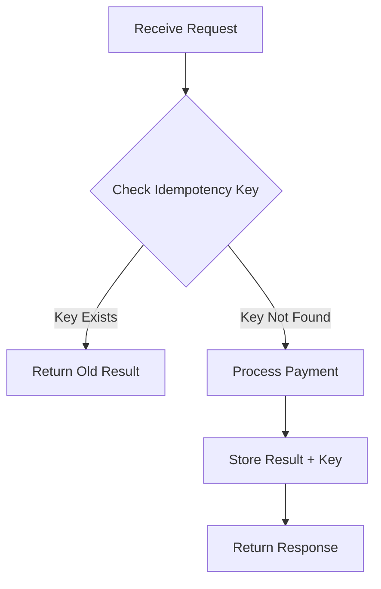
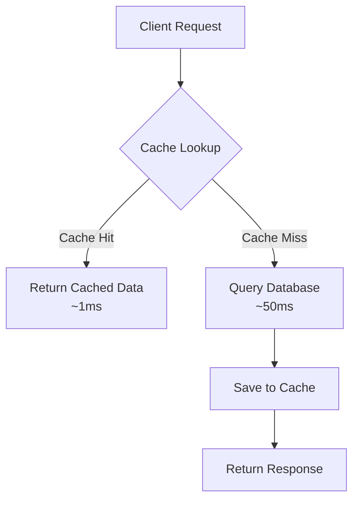
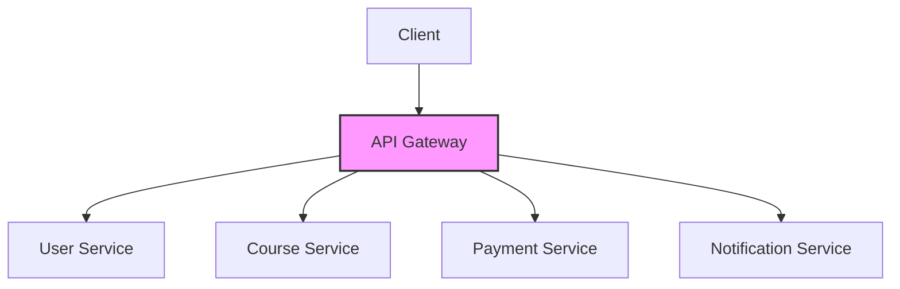
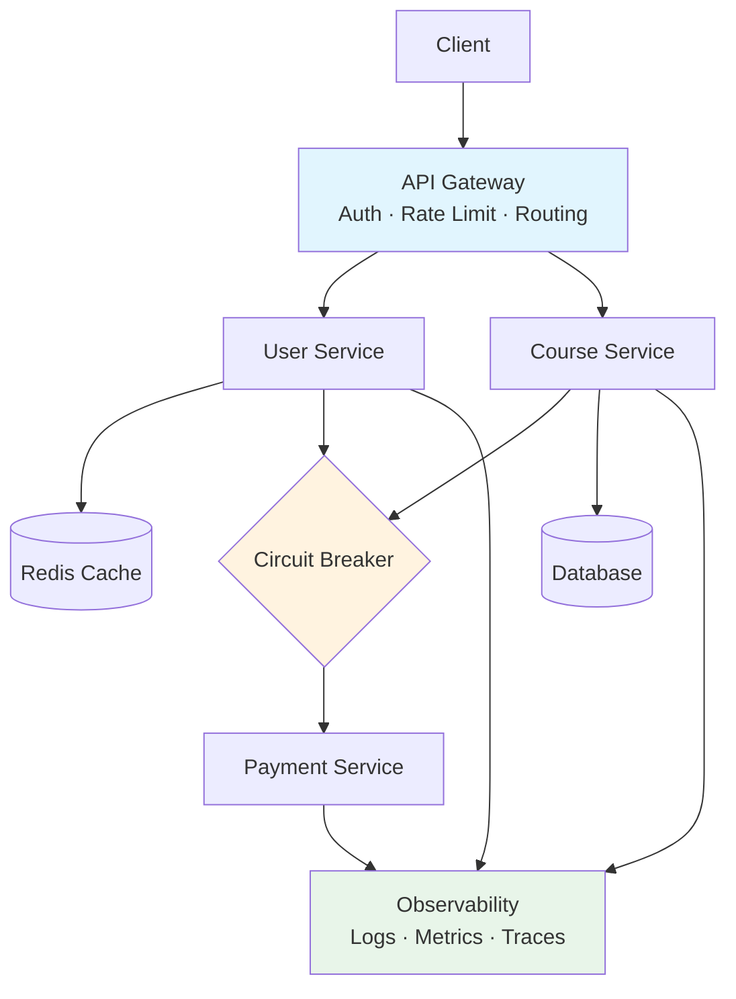

[← Back to Main README](../README.md) | [Previous: Fundamentals](00-FUNDAMENTALS.md) | [Next: GraphQL →](02-GRAPHQL.md)

---

# Phase 1 — REST APIs: Zero to Hero

Before we learn GraphQL, gRPC, API Gateways, Authentication, etc., we must master REST APIs because:

```
Modern backend systems are built on top of HTTP.

REST = The most common way people use HTTP.
```

Think of REST as:

```
TCP/IP = Road System
HTTP = Traffic Rules
REST = Driving Style
```

You already learned HTTP/1.1 → HTTP/2 → HTTP/3 previously, so now we'll build on top of that knowledge.

---

## Quick Reference Card

### HTTP Methods

| Method | Action | Idempotent | Safe |
|--------|----------------|------------|------|
| GET | Read | ✅ | ✅ |
| POST | Create | ❌ | ❌ |
| PUT | Replace | ✅ | ❌ |
| PATCH | Partial Update | Depends | ❌ |
| DELETE | Delete | ✅ | ❌ |

### Status Codes

| Code | Meaning | Category |
|------|--------------------------|----------------|
| 200 | Success | ✅ Success |
| 201 | Created | ✅ Success |
| 204 | Deleted Successfully | ✅ Success |
| 304 | Not Modified | ↪ Redirect |
| 400 | Invalid Request | ❌ Client Error |
| 401 | Not Logged In | ❌ Client Error |
| 403 | No Permission | ❌ Client Error |
| 404 | Not Found | ❌ Client Error |
| 409 | Conflict | ❌ Client Error |
| 429 | Rate Limited | ❌ Client Error |
| 500 | Internal Error | 💥 Server Error |
| 503 | Service Unavailable | 💥 Server Error |

---

## Table of Contents

- [REST APIs — Zero to Hero Roadmap](#rest-apis--zero-to-hero-roadmap)
- [Part 1: What is REST?](#part-1-what-is-rest)
  - [Chapter 1: What Problem Was REST Trying to Solve?](#chapter-1-what-problem-was-rest-trying-to-solve)
    - [Resource](#resource)
  - [Chapter 2: URLs in REST](#chapter-2-urls-in-rest)
    - [URI vs URL](#uri-vs-url)
    - [REST Naming Rules](#rest-naming-rules)
  - [Chapter 3: HTTP Methods](#chapter-3-http-methods)
    - [GET](#get)
    - [POST](#post)
    - [PUT](#put)
    - [PATCH](#patch)
    - [DELETE](#delete)
  - [First REST API Design](#first-rest-api-design)
- [Part 2: Request, Response, Status Codes, JSON](#part-2-request-response-status-codes-json)
  - [REST Request-Response Lifecycle](#rest-request-response-lifecycle)
  - [Chapter 1: Anatomy of an HTTP Request](#chapter-1-anatomy-of-an-http-request)
    - [Request Line](#part-1-request-line)
    - [Headers](#part-2-headers)
  - [Chapter 2: Request Body](#chapter-2-request-body)
    - [JSON Fundamentals](#json-fundamentals)
  - [Chapter 3: Anatomy of Response](#chapter-3-anatomy-of-response)
  - [Chapter 4: Status Codes](#chapter-4-status-codes)
- [Part 3: Real-World REST API Design](#part-3-real-world-rest-api-design)
  - [Chapter 1: Path Parameters](#chapter-1-path-parameters)
  - [Chapter 2: Query Parameters](#chapter-2-query-parameters)
  - [Chapter 3: Filtering](#chapter-3-filtering)
  - [Chapter 4: Sorting](#chapter-4-sorting)
  - [Chapter 5: Searching](#chapter-5-searching)
  - [Chapter 6: Pagination](#chapter-6-pagination)
    - [Offset Pagination](#offset-pagination)
    - [Cursor Pagination](#cursor-pagination)
- [Part 4: Idempotency & Distributed Systems](#part-4-idempotency--distributed-systems)
  - [Chapter 1: Safe vs Unsafe Methods](#chapter-1-safe-vs-unsafe-methods)
  - [Chapter 2: Idempotency](#chapter-2-idempotency)
  - [Chapter 3: Why Retries Exist](#chapter-3-why-retries-exist)
  - [Chapter 4: Idempotency Keys](#chapter-4-idempotency-keys)
  - [Chapter 5: Payment API Design](#chapter-5-payment-api-design)
  - [Chapter 6: What Happens During Failure?](#chapter-6-what-happens-during-failure)
  - [Chapter 7: Real Company Examples](#chapter-7-real-company-examples)
  - [Chapter 8: System Design Interview Mindset](#chapter-8-system-design-interview-mindset)
- [Part 5: HTTP Caching — From Zero to Hero](#part-5-http-caching--from-zero-to-hero)
  - [Why Caching Exists](#why-caching-exists)
  - [Cache Hit vs Cache Miss](#cache-hit-vs-cache-miss)
  - [Where Can Cache Exist?](#where-can-cache-exist)
  - [Cache-Control Header](#cache-control-header)
  - [ETag](#etag)
  - [304 Not Modified](#304-not-modified)
  - [Last-Modified Header](#last-modified-header)
  - [Cache Patterns in System Design](#cache-patterns-in-system-design)
- [Part 6: Production REST APIs](#part-6-production-rest-apis)
  - [Chapter 1: The API Evolution Problem](#chapter-1-the-api-evolution-problem)
  - [Chapter 2: API Versioning](#chapter-2-api-versioning)
  - [Chapter 3: Authentication](#chapter-3-authentication)
  - [Chapter 4: Rate Limiting](#chapter-4-rate-limiting)
  - [Chapter 5: API Gateway](#chapter-5-api-gateway)
  - [Chapter 6: Timeouts](#chapter-6-timeouts)
  - [Chapter 7: Retries](#chapter-7-retries)
  - [Chapter 8: Circuit Breaker](#chapter-8-circuit-breaker)
  - [Chapter 9: Observability](#chapter-9-observability)
- [Why REST Was Not Enough](#why-rest-was-not-enough)
  - [Problem 1: Under-Fetching](#problem-1-multiple-round-trips)
  - [Problem 2: Over-Fetching](#problem-2-over-fetching)
  - [REST vs GraphQL Mindset](#rest-vs-graphql-mindset)
  - [Did GraphQL Replace REST?](#did-graphql-replace-rest)
- [REST Mastery Checklist](#rest-mastery-checklist)
- [Next Lesson — GraphQL From Zero to Hero](#next-lesson--graphql-from-zero-to-hero-part-1)

---

## REST APIs — Zero to Hero Roadmap

Today we'll cover:

```
PART 1
✅ What is REST?
✅ Why REST was invented?
✅ What is a Resource?
✅ URLs
✅ URI vs URL
✅ HTTP Methods

PART 2
✅ Request Structure
✅ Response Structure
✅ Status Codes
✅ JSON

PART 3
✅ Designing your first REST API

Later lessons:
⏳ Pagination
⏳ Filtering
⏳ Sorting
⏳ Caching
⏳ Rate Limiting
⏳ Idempotency
⏳ API Versioning
⏳ API Gateway
⏳ Production REST Design
```

---

# Part 1: What is REST?

## Chapter 1: What Problem Was REST Trying to Solve?

Let's go back to early internet.
Imagine Amazon in the early days.
They have:

```
Customers
Orders
Products
Payments
Reviews
```

Many applications need access:

```
Website
Mobile App
Internal Admin Portal
Partners
Warehouses
```

Question:

```
How should these systems communicate?
```

Everyone was inventing their own style.
Example:

```
GetCustomer()
FetchUser()
ReadProduct()
CustomerLookup()
```

No consistency.
Different systems used:

```
XML
Custom protocols
SOAP
Binary protocols
Random naming conventions
```

It became chaos.

Then Roy Fielding introduced REST.
His idea was:

```
The web is already successful.

Let's use HTTP properly.
```

Instead of thinking:

```
Functions
Actions
Methods
```

Think:

```
Resources
```

This was revolutionary.

### Resource

Most important word in REST.
Let's understand deeply.
Imagine Instagram.
What exists inside Instagram?

```
Users
Posts
Comments
Messages
Stories
Likes
Followers
```

Every one of these is a resource.

Think like this:

```
Resource = Any thing that exists in your system.
```

Examples:

```
User
Course
Book
Product
Order
Cart
Payment
Video
Movie
Tweet
Photo
Post
```

### Rule #1 of REST

REST deals with:

```
Resources
NOT actions
```

Bad Design:

```http
/getUser
/fetchUser
/removeUser
/updateUser
```

Looks like function calls.

Better REST Design:

```http
/users
/users/123
```

Resource-focused.

### Why Resources?

Imagine a city.
We can describe the city using:

```
House
Road
School
Hospital
Police Station
```

These are entities.
Similarly:

```
Your system = city
Resources = entities
```

REST asks:

```
"What thing are we working on?"
```

Not:

```
"What function are we executing?"
```

---

## Chapter 2: URLs in REST

Every resource gets an address.
Exactly like:

```
Your Home Address
```

REST resource address:

```http
/users
/orders
/products
```

These addresses are URLs.

Example

```http
https://amazon.com/products
```

means:

```
Product resource collection
```

Specific product:

```http
https://amazon.com/products/123
```

means:

```
Product whose id = 123
```

Think:

```
/products
|
+--- Product 1
+--- Product 2
+--- Product 3
```

Specific item:

```http
/products/3
```

### URI vs URL

Interview favourite.
Most developers confuse this.

Think:

```
URI = Identifier
URL = Identifier + Location
```

Example:

```
user:123
```

This identifies something.
URI ✅
URL ❌

Example:

```
https://api.amazon.com/users/123
```

Identifies resource.
Has location.
URI ✅ URL ✅

Rule:

```
Every URL is URI.

Not every URI is URL.
```

### REST Naming Rules

Bad:

```http
/getUsers
/createUser
/deleteUser
```

Good:

```http
/users
/users/123
```

Because actions come from HTTP methods.

Bad:

```http
/productsList
```

Good:

```http
/products
```

Bad:

```http
/product
```

Good:

```http
/products
```

Plural is common convention.

---

## Chapter 3: HTTP Methods

Now magic begins.
Remember:

```
URL tells us WHAT resource.

HTTP Method tells us WHAT operation.
```

Example:

```http
/users
```

We now need operation.

### GET

Means:

```
Fetch data
```

Example:

```http
GET /users
```

Meaning:

```
Give me all users.
```

Example:

```http
GET /users/123
```

Meaning:

```
Give me user 123.
```

#### Real Example

Instagram:

```http
GET /posts/100
```

Server:

```json
{
"id":100,
"caption":"Hello World"
}
```

GET should NOT modify anything.
Bad:

```http
GET /createOrder
```

Very wrong.

### POST

Means:

```
Create something.
```

Example:

```http
POST /users
```

Body:

```json
{
"name":"Irfan"
}
```

Meaning:

```
Create a new user.
```

Server:

```json
{
"id":123,
"name":"Irfan"
}
```

New resource created.

### PUT

Means:

```
Replace an existing resource.
```

Imagine user:

```json
{
"name":"Irfan",
"age":25
}
```

PUT:

```json
{
"name":"Mohammad",
"age":30
}
```

Old object completely replaced.

Result:

```json
{
"name":"Mohammad",
"age":30
}
```

Entire resource updated.

### PATCH

Means:

```
Partial update.
```

Current:

```json
{
"name":"Irfan",
"age":25
}
```

PATCH:

```json
{
"age":26
}
```

Result:

```json
{
"name":"Irfan",
"age":26
}
```

Only one field changed.

Real world:
Instagram update bio:

```http
PATCH /users/123
```

### DELETE

Means:

```
Remove resource.
```

Example:

```http
DELETE /users/123
```

Meaning:

```
Delete user 123.
```

### HTTP Method Cheat Sheet

| Method | Action |
|--------|----------------|
| GET | Read |
| POST | Create |
| PUT | Replace |
| PATCH | Partial Update |
| DELETE | Delete |

Memorise this forever.

---

## First REST API Design

Let's design:

```
Skillsoft Learning Platform
```

Resources:

```
Users
Courses
Progress
Certificates
```

Read Courses

```http
GET /courses
```

Get specific course

```http
GET /courses/123
```

Create course

```http
POST /courses
```

Update course

```http
PATCH /courses/123
```

Delete course

```http
DELETE /courses/123
```

Simple.
Predictable.
Beautiful.
That's REST philosophy.

### REST Mental Model

Whenever you see a requirement,
DO NOT think:

```
Function
Method
Action
```

Think:

```
Resource
```

Example:
Requirement:

```
Fetch course details
```

Junior:

```http
/getCourseDetails
```

Senior:

```http
GET /courses/123
```

Requirement:

```
Create user
```

Junior:

```http
/createUser
```

Senior:

```http
POST /users
```

Requirement:

```
Delete order
```

Junior:

```http
/deleteOrder
```

Senior:

```http
DELETE /orders/123
```

### Interview Golden Rule

When designing REST APIs:

```
URL => Resource

Method => Action

Body => Data

Status => Result
```

This single sentence can carry you through most backend interviews.

### Homework Thought Exercise

Try to design REST APIs for:

```
WhatsApp

Resources:
- Users
- Chats
- Messages
- Groups

Instagram

Resources:
- Users
- Posts
- Comments
- Reels
- Stories

Amazon

Resources:
- Products
- Orders
- Cart
- Payments
```

Just identify resources and available HTTP methods.

### Next Lesson (Very Important)

Before pagination and versioning, we'll cover:

```
✅ Complete HTTP Request Anatomy
✅ Headers
✅ Request Body
✅ Response Body
✅ Status Codes (200,201,204,400,401,403,404,409,429,500)
✅ JSON Deep Dive
✅ How browser/Postman actually call REST APIs
✅ Complete request-response lifecycle
```

This is where REST starts becoming real engineering instead of simple CRUD.

---

# Part 2: Request, Response, Status Codes, JSON

Now we're moving from:

```
REST Basics
↓
Real REST Engineering
```

Everything we learned before answered:

```
WHAT resource?
WHAT operation?
```

Now we'll learn:

```
How does a request actually travel?
What is inside a request?
What is inside a response?
How do servers communicate success/failure?
Why are headers so important?
```

This chapter is the foundation of:

```
Authentication
Caching
API Gateway
Rate Limiting
Microservices
GraphQL
gRPC
```

Without this, later topics won't make sense.

## REST Request-Response Lifecycle

Let's start with the complete picture.
Imagine you open Instagram.
You click:

```
View Post #100
```

Browser/App sends:

```http
GET /posts/100
```

The journey looks like:

```
Client
|
| HTTP Request
|
V
Load Balancer
|
V
API Server
|
V
Database
|
V
API Server
|
| HTTP Response
|
V
Client
```



This is called:

```
Request → Processing → Response
```

Everything in REST follows this.

---

## Chapter 1: Anatomy of an HTTP Request

A request contains multiple parts.
Think of a courier package.

```
Package
├── Destination Address
├── Instructions
├── Labels
└── Content
```

HTTP request is similar.
Structure:

```http
GET /users/123 HTTP/1.1
Host: api.company.com
Authorization: Bearer xyz
Content-Type: application/json

{
"some":"data"
}
```

Let's understand every piece.

### Part 1: Request Line

Example:

```http
GET /users/123 HTTP/1.1
```

Contains:

```
Method
Path
Protocol Version
```

Breakdown:

```
GET → Operation
/users/123 → Resource
HTTP/1.1 → Protocol Version
```

Example:

```http
POST /orders HTTP/2
```

Means:

```
Create order
using HTTP/2
```

### Part 2: Headers

Headers are metadata.
Think:

```
Letter
|
+-- Main message
|
+-- Extra notes
```

Headers are extra notes.
Example:

```http
Authorization: Bearer xyz
```

Meaning:

```
I am user XYZ.
```

Example:

```http
Content-Type: application/json
```

Meaning:

```
I am sending JSON.
```

Example:

```http
Accept: application/json
```

Meaning:

```
Please return JSON.
```

Headers are extremely important.
Later:

```
Authentication
Caching
Rate Limiting
API Gateway
CDNs
```

all heavily depend on headers.

#### Common Headers

Let's learn the important ones.

##### Host

Example:

```http
Host: api.instagram.com
```

Tells server:

```
Which website?
```

Important because:

```
Many websites can run on same IP.
```

##### User-Agent

Example:

```http
User-Agent: Chrome
```

Meaning:

```
I am Chrome browser.
```

or

```
I am Android App.
```

Server can customise response.

##### Content-Type

Super important.
Example:

```http
Content-Type: application/json
```

Meaning:

```
Request body is JSON.
```

Other examples:

```
application/json

application/xml

multipart/form-data

text/plain
```

##### Accept

Example:

```http
Accept: application/json
```

Meaning:

```
I want JSON response.
```

This is called:

```
Content Negotiation
```

We'll revisit later.

##### Authorization

Very important.
Example:

```http
Authorization: Bearer abc123
```

Meaning:

```
I am authenticated.
```

Without this:

```
No access
```

Usually used for:

```
JWT
OAuth
Access Tokens
```

#### Example Request

```http
GET /courses/123 HTTP/1.1
Host: api.skillsoft.com
Authorization: Bearer xyz
Accept: application/json
```

Read it like English:

```
Fetch course 123
from skillsoft
I am authorised
Return JSON
```

---

## Chapter 2: Request Body

Question:

```
Where is actual data sent?
```

Answer:

```
Request Body
```

Example:
Create user.

```http
POST /users
```

Body:

```json
{
"name":"Irfan",
"email":"abc@gmail.com"
}
```

Think:

```
POST
PUT
PATCH
```

usually have body.

Think:

```
GET
DELETE
```

normally don't.

### Why JSON?

Imagine sending data.
Bad:

```
name=irfan-age=25-country=india
```

Hard to parse.

JSON:

```json
{
"name":"Irfan",
"age":25
}
```

Beautiful.
Readable.
Language-independent.

This is why REST loves JSON.

### JSON Fundamentals

Object:

```json
{
"name":"Irfan"
}
```

Multiple values:

```json
{
"name":"Irfan",
"age":25
}
```

Array:

```json
[
"Java",
"NodeJS",
"React"
]
```

Nested:

```json
{
"name":"Irfan",
"skills":[
"NodeJS",
"React"
]
}
```

Real API Response

```json
{
"id":123,
"name":"Irfan",
"courses":[
{
"id":1,
"name":"System Design"
}
]
}
```

You'll see structures like this daily.

---

## Chapter 3: Anatomy of Response

Server receives request.
Now server responds.
Structure:

```http
HTTP/1.1 200 OK
Content-Type: application/json

{
"id":123,
"name":"Irfan"
}
```

Response contains:

```
Status Line
Headers
Body
```

Example:

```http
HTTP/1.1 200 OK
```

Breakdown:

```
HTTP Version
Status Code
Status Text
```

---

## Chapter 4: Status Codes

One of the most important topics.
Status Codes tell:

```
What happened?
```

Without reading body.

### Easy Way to Memorise

```
1xx -> Information

2xx -> Success

3xx -> Redirect

4xx -> Client Error

5xx -> Server Error
```

Memorise this forever.

### 200 OK

Most common.
Means:

```
Everything worked.
```

Example:

```http
GET /users/123
```

Response:

```http
200 OK
```

### 201 Created

Means:

```
New resource created.
```

Example:

```http
POST /users
```

Response:

```http
201 Created
```

### 204 No Content

Means:

```
Success

Nothing to return
```

Example:

```http
DELETE /users/123
```

Response:

```http
204 No Content
```

### Client Errors

These are your fault.
Server understood.
You made mistake.

#### 400 Bad Request

Example:

```json
{
"email":"not-an-email"
}
```

Server:

```http
400 Bad Request
```

Meaning:

```
Request invalid.
```

#### 401 Unauthorized

Means:

```
Authentication missing.
```

Example:

```
No token.
```

Server:

```http
401 Unauthorized
```

#### 403 Forbidden

Different from 401.
401:

```
Who are you?
```

403:

```
I know who you are

You don't have permission
```

Example:
Employee trying to access:

```
Admin endpoint
```

Response:

```http
403 Forbidden
```

#### 404 Not Found

Very common.
Example:

```http
GET /users/999999
```

User doesn't exist.
Response:

```http
404 Not Found
```

#### 409 Conflict

Super important in real systems.
Example:

```
Email must be unique.
```

Existing:

```
abc@gmail.com
```

New request:

```
abc@gmail.com
```

Server:

```http
409 Conflict
```

Meaning:

```
Resource state conflicts.
```

#### 429 Too Many Requests

Rate limiting.
Example:

```
You made
10,000 requests
in 1 minute
```

Server:

```http
429 Too Many Requests
```

Very common in public APIs.

### Server Errors

These are server fault.
Not client fault.

#### 500 Internal Server Error

Most famous.
Example:

```
Database crashed.
Null pointer exception.
Unexpected exception.
```

Response:

```http
500 Internal Server Error
```

#### 503 Service Unavailable

Means:

```
Server temporarily unavailable.
```

Example:

```
Maintenance
Database outage
Deployment issue
```

### Status Code Interview Table

| Code | Meaning |
|------|--------------------------|
| 200 | Success |
| 201 | Created |
| 204 | Deleted Successfully |
| 400 | Invalid Request |
| 401 | Not Logged In |
| 403 | No Permission |
| 404 | Not Found |
| 409 | Conflict |
| 429 | Rate Limited |
| 500 | Internal Error |
| 503 | Service Unavailable |

Memorise.

### Real API Example

Request:

```http
POST /users
```

Body:

```json
{
"name":"Irfan",
"email":"irfan@gmail.com"
}
```

Response:

```http
201 Created
```

Body:

```json
{
"id":123,
"name":"Irfan",
"email":"irfan@gmail.com"
}
```

Another example.
Request:

```http
GET /users/999
```

User missing.
Response:

```http
404 Not Found
```

Body:

```json
{
"error":"User not found"
}
```

### Complete Mental Model

Whenever browser/app calls API:

```
Request
|
|-- Method
|-- URL
|-- Headers
|-- Body
|
V

Server

|
|-- Validation
|-- Business Logic
|-- Database
|
V

Response

|
|-- Status Code
|-- Headers
|-- Response Body
|
V

Client
```

This entire flow happens in milliseconds.

### What Senior Engineers Think About

When they see:

```http
POST /orders
```

They immediately think:

```
What headers are required?

What body schema?

What status codes?

What auth mechanism?

What happens if DB fails?

What if client retries?

What if request duplicates?

What if server times out?
```

That's the difference between CRUD coding and system design thinking.

### Next Lesson (Extremely Important)

We'll cover:

```
✅ Query Parameters
✅ Path Parameters
✅ Pagination
✅ Filtering
✅ Sorting
✅ Searching
✅ API Design Patterns

Example:

GET /courses?page=2&pageSize=20

GET /products?category=laptop

GET /users?sort=name

GET /courses?search=system+design
```

This is where APIs start resembling real-world systems like Amazon, Instagram, Skillsoft, Netflix, and WhatsApp.

---

# Part 3: Real-World REST API Design

Now we move from:

```
Basic REST
↓
Real-world REST APIs
```

Until now we learned:

```http
GET /users/123
POST /users
PATCH /users/123
DELETE /users/123
```

But real companies like:

```
Amazon
Instagram
Facebook
Netflix
Skillsoft
WhatsApp
```

don't stop there.
The biggest challenge becomes:
"How do we return only the data the user wants?"
This is where:

```
Path Parameters
Query Parameters
Pagination
Filtering
Sorting
Searching
```

become essential.

## Phase 1.3 — Real World REST API Design

### Problem #1

Imagine Amazon.
Database contains:

```
100 Million Products
```

User opens app.
Request:

```http
GET /products
```

Question:
Should server return:

```
100 million products?
```

Of course not.
Response would be:

```
Huge payload
Slow response
Server crash
Network congestion
Phone hangs
```

So we need techniques.

---

## Chapter 1: Path Parameters

Imagine:

```
Users
Products
Courses
Orders
```

Sometimes we need:

```
ALL users
```

Sometimes:

```
ONE specific user
```

Example:

```http
GET /users
```

means:

```
All users
```

Specific user:

```http
GET /users/123
```

means:

```
User whose id = 123
```

Here:

```
123
```

is called:

```
Path Parameter
```

because it is part of URL path.

Example:

```http
GET /courses/45
```

Path parameter:

```
45
```

Example:

```http
GET /orders/987
```

Path parameter:

```
987
```

Visualise:

```
/users/{id}

/courses/{courseId}

/orders/{orderId}
```

Path Parameters identify:

```
Specific Resource
```

Remember this.
Interview favourite question.

### Path Parameter Rule

Use path parameters when:

```
You know exactly which resource.
```

Example:

```http
/users/123
```

Not:

```http
/users?id=123
```

Both may work.
But REST style prefers:

```http
/users/123
```

for specific resource.

---

## Chapter 2: Query Parameters

Now imagine Amazon.
User wants:

```
Only laptops
```

Should we create:

```http
/products/laptops
```

Maybe.
But tomorrow:

```
Mobile
TV
Tablet
Camera
```

Becomes messy.

Instead:

```http
GET /products?category=laptop
```

Everything after:

```
?
```

is query parameter.

Example:

```http
GET /products?category=laptop
```

Meaning:

```
Show products
where category=laptop
```

Another:

```http
GET /products?brand=apple
```

Meaning:

```
Only Apple products
```

Multiple:

```http
GET /products?brand=apple&category=laptop
```

Meaning:

```
Apple laptops only
```

Think:

```
Path Parameters
=
Identity

Query Parameters
=
Filters
```

Memorise.

### Easy Interview Rule

Path:

```http
/users/123
```

Specific thing.

Query:

```http
/users?country=india
```

Filtered collection.

### Real World Examples

Instagram:

```http
GET /posts?user=123
```

Netflix:

```http
GET /movies?genre=action
```

Skillsoft:

```http
GET /courses?skill=system-design
```

Amazon:

```http
GET /products?category=laptop
```

---

## Chapter 3: Filtering

Filtering reduces results.

Without filtering:

```http
GET /courses
```

Returns:

```
All courses
```

Maybe:

```
20,000 courses
```

User wants:

```
Only Java courses
```

Request:

```http
GET /courses?topic=java
```

User wants:

```
Intermediate Java
```

Request:

```http
GET /courses?topic=java&level=intermediate
```

Real response:

```json
[
{
"id":1,
"title":"Advanced Java"
}
]
```

Filtering can be:

```
Topic
Category
Price
Status
Author
Date
Country
Language
```

Anything.

---

## Chapter 4: Sorting

Now imagine:

```http
GET /courses
```

Many results.
How should they be ordered?

Maybe:

```
Newest First
```

Request:

```http
GET /courses?sort=createdAt
```

Maybe:

```
Highest Rated
```

Request:

```http
GET /courses?sort=rating
```

Descending:

```http
GET /courses?sort=-rating
```

Common convention.
Meaning:

```
Highest rating first.
```

Ascending:

```http
GET /courses?sort=rating
```

Meaning:

```
Lowest rating first.
```

### Real Companies

Amazon:

```
Price Low to High
Price High to Low
Best Selling
Newest
```

All implemented with sorting.

Example:

```http
GET /products?sort=price
```

or

```http
GET /products?sort=-price
```

---

## Chapter 5: Searching

Most important API feature.
Example:
User types:

```
system design
```

Search box.

Request:

```http
GET /courses?search=system design
```

Server:

```
Find matching courses
```

Response:

```json
[
{
"title":"System Design Fundamentals"
}
]
```

Real World:
Google:

```
search
```

Amazon:

```
search product
```

Netflix:

```
search movie
```

Skillsoft:

```
search courses
```

Search usually uses:

```
Database indexes
Elasticsearch/OpenSearch
Vector Search
AI Search
```

We'll cover later.

---

## Chapter 6: Pagination

VERY IMPORTANT.
Senior engineer favourite.
Interview favourite.
Production favourite.

Let's understand.
Imagine:

```
100 million users
```

Request:

```http
GET /users
```

What happens?

Server tries sending:

```
100 million users
```

Response size:

```
Huge
```

Problems:

```
Memory explosion
Network latency
Mobile app freeze
Database pressure
```

Solution:
Pagination.
Meaning:

```
Return little by little.
```

### Book Analogy

Book has:

```
500 pages
```

You don't read all pages together.
You read:

```
Page 1
Page 2
Page 3
```

REST pagination is same.

### Offset Pagination

Most common.
Request:

```http
GET /users?page=1&pageSize=20
```

Means:

```
Give first 20 users.
```

Next page:

```http
GET /users?page=2&pageSize=20
```

Means:

```
Give next 20 users.
```

Response:

```json
{
"page":1,
"pageSize":20,
"total":500,
"data":[]
}
```

#### How Database Executes

Page 1:

```sql
LIMIT 20 OFFSET 0
```

Page 2:

```sql
LIMIT 20 OFFSET 20
```

Page 3:

```sql
LIMIT 20 OFFSET 40
```

Simple.
Easy.
Very common.

#### Problem With Offset Pagination

Imagine Instagram.
User has:

```
10 million posts
```

Request:

```http
GET /posts?page=100000
```

Database:

```sql
OFFSET 9999990
```

Very expensive.
Server scans countless rows.
Slow.

At scale:

```
Instagram
Facebook
Twitter
LinkedIn
```

avoid large offsets.

### Cursor Pagination

Used by big tech.
Instead of:

```
Page Number
```

We use:

```
Cursor
```

Example:

```http
GET /posts?cursor=abc123
```

Meaning:

```
Start after record abc123.
```

Response:

```json
{
"data":[...],
"nextCursor":"xyz789"
}
```

Next request:

```http
GET /posts?cursor=xyz789
```

Very fast.

#### Real Example

Instagram Feed:

```
Load more posts
Load more posts
Load more posts
```

Often implemented using cursor pagination.

### Pagination Comparison

Offset Pagination

```
Easy
Simple
Jump to page 100
```

But:

```
Slow at scale
```

Cursor Pagination

```
Fast
Scalable
Ideal for feeds
```

But:

```
Harder to implement
```

### Senior Engineer Rule

```
Admin Panels
Reports
Dashboards
=
Offset Pagination
```

```
Feeds
Chats
Notifications
Activity Streams
=
Cursor Pagination
```

### Example Production API

Let's combine everything.

```http
GET /courses?
topic=java
&level=intermediate
&sort=-rating
&page=2
&pageSize=20
```

Meaning:

```
Java Courses
Intermediate Only
Highest Rating First
Second Page
20 Results
```

This is what real APIs look like.

### Design Exercise

Let's design Skillsoft APIs.
Get all courses

```http
GET /courses
```

Course details

```http
GET /courses/123
```

Search courses

```http
GET /courses?search=system design
```

Filter by skill

```http
GET /courses?skill=java
```

Sort by rating

```http
GET /courses?sort=-rating
```

Paginate

```http
GET /courses?page=1&pageSize=20
```

Combine everything

```http
GET /courses?
search=system design
&level=intermediate
&sort=-rating
&page=1
&pageSize=20
```

This is exactly how production-grade REST APIs evolve.

### Senior System Design Thinking

Whenever you see:

```http
GET /courses
```

Ask:

```
How many courses?

100?
1000?
1 million?
100 million?
```

Because API design changes with scale.
A junior engineer thinks:

```
Can it work?
```

A senior engineer thinks:

```
Can it still work with 100 million records?
```

### Next Important Phase

Now we're ready for the part that separates ordinary developers from backend engineers:

```
✅ Idempotency
✅ Safe vs Unsafe HTTP Methods
✅ Why GET is special
✅ Why PUT behaves differently from POST
✅ Duplicate Requests
✅ Retry Mechanisms
✅ Network Failures
✅ Distributed System Problems
✅ Payment API Design (Stripe-like)
```

This is where REST meets distributed systems and system design. This is one of the most important concepts for senior backend interviews.

---

# Part 4: Idempotency & Distributed Systems

Now we enter the phase where REST stops being CRUD and starts becoming Distributed Systems Engineering.
This is one of the most important concepts for:

```
Senior Backend Engineers
System Design Interviews
Payment Systems
E-commerce Platforms
Banking Applications
Microservices
```

Today we'll learn:

```
✅ Safe vs Unsafe Operations
✅ Idempotency
✅ Why Retries Are Dangerous
✅ Network Failures
✅ Duplicate Requests
✅ Payment API Design
✅ Stripe/UPI/Banking Patterns
✅ Real Production Failures
```

### The Problem Most Beginners Never Think About

Imagine you're buying a laptop on Amazon.
You click:

```
Pay ₹50,000
```

The mobile app sends:

```http
POST /payments
```

Server starts processing.
Suddenly:

```
Network disconnects
```

Your mobile never receives a response.
Now what?

Most users do this:

```
Click Pay Again
```

or

```
App automatically retries
```

Now server receives:

```
Payment Request #1
Payment Request #2
```

Question:

```
Should customer be charged once?

or

twice?
```

Obviously:

```
ONCE
```

But how?
This is where Idempotency comes in.

---

## Chapter 1: Safe vs Unsafe Methods

Before idempotency, let's learn another important idea.

### Safe Methods

Safe means:

```
This operation only reads data.

No state change.
```

Examples:

```http
GET /users/123

GET /products

GET /courses
```

These are safe.

Example:

```http
GET /products/100
```

You can call:

```
1 time
10 times
1000 times
```

Result remains same.
Nothing changes.

Therefore:

```
GET = Safe Method
```

### Unsafe Methods

Unsafe means:

```
Changes server state.
```

Examples:

```http
POST /orders

POST /payments

DELETE /users/123

PATCH /users/123
```

These modify data.

So:

```
GET -> Safe

POST -> Unsafe

PATCH -> Unsafe

PUT -> Unsafe

DELETE -> Unsafe
```

Memorise.
Interview favourite.

---

## Chapter 2: Idempotency

The most misunderstood REST concept.

### Simple Definition

An operation is idempotent if:

```
Running it once

or

Running it 100 times

produces same final state.
```

### Real-Life Example

Imagine a room.
Light switch currently:

```
OFF
```

Command:

```
Turn OFF
```

Run once:

```
OFF
```

Run again:

```
OFF
```

Run again:

```
OFF
```

State unchanged.
This is idempotent.

### Another Example

Door.
Current state:

```
Closed
```

Command:

```
Close Door
```

Run 1 time:

```
Closed
```

Run 10 times:

```
Closed
```

Same result.
Idempotent.

### Non-Idempotent Example

Bank Account
Balance:

```
₹1000
```

Operation:

```
Add ₹100
```

Run once:

```
₹1100
```

Run again:

```
₹1200
```

Run again:

```
₹1300
```

Different state each time.
NOT idempotent.

### REST Methods and Idempotency

#### GET

```http
GET /users/123
```

Read only.
Always same.
✅ Idempotent

#### DELETE

```http
DELETE /users/123
```

First call:

```
User deleted.
```

Second call:

```
Still deleted.
```

Final state same.
✅ Idempotent

#### PUT

```http
PUT /users/123

{
"name":"Irfan"
}
```

Run:

```
1 time
10 times
100 times
```

Final state:

```json
{
"name":"Irfan"
}
```

Same.
✅ Idempotent

#### PATCH

Depends.
Example:

```json
{
"name":"Mohammad"
}
```

Repeat:
Same state.
✅ Can be idempotent

But:

```json
{
"increaseBalanceBy":100
}
```

Repeat:
Balance keeps changing.
❌ Not idempotent

#### POST

Usually:
❌ NOT idempotent
Why?
Example:

```http
POST /orders
```

Run twice:

```
Order #1
Order #2
```

Two orders created.
Different state.

### Interview Table

| Method | Idempotent? |
|--------|---------------------|
| GET | ✅ Idempotent |
| PUT | ✅ Idempotent |
| DELETE | ✅ Idempotent |
| POST | ❌ Usually Not |
| PATCH | Depends |

Very important.

---

## Chapter 3: Why Retries Exist

In distributed systems:

```
Networks fail
Servers crash
Packets drop
Load balancers restart
Databases timeout
```

Failures are NORMAL.
Not exceptional.

Imagine:

```http
POST /payments
```

Request sent.
Server processes payment.
Response gets lost.
Client sees:

```
Timeout
```

Client now thinks:

```
Payment failed
```

But actually:

```
Payment succeeded
```

Huge problem.

### The Two Generals Problem

System A:

```
Payment App
```

System B:

```
Bank
```

A sends:

```
Charge customer.
```

B processes.
B sends:

```
Success.
```

Message lost.
Now:

```
A doesn't know.
B doesn't know that A knows.
```

This problem exists everywhere.
You cannot completely eliminate uncertainty in distributed systems.
You design around it.

---

## Chapter 4: Idempotency Keys

Production solution.

Imagine Stripe.
Client generates:

```
payment-123456
```

Request:

```http
POST /payments

Idempotency-Key: payment-123456
```

Server stores:

```
Key
Result
```

Database:

```
payment-123456 → SUCCESS
```

If request retries:

```http
POST /payments

Idempotency-Key: payment-123456
```

Server checks:

```
Already processed.
```

Returns old response.
No duplicate charge.

Result:

```
1 payment

not

2 payments
```

### Real UPI Example

Since you've previously dealt with UPI disputes, this becomes easy to understand.
You pay:

```
₹500
```

UPI app shows:

```
Processing...
```

Network fails.
You wonder:

```
Did money go?

or

Did it not go?
```

Banking systems rely on:

```
Transaction IDs
Reference Numbers
Idempotency
Reconciliation Jobs
```

to ensure duplicates are not processed.

---

## Chapter 5: Payment API Design

Beginner design:

```http
POST /chargeCard
```

Dangerous.

Better:

```http
POST /payments
```

Headers:

```http
Idempotency-Key: abc123
```

Body:

```json
{
"amount":50000,
"currency":"INR"
}
```

### Server Flow

```
Receive Request
|
V
Check Key
|
Exists?
/ \
Yes No
| |
Return Process Payment
Old Store Result
Result Store Key
```



### Architecture

```
Client
|
V
Payment API
|
V
Idempotency Store
|
V
Payment Processor
|
V
Bank
```

This is how many modern payment APIs work.

---

## Chapter 6: What Happens During Failure?

Let's analyse.

### Failure 1

Client crashes before request sent.
Result:

```
No payment.
```

Easy.

### Failure 2

Server never receives request.
Result:

```
No payment.
```

Easy.

### Failure 3

Server processes payment.
Response lost.
Result:

```
Payment happened.
Client unaware.
```

Dangerous.

### Failure 4

Client retries.
Without idempotency:

```
Double charge.
```

Disaster.

### Failure 5

Client retries.
With idempotency:

```
Return previous response.
```

Perfect.

---

## Chapter 7: Real Company Examples

### Amazon

When placing orders:

```
Retries happen.
Network issues happen.
```

Order APIs need:

```
Idempotency
Deduplication
Unique Order IDs
```

otherwise:

```
Customer receives 5 laptops.
```

### Stripe

One of the most famous examples.
Stripe strongly promotes:

```
Idempotency Keys
```

because payment retries are unavoidable.

### WhatsApp

When sending messages:

```
Retry if delivery uncertain.
```

Each message gets:

```
Message ID
```

used for deduplication.

### Instagram

Like operation:

```http
POST /like
```

may be retried.
Backend often uses:

```
UserId + PostId uniqueness
```

to avoid multiple identical likes.

---

## Chapter 8: System Design Interview Mindset

When interviewer says:

```
Design Payment System
```

Don't immediately draw databases.
Think:

```
What if request retries?

What if response is lost?

What if payment succeeded but client timed out?

What if request arrives twice?

What if server crashes halfway?
```

These questions separate:

```
Junior Engineer
```

from

```
Senior Engineer
```

### Golden Rule

Whenever you see:

```http
POST
```

Ask yourself:

```
Will duplicate requests be harmful?
```

If answer is:

```
YES
```

You probably need:

```
Idempotency Key
Deduplication
Unique Request ID
```

### Complete REST Mental Model So Far

```
Resources
|
├── URLs
├── HTTP Methods
├── Headers
├── Request Body
├── Response Body
├── Status Codes
├── Path Parameters
├── Query Parameters
├── Filtering
├── Sorting
├── Pagination
├── Safety
└── Idempotency
```

You are now beyond the level of most developers who only know:

```
GET
POST
PUT
DELETE
```

and think REST is finished.

### Next Phase (Senior Backend Level)

Now we'll learn what powers almost every production API:

```
✅ HTTP Caching
✅ Cache-Control Header
✅ ETag
✅ Last-Modified
✅ CDN Caching
✅ Browser Caching
✅ 304 Not Modified
✅ Why Instagram/Amazon don't hit DB on every request
✅ Cache Invalidation (the hardest problem in computer science 😄)
```

This is where REST meets performance engineering and large-scale system design.

---

# Part 5: HTTP Caching — From Zero to Hero

Now we are entering one of the most important topics in system design:
REST API Caching — From Zero to Hero
This is where engineers start thinking:

```
Not:
"How do I get data?"

But:

"How do I avoid getting data again?"
```

Because at scale:

```
Getting data is expensive.

Avoiding getting data is cheap.
```

## Why Caching Exists

Let's start with a simple example.
Imagine Instagram.
A celebrity posts a new image.

```
100 Million followers
```

open Instagram.
Every user requests:

```http
GET /posts/123
```

Without caching:

```
100 Million Requests
|
V
Database
```

Database explodes.

Think about it.
Post data is:

```json
{
"id":123,
"caption":"Hello World"
}
```

Same for everyone.
Why fetch it from database 100 million times?
Makes no sense.

### The Restaurant Analogy

Restaurant has:

```
Kitchen
```

making food.
Suppose:

```
100 customers
```

ask for:

```
Same tea
```

Bad:

```
Cook tea 100 times.
```

Better:

```
Cook once.
Keep ready.
Serve repeatedly.
```

That's caching.

### What is Cache?

Cache = Temporary storage of frequently used data.
Think:

```
Fast Copy
```

of original data.

### Without Cache

```
Client
|
V
Server
|
V
Database
```

Every request hits database.

### With Cache

```
Client
|
V
Server
|
V
Cache
|
V
Database
```

Most requests stop at cache.
Database rests.

### Real Numbers

Let's say:

```
Database Query = 50 ms

Cache Query = 1 ms
```

100 requests:
Without cache:

```
100 × 50 ms
```

With cache:

```
100 × 1 ms
```

Massive difference.

---

## Cache Hit vs Cache Miss

The most important cache terminology.

### Cache Hit

Data found in cache.

```
Request
|
Cache
|
Found
```

Response immediately.
Example:

```
GET /courses/123
```

Course already cached.
Result:

```
1 ms response
```

Awesome.

### Cache Miss

Data not found.

```
Request
|
Cache
|
Not Found
|
Database
```

Database queried.
Then stored in cache.
Future requests become fast.

Flow:

```
Request
|
Cache Miss
|
Database
|
Save To Cache
|
Return Response
```



### Cache Hit Ratio

Senior engineers monitor this constantly.
Formula:

```
Cache Hits
-------------
Total Requests
```

Example:

```
900 hits
100 misses
```

Hit rate:

```
900 / 1000 = 90%
```

Excellent.

Example:

```
50 hits
950 misses
```

Hit rate:

```
5%
```

Cache useless.

### Interview Rule

```
Higher Cache Hit Ratio
=
Lower Database Load
```

---

## Where Can Cache Exist?

Beginners think:

```
Only one cache.
```

Reality:

```
Many layers.
```

### Layer 1: Browser Cache

Your browser caches:

```
Images
CSS
JavaScript
Fonts
API Responses
```

Flow:

```
Browser
|
| Check Local Cache
|
Found?
|
Yes
|
Show immediately
```

No network.
Super fast.

### Layer 2: CDN Cache

Examples:

```
Cloudflare
Akamai
Fastly
CloudFront
```

Flow:

```
User
|
V
CDN
|
Found?
|
Yes
|
Return
```

Origin server never touched.
Massive scale.

Example:
When you download:

```
Instagram Image
Netflix Thumbnail
Amazon Product Image
```

Often served from CDN.

### Layer 3: API Cache

Inside backend.
Example:

```
Redis
Memcached
```

Architecture:

```
API
|
Redis
|
Database
```

Request:

```http
GET /courses/123
```

Redis:

```
Course already present.
```

Database avoided.

---

## Cache-Control Header

Now we enter REST-specific caching.
Server can tell browser:

```
How long this response can be reused.
```

Using:

```http
Cache-Control
```

header.

### Example

```http
Cache-Control: max-age=60
```

Meaning:

```
Use this response for 60 seconds.
```

No need to call server again.

Flow:

```
Request
|
Server
|
Return Response
|
Tell Browser:
Store for 60 sec
```

Next request within 60 sec:

```
No network.
```

Super fast.

### Common Cache-Control Directives

#### max-age

```http
Cache-Control: max-age=3600
```

Meaning:

```
Cache for 1 hour.
```

#### no-store

```http
Cache-Control: no-store
```

Meaning:

```
Never cache.
```

Used for:

```
Banking
Sensitive Data
OTP APIs
```

#### no-cache

Important.
Many developers misunderstand.
It does NOT mean:

```
Don't cache.
```

It means:

```
Cache it

But verify before reuse.
```

#### public

```http
Cache-Control: public
```

Meaning:

```
CDNs may cache.
```

#### private

```http
Cache-Control: private
```

Meaning:

```
Only browser should cache.
```

Not shared caches.

### Problem: What If Data Changes?

Suppose:

```
User Profile Cached
```

Current response:

```json
{
"name":"Irfan"
}
```

User changes name.
Now:

```json
{
"name":"Irfanuddin"
}
```

Cache still has old version.
Problem.

This is called:
Stale Data
Cache contains:

```
Old Information
```

And this leads to:
Cache Invalidation
The hardest part of caching.

Famous joke:

```
There are only two hard things in Computer Science:

1. Cache Invalidation
2. Naming Things
```

---

## ETag

Beautiful solution.
Think of ETag as:

```
Fingerprint of data
```

Example response:

```http
ETag: abc123
```

Meaning:

```
Current version fingerprint = abc123
```

Browser stores:

```
Data
+
ETag
```

Next request:

```http
If-None-Match: abc123
```

Meaning:

```
I already have version abc123.

Has anything changed?
```

Server checks.
If unchanged:

```http
304 Not Modified
```

No body returned.
Tiny response.
Super efficient.

---

## 304 Not Modified

Important status code.
Meaning:

```
Your cached copy is still valid.
```

Instead of sending:

```json
{
huge response...
}
```

Server sends:

```http
304 Not Modified
```

Just a few bytes.

### Real Example

You visit:

```
Amazon Home Page
```

Many assets already cached.
Server sends:

```http
304 Not Modified
```

rather than sending everything again.

---

## Last-Modified Header

Another validation approach.
Response:

```http
Last-Modified: Tue, 7 Jul 2026 10:00:00 GMT
```

Next request:

```http
If-Modified-Since: Tue, 7 Jul 2026 10:00:00 GMT
```

Server checks.
unchanged?
Return:

```http
304 Not Modified
```

Difference:
ETag

```
Version-based
```

More precise.

Last-Modified

```
Time-based
```

Simpler.

### Instagram Example

User opens profile.
First request:

```http
GET /profile/123
```

Database:

```
Hit
```

Response cached.

Second request:

```
Browser Cache Hit
```

No server call.

Third request after expiry:

```
ETag Validation
```

Server:

```http
304 Not Modified
```

Tiny response.
Very fast.

### API Design Interview Question

Interviewer asks:

```
Design Product API

GET /products/123
```

Senior engineer thinks:

```
Highly read heavy.

Should cache.

Could use:
- Redis
- CDN
- Cache-Control
- ETag
- 304 Not Modified
```

Junior engineer thinks:

```
Just query database.
```

Big difference.

---

## Cache Patterns in System Design

### Cache Aside (Most Popular)

Flow:

```
Request
|
Cache
|
Miss
|
Database
|
Cache Result
|
Response
```

Used by:

```
Most applications
```

including:

```
Node.js
Java
Spring
.NET
Go
```

### Write Through

When updating:

```
Update DB
Update Cache
```

same time.

### Write Back

Update:

```
Cache First
```

Database updated later.
Very fast.
Used carefully.

### Real Company Examples

#### Netflix

Cache:

```
Metadata
Movie Info
Recommendations
Artwork
```

to avoid hitting databases constantly.

#### Amazon

Caches:

```
Product Details
Reviews
Inventory snapshots
```

to handle massive read traffic.

#### Instagram

Caches:

```
Profiles
Posts
Follower Counts
```

because reads are enormous compared to writes.

#### WhatsApp

Uses caching heavily for:

```
Presence
Sessions
Routing information
```

because real-time systems cannot constantly query databases.

### Senior Engineer Mental Model

Whenever you see:

```http
GET /products/123
```

Ask:

```
How many reads?

100/day?
10,000/day?
10 Million/day?
```

If reads are high:

```
Cache.
```

Whenever you see:

```http
GET anything
```

Ask:

```
Can CDN cache it?

Can browser cache it?

Can Redis cache it?

Can we use ETag?

Can we return 304?
```

That's senior-level thinking.

### REST Phase 1 Progress

You now understand:

```
✅ Resources
✅ URLs
✅ HTTP Methods
✅ Status Codes
✅ Request Structure
✅ Response Structure
✅ Path Parameters
✅ Query Parameters
✅ Filtering
✅ Sorting
✅ Pagination
✅ Idempotency
✅ Safe vs Unsafe Methods
✅ Retries
✅ Caching
✅ Cache-Control
✅ ETag
✅ 304 Not Modified
```

At this point you know more REST fundamentals than many developers with several years of experience.

### Next (Production-Grade REST APIs)

The next phase is where REST meets large-scale architectures:

```
✅ API Versioning
✅ Backward Compatibility
✅ Breaking vs Non-Breaking Changes
✅ OpenAPI (Swagger)
✅ Authentication (JWT/OAuth2)
✅ Rate Limiting
✅ API Gateway
✅ Circuit Breakers
✅ Timeouts
✅ Retries
✅ Observability (Logs, Metrics, Traces)
```

This is the final step before we transition into GraphQL, RPC, and gRPC.

---

# Part 6: Production REST APIs

Now we're entering the final stage of Production-Grade REST APIs.
Up until now, we built APIs that work.
Now we're going to build APIs that survive:

```
Millions of users
Mobile app upgrades
Microservices
Third-party integrations
Server failures
Traffic spikes
Years of evolution
```

This is where many real systems fail.

## REST Phase 1.6 — Production REST APIs

Today we cover:

```
✅ API Versioning
✅ Backward Compatibility
✅ Breaking vs Non-Breaking Changes
✅ Authentication
✅ Authorization
✅ Rate Limiting
✅ API Gateway
✅ Timeouts
✅ Retries
✅ Circuit Breakers
✅ Observability
```

This is the final REST phase before GraphQL and gRPC.

---

## Chapter 1: The API Evolution Problem

Imagine you launched:

```http
GET /users/123
```

Response:

```json
{
"id":123,
"name":"Irfan"
}
```

Everything works.

One year later business says:

```
Let's rename "name"
to
"fullName"
```

New API:

```json
{
"id":123,
"fullName":"Irfan Mohammad"
}
```

Question:
What happens to old mobile apps?

Old app expects:

```json
{
"name":"..."
}
```

Now receives:

```json
{
"fullName":"..."
}
```

App crashes.

This is called:
Breaking Change
A change that may break existing clients.

### Breaking Changes

Examples:
Removing field
Old:

```json
{
"name":"Irfan"
}
```

New:

```json
{
}
```

Breaking ❌

Renaming field
Old:

```json
{
"name":"Irfan"
}
```

New:

```json
{
"fullName":"Irfan"
}
```

Breaking ❌

Changing data type
Old:

```json
{
"age":25
}
```

New:

```json
{
"age":"twenty five"
}
```

Breaking ❌

Changing endpoint
Old:

```http
/users
```

New:

```http
/customers
```

Breaking ❌

### Non-Breaking Changes

Safe changes.

Adding optional field:
Old:

```json
{
"id":123,
"name":"Irfan"
}
```

New:

```json
{
"id":123,
"name":"Irfan",
"country":"India"
}
```

Most clients ignore new fields.
Safe ✅

Senior Engineer Rule:

```
Adding fields = usually safe

Removing fields = dangerous
```

---

## Chapter 2: API Versioning

Question:
How do companies evolve APIs without breaking everyone?
Solution:

```
Versioning
```

Most common pattern:

```http
/v1/users

/v2/users
```

Example:
Version 1

```http
GET /v1/users/123
```

Returns:

```json
{
"name":"Irfan"
}
```

Version 2

```http
GET /v2/users/123
```

Returns:

```json
{
"fullName":"Irfan Mohammad"
}
```

Both coexist.

Architecture:

```
Mobile App v1
|
V
/v1 API

Mobile App v2
|
V
/v2 API
```

No breakage.

### Versioning Strategies

#### URL Versioning

Most popular.

```http
/v1/users
/v2/users
```

Easy.
Clear.

#### Header Versioning

```http
API-Version: 2
```

Cleaner URL.
Harder to debug.

#### Query Versioning

```http
/users?version=2
```

Rare.
Not preferred.

Interview Answer:

```
Use URL versioning unless
organisation standards say otherwise.
```

---

## Chapter 3: Authentication

Now things get interesting.
Question:
How does server know who you are?

Without auth:

```http
GET /users
```

Anyone can access.
Dangerous.

Authentication answers:

```
WHO ARE YOU?
```

Example:

```http
Authorization: Bearer xyz123
```

Server checks token.

If valid:

```
User identified.
```

If invalid:

```http
401 Unauthorized
```

### Authentication Flow

```
User Login
|
V
Auth Service
|
Generate Token
|
V
Client Stores Token
|
V
API Requests
```

Example:

```http
Authorization: Bearer eyJ...
```

Server reads token.
Identifies user.

### JWT (Most Common)

JWT = JSON Web Token
Contains:

```
User ID
Roles
Expiry
Claims
```

Structure:

```
Header.Payload.Signature
```

Example:

```
abc.xyz.123
```

Think of JWT as:

```
Digital ID Card
```

### Authentication vs Authorization

Huge interview question.

Authentication:

```
WHO ARE YOU?
```

Example:

```
Login
Token
Password
Biometrics
```

Authorization:

```
What are you allowed to do?
```

Example:
User:

```
Irfan
```

Authenticated ✅

Requests:

```http
DELETE /admin/users
```

Server:

```
You're not admin.
```

Response:

```http
403 Forbidden
```

Easy Trick:

```
401
=
I don't know you.

403
=
I know you.
You can't do this.
```

---

## Chapter 4: Rate Limiting

Imagine public API.
One user sends:

```
1 million requests/sec
```

What happens?
Server dies.

Need protection.

Rate limiting:

```
Restrict requests.
```

Example:

```
100 requests/minute
```

Exceed limit:

```http
429 Too Many Requests
```

### Real World Examples

GitHub

```
Thousands requests/hour
```

limit.

Twitter/X

```
API limits
```

Payment APIs

```
Strict limits
```

to prevent attacks.

### Common Algorithms

Don't memorise deeply today.
Just know names.

#### Fixed Window

```
100 req/min
```

Simple.

#### Sliding Window

Smarter.
More accurate.

#### Token Bucket

Most popular.
Allows bursts.
Used widely.

Remember:

```
Rate Limiting
=
Protect infrastructure
```

---

## Chapter 5: API Gateway

Very important.
Suppose system grows.

### Without Gateway

```
Client
|
+--> User Service
|
+--> Course Service
|
+--> Payment Service
|
+--> Notification Service
```

Messy.

Client must know everything.
Bad.

### With Gateway

```
Client
|
V
API Gateway
|
+--> User Service
|
+--> Course Service
|
+--> Payment Service
|
+--> Notification Service
```



Beautiful.

Gateway becomes front door.

Responsibilities:

```
Authentication

Rate Limiting

Routing

Request Logging

Metrics

TLS Termination

Caching
```

Examples:

```
Kong

NGINX

AWS API Gateway

Apigee

Envoy
```

---

## Chapter 6: Timeouts

Distributed systems rule:

```
Everything eventually fails.
```

Suppose:

```
User Service
```

calls:

```
Payment Service
```

Payment hangs forever.

Without timeout:

```
Request waits forever.
```

Bad.

With timeout:

```
Wait 3 seconds

Then fail.
```

Better.

Always set:

```
Client Timeout

Server Timeout
```

Interview Rule:

```
Never make network calls
without timeout.
```

---

## Chapter 7: Retries

Network failures happen.
Retry can help.

Example:

```
Packet lost.
```

Retry succeeds.

Example:

```
Temporary DB glitch.
```

Retry succeeds.

But retries are dangerous.

Bad:

```
Retry immediately
1000 times
```

Can kill system.

Better:

```
Exponential Backoff
```

Example:

```
Retry 1 = 1 sec

Retry 2 = 2 sec

Retry 3 = 4 sec

Retry 4 = 8 sec
```

This protects servers.

---

## Chapter 8: Circuit Breaker

Advanced topic.
Imagine:

```
Course Service
```

calls:

```
Payment Service
```

Payment Service down.

Without circuit breaker:

```
Keep calling.

Keep failing.

Waste resources.
```

With circuit breaker:

```
Failure rate high?
```

Then:

```
STOP CALLING
```

temporarily.

Analogy:
Electrical circuit.
Too much current?

```
Breaker opens.
```

Protects house.

System version:

```
Failures high?

Breaker opens.
```

Protects platform.

### Architecture

```
User Service
|
Circuit Breaker
|
Payment Service
```

Popular tools:

```
Resilience4j

Hystrix (legacy)

Envoy
```

---

## Chapter 9: Observability

How do companies diagnose failures?

Need visibility.
Three pillars:

### Logs

Record events.
Example:

```
User 123 requested course 456.
```

### Metrics

Numbers.
Example:

```
Requests/sec

Error Rate

Latency

CPU Usage
```

### Traces

Track request journey.
Example:

```
Gateway
|
User Service
|
Payment Service
|
Database
```

One trace shows full path.

Modern systems use:

```
OpenTelemetry

Prometheus

Grafana

Datadog

Splunk
```

---

## Final Production Architecture

```
Client
|
V
+----------------+
| API Gateway |
+--------+-------+
|
+--------------+--------------+
| |
V V

+-------------+ +-------------+
| User Service| |Course Service|
+------+------+\ /+------+------+
| \ / |
| \ / |
| Circuit Breaker |
| | |
V V V

Redis Payment Service DB
| |
| |
+------Logs----+
|
V

Metrics + Traces + Monitoring
```



---

## REST Mastery Checklist

You now understand:

```
✅ Resources
✅ URLs
✅ HTTP Methods
✅ Request/Response Structure
✅ Status Codes
✅ Headers
✅ JSON
✅ Path Parameters
✅ Query Parameters
✅ Filtering
✅ Sorting
✅ Pagination
✅ Safe vs Unsafe Methods
✅ Idempotency
✅ Retries
✅ Caching
✅ ETags
✅ 304 Not Modified
✅ Versioning
✅ Authentication
✅ Authorization
✅ Rate Limiting
✅ API Gateway
✅ Timeouts
✅ Circuit Breakers
✅ Observability
```

At this point, you're ready to move beyond REST and understand why GraphQL, RPC, and gRPC were created.
That's actually the perfect next step because now you know REST well enough to understand its limitations.
Next Topic: Why REST Was Not Enough
We'll begin with:

```
1. Over-fetching problem
2. Under-fetching problem
3. Mobile app challenges
4. Facebook's problem
5. Birth of GraphQL
6. REST vs GraphQL
```

And from there we'll move into GraphQL from zero → hero.

---

# Why REST Was Not Enough

Now you're finally ready to understand:
Why REST Was Not Enough
This is one of the most important moments in your API journey.
Most developers learn:

```
REST = API
```

But senior engineers know:

```
REST is only ONE way to build APIs.
```

Companies like:

```
Facebook
Instagram
Netflix
Shopify
GitHub
Airbnb
```

eventually encountered problems that REST wasn't solving well.
And that led to:

```
GraphQL
gRPC
RPC
Backend For Frontend (BFF)
```

Today we'll answer:

```
1. What problems does REST have?
2. Why did Facebook invent GraphQL?
3. What are Over-Fetching and Under-Fetching?
4. Why mobile apps suffered with REST?
5. Why GraphQL became popular?
```

## The REST Dream

REST says:

```
Everything is a resource.

Users
Posts
Comments
Orders
Products
Courses
```

Example:

```http
GET /users/123

GET /posts/456

GET /comments/789
```

This works beautifully.
For a while.

## Let's Build Instagram

Imagine you are building:

```
Instagram Profile Screen
```

Profile screen displays:

```
Profile Picture
Username
Bio
Followers Count
Following Count
Recent Posts
```

### REST Approach

First API:

```http
GET /users/123
```

Response:

```json
{
"id":123,
"username":"irfan",
"bio":"Software Engineer"
}
```

Good.

Now UI team says:

```
Need followers count.
```

New API:

```http
GET /users/123/followers-count
```

Need following count.
New API:

```http
GET /users/123/following-count
```

Need recent posts.
New API:

```http
GET /users/123/posts
```

Final screen requires:

```
4 API calls
```

```
Mobile App
|
+--> User API
|
+--> Followers API
|
+--> Following API
|
+--> Posts API
```

## Problem 1: Multiple Round Trips

Imagine user sitting in:

```
Village
Poor network
3G connection
```

Each call takes:

```
300 ms
```

Now:

```
4 × 300 ms
=
1200 ms
```

Profile feels slow.

This is called:
Under-Fetching
Important term.

### Under-Fetching

Meaning:

```
Single request
does not provide enough data.
```

Client keeps making:

```
More Requests
More Requests
More Requests
```

Example:

```http
GET /users/123
```

returns too little.
Need:

```http
GET /followers
GET /posts
GET /likes
GET /comments
```

Diagram:

```
Client
|
+--> API 1
|
+--> API 2
|
+--> API 3
|
+--> API 4
|
+--> API 5
```

Too many trips.

### Facebook's Problem

Imagine Facebook News Feed.
One post requires:

```
Post Data
Author Data
Comments
Likes
Reactions
Shared Count
Media Links
Advertisements
```

If each thing requires REST call:

```
Explosion of requests.
```

Mobile performance suffered badly.

---

## Problem 2: Over-Fetching

The opposite problem.

Imagine:

```http
GET /users/123
```

returns:

```json
{
"id":123,
"name":"Irfan",
"email":"abc@gmail.com",
"phone":"123456",
"address":"Hyderabad",
"birthDate":"01-01-2000",
"preferences":{},
"settings":{},
"socialLinks":[]
}
```

But mobile screen needs only:

```
name
```

Everything else downloaded unnecessarily.

This is called:
Over-Fetching
Definition:

```
Server returns
more data than needed.
```

### Analogy

You go to restaurant.
Ask:

```
One tea
```

They bring:

```
Tea
Coffee
Milk
Juice
Water
Snacks
Cake
```

Mostly wasted.

REST often causes:

```
Over-Fetching
```

because server decides response shape.

### Real Mobile Problem

Remember:

```
Facebook created GraphQL
during mobile growth era.
```

Back then:

```
Slow cellular networks
Limited bandwidth
Expensive data
```

Every extra KB mattered.

REST response:

```
50 KB
```

Needed:

```
5 KB
```

90% wasted.
Huge issue at scale.

---

## REST Resource-Centric Thinking

REST thinks:

```
Users Resource
Posts Resource
Comments Resource
```

GraphQL thinks differently.

GraphQL asks:

```
What does the screen need?
```

Huge difference.

### REST View

```
Backend decides
response shape.
```

### GraphQL View

```
Client decides
response shape.
```

This idea changed everything.

### Example

REST:

```http
GET /users/123
```

Response fixed.

GraphQL:

```graphql
query {
user(id:123){
name
}
}
```

Only name returned.

Need more?

```graphql
query {
user(id:123){
name
bio
followers
posts {
title
}
}
}
```

Only requested data returned.

---

## REST vs GraphQL Mindset

### REST Analogy

Restaurant Menu.

```
Combo Meal 1
Combo Meal 2
Combo Meal 3
```

You can only choose predefined combinations.

### GraphQL Analogy

Buffet.

```
Take only what you want.
```

```
1 tea
0 coffee
2 cakes
1 sandwich
```

Customised.

### REST vs GraphQL Mindset

REST:

```
Backend owns API shape.
```

GraphQL:

```
Frontend owns API shape.
```

This is the biggest conceptual difference.

### Why Frontend Developers Loved GraphQL

Before GraphQL:
Frontend team says:

```
Need one more field.
```

Backend team creates endpoint.
Deploy.
Wait.
Frontend updates.
Slow process.

GraphQL:
Frontend simply requests:

```graphql
user {
country
}
```

Done.
No new endpoint.

This increased developer productivity tremendously.

---

## Real Architecture Evolution

### Phase 1: Simple Startup

```
Frontend
|
REST
|
Backend
```

Perfect.

### Phase 2: Growing System

```
Frontend
|
+-- User API
|
+-- Post API
|
+-- Comment API
|
+-- Like API
|
+-- Feed API
```

Getting messy.

### Phase 3: GraphQL Gateway

```
Frontend
|
GraphQL
|
V
GraphQL Server
|
+----+----+----+
| | | |
User Post Like Comment
Svc Svc Svc Svc
```

One request.
Many services behind scenes.
Much cleaner for frontend teams.

---

## Did GraphQL Replace REST?

No.
This is one of the biggest misconceptions.
Many beginners think:

```
GraphQL is better.
```

Wrong.

Senior engineers think:

```
Different tools.
Different use cases.
```

REST excels at:

```
Public APIs
CRUD systems
Simple services
Caching
HTTP ecosystem
```

GraphQL excels at:

```
Frontend aggregation
Mobile apps
Complex screens
Many backend services
Flexible querying
```

### Why Companies Still Use REST

Even companies that use GraphQL heavily still use REST.
Example architecture:

```
Mobile App
|
GraphQL
|
GraphQL Layer
|
+----+----+----+
| | |
REST REST REST
Svc Svc Svc
```

Very common.

### Problems GraphQL Introduced

Every solution creates new problems.
GraphQL solved:

```
Over-Fetching
Under-Fetching
```

But created:

```
Complex Caching
Expensive Queries
N+1 Problem
Schema Management
Query Cost Control
Security Challenges
```

We'll learn those next.

---

## What You Learned Today

### REST Problems

#### Over-Fetching

```
Too much data returned.
```

Example:

```json
50 fields returned

Need only 2
```

#### Under-Fetching

```
Too little data returned.
```

Need:

```
Many API calls
```

to build one screen.

### Why Facebook Created GraphQL

Because:

```
Mobile apps needed:

Less bandwidth
Fewer requests
Flexible data
Faster UI development
```

REST wasn't solving those problems efficiently.

### Mental Model Before Next Lesson

Remember this forever:

```
REST:
Server decides data shape.

GraphQL:
Client decides data shape.
```

That single sentence explains 70% of GraphQL.

---

## Next Lesson — GraphQL From Zero to Hero (Part 1)

We'll cover:

```
✅ What exactly is GraphQL?
✅ Query
✅ Schema
✅ Type System
✅ Resolvers
✅ Mutations
✅ Subscriptions
✅ Real Instagram/Facebook examples
✅ GraphQL Request Lifecycle
✅ How GraphQL actually works internally
```

This is where we start learning GraphQL itself, not just why it was created.

---

[← Back to Main README](../README.md) | [Previous: Fundamentals](00-FUNDAMENTALS.md) | [Next: GraphQL →](02-GRAPHQL.md)
