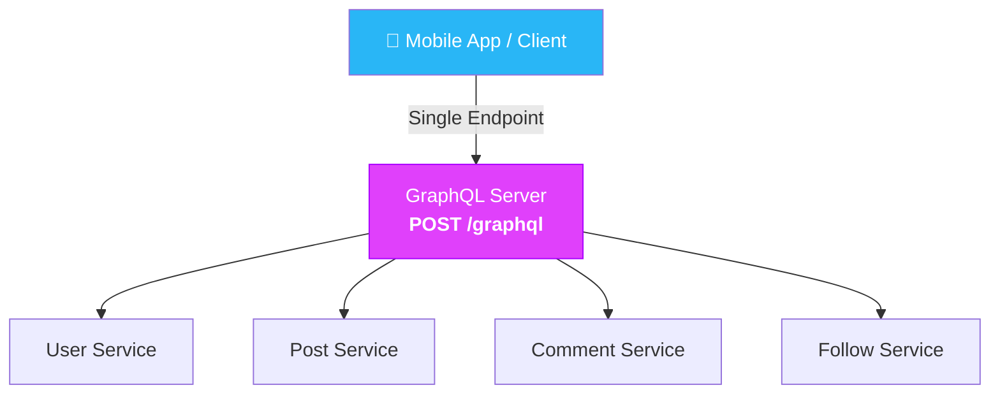
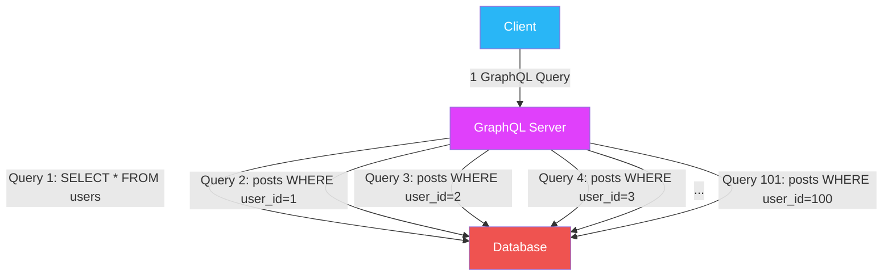
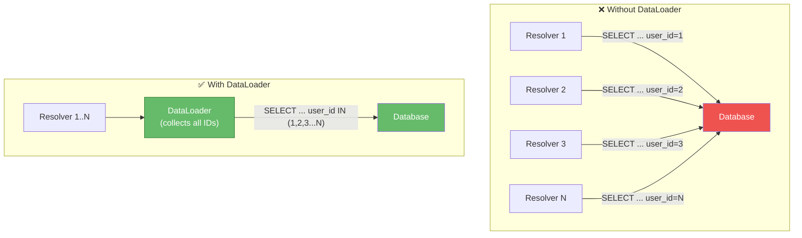
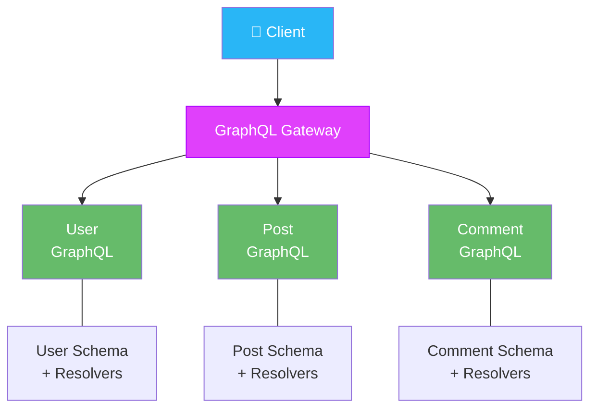
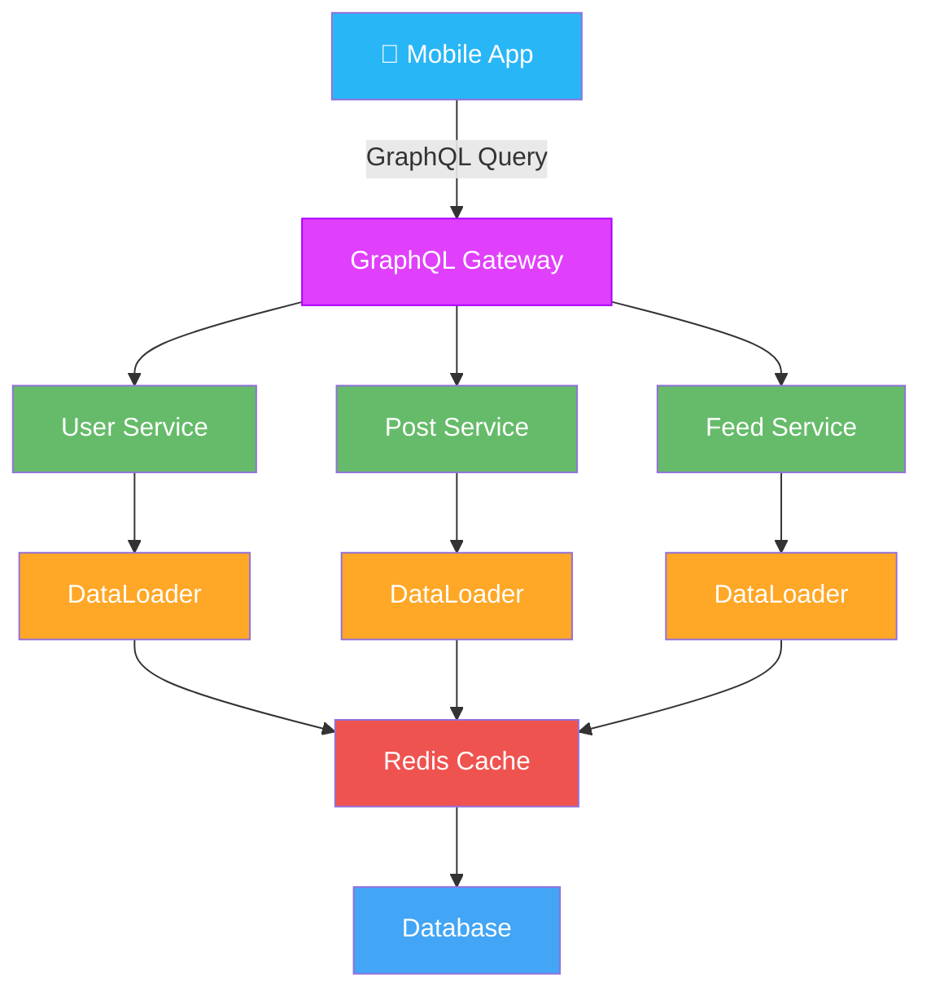

[← Back to Main README](../README.md) | [Previous: REST APIs](01-REST-APIS.md) | [Next: RPC & gRPC →](03-RPC-AND-GRPC.md)

---

# Phase 2 — GraphQL: Zero → Hero

Welcome to the beginning of GraphQL: Zero → Hero.
Today, don't think of GraphQL as a technology.
Think of it as:

> A new way of asking for data.

Everything becomes easier once you understand that.

---

## Quick Reference Card

| Concept | Description |
|---|---|
| **GraphQL** | A Query Language for APIs — client decides response structure |
| **Query** | Read operation (like GET in REST) |
| **Mutation** | Write operation (like POST/PUT/DELETE in REST) |
| **Schema** | Contract / Blueprint / Menu — defines available types, fields, queries, mutations |
| **Type System** | Strongly typed: `String`, `Int`, `Boolean`, `Float`, `ID` |
| **Resolver** | Function that fetches data for a field |
| **N+1 Problem** | 1 query + N child queries — kills performance |
| **DataLoader** | Batches + caches resolver calls to fix N+1 |
| **Depth Limit** | Restricts nesting depth to prevent deep query explosions |
| **Query Complexity** | Cost analysis — reject queries above a cost threshold |
| **Federation** | Multiple GraphQL services merged via a Gateway |
| **Persisted Queries** | Store approved queries by hash for caching & security |

---

## Table of Contents

### Part 1 — GraphQL Fundamentals

- [GraphQL Roadmap](#graphql-roadmap)
- [Chapter 1 — What Exactly Is GraphQL?](#chapter-1--what-exactly-is-graphql)
  - [Real Life Analogy](#real-life-analogy)
  - [Traditional REST](#traditional-rest)
  - [GraphQL](#graphql)
  - [Biggest Idea In GraphQL](#biggest-idea-in-graphql)
- [Chapter 2 — GraphQL Architecture](#chapter-2--graphql-architecture)
  - [REST Architecture](#rest-architecture)
  - [GraphQL Architecture](#graphql-architecture)
- [Chapter 3 — GraphQL Query](#chapter-3--graphql-query)
- [Chapter 4 — Schema](#chapter-4--schema)
  - [Type System](#type-system)
  - [Built-In Types](#built-in-types)
- [Chapter 5 — Resolver](#chapter-5--resolver)
  - [GraphQL Superpower — Nested Queries](#graphql-superpower)
- [Chapter 6 — Mutation](#chapter-6--mutation)
  - [Request Lifecycle](#request-lifecycle)
  - [REST vs GraphQL So Far](#rest-vs-graphql-so-far)
  - [Instagram Example](#instagram-example)
  - [Mental Model To Remember](#mental-model-to-remember)
  - [What You've Learned](#what-youve-learned)

### Part 2 — Production GraphQL

- [Next Lesson (Where Real GraphQL Starts)](#next-lesson-where-real-graphql-starts)
- [Chapter 1 — The Hidden Problem in GraphQL (N+1)](#chapter-1--the-hidden-problem-in-graphql)
  - [Understanding N+1](#understanding-n1)
  - [Real Facebook Problem](#real-facebook-problem)
- [Chapter 2 — DataLoader](#chapter-2--dataloader)
- [Chapter 3 — Query Depth Problem](#chapter-3--query-depth-problem)
- [Chapter 4 — Query Complexity Problem](#chapter-4--query-complexity-problem)
- [Chapter 5 — GraphQL Caching](#chapter-5--graphql-caching)
  - [Common GraphQL Cache Layers](#common-graphql-cache-layers)
- [Chapter 6 — GraphQL Security Problems](#chapter-6--graphql-security-problems)
  - [Introspection](#introspection)
- [Chapter 7 — GraphQL Federation](#chapter-7--graphql-federation)
- [End-to-End Production GraphQL Architecture](#end-to-end-production-graphql-architecture)
- [REST vs GraphQL — Senior Engineer View](#rest-vs-graphql--senior-engineer-view)
- [GraphQL Mastery Checklist ✅](#graphql-mastery-checklist-)
- [What Comes Next?](#what-comes-next)

---

## GraphQL Roadmap

### Phase 1 (Today)

```
✅ What is GraphQL?
✅ GraphQL Architecture
✅ Query
✅ Schema
✅ Type System
✅ Resolver
✅ Mutation
✅ Request Lifecycle
✅ Facebook Example
```

### Phase 2

```
✅ Subscriptions
✅ Real-time GraphQL
✅ Apollo
✅ Federation
✅ Gateway
✅ N+1 Problem
✅ DataLoader
```

### Phase 3

```
✅ Scaling GraphQL
✅ Caching
✅ Security
✅ Query Complexity
✅ Cost Analysis
✅ Production Architecture
```

---

# Part 1 — GraphQL Fundamentals

---

## Chapter 1 — What Exactly Is GraphQL?

Most beginners hear:

> GraphQL is an API.

Not quite.
GraphQL is:

> A Query Language for APIs

Important distinction.

Think of SQL.
You don't say:

> SQL is a database.

No.
SQL is:

> A language used to ask databases for data.

Similarly:

> GraphQL is a language used to ask APIs for data.

### Real Life Analogy

Imagine a waiter.
REST waiter:

> Orders come in predefined combos.

Example:

```
Combo 1
Combo 2
Combo 3
```

You must choose one.

GraphQL waiter:

> Tell me exactly what you want.

Example:

```
1 tea
2 cakes
1 sandwich
```

Custom response.

That's GraphQL.

### Traditional REST

Example:

```http
GET /users/123
```

Server decides response.
Returns:

```json
{
"id":123,
"name":"Irfan",
"email":"abc@gmail.com",
"address":"Hyderabad",
"bio":"Engineer"
}
```

Need only:

> name

Too bad.
Server decides.

### GraphQL

Client decides.
Request:

```graphql
query {
  user(id:123){
    name
  }
}
```

Response:

```json
{
  "data":{
    "user":{
      "name":"Irfan"
    }
  }
}
```

Only requested fields returned.
This is the core GraphQL idea.

### Biggest Idea In GraphQL

Memorise forever:

```
REST:
  Server decides response structure.

GraphQL:
  Client decides response structure.
```

This is the most important GraphQL concept.

---

## Chapter 2 — GraphQL Architecture

Let's build Instagram.

### REST Architecture

```
Mobile App
  |
  +--> User API
  |
  +--> Post API
  |
  +--> Followers API
  |
  +--> Comments API
```

Many requests.

### GraphQL Architecture

```
Mobile App
  |
  V
GraphQL Server
  |
  +---- User Service
  |
  +---- Post Service
  |
  +---- Comment Service
  |
  +---- Follow Service
```



From client side:

> ONE GRAPHQL ENDPOINT

Usually:

```http
/graphql
```

Only one endpoint.

Not:

```http
/users
/posts
/comments
```

#### Important Question

Many beginners ask:

> Where are resources?

In GraphQL:

> Resources are hidden behind schema.

We'll see why.

---

## Chapter 3 — GraphQL Query

The equivalent of:

```http
GET
```

in GraphQL is:

```graphql
Query
```

### Example

REST:

```http
GET /users/123
```

GraphQL:

```graphql
query {
  user(id:123) {
    name
  }
}
```

Read it like English:

```
Get user 123

Return:
  only name
```

Need more?

```graphql
query {
  user(id:123){
    id
    name
    bio
  }
}
```

Response:

```json
{
  "data":{
    "user":{
      "id":123,
      "name":"Irfan",
      "bio":"Engineer"
    }
  }
}
```

Need even more?

```graphql
query {
  user(id:123){
    name
    followers
    following
  }
}
```

Same API.
Different response.
Amazing flexibility.

---

## Chapter 4 — Schema

Most important GraphQL concept.
Think:

```
Schema
  =
Contract
  =
Blueprint
  =
Menu
```

#### Restaurant Example

Before ordering:

> Need Menu.

Otherwise:

> You don't know what exists.

GraphQL works same way.
Schema defines:

```
Available Objects

Available Fields

Available Queries

Available Mutations
```

#### Example Schema

```graphql
type User {
  id: ID
  name: String
  bio: String
}
```

Meaning:

```
User has:
  id
  name
  bio
```

Now GraphQL knows:

> What fields can be requested.

#### Why Schema Matters

Imagine frontend requests:

```graphql
query {
  user(id:123){
    salary
  }
}
```

Schema:

```graphql
type User {
  id
  name
  bio
}
```

No salary field.
Immediate error.

This prevents lots of bugs.

### Type System

GraphQL is strongly typed.
Very important.

#### Example

```graphql
type User {
  id: ID
  name: String
  age: Int
}
```

Meaning:

```
id = identifier

name = string

age = integer
```

If backend returns:

```json
{
  "age":"twenty-five"
}
```

GraphQL rejects it.
Type mismatch.

Benefits:

```
Safer APIs

Better validation

Better tooling

Better autocomplete
```

### Built-In Types

Most common:

```graphql
String

Int

Boolean

Float

ID
```

#### Example

```graphql
type Course {
  id: ID
  title: String
  rating: Float
  published: Boolean
}
```

Easy.

---

## Chapter 5 — Resolver

This is where magic happens.

Question:
When frontend asks:

```graphql
query {
  user(id:123){
    name
  }
}
```

Who fetches data?

Answer:

> Resolver

Think:

```
Resolver
  =
Function
  =
Worker
  =
Data Fetcher
```

#### Architecture

```
Client
  |
Query
  |
GraphQL Server
  |
Resolver
  |
Database
```

#### Example

Frontend:

```graphql
query {
  user(id:123){
    name
  }
}
```

Resolver:

```javascript
function user(id){
  return database.find(id);
}
```

Resolver fetches data.
Returns result.

#### More Complex Example

Instagram Profile

Query

```graphql
query {
  user(id:123){
    name
    posts
  }
}
```

GraphQL Resolver Flow

```
User Resolver
  |
  V
User Service

Posts Resolver
  |
  V
Post Service
```

GraphQL assembles everything.

Final response:

```json
{
  "data":{
    "user":{
      "name":"Irfan",
      "posts":[]
    }
  }
}
```

### GraphQL Superpower

Nested Queries.

REST
May require:

```
GET /user

GET /posts

GET /comments
```

GraphQL
Single Query:

```graphql
query {
  user(id:123){
    name

    posts {

      title

      comments {

        text
      }
    }
  }
}
```

One request.
Multiple data sources.

This was revolutionary for mobile apps.

---

## Chapter 6 — Mutation

Query = Read
Mutation = Write

REST:

```http
POST
PUT
PATCH
DELETE
```

GraphQL:

```graphql
mutation
```

#### Example

Create User.

```graphql
mutation {

  createUser(
    name:"Irfan"
  ) {

    id
    name
  }
}
```

Response:

```json
{
  "data":{
    "createUser":{
      "id":123,
      "name":"Irfan"
    }
  }
}
```

#### Update User

```graphql
mutation {
  updateUser(
    id:123,
    name:"Mohammad"
  ){
    id
    name
  }
}
```

#### Delete User

```graphql
mutation {
  deleteUser(id:123)
}
```

So think:

```
Query => Read

Mutation => Write
```

### Request Lifecycle

Let's trace a full GraphQL request.

User opens Instagram Profile.
GraphQL Query:

```graphql
query {
  user(id:123){

    name

    posts {
      title
    }

    followers
  }
}
```

#### Flow

```
Client
  |
  V
GraphQL Server
  |
  +--> User Resolver
  |
  +--> Post Resolver
  |
  +--> Followers Resolver
  |
  V
Combined Response
  |
  V
Client
```

GraphQL acts like an orchestra conductor.
It coordinates data retrieval.

### REST vs GraphQL So Far

| REST | GraphQL |
|---|---|
| Multiple endpoints | Single endpoint |
| Server chooses response | Client chooses response |
| Simple caching | Harder caching |
| Easy to understand | More complex |
| CRUD friendly | Aggregation friendly |
| Resource-centric | Query-centric |

### Instagram Example

If profile screen needs:

```
User
Posts
Followers
```

REST:

> 3-5 API calls

GraphQL:

> 1 Query

That's why Facebook loved it.

### Mental Model To Remember

Imagine:
REST:

> Restaurant Combo Menu

You get predefined meals.

GraphQL:

> Buffet

Pick precisely what you want.
Nothing more.
Nothing less.

### What You've Learned

```
✅ What GraphQL is

✅ Single Endpoint

✅ Query

✅ Schema

✅ Type System

✅ Resolver

✅ Nested Queries

✅ Mutation

✅ Request Lifecycle

✅ REST vs GraphQL fundamentals
```

---

# Part 2 — Production GraphQL

---

## Next Lesson (Where Real GraphQL Starts)

Now we'll enter the advanced but extremely important topics:

```
✅ N+1 Query Problem
✅ Why naive GraphQL becomes slow
✅ DataLoader
✅ Batching
✅ Caching Challenges
✅ Query Cost Analysis
✅ Query Depth Limits
✅ Security
✅ GraphQL Federation
✅ How Instagram/Facebook scale GraphQL
```

This is where GraphQL moves from a nice idea to a production-scale system.

Now we enter the part where GraphQL goes from "cool API technology" to "production engineering".
Many beginners see GraphQL and think:

> Wow!
> One query gets everything.

And that's true.
But then they deploy it.
And suddenly:

```
Database crashes
Latency explodes
CPU spikes
Queries become slow
```

Today we'll learn:

```
✅ N+1 Problem
✅ Why GraphQL can become slower than REST
✅ DataLoader
✅ Batching
✅ Query Complexity
✅ Query Depth Attacks
✅ GraphQL Caching Challenges
✅ Security
✅ Production Architecture
```

---

## Chapter 1 — The Hidden Problem in GraphQL

Let's build Instagram.
Query:

```graphql
query {
  users {
    id
    name
  }
}
```

Simple.

GraphQL executes:

```sql
SELECT * FROM users
```

One query.
Fast.

Now frontend says:

> Show user posts too.

GraphQL:

```graphql
query {
  users {
    id
    name

    posts {
      title
    }
  }
}
```

Looks innocent.
But something dangerous may happen.

#### What Developer Thinks

```
One GraphQL query

  =
One Database query
```

Wrong.

Reality:

```
One GraphQL query

  can become

1000 Database queries
```

This is the famous:
**N+1 Problem**

### Understanding N+1

Suppose:

> 100 users

exist.
GraphQL query:

```graphql
query {

  users {

    name

    posts {
      title
    }

  }

}
```

#### Resolver Behaviour

Step 1:
Fetch users.

```sql
SELECT * FROM users
```

1 query.

Now GraphQL loops.
User 1:

```sql
SELECT * FROM posts
WHERE user_id = 1
```

User 2:

```sql
SELECT * FROM posts
WHERE user_id = 2
```

User 3:

```sql
SELECT * FROM posts
WHERE user_id = 3
```

Continue until:

> User 100

Total Queries:

```
1 query for users

  +

100 queries for posts

  =

101 queries
```

Formula:

> 1 + N

Hence:

> N+1 Problem



#### Why This Is Bad

Imagine:

> 10,000 users

Now:

> 10001 database queries

for one GraphQL request.
Disaster.

Architecture:

```
Client
  |
GraphQL
  |
10001 Queries
  |
Database
```

Database melts.

### Real Facebook Problem

Facebook:

```
Posts
Authors
Comments
Likes
Reactions
```

Deeply nested queries.
Without optimisation:

> Millions of extra DB calls.

Impossible to scale.

---

## Chapter 2 — DataLoader

The most famous GraphQL performance solution.
Memorise this term.
Interview favourite.

DataLoader solves:

> N+1 Problem

using:

```
Batching
  +
Caching
```

#### Without DataLoader

GraphQL does:

```sql
SELECT * FROM posts
WHERE user_id = 1

SELECT * FROM posts
WHERE user_id = 2

SELECT * FROM posts
WHERE user_id = 3
```

100 times.

#### With DataLoader

GraphQL combines requests.
Single query:

```sql
SELECT *
FROM posts
WHERE user_id IN
(1,2,3,4,5...100)
```

Amazing.

Now:

```
1 query
  instead of
100 queries
```

Huge performance boost.



#### Restaurant Analogy

Without DataLoader:

```
Customer 1 orders tea

Kitchen trip

Customer 2 orders tea

Kitchen trip

Customer 3 orders tea

Kitchen trip
```

100 trips.

With DataLoader:

```
Collect all orders first

Go to kitchen once
```

Efficient.

#### DataLoader Architecture

```
Query
  |
Resolvers
  |
DataLoader
  |
Batch Query
  |
Database
```

Senior Rule:

> Every GraphQL project
> eventually needs DataLoader.

---

## Chapter 3 — Query Depth Problem

GraphQL allows nesting.
Amazing feature.
Dangerous feature.

#### Normal Query

```graphql
query {

  user(id:1){
    name
  }

}
```

Simple.

But attacker sends:

```graphql
query {

  user(id:1){

    friends{

      friends{

        friends{

          friends{

            friends{

              friends{
                name
              }

            }

          }

        }

      }

    }

  }

}
```

Question:
How much work is this?
Potentially enormous.

This is called:
**Deep Query Explosion**

Cost grows rapidly.
Think:

```
Person

  500 friends

    each friend

      500 friends

        each friend

          500 friends
```

Massive expansion.

Can crash backend.

#### Solution: Depth Limit

Example:

> Maximum Depth = 5

Anything deeper:

```http
403 Forbidden
```

or

```http
400 Bad Request
```

Production GraphQL nearly always has:

> Depth Limits

---

## Chapter 4 — Query Complexity Problem

Another GraphQL challenge.

Look at query.
Seems harmless:

```graphql
query {
  posts {
    title
  }
}
```

But imagine:

```graphql
query {
  posts(limit:1000000) {
    title
  }
}
```

Huge cost.

Or:

```graphql
query {

  users(first:100000){

    posts(first:10000){

      comments(first:10000){

        likes(first:10000)
      }

    }

  }

}
```

One query.
But backend workload enormous.

GraphQL server needs:
**Cost Analysis**
Before execution.

Example:

```
Simple Query
  Cost = 10

Medium Query
  Cost = 50

Huge Query
  Cost = 5000
```

Rule:

> Max Cost = 100

Reject anything bigger.

Used at:

```
Facebook
Shopify
GitHub
Large GraphQL systems
```

---

## Chapter 5 — GraphQL Caching

Here things become tricky.

REST caching is easy.
Example:

```http
GET /users/123
```

URL identifies resource.
Browser can cache.
CDN can cache.
Redis can cache.
Easy.

GraphQL uses:

```http
POST /graphql
```

for most requests.

Example:

```graphql
query {
  user(id:123){
    name
  }
}
```

and

```graphql
query {
  user(id:123){
    bio
  }
}
```

Same endpoint.
Different response.

Traditional HTTP cache struggles.
Because:

```
URL identical

Response different
```

This is why GraphQL caching is harder.

### Common GraphQL Cache Layers

#### Resolver Cache

Cache inside resolver.
Example:

> User Data

stored in Redis.

#### DataLoader Cache

Caches repeated loads inside request.

#### Persisted Queries

Advanced technique.
Store approved queries.
Reference by hash.
Much easier to cache.

---

## Chapter 6 — GraphQL Security Problems

REST naturally limits access via endpoints.
Example:

```http
/users

/posts

/comments
```

GraphQL exposes schema.
Potentially:

```
Many relationships

Many traversal paths
```

Attacks include:

```
Deep Queries

Expensive Queries

Introspection Abuse

Field Enumeration

DoS Queries
```

### Introspection

GraphQL can describe itself.
Amazing for developers.

Example:

```graphql
{
  __schema {
    types {
      name
    }
  }
}
```

Returns schema details.

In production:
Many companies restrict or disable introspection.
Especially on public APIs.

---

## Chapter 7 — GraphQL Federation

Now we reach the architecture used by big companies.

Small startup:

> One GraphQL Server

works fine.

Large company:

```
User Service

Post Service

Comment Service

Payment Service

Search Service
```

Each team owns its data.

One huge GraphQL server becomes impossible.

Solution:
**Federation**



#### Architecture

```
Client
  |
  V

  GraphQL Gateway

    /    |    \
   /     |     \

User    Post   Comment
GraphQL GraphQL GraphQL
```

Each team owns:

```
Their schema
Their service
Their deployment
```

Gateway merges everything.
Client sees:

> One GraphQL API

Beautiful.

Used widely in:

```
Facebook

Netflix

Shopify

Airbnb

Large enterprises
```

---

## End-to-End Production GraphQL Architecture

```
Mobile App
  |
GraphQL Query
  |
  V
+------------------+
| GraphQL Gateway  |
+---------+--------+
          |
  +-------+--------+--------+
  |                |        |
  V                V        V

+--------+   +--------+  +--------+
| User   |   | Post   |  |Feed    |
|Service |   |Service |  |Service |
+----+---+   +----+---+  +----+---+
     |             |           |
     V             V           V

DataLoader   DataLoader  DataLoader
     |             |           |
     +-------+-----+-----------+
             |
             V

       Redis Cache
             |
             V

         Database
```



---

## REST vs GraphQL — Senior Engineer View

Beginner view:

> Which is better?

Wrong question.

Senior view:

> When is each useful?

**Use REST when:**

```
Public API

CRUD

Simple service

Caching important

Easy debugging important
```

**Use GraphQL when:**

```
Frontend needs flexibility

Many services involved

Mobile bandwidth matters

Many UI screens
```

#### Reality in Big Companies

```
Frontend
  |
GraphQL
  |
Gateway
  |
REST + gRPC + Events
```

Most organisations use:

> Multiple communication styles together.

Not one.

---

## GraphQL Mastery Checklist ✅

You now understand:

```
✅ Why GraphQL Exists
✅ Query
✅ Schema
✅ Type System
✅ Resolver
✅ Mutation
✅ Nested Queries
✅ N+1 Problem
✅ DataLoader
✅ Query Complexity
✅ Query Depth Limits
✅ Security Concerns
✅ Caching Challenges
✅ Federation
✅ Production Architecture
```

---

## What Comes Next?

Now you're finally ready for the next major API communication style:
**RPC & gRPC**
This is where you'll learn:

```
Why Google didn't choose REST internally

Why microservices often avoid REST

What RPC really means

Protocol Buffers

gRPC

Streams

Unary Calls

Bidirectional Streaming

HTTP/2

Why Uber, Netflix, Google,
Microsoft, and many large systems
use gRPC internally
```

And this is the point where API design starts blending directly into microservices and distributed systems.

---

[← Back to Main README](../README.md) | [Previous: REST APIs](01-REST-APIS.md) | [Next: RPC & gRPC →](03-RPC-AND-GRPC.md)
