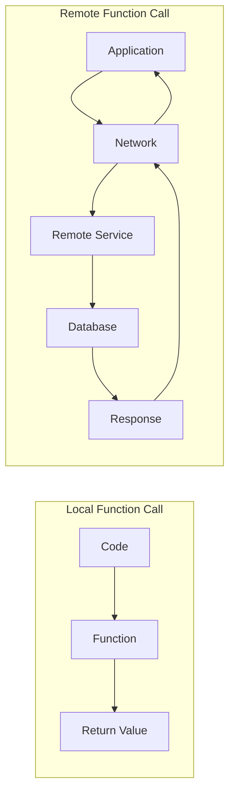
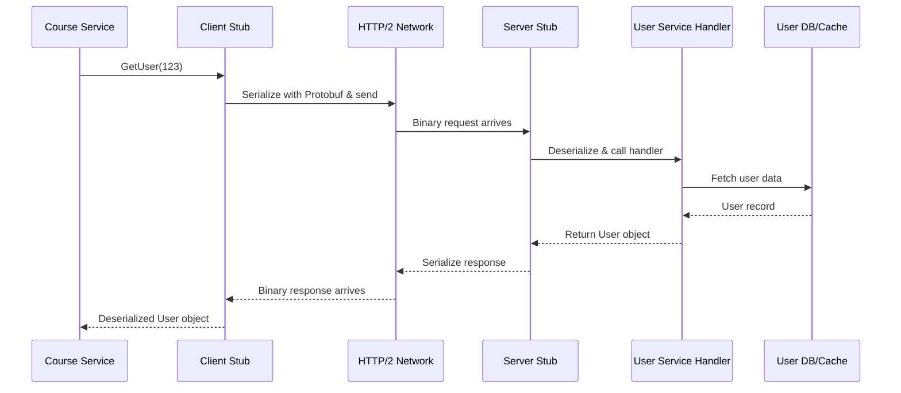
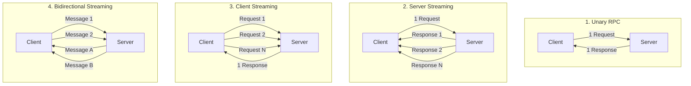
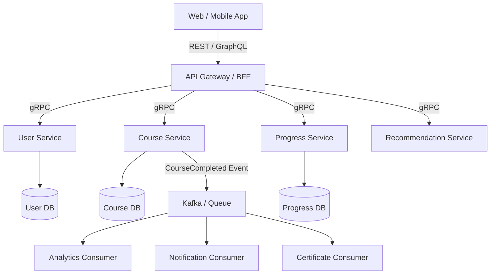

[← Back to Main README](../README.md) | [Previous: GraphQL](02-GRAPHQL.md) | [Next: Real-Time Communication →](04-REALTIME-COMMUNICATION.md)

---

# RPC & gRPC — Zero to Hero

This is where you'll start understanding how Google, Uber, Netflix, Microsoft and many large microservice architectures communicate internally.
And you'll finally understand:

```text
REST -> Mainly became popular for external/public APIs

gRPC -> Became popular for internal service communication
```

---

## Quick Reference Card

| Concept | Summary |
|---|---|
| **RPC** | Call a function that is running on another machine |
| **gRPC** | Modern RPC using HTTP/2 + Protocol Buffers + Code Generation |
| **Protocol Buffers** | Compact binary serialization format (the "vacuum-compressed suitcase") |
| **Proto File (.proto)** | Service contract defining services, methods, and message types |
| **Client Stub** | Generated code on client side — makes remote calls look like local functions |
| **Server Stub** | Generated code on server side — receives requests and routes to handler |
| **Unary RPC** | One request → One response (most common, similar to REST) |
| **Server Streaming** | One request → Many responses (live updates, progress) |
| **Client Streaming** | Many requests → One response (file upload, batch events) |
| **Bidirectional Streaming** | Many messages both ways simultaneously (chat, collaboration) |
| **Deadline** | Maximum time a gRPC call is allowed to take |
| **Field Numbers** | Compact identifiers in proto messages — do not change after clients use them |

---

## Table of Contents

### Part 1: RPC Foundations & gRPC Introduction

- [Learning Roadmap](#learning-roadmap)
- [Chapter 1 — Before RPC Existed](#chapter-1--before-rpc-existed)
- [Chapter 2 — What is RPC?](#chapter-2--what-is-rpc)
- [Chapter 3 — REST vs RPC Thinking](#chapter-3--rest-vs-rpc-thinking)
- [Chapter 4 — Basic RPC Architecture](#chapter-4--basic-rpc-architecture)
- [Chapter 5 — The Hidden Challenge](#chapter-5--the-hidden-challenge)
- [Chapter 6 — Service Contract](#chapter-6--service-contract)
- [Chapter 7 — Why Google Created gRPC](#chapter-7--why-google-created-grpc)
- [Chapter 8 — Protocol Buffers (Proto)](#chapter-8--protocol-buffers-proto)
- [REST vs RPC vs gRPC Comparison](#rest-vs-rpc-vs-grpc)
- [The Most Important Thing You Learned (Part 1)](#the-most-important-thing-you-learned-today)

### Part 2: gRPC Deep Dive

- [1. Quick Recap: What is gRPC?](#1-quick-recap-what-is-grpc)
- [2. REST vs gRPC Mental Model](#2-rest-vs-grpc-mental-model)
- [3. Why gRPC is Fast](#3-why-grpc-is-fast)
- [4. HTTP/1.1 Problem](#4-http11-problem)
- [5. HTTP/2 — gRPC's Transport Power](#5-http2--grpcs-transport-power)
- [6. Protocol Buffers — The Data Format](#6-protocol-buffers--the-data-format)
- [7. Protocol Buffers Simple Explanation](#7-protocol-buffers-simple-explanation)
- [8. The .proto File](#8-the-proto-file)
- [9. Code Generation](#9-code-generation)
- [10. Client Stub and Server Stub](#10-client-stub-and-server-stub)
- [11. Full gRPC Request Lifecycle](#11-full-grpc-request-lifecycle)
- [12. Four Types of gRPC Calls](#12-four-types-of-grpc-calls)
- [13. Unary RPC](#13-unary-rpc)
- [14. Server Streaming RPC](#14-server-streaming-rpc)
- [15. Client Streaming RPC](#15-client-streaming-rpc)
- [16. Bidirectional Streaming RPC](#16-bidirectional-streaming-rpc)
- [17. gRPC Streaming vs WebSocket](#17-grpc-streaming-vs-websocket)
- [18. Why gRPC is Popular in Microservices](#18-why-grpc-is-popular-in-microservices)
- [19. Where gRPC Is Usually a Good Fit](#19-where-grpc-is-usually-a-good-fit)
- [20. Where gRPC May Not Be Ideal](#20-where-grpc-may-not-be-ideal)
- [Part 2 Deep Dive Begins](#part-2-deep-dive)
- [21. REST vs GraphQL vs gRPC So Far](#21-rest-vs-graphql-vs-grpc-so-far)
- [22. Real-World Example: Learning Platform](#22-real-world-example-learning-platform)
- [23. Failure Modes in gRPC](#23-failure-modes-in-grpc)
- [24. Deadlines: Very Important](#24-deadlines-very-important)
- [25. Retries in gRPC](#25-retries-in-grpc)
- [26. Load Balancing gRPC](#26-load-balancing-grpc)
- [27. Observability in gRPC](#27-observability-in-grpc)
- [28. When Should You Use gRPC?](#28-when-should-you-use-grpc)
- [29. When Should You Avoid gRPC?](#29-when-should-you-avoid-grpc)
- [30. Final Architecture Diagram](#30-final-architecture-diagram)
- [31. Senior-Level Summary](#31-senior-level-summary)
- [Next Lesson](#next-lesson)

---

# Part 1: RPC Foundations & gRPC Introduction

## Learning Roadmap

**Today (Part 1)**

```text
✅ What is RPC?
✅ Why RPC was invented
✅ What's wrong with REST internally?
✅ Local Function vs Remote Function
✅ Remote Procedure Call
✅ Request/Response Flow
✅ Service Contracts
✅ Why Google created gRPC
✅ Protocol Buffers basics
```

**Next lessons:**

```text
✅ HTTP/2
✅ Binary vs JSON
✅ Unary Calls
✅ Streaming
✅ Client Streaming
✅ Server Streaming
✅ Bidirectional Streaming
✅ Microservices Architecture
✅ Service Discovery
✅ Load Balancing
✅ Production gRPC
```

---

## Chapter 1 — Before RPC Existed

Imagine we have:

```text
User Service
Course Service
Payment Service
```

Simple architecture:

```text
User Service
|
V
Course Service
```

Now User Service needs course data.
How should it do that?

REST approach:

```http
GET /courses/123
```

The Course Service returns:

```json
{
  "id":123,
  "title":"System Design"
}
```

Works.
No problem.

But now imagine:

```text
50 microservices

100 microservices

500 microservices
```

all talking to each other.
Suddenly engineers begin asking:

```text
Why are we sending verbose JSON?

Why are we manually writing clients?

Why are we dealing with URL routing?

Why are we treating service calls like websites?
```

### REST Came From The Web

Remember REST's original roots.
REST was designed around:

```text
Browsers
Websites
Resources
HTTP
```

Examples:

```text
Products
Users
Orders
Posts
```

Very web-oriented.

But internally microservices often think differently.
Instead of:

```text
Resources
```

they think:

```text
Operations
Actions
Functions
Commands
```

Example:

```text
ValidatePayment()

CalculateRecommendation()

GenerateCertificate()

CreateInvoice()
```

These look more like:

```text
Functions
```

than

```text
Resources
```

---

## Chapter 2 — What is RPC?

RPC means:
**Remote Procedure Call**

Let's break that down.

**Procedure:**

```text
Function
Method
Operation
```

Examples:

```text
getUser()

createOrder()

sendMessage()
```

**Remote:**

```text
Not running on my machine.

Running somewhere else.
```

**Call:**

```text
Execute it.
```

**Combine:**

```text
RPC

=
Call a function

that is running

on another machine.
```

### Restaurant Analogy

Imagine:

```text
You call restaurant.
```

You say:

```text
Make Pizza.
```

You don't care:

```text
Where oven is

Which cook made it

How dough was prepared
```

You just invoke:

```text
MakePizza()
```

That's the RPC mindset.

### Local Function Call

Normal code.
Example:

```javascript
calculateTax()
```

Flow:

```text
Code
|
V
Function
|
Return
```

Everything in same process.
Super fast.

### Remote Function Call

Now function lives elsewhere.

```javascript
paymentService.charge()
```

Flow:

```text
Application
|
Network
|
Payment Service
|
Database
|
Response
```

Looks like a function.
But secretly:

```text
Network Call
Serialization
Deserialization
Authentication
Retries
Timeouts
```

are happening.



### Important Lesson

This is where many engineers get into trouble.
Question:

```text
Is remote call same
as local function call?
```

Answer:

```text
NO
```

Very important.

**Local Call**

Characteristics:

```text
Fast

No network

Very reliable

Same memory space
```

**Remote Call**

Characteristics:

```text
Network latency

Network failures

Timeouts

Packet loss

Server crashes

Retries
```

Very different.

### Famous Distributed Systems Rule

Memorise this:

```text
A remote call is NOT a local call.
```

This sentence alone can save years of mistakes.

---

## Chapter 3 — REST vs RPC Thinking

REST mindset:

```text
Resource Oriented
```

Example:

```http
GET /users/123
```

RPC mindset:

```text
Action Oriented
```

Example:

```text
GetUser(123)
```

REST:

```http
POST /payments
```

RPC:

```text
ChargePayment()
```

REST:

```http
POST /notifications
```

RPC:

```text
SendNotification()
```

Notice the difference?
REST asks:

```text
What resource?
```

RPC asks:

```text
What function?
```

### Example

Let's build recommendation system.
REST version:

```http
POST /recommendations
```

or:

```http
GET /users/123/recommendations
```

RPC version:

```text
GetRecommendations(userId)
```

Much more natural.

That is why engineers loved RPC internally.

---

## Chapter 4 — Basic RPC Architecture

Simple version:

```text
Client
|
RPC Call
|
V
Server
|
Function Executes
|
Response
```

Example:

```text
Client

GetUser(123)
```

Server:

```text
function GetUser(123)
```

returns:

```json
{
  "id":123,
  "name":"Irfan"
}
```

To developer:

```text
Feels like function call.
```

---

## Chapter 5 — The Hidden Challenge

Look at this:

```javascript
userService.getUser(123)
```

Looks harmless.

Reality:

```text
JSON Conversion

TCP Connection

TLS

Authentication

Network

Load Balancer

Server Processing

Database Call
```

Lots happening.

The danger:
Developers forget network exists.

Beginner thinks:

```text
Just call function.
```

Senior thinks:

```text
What happens if:

Network timeout?

Server down?

Response lost?

Retries occur?
```

Big difference.

---

## Chapter 6 — Service Contract

Question:
How does client know:

```text
Function Name

Input Parameters

Output Structure
```

?
Need a contract.

### Example Contract

```text
GetUser()

Input:
  userId

Output:
  User
```

This becomes extremely important in gRPC.
Because gRPC generates code automatically.

### Traditional REST

Often people read:

```text
Swagger/OpenAPI
```

to know endpoints.

RPC wants something stronger:

```text
Formal service definition.
```

---

## Chapter 7 — Why Google Created gRPC

Google had massive problems.
Imagine:

```text
Thousands of services.
```

Requirements:

```text
Fast

Strongly Typed

Cross Language

Scalable

Streaming Support
```

JSON + REST was becoming expensive internally.

Problems:

```text
Large payloads

Text parsing

Lack of strong contracts

Manual client creation
```

Google wanted:

```text
Smaller payloads

Code generation

Compile-time safety

Very fast communication
```

Thus:
**gRPC**
was born.

### What Does gRPC Stand For?

Historically:

```text
Google Remote Procedure Call
```

Today:

```text
gRPC
```

is simply the project name.

### Core Idea of gRPC

Take RPC.
Add:

```text
HTTP/2

Protocol Buffers

Code Generation

Streaming

Strong Contracts
```

Result:

```text
Extremely fast
service communication.
```

### Architecture

```text
User Service
|
| gRPC
V
Course Service
```

Instead of:

```text
JSON

REST Endpoint

Manual Parsing
```

---

## Chapter 8 — Protocol Buffers (Proto)

This is the secret sauce.
Before data travels:
Need format.

REST usually uses:

```json
{
  "id":123,
  "name":"Irfan"
}
```

Human readable.

But JSON is verbose.

Protocol Buffer version:

```text
Binary Format
```

Much smaller.
Much faster.

Think:

**JSON**

```text
A large suitcase.
```

**Protocol Buffers**

```text
Vacuum-compressed suitcase.
```

Same information.
Less space.

### Proto File

Example:

```protobuf
message User {

  int32 id = 1;

  string name = 2;

}
```

This becomes the contract.
Client and server both read it.

From this file:
gRPC generates:

```text
Java Code

Go Code

NodeJS Code

Python Code

C# Code
```

automatically.

Amazing benefit:

```text
No manual client writing.
```

### End-To-End Example

**Step 1**

Client calls:

```text
GetUser(123)
```

**Step 2**

Generated client converts request.

**Step 3**

Protocol Buffers serialize data.

**Step 4**

Sent over network.

**Step 5**

Server executes:

```text
GetUser()
```

**Step 6**

Response serialized.

**Step 7**

Client receives:

```text
User Object
```

Feels like:

```text
Function call.
```

Reality:

```text
Distributed system communication.
```

---

## REST vs RPC vs gRPC

| Feature | REST | RPC | gRPC |
|---|---|---|---|
| Primary Idea | Resources | Functions | Functions |
| Data Format | JSON | Various | ProtoBuf |
| Human Readable | ✅ | Depends | ❌ |
| Strong Typing | Partial | Depends | ✅ |
| Code Generation | Limited | Sometimes | ✅ |
| Performance | Good | Good | Excellent |
| Browser Friendly | ✅ | Usually | Limited |
| Internal Services | Good | Good | Excellent |
| Public APIs | Excellent | Rare | Rare |

---

## The Most Important Thing You Learned Today

There are two fundamentally different ways to think about APIs.

**REST thinking**

```text
What resource
am I accessing?
```

Example:

```http
GET /users/123
```

**RPC thinking**

```text
What function
am I invoking?
```

Example:

```text
GetUser(123)
```

That single distinction explains most of the difference between REST and RPC.

---

## What's Next? (The Really Fun Part)

In the next lesson we'll dive into:

```text
✅ HTTP/2
✅ Why gRPC is so fast
✅ Protobuf Encoding
✅ Client Stub
✅ Server Stub
✅ Unary Calls
✅ Server Streaming
✅ Client Streaming
✅ Bidirectional Streaming
✅ Real WhatsApp/Uber/Netflix Examples
```

This is where you'll finally understand why many modern microservices choose gRPC over REST internally.

---

# Part 2: gRPC Deep Dive

Now we continue RPC & gRPC Part 2 — this is where gRPC becomes much clearer.
Today we'll understand:

```text
✅ Why gRPC is fast
✅ HTTP/2 role in gRPC
✅ Protocol Buffers deeply
✅ Client Stub and Server Stub
✅ Unary RPC
✅ Server Streaming
✅ Client Streaming
✅ Bidirectional Streaming
✅ Real-world use cases
```

---

### 1. Quick Recap: What is gRPC?

In simple words:

```text
gRPC = Remote Function Calls + HTTP/2 + Protocol Buffers + Code Generation
```

Meaning:
Instead of calling:

```http
GET /users/123
```

you call:

```text
GetUser(123)
```

It feels like calling a normal function, but that function is running on another server.

---

### 2. REST vs gRPC Mental Model

**REST**

REST thinks in resources.

```http
GET /users/123
POST /orders
PATCH /courses/456
```

REST asks:

```text
Which resource am I working with?
```

**gRPC**

gRPC thinks in functions/services.

```text
GetUser(123)
CreateOrder(order)
UpdateCourse(course)
```

gRPC asks:

```text
Which operation do I want to execute?
```

---

### 3. Why gRPC is Fast

gRPC is fast mainly because of three things:

```text
1. HTTP/2
2. Protocol Buffers
3. Generated code/stubs
```

Let's understand each one slowly.

---

### 4. HTTP/1.1 Problem

Traditional REST APIs usually run over HTTP/1.1 or HTTP/2, but many classic REST systems were designed around HTTP/1.1 style request-response.
HTTP/1.1 works like this:

```text
Client sends request
Server sends response
Client sends another request
Server sends another response
```

It is simple, but at high scale, there are challenges:

```text
- Many connections may be needed
- Head-of-line blocking can happen at connection level
- Less efficient for many parallel service calls
- Streaming is not natural
```

---

### 5. HTTP/2 — gRPC's Transport Power

gRPC uses HTTP/2 as the default transport.
HTTP/2 gives important benefits:

```text
✅ Multiplexing
✅ Header compression
✅ Binary framing
✅ Long-lived connections
✅ Streaming support
```

Let's break these down.

#### 5.1 Multiplexing

Imagine one road.
In HTTP/1.1 style, traffic may behave like:

```text
Car 1 goes
then Car 2
then Car 3
```

In HTTP/2:

```text
Car 1, Car 2, Car 3
can share the same highway efficiently
```

Technically:

```text
Multiple requests and responses can travel over one connection at the same time.
```

This is very useful for microservices.
Example:

```text
Order Service calls:
- User Service
- Inventory Service
- Payment Service
- Shipping Service
```

With HTTP/2, communication can be more efficient over fewer connections.

#### 5.2 Header Compression

HTTP requests contain headers.
Example:

```http
Authorization: Bearer token
Content-Type: application/json
User-Agent: client
```

In REST/HTTP, these headers are often repeated again and again.
HTTP/2 compresses headers, reducing repeated overhead.
Useful when:

```text
Services call each other thousands/millions of times.
```

#### 5.3 Binary Framing

HTTP/2 breaks messages into binary frames.
Simple explanation:

```text
Instead of sending one big text-style message,
HTTP/2 sends structured binary chunks.
```

This makes it more efficient for machines.

#### 5.4 Streaming Support

This is one of the biggest reasons gRPC is powerful.
HTTP/2 supports streams naturally.
That allows gRPC to support:

```text
1. Unary call
2. Server streaming
3. Client streaming
4. Bidirectional streaming
```

We'll deeply understand each today.

---

### 6. Protocol Buffers — The Data Format

REST usually uses JSON.
Example JSON:

```json
{
  "id": 123,
  "name": "Irfan",
  "email": "irfan@example.com"
}
```

JSON is nice because:

```text
✅ Human-readable
✅ Easy to debug
✅ Works everywhere
```

But JSON also has problems:

```text
❌ Verbose
❌ Text-based
❌ Slower to parse than binary formats
❌ No strict schema by default
```

---

### 7. Protocol Buffers Simple Explanation

Protocol Buffers, or Protobuf, is:

```text
A compact binary format for structured data.
```

Think of it like this:

```text
JSON = Normal suitcase
Protobuf = Vacuum-compressed suitcase
```

Same information, smaller and faster for machines.

---

### 8. The .proto File

In gRPC, you define service contracts using .proto files.
Example:

```protobuf
syntax = "proto3";

service UserService {
  rpc GetUser(GetUserRequest) returns (GetUserResponse);
}

message GetUserRequest {
  int32 user_id = 1;
}

message GetUserResponse {
  int32 id = 1;
  string name = 2;
  string email = 3;
}
```

Now let's understand this slowly.

#### 8.1 Service

```protobuf
service UserService {
  rpc GetUser(GetUserRequest) returns (GetUserResponse);
}
```

This says:

```text
There is a service called UserService.

It has a remote function called GetUser.

GetUser accepts GetUserRequest.

It returns GetUserResponse.
```

#### 8.2 Message

```protobuf
message GetUserRequest {
  int32 user_id = 1;
}
```

This defines request shape.
Meaning:

```text
The request contains one field:
  user_id
```

#### 8.3 Field Numbers

Notice:

```protobuf
int32 user_id = 1;
string name = 2;
```

The numbers 1, 2, 3 are field numbers.
They are important because Protobuf binary encoding uses these numbers internally.
Important rule:

```text
Do not randomly change field numbers after clients are using them.
```

Because field numbers are part of the contract.

---

### 9. Code Generation

This is one of gRPC's biggest strengths.
From one .proto file, gRPC can generate code for:

```text
Java
Go
Node.js
Python
C#
C++
Ruby
and more
```

So teams do not manually write HTTP clients.
Instead, they generate strongly typed client and server code.

---

### 10. Client Stub and Server Stub

This is extremely important.

**Client Stub**

Client stub is generated code on the client side.
It lets you call remote service like a local function.
Example:

```javascript
client.getUser({ user_id: 123 })
```

Looks like a normal function.
But internally it does:

```text
Serialize request using Protobuf
Send over HTTP/2
Wait for response
Deserialize response
Return result
```

**Server Stub**

Server stub is generated code on the server side.
It receives the request and routes it to your actual function implementation.
Flow:

```text
Network request arrives
|
Server stub decodes it
|
Calls your GetUser handler
|
Encodes response
|
Sends response back
```

---

### 11. Full gRPC Request Lifecycle

Let's trace one call.

```text
Course Service wants user data.
```

It calls:

```text
GetUser(123)
```

Flow:

```text
Course Service
|
| Calls generated client stub
v
Client Stub
|
| Serialises request using Protobuf
v
HTTP/2 Network
|
v
Server Stub
|
| Deserialises request
v
User Service Handler
|
| Fetches user from DB/cache
v
Server Stub
|
| Serialises response
v
HTTP/2 Network
|
v
Client Stub
|
| Deserialises response
v
Course Service receives User object
```

ASCII diagram:

```text
+----------------+
| Course Service |
+-------+--------+
        |
        | getUser(123)
        v
+----------------+
| Client Stub    |
+-------+--------+
        |
        | Protobuf + HTTP/2
        v
+----------------+
| Server Stub    |
+-------+--------+
        |
        v
+----------------+
| User Service   |
+-------+--------+
        |
        v
+----------------+
| User DB/Cache  |
+----------------+
```



---

### 12. Four Types of gRPC Calls

This is the heart of gRPC.
gRPC supports four communication patterns:

```text
1. Unary RPC
2. Server Streaming RPC
3. Client Streaming RPC
4. Bidirectional Streaming RPC
```

Let's learn them one by one.



---

### 13. Unary RPC

Unary means:

```text
One request
One response
```

This is the most common and most similar to REST.
Example:

```text
GetUser(userId) -> User
```

Proto:

```protobuf
service UserService {
  rpc GetUser(GetUserRequest) returns (GetUserResponse);
}
```

Flow:

```text
Client ---- request ----> Server
Client <--- response ---- Server
```

Diagram:

```text
Client                       Server
  |                            |
  | ---- GetUser(123) -->      |
  |                            |
  | <---- User data -----     |
```

Use cases:

```text
- Get user
- Create order
- Validate token
- Fetch course details
- Calculate price
```

Most gRPC calls in normal microservices are unary.

---

### 14. Server Streaming RPC

Server streaming means:

```text
Client sends one request.
Server sends many responses.
```

Example:

```text
Client: Give me live stock price for Microsoft.
Server: price update 1
Server: price update 2
Server: price update 3
...
```

Proto:

```protobuf
service StockService {
  rpc WatchPrice(PriceRequest) returns (stream PriceUpdate);
}
```

Flow:

```text
Client ---- request ----> Server
Client <--- response 1 -- Server
Client <--- response 2 -- Server
Client <--- response 3 -- Server
```

Diagram:

```text
Client                       Server
  |                            |
  | ---- WatchPrice ---->      |
  |                            |
  | <---- Update 1 ------     |
  | <---- Update 2 ------     |
  | <---- Update 3 ------     |
```

Use cases:

```text
- Live price updates
- Notification feed
- Log tailing
- Real-time dashboard
- Progress updates for long-running jobs
```

---

### 15. Client Streaming RPC

Client streaming means:

```text
Client sends many requests.
Server sends one response.
```

Example:

```text
Client uploads file chunks.
Server returns final success response.
```

Proto:

```protobuf
service UploadService {
  rpc UploadFile(stream FileChunk) returns (UploadResponse);
}
```

Flow:

```text
Client ---- chunk 1 ----> Server
Client ---- chunk 2 ----> Server
Client ---- chunk 3 ----> Server
Client ---- done -------> Server
Client <--- success ----- Server
```

Diagram:

```text
Client                       Server
  |                            |
  | ---- Chunk 1 ------->     |
  | ---- Chunk 2 ------->     |
  | ---- Chunk 3 ------->     |
  |                            |
  | <---- Success -------     |
```

Use cases:

```text
- File upload
- Sensor data upload
- Batch event upload
- Audio upload
- Logs upload
```

---

### 16. Bidirectional Streaming RPC

Bidirectional streaming means:

```text
Client sends many messages.
Server sends many messages.
Both can happen independently.
```

This is the most powerful mode.

Proto:

```protobuf
service ChatService {
  rpc Chat(stream ChatMessage) returns (stream ChatMessage);
}
```

Flow:

```text
Client ---- message 1 ----> Server
Client <--- message A ----- Server
Client ---- message 2 ----> Server
Client <--- message B ----- Server
```

Diagram:

```text
Client                       Server
  |                            |
  | ---- Message 1 ----->     |
  | <---- Message A -----     |
  | ---- Message 2 ----->     |
  | <---- Message B -----     |
```

Use cases:

```text
- Chat
- Live collaboration
- Multiplayer game events
- Real-time voice processing
- Continuous telemetry
```

---

### 17. gRPC Streaming vs WebSocket

This is an important comparison.
Both can support real-time communication, but they are not identical.

| Feature | gRPC Streaming | WebSocket |
|---|---|---|
| Transport | HTTP/2 | WebSocket protocol |
| Contract | Strong Protobuf schema | Usually custom JSON/binary |
| Best for | Service-to-service streaming | Browser/client real-time apps |
| Browser support | Limited/direct support is harder | Excellent |
| Type safety | Strong | Depends |
| Internal microservices | Excellent | Less common |
| Public web apps | Less common | Very common |

Simple rule:

```text
Browser chat app?
Use WebSocket.

Internal service streaming?
Use gRPC streaming.
```

---

### 18. Why gRPC is Popular in Microservices

Imagine a large company.
Services:

```text
User Service
Payment Service
Recommendation Service
Search Service
Notification Service
Course Service
Analytics Service
```

They may be written in different languages:

```text
Go
Java
Node.js
Python
C#
```

gRPC helps because:

```text
✅ One contract file
✅ Code generation for many languages
✅ Strong typing
✅ Fast binary format
✅ HTTP/2 connection efficiency
✅ Streaming support
```

---

### 19. Where gRPC Is Usually a Good Fit

Use gRPC for:

```text
Internal service-to-service communication
Low-latency microservices
High-throughput APIs
Strongly typed contracts
Streaming between backend services
Polyglot service architecture
```

Example:

```text
Recommendation Service -> User Profile Service
Order Service -> Payment Service
Course Service -> Progress Service
Search Service -> Ranking Service
```

---

### 20. Where gRPC May Not Be Ideal

Avoid or be careful with gRPC for:

```text
Public browser-facing APIs
Simple CRUD apps
APIs where human debugging is important
Third-party APIs where consumers
```

---

<a id="part-2-deep-dive"></a>

## Part 2 Deep Dive

Last time we understood:

```text
RPC = Call a function on another machine
gRPC = Modern high-performance RPC using HTTP/2 + Protocol Buffers
```

Today we go deeper into:

```text
✅ Why gRPC is fast
✅ HTTP/2 role in gRPC
✅ Protocol Buffers in detail
✅ Client Stub and Server Stub
✅ Unary RPC
✅ Server Streaming RPC
✅ Client Streaming RPC
✅ Bidirectional Streaming RPC
✅ Real-world examples
```

#### 1. Why Was gRPC Needed?

REST is excellent, especially for public APIs.
Example:

```http
GET /users/123
POST /orders
PATCH /courses/456
```

But inside a large microservice system, services may call each other thousands or millions of times.
Example:

```text
Checkout Service
|
+--> User Service
+--> Cart Service
+--> Inventory Service
+--> Payment Service
+--> Fraud Service
+--> Notification Service
```

If all these calls use REST + JSON, it works, but there are trade-offs:

```text
JSON is text-based
JSON payloads are larger
Parsing JSON costs CPU
No strict compile-time contract by default
Manual client code is often needed
Streaming is not natural
```

gRPC tries to solve these problems.

#### 2. gRPC Core Mental Model

Think of gRPC like this:

```text
Normal code:

user = getUser(123)
```

gRPC makes remote service calls feel similar:

```text
user = userService.GetUser({ id: 123 })
```

But underneath, it is doing:

```text
1. Convert request object into binary using Protocol Buffers
2. Send it over HTTP/2
3. Server receives binary
4. Server decodes it
5. Server runs function
6. Server encodes response
7. Client receives response object
```

So the visible developer experience is simple, but underneath it is a full distributed system call.

#### 3. Big Warning: gRPC Still Uses Network

This is very important.
Even though gRPC looks like:

```text
paymentService.ChargeCard()
```

it is not the same as a local function call.
A local function call may fail because of code issues.
A remote call can fail because of:

```text
Network timeout
Server crash
Load balancer issue
DNS issue
TLS issue
Packet loss
Service overload
Deployment restart
```

So a senior engineer always remembers:

```text
gRPC makes remote calls convenient.

It does not remove distributed system problems.
```

#### 4. What Makes gRPC Fast?

gRPC is usually faster than typical REST/JSON for internal APIs because of three major reasons:

```text
1. Protocol Buffers are compact binary format
2. HTTP/2 supports multiplexing
3. Code generation avoids lots of manual parsing/client boilerplate
```

Let's understand each one slowly.

#### 5. Protocol Buffers: The Data Format

REST commonly sends JSON:

```json
{
  "id": 123,
  "name": "Irfan",
  "email": "irfan@example.com"
}
```

This is easy for humans to read.
But machines do not need pretty text. Machines prefer compact binary.
Protocol Buffers define data like this:

```protobuf
message User {
  int32 id = 1;
  string name = 2;
  string email = 3;
}
```

Notice these numbers:

```protobuf
id = 1
name = 2
email = 3
```

Those field numbers are important. They become compact identifiers in the binary payload.
Instead of sending repeated field names like:

```json
"id"
"name"
"email"
```

Protocol Buffers can encode data more compactly.

#### 6. Simple Analogy: JSON vs Protobuf

Imagine you send luggage.
JSON:

```text
Large suitcase with labels on every item:
"name", "email", "address", "phone"
```

Protobuf:

```text
Compact suitcase where item positions are already agreed:
1 means id
2 means name
3 means email
```

Both carry the same information.
But Protobuf is usually:

```text
Smaller
Faster to parse
Strongly typed
Better for service contracts
```

#### 7. The .proto File

The .proto file is the contract between client and server.
Example:

```protobuf
syntax = "proto3";

service UserService {
  rpc GetUser(GetUserRequest) returns (GetUserResponse);
}

message GetUserRequest {
  int32 user_id = 1;
}

message GetUserResponse {
  int32 id = 1;
  string name = 2;
  string email = 3;
}
```

Read this like English:

```text
There is a service called UserService.

It has a remote function called GetUser.

GetUser accepts GetUserRequest.

GetUser returns GetUserResponse.
```

This is much stricter than a casual REST endpoint.

#### 8. Code Generation

From the .proto file, gRPC tooling can generate client and server code.
For example, from one proto file, you can generate:

```text
Node.js client
Java server
Go client
Python server
C# client
```

This is very powerful in companies where different teams use different languages.
Example:

```text
Recommendation Service -> Python
Course Service -> Java
User Service -> Go
Frontend BFF -> Node.js
```

They can still communicate safely using the same proto contract.

#### 9. Client Stub and Server Stub

These two words are important.

**Client Stub**

The client stub is generated code used by the caller.
It makes a remote call look like a normal method call.
Example:

```text
userClient.GetUser(request)
```

But internally it handles:

```text
Serialisation
HTTP/2 request
Network call
Response decoding
```

**Server Stub**

The server stub receives the network request and calls your actual service implementation.
Flow:

```text
Client Code
|
v
Client Stub
|
v
Network / HTTP/2
|
v
Server Stub
|
v
Your Actual Function
```

So the developer writes business logic, and gRPC generated code handles much of the communication plumbing.

#### 10. HTTP/2: Why It Matters

gRPC uses HTTP/2 as its transport.
You already learned HTTP evolution earlier, so connect it like this:

```text
HTTP/1.1:
Multiple requests can suffer from connection limits and head-of-line issues.

HTTP/2:
Multiple streams can share one TCP connection.
```

This is called:

```text
Multiplexing
```

#### 11. Multiplexing: Simple Explanation

Imagine a road.
HTTP/1.1 style:

```text
One car at a time in a narrow lane.
```

HTTP/2 style:

```text
Multiple logical lanes on the same road.
```

In gRPC, this helps because many service calls can happen efficiently over fewer connections.
Architecture:

```text
Service A
|
| One HTTP/2 connection
| Multiple streams
v
Service B
```

This is one reason gRPC fits microservices well.

#### 12. Four Types of gRPC Calls

This is the heart of gRPC.
gRPC supports four major communication patterns:

```text
1. Unary RPC
2. Server Streaming RPC
3. Client Streaming RPC
4. Bidirectional Streaming RPC
```

Let's understand each with real examples.

#### 13. Unary RPC

Unary means:

```text
One request
One response
```

This is most similar to REST.
Example:

```text
GetUser(userId) -> User
```

Proto:

```protobuf
service UserService {
  rpc GetUser(GetUserRequest) returns (GetUserResponse);
}
```

Flow:

```text
Client
|
| GetUserRequest
v
Server
|
| GetUserResponse
v
Client
```

Use cases:

```text
Get user profile
Get course details
Validate coupon
Fetch account balance
Check inventory
```

Most gRPC calls in many systems are unary.

#### 14. Unary RPC vs REST

REST:

```http
GET /users/123
```

gRPC:

```text
GetUser({ user_id: 123 })
```

Both can solve the same use case.
Difference:

```text
REST exposes resource + HTTP method.

gRPC exposes service method + typed request/response.
```

#### 15. Server Streaming RPC

Server streaming means:

```text
Client sends one request.
Server sends many responses over time.
```

Example:

```text
Client asks:
"Give me live stock price updates for Microsoft."

Server keeps sending updates:
Price 1
Price 2
Price 3
...
```

Proto:

```protobuf
service StockService {
  rpc WatchPrice(WatchPriceRequest) returns (stream PriceUpdate);
}
```

Flow:

```text
Client
|
| One request
v
Server
|
| response 1
| response 2
| response 3
v
Client
```

Use cases:

```text
Live tracking
Log streaming
Progress updates
Notification feed
Live price updates
Long-running job updates
```

#### 16. Server Streaming Example: Video Processing

Suppose a user uploads a video.
A processing service may send progress:

```text
10% completed
30% completed
60% completed
100% completed
```

Instead of polling repeatedly:

```http
GET /jobs/123/status
GET /jobs/123/status
GET /jobs/123/status
```

gRPC server streaming can push progress updates over one stream.

#### 17. Client Streaming RPC

Client streaming means:

```text
Client sends many requests.
Server sends one final response.
```

Example:

```text
Client uploads chunks of a large file.
Server receives all chunks.
Server returns final upload result.
```

Proto:

```protobuf
service UploadService {
  rpc UploadFile(stream FileChunk) returns (UploadResult);
}
```

Flow:

```text
Client
|
| chunk 1
| chunk 2
| chunk 3
v
Server
|
| final result
v
Client
```

Use cases:

```text
File upload
Telemetry upload
Batch log ingestion
Sensor data collection
Audio upload
```

#### 18. Client Streaming Example: Analytics Events

Imagine a mobile app collecting many events:

```text
button_clicked
course_started
course_completed
search_performed
```

Instead of sending one HTTP request per event, the client can stream many events and the server can reply once:

```text
Received 1,000 events successfully.
```

This reduces overhead.

#### 19. Bidirectional Streaming RPC

Bidirectional streaming means:

```text
Client sends many messages.
Server sends many messages.
Both can happen at the same time.
```

Proto:

```protobuf
service ChatService {
  rpc Chat(stream ChatMessage) returns (stream ChatMessage);
}
```

Flow:

```text
Client <------> Server

Both keep sending messages
```

Use cases:

```text
Chat systems
Live collaboration
Gaming
Voice/video signalling
Real-time monitoring
Interactive AI assistant streams
```

This is the most powerful but also the most complex pattern.

#### 20. gRPC Streaming vs WebSocket

You may ask:

```text
If gRPC supports streaming, is it same as WebSocket?
```

Not exactly.

**WebSocket**

Good for:

```text
Browser-to-server real-time communication
Chat apps
Realtime web apps
```

**gRPC Streaming**

Good for:

```text
Service-to-service streaming
Internal backend communication
Strong typed streams
Microservices
```

Simple rule:

```text
Browser/client real-time app -> WebSocket often fits better

Internal typed service streaming -> gRPC streaming often fits better
```

---

### 21. REST vs GraphQL vs gRPC So Far

Now your mental model should be:

```text
REST:
Resource-based public APIs.

GraphQL:
Client-shaped data fetching for frontend/mobile.

gRPC:
Strongly typed high-performance internal service calls.
```

Example large system:

```text
Mobile App
|
| GraphQL / REST
v
API Gateway / BFF
|
| gRPC
v
Internal Microservices
|
| Events / Queues
v
Async Processing
```

This is a very common architecture pattern.

---

### 22. Real-World Example: Learning Platform

Let's apply it to a Skillsoft-like learning platform.

**Public/Frontend APIs**

The web/mobile app may use:

```text
REST or GraphQL
```

Examples:

```http
GET /courses/123
GET /users/me/progress
```

or:

```graphql
query {
  course(id: "123") {
    title
    duration
    progress {
      percentComplete
    }
  }
}
```

**Internal Services**

Inside the backend, services may use gRPC:

```text
CourseService.GetCourse()
ProgressService.GetProgress()
RecommendationService.GetRecommendations()
SearchService.SearchCourses()
```

**Async Events**

When a user completes a course:

```text
CourseCompleted event
```

can go to:

```text
Analytics
Recommendations
Certificates
Notifications
```

So the full system may use:

```text
REST + GraphQL + gRPC + Events
```

not just one style.



---

### 23. Failure Modes in gRPC

Now let's think like a senior engineer.
A gRPC call can fail due to:

```text
Deadline exceeded
Unavailable service
Internal server error
Invalid argument
Permission denied
Unauthenticated request
Resource exhausted
Cancelled request
```

These map to gRPC status codes.

---

### 24. Deadlines: Very Important

In REST, we talked about timeouts.
In gRPC, the common word is:

```text
Deadline
```

A deadline means:

```text
This call must finish before this time.
```

Example:

```text
RecommendationService must respond within 200 ms.
```

If not:

```text
Deadline exceeded
```

Why important?
Because without deadlines:

```text
One slow service can make many services wait.
Threads get blocked.
Memory increases.
System becomes unstable.
```

Senior rule:

```text
Every gRPC call should have a deadline.
```

---

### 25. Retries in gRPC

Retries can help with temporary errors.
But the same danger applies:

```text
Retrying unsafe operations can duplicate side effects.
```

Safe to retry:

```text
GetCourse()
GetUser()
SearchCourses()
```

Dangerous to retry blindly:

```text
ChargePayment()
CreateOrder()
SendMessage()
CreateCertificate()
```

For dangerous operations, use:

```text
Idempotency key
Request ID
Deduplication
Unique constraints
```

Same concept from REST applies here.

---

### 26. Load Balancing gRPC

REST load balancing is straightforward because each request is often independent.
gRPC over HTTP/2 can maintain long-lived connections.
That means:

```text
If one client opens one long HTTP/2 connection,
many requests may go over that same connection.
```

So load balancing needs care.
Common approaches:

```text
Client-side load balancing
Service mesh
Envoy proxy
xDS-based load balancing
Kubernetes service discovery
```

Beginner takeaway:

```text
gRPC load balancing is more nuanced because HTTP/2 connections can be long-lived.
```

---

### 27. Observability in gRPC

For production gRPC, you still need:

```text
Logs
Metrics
Traces
```

Important metrics:

```text
Request count
Error count
Latency
Deadline exceeded count
Payload size
Retry count
Stream duration
Active streams
```

Distributed tracing is especially useful:

```text
API Gateway
|
v
Recommendation Service
|
v
User Service
|
v
Progress Service
|
v
Redis / DB
```

Without traces, debugging microservice latency becomes painful.

---

### 28. When Should You Use gRPC?

Use gRPC when:

```text
Services are internal
You control both client and server
Performance matters
Strong contract matters
Multiple languages are used
Streaming is useful
Microservices call each other frequently
```

Examples:

```text
Search service calling ranking service
Checkout service calling payment service
Video service calling transcoding service
Recommendation service calling profile service
Inventory service calling warehouse service
```

---

### 29. When Should You Avoid gRPC?

Avoid or be careful with gRPC when:

```text
API is public-facing for many unknown consumers
Human debugging with browser/cURL is important
Simple REST CRUD is enough
Browser compatibility is required without extra tooling
Your team is not ready for proto/schema discipline
```

For public APIs, REST is often easier.
For frontend aggregation, GraphQL may be better.
For internal high-performance service calls, gRPC shines.

---

### 30. Final Architecture Diagram

Here's a polished architecture showing where gRPC fits.

```text
+----------------------+
|  Web / Mobile App    |
+----------+-----------+
           |
           | REST / GraphQL
           v
+----------------------+
|  API Gateway / BFF   |
|  Auth, Rate Limit,   |
|  Routing, Logging    |
+----------+-----------+
           |
           | gRPC
+-----------------------+------------------------+
|                       |                        |
v                       v                        v
+------------------+ +------------------+ +------------------+
| User Service     | | Course Service   | | Progress Service |
| gRPC Server      | | gRPC Server      | | gRPC Server      |
+--------+---------+ +--------+---------+ +--------+---------+
         |                    |                     |
         v                    v                     v
+------------------+ +------------------+ +------------------+
| User DB          | | Course DB        | | Progress DB      |
+------------------+ +------------------+ +------------------+

                             |
                             | Events
                             v
                  +----------------------+
                  |   Kafka / Queue      |
                  +----------+-----------+
                             |
              +-------------------+-------------------+
              |                   |                   |
              v                   v                   v
       +-------------+   +---------------+   +---------------+
       | Analytics   |   | Notification  |   | Certificate   |
       | Consumer    |   | Consumer      |   | Consumer      |
       +-------------+   +---------------+   +---------------+
```

---

### 31. Senior-Level Summary

You can now think like this:

```text
REST:
Best for public resource APIs.

GraphQL:
Best for flexible frontend data fetching.

gRPC:
Best for fast, typed internal service communication.

Events/Queues:
Best for async decoupled workflows.
```

And the most important gRPC ideas are:

```text
1. gRPC is RPC over HTTP/2.
2. It usually uses Protocol Buffers.
3. Proto files define strict contracts.
4. Client and server code can be generated.
5. Unary RPC is one request, one response.
6. Server streaming is one request, many responses.
7. Client streaming is many requests, one response.
8. Bidirectional streaming is many messages both ways.
9. Remote calls still fail like any distributed system call.
10. Deadlines, retries, observability, and load balancing are mandatory in production.
```

---

## Next Lesson

Next, we should complete this API communication journey with:

```text
✅ WebSockets
✅ Server-Sent Events
✅ Long Polling
✅ Webhooks
✅ Message Queues / Events
✅ When to use sync vs async communication
✅ WhatsApp / Instagram / payment notification examples
```

This final part will connect everything into a complete system design decision framework.

---

[← Back to Main README](../README.md) | [Previous: GraphQL](02-GRAPHQL.md) | [Next: Real-Time Communication →](04-REALTIME-COMMUNICATION.md)
