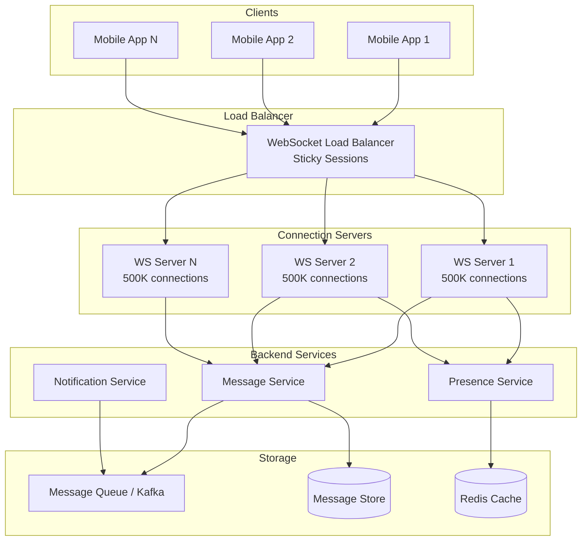
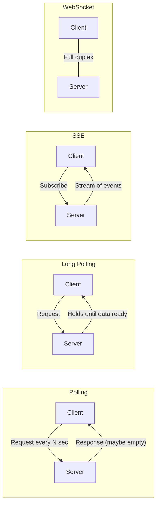
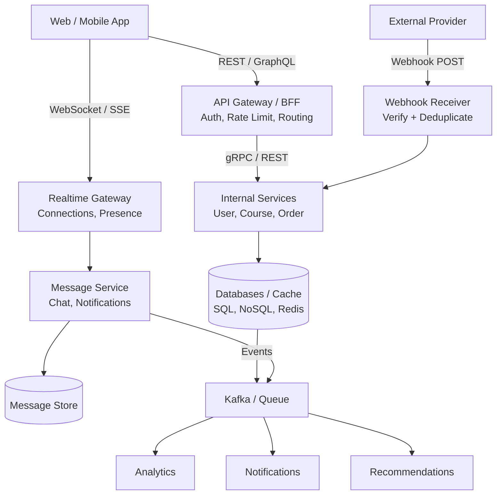
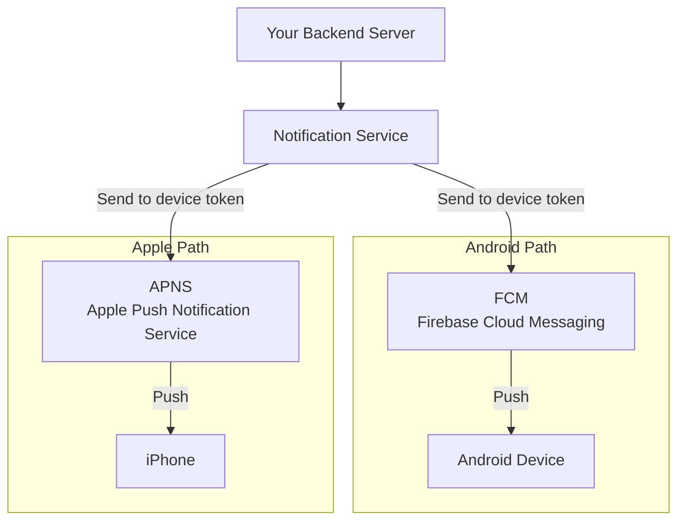
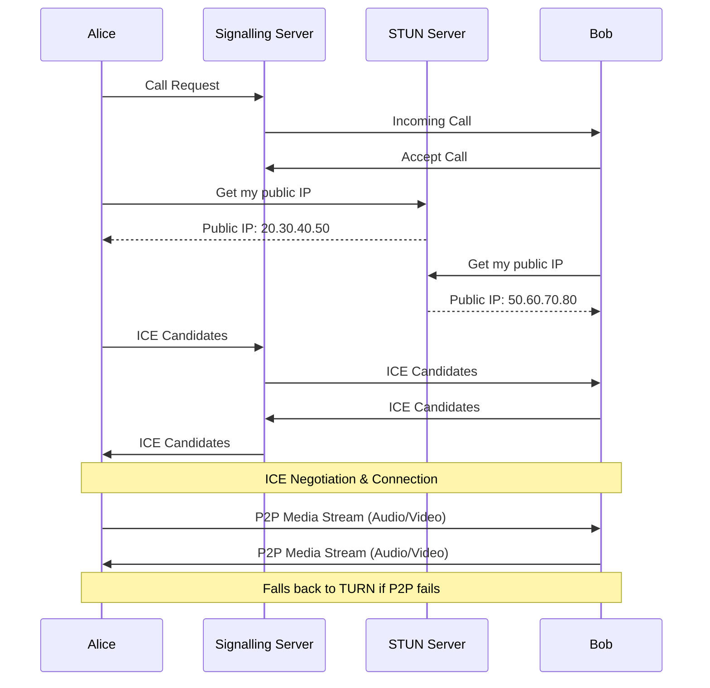

# Phase 4 — Real-Time, Async, and Event-Based Communication

[← Back to Main README](../README.md) | [Previous: RPC & gRPC](03-RPC-AND-GRPC.md) | [Next: Async APIs →](05-ASYNC-APIS.md)

---

## Quick Reference Card

| Method                | Direction                      | Best For                 | Protocol          |
| --------------------- | ------------------------------ | ------------------------ | ----------------- |
| **Polling**           | Client → Server (repeated)     | Simple status checks     | HTTP              |
| **Long Polling**      | Client waits → Server responds | Basic near-real-time     | HTTP              |
| **SSE**               | Server → Client (stream)       | One-way live updates     | HTTP              |
| **WebSocket**         | Client ↔ Server (persistent)   | Real-time two-way apps   | WS/WSS            |
| **Webhook**           | External → Your system         | Event notification       | HTTP POST         |
| **Queue/Events**      | Async background               | Decoupling services      | Kafka/SQS/etc.    |
| **Push Notification** | Server → Device (via FCM/APNS) | Wake inactive apps       | Platform-specific |
| **WebRTC**            | Peer ↔ Peer (direct)           | Audio/Video/Screen share | UDP/SRTP          |

> **One-Line Memory Map:**
>
> - **WebSocket** = Real-time two-way communication for active clients
> - **Push Notification** = Wake up inactive clients
> - **WebRTC** = Direct peer-to-peer audio/video/screen sharing

---

## Table of Contents

### Part 1 — Real-Time Patterns: Polling, Long Polling, SSE, WebSocket

- [1. The Big Problem](#1-the-big-problem)
- [2. Polling](#2-polling)
- [3. Long Polling](#3-long-polling)
- [4. Server-Sent Events (SSE)](#4-server-sent-events-sse)
- [5. WebSocket](#5-websocket)
- [6. Why WhatsApp-like Systems Need WebSocket](#6-why-whatsapp-like-systems-need-websocket)
- [7. WebSocket Failure Modes](#7-websocket-failure-modes)

### Part 2 — Webhooks

- [8. Webhooks](#8-webhooks)
- [9. Webhook Problems](#9-webhook-problems)

### Part 3 — Message Queues, Events & Sync vs Async

- [10. Message Queues and Events](#10-message-queues-and-events)
- [11. Queue Analogy](#11-queue-analogy)
- [12. Queue Architecture](#12-queue-architecture)
- [13. Examples of Queues / Event Systems](#13-examples-of-queues--event-systems)
- [14. Queue vs Event Stream](#14-queue-vs-event-stream)
- [15. Async Example: Course Completion](#15-async-example-course-completion)
- [16. Sync vs Async Communication](#16-sync-vs-async-communication)
- [17. Very Important Rule](#17-very-important-rule)
- [18. Real-World Patterns](#18-real-world-patterns)
- [19. Comparison Table](#19-comparison-table)
- [20. Final Architecture: Complete API Communication System](#20-final-architecture-complete-api-communication-system)
- [21. The Final Senior Decision Framework](#21-the-final-senior-decision-framework)
- [22. One-Line Memory Map](#22-one-line-memory-map)
- [23. You Have Completed the API Communication Methods Topic](#23-you-have-completed-the-api-communication-methods-topic)

### Part 4 — Push Notifications (Phase 4.1)

- [4.1.1. The Core Problem](#411-the-core-problem)
- [4.1.2. Why Push Notifications Exist](#412-why-push-notifications-exist)
- [4.1.3. Life Before Push Notifications](#413-life-before-push-notifications)
- [4.1.4. Push Notification Mental Model](#414-push-notification-mental-model)
- [4.1.5. The Hidden Middleman](#415-the-hidden-middleman)
- [4.1.6. Android Push Flow](#416-android-push-flow)
- [4.1.7. Apple Push Flow](#417-apple-push-flow)
- [4.1.8. Device Token](#418-device-token)
- [4.1.9. Notification Payload](#419-notification-payload)
- [4.1.10. Why Not Send Full Data?](#4110-why-not-send-full-data)
- [4.1.11. Push Notification Types](#4111-push-notification-types)
- [4.1.12. Fanout Problem](#4112-fanout-problem)
- [4.1.13. Why Queues Are Needed](#4113-why-queues-are-needed)
- [4.1.14. WhatsApp Architecture](#4114-whatsapp-architecture)
- [4.1.15. WhatsApp Decision Logic](#4115-whatsapp-decision-logic)
- [4.1.16. Instagram Architecture](#4116-instagram-architecture)
- [4.1.17. Push Notification Failure Modes](#4117-push-notification-failure-modes)
- [4.1.18. Interview Architecture](#4118-interview-architecture)
- [4.1.19. Push Notification vs WebSocket](#4119-push-notification-vs-websocket)

### Part 5 — WebRTC (Phase 4.2)

- [4.2.1. The Problem WebRTC Solves](#421-the-problem-webrtc-solves)
- [4.2.2. What is Peer-to-Peer (P2P)?](#422-what-is-peer-to-peer-p2p)
- [4.2.3. What is WebRTC?](#423-what-is-webrtc)
- [4.2.4. Why Not Use WebSocket?](#424-why-not-use-websocket)
- [4.2.5. Basic WebRTC Architecture](#425-basic-webrtc-architecture)
- [4.2.6. The NAT Problem](#426-the-nat-problem)
- [4.2.7. STUN Server](#427-stun-server)
- [4.2.8. ICE Candidates](#428-ice-candidates)
- [4.2.9. TURN Server](#429-turn-server)
- [4.2.10. STUN vs TURN](#4210-stun-vs-turn)
- [4.2.11. ICE = Negotiation Engine](#4211-ice--negotiation-engine)
- [4.2.12. Call Setup Flow](#4212-call-setup-flow)
- [4.2.13. Signalling Server](#4213-signalling-server)
- [4.2.14. Real WhatsApp Call Architecture](#4214-real-whatsapp-call-architecture)
- [4.2.15. Google Meet Architecture](#4215-google-meet-architecture)
- [4.2.16. SFU](#4216-sfu)
- [4.2.17. MCU](#4217-mcu)
- [4.2.18. WebRTC Failure Modes](#4218-webrtc-failure-modes)
- [4.2.19. WebRTC vs WebSocket](#4219-webrtc-vs-websocket)

---

# Part 1 — Real-Time Patterns: Polling, Long Polling, SSE, WebSocket

So far you learned:

```
REST        -> resource-based request/response
GraphQL     -> client-controlled data fetching
gRPC        -> fast typed service-to-service calls
```

Now we learn the methods used when:

```
The server needs to push data
The work should happen later
Systems should not wait for each other
External systems need to notify us
```

Today's lesson:

```
✅ Polling
✅ Long Polling
✅ Server-Sent Events
✅ WebSockets
✅ Webhooks
✅ Message Queues / Events
✅ Sync vs Async Communication
✅ WhatsApp / Instagram / Payment examples
✅ Final decision framework
```

---

## 1. The Big Problem

Until now, most APIs followed this model:

```
Client asks
Server answers
```

Example:

```http
GET /messages
```

Server returns messages.

But what if the server needs to tell the client immediately?

Example:

```
New WhatsApp message received
Friend came online
Stock price changed
Food delivery location changed
Payment succeeded
Live score updated
```

If client always has to ask repeatedly, that becomes inefficient.

So we need different communication patterns.

---

## 2. Polling

Polling means:

```
Client keeps asking the server again and again.
```

Example:

```http
GET /messages
GET /messages
GET /messages
GET /messages
```

Every few seconds.

### Simple analogy

Imagine you are waiting for a parcel.
You keep asking your mother:

```
Did parcel come?
Did parcel come?
Did parcel come?
```

Most of the time answer is:

```
No
```

That is polling.

### Polling architecture

```
Client
  |
  | every 5 seconds
  v
Server
  |
  v
Database
```

### Example

```http
GET /orders/123/status
```

Response:

```json
{
  "status": "processing"
}
```

After 5 seconds:

```http
GET /orders/123/status
```

Response:

```json
{
  "status": "shipped"
}
```

### Pros

```
Very simple
Works everywhere
Easy to implement
No special protocol needed
```

### Cons

```
Wastes requests
Higher server load
Not truly real-time
Bad for large-scale chat/live systems
```

### Use polling when

```
Updates are not frequent
Real-time is not critical
System is simple
```

Examples:

```
Checking report generation status
Checking payment settlement status
Checking background job status
```

---

## 3. Long Polling

Long polling improves normal polling.

Instead of server replying immediately with:

```
No update
```

server waits until something happens.

### Normal polling

```
Client: Any new message?
Server: No.

Client: Any new message?
Server: No.

Client: Any new message?
Server: Yes.
```

### Long polling

```
Client: Any new message?
Server: Waits...
Server: New message arrived. Here it is.
Client: Immediately asks again.
```

### Diagram

```
Client ---- request ----> Server
                            |
                            | server waits
                            |
Client <--- response ---- Server
```

Then client sends another request.

### Pros

```
More efficient than polling
Works over normal HTTP
Can feel near real-time
```

### Cons

```
Connections stay open
Server must manage many waiting requests
Still not as elegant as WebSocket
```

### Use long polling when

```
You want near real-time
But cannot use WebSocket
```

Examples:

```
Older chat systems
Notification systems
Simple live updates
```

---

## 4. Server-Sent Events (SSE)

Server-Sent Events means:

```
Client opens connection.
Server keeps sending updates.
Client does not send messages back on same stream.
```

It is mostly one-way:

```
Server -> Client
```

### Example

Client connects:

```http
GET /notifications/stream
```

Server keeps sending:

```
notification 1
notification 2
notification 3
```

### Diagram

```
Client <------ update 1 ------ Server
Client <------ update 2 ------ Server
Client <------ update 3 ------ Server
```

### SSE is good for

```
Live notifications
News feed updates
Stock price updates
Progress updates
Live dashboards
```

### SSE is not ideal for

```
Full chat apps
Multiplayer games
Two-way real-time communication
```

Because it is mainly server-to-client.

### SSE vs WebSocket simple rule

```
Only server needs to push? SSE can work.

Both client and server need to talk continuously? WebSocket is better.
```

---

## 5. WebSocket

WebSocket is one of the most important real-time communication methods.

It creates a persistent connection between client and server.

After connection opens:

```
Client can send anytime.
Server can send anytime.
```

This is two-way communication.

### HTTP vs WebSocket

HTTP REST:

```
Client asks
Server replies
Connection may close
```

WebSocket:

```
Connection stays open
Both sides can send messages
```

### Diagram

```
Client <====================> Server
       persistent connection
```

### WebSocket example: chat

User A sends:

```json
{
  "type": "message",
  "to": "userB",
  "text": "Hi"
}
```

Server immediately pushes to User B:

```json
{
  "type": "message",
  "from": "userA",
  "text": "Hi"
}
```

---

## 6. Why WhatsApp-like Systems Need WebSocket

A chat app needs:

```
Instant message delivery
Typing indicators
Online/offline presence
Read receipts
Delivery receipts
Reactions
Live updates
```

Polling would be wasteful.
Imagine 1 billion users polling every 2 seconds.
That would create enormous unnecessary traffic.

So real-time systems usually need persistent connections.

### WhatsApp-style high-level architecture

```
Mobile App
    |
    | WebSocket
    v
Connection Server
    |
    +--> Message Service
    |
    +--> Presence Service
    |
    +--> Notification Service
    |
    v
Message Queue / Storage
```

### Important production challenge

WebSocket servers keep connections open.

So they must manage:

```
Millions of active connections
Reconnects
Heartbeats
Mobile network drops
Load balancing
Connection routing
Message acknowledgements
Backpressure
```



---

## 7. WebSocket Failure Modes

### 7.1 Client disconnects

Mobile network goes down.

Solution:

```
Reconnect logic
Resume from last message ID
Offline message queue
```

### 7.2 Server crashes

All connected users on that server disconnect.

Solution:

```
Connection recovery
Multiple connection servers
Load balancer
Message persistence
```

### 7.3 Message delivered twice

Client reconnects and server resends.

Solution:

```
Message ID
Deduplication
Idempotent processing
```

### 7.4 Message order issue

Message 2 arrives before Message 1.

Solution:

```
Sequence numbers
Timestamps
Per-chat ordering
```

---



---

# Part 2 — Webhooks

## 8. Webhooks

Webhooks are different.

A webhook is used when:

```
Another system wants to notify your system when something happens.
```

Simple definition:

```
Webhook = Reverse API call
```

Normally:

```
You call external API.
```

With webhook:

```
External system calls your API.
```

### Example: payment webhook

You start payment:

```http
POST /payments
```

Payment provider processes it.

Later, payment provider calls your webhook:

```http
POST /webhooks/payment-success
```

Payload:

```json
{
  "event": "payment_succeeded",
  "paymentId": "pay_123",
  "amount": 50000
}
```

### Real-world examples

```
Stripe/Razorpay payment success
GitHub push event
Slack app event
Shopify order created
LMS course completion callback
```

### Webhook architecture

```
Payment Provider
      |
      | POST event
      v
Your Webhook API
      |
      v
Verify Signature
      |
      v
Store Event
      |
      v
Process Async
```

---

## 9. Webhook Problems

Webhooks look simple, but production webhooks are tricky.

### Problem 1: Duplicate events

Provider may send the same event multiple times.

Solution:

```
Event ID deduplication
Idempotent processing
```

### Problem 2: Receiver down

Your server may be unavailable.

Solution:

```
Provider retries
You return proper status codes
You process events asynchronously
```

### Problem 3: Fake webhook attack

Attacker calls your webhook endpoint.

Solution:

```
Signature verification
Shared secret
Timestamp validation
```

### Problem 4: Event order

You may receive:

```
payment_failed
```

after:

```
payment_succeeded
```

or vice versa.

Solution:

```
State machine
Event timestamp
Final source-of-truth check
```

---

# Part 3 — Message Queues, Events & Sync vs Async

## 10. Message Queues and Events

Now we reach one of the most important distributed system topics.

Message queues are used when:

```
Service A should not wait for Service B.
```

### Synchronous communication

```
Service A calls Service B and waits.
```

Example:

```
Order Service -> Payment Service
```

A waits for B.

### Asynchronous communication

```
Service A publishes message.
Service B processes later.
```

Example:

```
Order Service publishes OrderCreated event.
Notification Service sends email later.
```

---

## 11. Queue Analogy

Imagine a restaurant.

Bad design:

```
Customer waits until chef cooks,
billing prints,
delivery packs,
feedback system updates,
analytics logs everything.
```

Too slow.

Better:

```
Take order.
Confirm order.
Send background tasks to queue.
```

Queue handles:

```
Email
SMS
Analytics
Invoice
Recommendations
```

---

## 12. Queue Architecture

```
Order Service
      |
      | publish event
      v
Message Queue
      |
      +--> Email Service
      +--> Analytics Service
      +--> Inventory Service
      +--> Recommendation Service
```

---

## 13. Examples of Queues / Event Systems

Common technologies:

```
Kafka
RabbitMQ
Amazon SQS
Azure Service Bus
Google Pub/Sub
Redis Streams
```

---

## 14. Queue vs Event Stream

Beginner-friendly distinction:

### Queue

Usually:

```
One message is processed by one consumer.
```

Example:

```
Send email job
```

One email worker handles it.

### Event stream

Usually:

```
Multiple consumers can read the same event.
```

Example:

```
CourseCompleted event
```

Consumers:

```
Analytics Service
Certificate Service
Recommendation Service
Notification Service
```

All may need the same event.

Kafka is commonly used for this style.

---

## 15. Async Example: Course Completion

User completes course.

Bad synchronous design:

```
POST /complete-course
      |
      +--> Save progress
      +--> Generate certificate
      +--> Send email
      +--> Update recommendations
      +--> Update analytics
      +--> Notify manager
```

If any one fails, user waits or request fails.

Better design:

```
POST /complete-course
      |
      +--> Save progress
      |
      +--> Publish CourseCompleted event
```

Then:

```
CourseCompleted Event
      |
      +--> Certificate Service
      +--> Email Service
      +--> Analytics Service
      +--> Recommendation Service
```

User gets fast response.
Background systems continue independently.

---

## 16. Sync vs Async Communication

This is a senior system design decision.

### Use synchronous communication when

The caller needs the answer immediately.

Examples:

```
Login validation
Payment authorisation
Check inventory before order
Get course details
Search results
Calculate price
```

Pattern:

```
Client/Service waits for response.
```

Use:

```
REST
GraphQL
gRPC
```

### Use asynchronous communication when

The work can happen later.

Examples:

```
Send email
Generate certificate
Update analytics
Refresh recommendations
Process video
Send notification
Create audit log
```

Pattern:

```
Publish event and continue.
```

Use:

```
Queue
Kafka
Event bus
Webhook
```

---

## 17. Very Important Rule

Do not make users wait for non-critical work.

Example:

When placing an order, user must wait for:

```
Payment confirmation
Order creation
```

But user should not wait for:

```
Marketing email
Analytics update
Recommendation refresh
Invoice PDF generation
```

Those should be async.

---

## 18. Real-World Patterns

### Instagram

Likely communication styles in a social app:

```
REST/GraphQL      -> mobile feed/profile APIs
WebSocket/SSE     -> notifications/live updates
gRPC              -> internal service calls
Events/Queues     -> likes, analytics, recommendations, notifications
CDN               -> images/videos
```

### WhatsApp

```
WebSocket-like persistent connection  -> real-time messages
Queues                                -> offline message delivery
REST                                  -> profile/settings/login support APIs
Events                                -> delivery receipts, read receipts
Internal RPC/gRPC                     -> service communication
```

### Payment systems

```
REST              -> create payment
Idempotency key   -> avoid duplicate charge
Webhook           -> payment provider notifies status
Queue             -> async reconciliation/notifications
Events            -> ledger/accounting updates
```

### Bitly/TinyURL-style URL shortener

```
REST              -> create short URL
HTTP redirect     -> resolve short URL
Cache/CDN         -> fast redirects
Events/Queue      -> click analytics
Async scanning    -> abuse/malware checks
```

Key lesson:

```
The redirect path must be extremely fast.
Analytics should not slow down redirect.
```

---

## 19. Comparison Table

| Method           | Direction                  | Best for               | Example            |
| ---------------- | -------------------------- | ---------------------- | ------------------ |
| **Polling**      | Client repeatedly asks     | Simple status checks   | Report status      |
| **Long Polling** | Client waits for update    | Basic near-real-time   | Notifications      |
| **SSE**          | Server pushes to client    | One-way live updates   | Live dashboard     |
| **WebSocket**    | Two-way persistent         | Real-time apps         | Chat               |
| **Webhook**      | External system calls you  | Event notification     | Payment success    |
| **Queue**        | Async background work      | Decoupling             | Send email         |
| **Event Stream** | Many consumers read events | Analytics/events       | Course completed   |
| **REST**         | Request/response           | Public CRUD APIs       | Products/users     |
| **GraphQL**      | Client-shaped query        | Frontend aggregation   | Profile/feed       |
| **gRPC**         | Typed service calls        | Internal microservices | Payment validation |

---

## 20. Final Architecture: Complete API Communication System

Here is a mature architecture combining everything:

```
+----------------------+
|  Web / Mobile App    |
+----------+-----------+
           |
+-----------------+------------------+
|                                    |
|  REST / GraphQL        WebSocket/SSE
v                        v
+---------------------+  +----------------------+
| API Gateway / BFF   |  | Realtime Gateway     |
| Auth, Rate Limit,   |  | Connections, Presence|
| Routing, Logging    |  +----------+-----------+
+----------+----------+             |
           |                        |
           |  gRPC / REST           |
           v                        v
+---------------------+  +----------------------+
| Internal Services   |  | Message Service      |
| User, Course, Order |  | Chat, Notifications  |
+----------+----------+  +----------+-----------+
           |                        |
           |                        |
           v                        v
+---------------------+  +----------------------+
| Databases / Cache   |  | Message Store        |
| SQL, NoSQL, Redis   |  +----------------------+
+----------+----------+
           |
           | Events
           v
+---------------------+
|   Kafka / Queue     |
+----------+----------+
           |
+------------+-------------+-------------+
|            |             |             |
v            v             v
+-------------+  +---------------+  +----------------+
| Analytics   |  | Notifications |  | Recommendations|
+-------------+  +---------------+  +----------------+

External Provider
      |
      | Webhook
      v
+---------------------+
| Webhook Receiver    |
| Verify + Deduplicate|
+---------------------+
```



---

## 21. The Final Senior Decision Framework

Whenever you design a system, ask this:

**Question 1: Does the caller need an immediate answer?**

If yes:

```
Use REST / GraphQL / gRPC
```

Example:

```
Get profile
Validate token
Check payment status
Search courses
```

**Question 2: Is the API mostly for frontend/mobile?**

If yes:

```
REST or GraphQL
```

Use GraphQL when:

```
One screen needs data from many services
Client needs flexible fields
Mobile bandwidth matters
```

**Question 3: Is it internal service-to-service communication?**

If yes:

```
gRPC is a strong choice
```

Especially when:

```
Performance matters
Strong contracts matter
Multiple languages are used
```

**Question 4: Does the server need to push updates?**

If yes:

```
SSE or WebSocket
```

Use SSE when:

```
Only server pushes updates
```

Use WebSocket when:

```
Both sides need real-time communication
```

**Question 5: Can work happen later?**

If yes:

```
Use queue/events
```

Examples:

```
Email
Analytics
Notifications
Video processing
Recommendation refresh
Certificate generation
```

**Question 6: Does another system need to notify you?**

If yes:

```
Use webhook
```

Example:

```
Payment provider sends payment success event.
```

---

## 22. One-Line Memory Map

Memorise this:

```
REST:
  Simple public resource APIs.

GraphQL:
  Frontend asks exactly what it needs.

gRPC:
  Fast typed internal service calls.

WebSocket:
  Real-time two-way communication.

SSE:
  Real-time one-way server push.

Webhook:
  External system notifies your system.

Queue/Event:
  Do work later and decouple services.
```

---

## 23. You Have Completed the API Communication Methods Topic

You now understand the full family:

```
✅ REST
✅ GraphQL
✅ RPC
✅ gRPC
✅ Polling
✅ Long Polling
✅ SSE
✅ WebSocket
✅ Webhooks
✅ Queues
✅ Events
✅ Sync vs Async
```

This is a very strong system design foundation.

Most importantly, you now know why each exists, not just definitions.

---

# Part 4 — Push Notifications (Phase 4.1)

This is one of the most misunderstood topics in system design.

Many beginners think:

```
Push Notification
       =
  WebSocket
```

❌ Wrong.

Today we'll understand:

```
✅ What push notifications are
✅ Why they exist
✅ WebSocket vs Push Notification
✅ FCM (Firebase)
✅ APNS (Apple)
✅ Device Tokens
✅ Notification Fanout
✅ Offline Users
✅ WhatsApp & Instagram Architecture
✅ Failure Modes
✅ Production Design
```

---

## 4.1.1. The Core Problem

Imagine WhatsApp.

Your friend sends:

```
"Hey Irfan"
```

But your phone is:

```
Screen off
App closed
Not connected to WebSocket
```

Question:

```
How does WhatsApp wake your phone up?
```

WebSocket cannot help.

Why?

Because:

```
App isn't running.
```

No active WebSocket.

---

## 4.1.2. Why Push Notifications Exist

Push notifications solve:

```
How do we notify a user
when the app isn't active?
```

Examples:

```
WhatsApp Message
Instagram Like
Teams Meeting Alert
Amazon Delivery Update
Bank Transaction Alert
```

---

## 4.1.3. Life Before Push Notifications

Without push notifications:

Phone would need:

```
Every 5 sec:
"Any messages?"

Every 5 sec:
"Any messages?"
```

Millions of apps doing that.

Result:

```
Battery destruction
Network waste
Server overload
```

Impossible.

---

## 4.1.4. Push Notification Mental Model

Think:

```
Government Post Office
```

Instead of:

```
You visiting post office every minute
```

Post office brings letters to you.

Push notifications work similarly.

```
Server pushes
notification to device.
```

Hence:

```
Push Notification
```

---

## 4.1.5. The Hidden Middleman

Important discovery:

Your backend DOES NOT send notifications directly to phones.

Many beginners think:

```
WhatsApp Server
       |
       V
     Phone
```

Wrong.

There is a middleman.

Android:

```
FCM
(Firebase Cloud Messaging)
```

Apple:

```
APNS
(Apple Push Notification Service)
```

Architecture:

```
Your Backend
      |
      V
  FCM / APNS
      |
      V
    Phone
```



---

## 4.1.6. Android Push Flow

Example:

Friend sends message.

**Step 1** — User A sends:

```
Hello
```

**Step 2** — Chat service stores message.

**Step 3** — User B offline.

**Step 4** — Notification Service decides:

```
Need push notification.
```

**Step 5** — Notification Service sends request:

```
Message for Device XYZ
```

to

```
FCM
```

**Step 6** — Google delivers notification.

**Step 7** — Phone wakes up. Shows:

```
New Message
```

### Diagram

```
User A
  |
  V
Chat Service
  |
  V
Notification Service
  |
  V
FCM
  |
  V
Android Device
```

---

## 4.1.7. Apple Push Flow

Identical idea.

Replace:

```
FCM
```

with:

```
APNS
```

Diagram:

```
Chat Service
     |
     V
Notification Service
     |
     V
   APNS
     |
     V
  iPhone
```

---

## 4.1.8. Device Token

How does FCM know:

```
Which phone?
```

Good question.

Every device gets:

```
Device Token
```

Think:

```
Phone Address
```

Example:

```
abc123xyz...
```

Very long string.

Database:

```
User
  |
Device Token
```

Example:

```
User 123

Token abc123
```

Now notification service knows:

```
Send notification
to token abc123
```

---

## 4.1.9. Notification Payload

Usually contains:

```json
{
  "title": "WhatsApp",
  "body": "New Message",
  "userId": "123"
}
```

This is NOT necessarily the message itself.

Important.

Often only:

```
Wake App
```

information is sent.

Then app fetches latest data.

---

## 4.1.10. Why Not Send Full Data?

Imagine:

```
Instagram Post
```

contains:

```
Image
Video
Comments
Likes
Metadata
```

Megabytes.

Push notifications should be tiny.

Instead:

```
New Like on Post 123
```

Then app fetches details.

---

## 4.1.11. Push Notification Types

### Visible Notification

User sees:

```
New Message
```

Popup.

Example:

```
WhatsApp

Hey, where are you?
```

### Silent Notification

User sees nothing.
Phone wakes app.
App refreshes data.

Instagram often uses silent notifications.

---

## 4.1.12. Fanout Problem

Now things get interesting.

Imagine:

```
Celebrity
100 Million Followers
```

Creates post.
Need notifications.

Naive solution:

```
Send 100 million notifications directly.
```

Disaster.

Production Architecture:

```
Post Created Event
       |
       V
Notification Queue
       |
       V
Notification Workers
       |
       V
   FCM/APNS
```

Diagram:

```
Instagram Service
       |
       V
Notification Queue
       |
  +-------+--------+
  |       |        |
Worker  Worker  Worker
  |       |        |
  V       V        V
 FCM     FCM      FCM
```

Scalable.

---

## 4.1.13. Why Queues Are Needed

Push notification spikes occur.

Example:

```
World Cup Goal

10 million notifications
```

within seconds.

Without queue:

```
Notification Service crashes.
```

With queue:

```
Buffer traffic.
```

Workers process gradually.

---

## 4.1.14. WhatsApp Architecture

Many people assume:

```
Push Notifications
deliver messages.
```

Actually:
No.

Message path:

```
User A
  |
Message Service
  |
Storage
  |
User B
```

Push Notification only says:

```
Wake up.

You have a message.
```

Then:

```
WhatsApp opens connection.

Downloads message.
```

Important distinction.

---

## 4.1.15. WhatsApp Decision Logic

User B online?

```
YES
```

Use:

```
WebSocket
```

User B offline?

```
YES
```

Use:

```
Push Notification
```

Architecture:

```
If Online
   |
WebSocket

If Offline
   |
Push Notification
```

Production systems usually use BOTH.

---

## 4.1.16. Instagram Architecture

Example:

```
Friend liked photo.
```

Instagram may:

```
Generate Like Event
```

Like Event:

```
Notification Service
```

creates:

```
Push Notification
```

Phone receives:

```
Alex liked your photo.
```

If user taps:

```
App Opens
```

Then app fetches fresh data.

---

## 4.1.17. Push Notification Failure Modes

Now think like senior engineer.

### Failure 1 — Invalid Device Token

User reinstalled app.
Old token invalid.

Solution:

```
Refresh token.
```

### Failure 2 — Phone Offline

Notification cannot deliver.

Solution:

```
FCM/APNS stores temporarily.
```

Then deliver later.

### Failure 3 — Notification Flood

Millions delivered.

Solution:

```
Queues

Workers

Rate Limiting
```

### Failure 4 — Duplicate Notifications

Same event processed twice.

Solution:

```
Event IDs

Deduplication
```

---

## 4.1.18. Interview Architecture

Design Instagram Notification System.

Requirements:

```
Likes

Comments

Mentions

Follows
```

Architecture:

```
Event Producer
      |
      V
    Kafka
      |
      V
Notification Service
      |
  +-----+------+
  |            |
  V            V

 FCM         APNS
  |            |
  V            V

Android    iPhone
```

---

## 4.1.19. Push Notification vs WebSocket

This question appears often.

### WebSocket

Purpose:

```
Real-time communication
while app active.
```

Examples:

```
Chat
Presence
Typing Indicator
Live Dashboard
```

### Push Notification

Purpose:

```
Wake inactive app
or notify user.
```

Examples:

```
New Message

New Like

Delivery Update
```

### Comparison

| Feature        | WebSocket | Push Notification |
| -------------- | --------- | ----------------- |
| App active     | Yes       | Not required      |
| Real-time      | Excellent | Good              |
| Two-way        | Yes       | No                |
| Can wake phone | No        | Yes               |
| Chat messages  | Yes       | Assist only       |
| Offline users  | No        | Yes               |

### Golden Rule

Memorise:

```
WebSocket
  =
Realtime communication
for active clients.

Push Notification
  =
Wake up inactive clients.
```

### What You've Learned

You now understand:

```
✅ Why push notifications exist
✅ FCM
✅ APNS
✅ Device Tokens
✅ Notification Fanout
✅ Notification Queues
✅ WhatsApp Architecture
✅ Instagram Architecture
✅ WebSocket vs Push
✅ Failure Handling
```

---

# Part 5 — WebRTC (Phase 4.2)

This is one of those technologies that sounds scary initially, but once you understand the problem it solves, everything starts making sense.

By the end of this lesson you'll understand:

```
✅ Why WebRTC exists
✅ Why WebSocket is not enough
✅ Peer-to-Peer (P2P)
✅ Audio calls
✅ Video calls
✅ Screen sharing
✅ NAT problem
✅ STUN
✅ TURN
✅ ICE
✅ Call setup flow
✅ WhatsApp/Teams/Meet architecture
✅ Scaling real-time video systems
```

---

## 4.2.1. The Problem WebRTC Solves

Imagine WhatsApp text messaging.

We learned:

```
User A
  |
WebSocket
  |
Server
  |
WebSocket
  |
User B
```

Perfect.
Text messages are tiny.

Now imagine:

```
Voice call
```

or

```
Video call
```

Question:

Should every audio packet travel through WhatsApp servers?

Naive design:

```
User A
  |
  V
WhatsApp Server
  |
  V
User B
```

For every:

```
Audio packet
Video packet
Camera frame
Screen share frame
```

Problem:

A one-hour video call generates enormous traffic.

Imagine:

```
10 million concurrent calls.
```

Server costs explode.

This created the need for:

**Peer-to-Peer Communication**

---

## 4.2.2. What is Peer-to-Peer (P2P)?

Instead of:

```
User A → Server → User B
```

we try:

```
User A ←→ User B
```

directly.

Analogy:

Without P2P:

```
Every letter between two friends
must go through a post office employee.
```

With P2P:

```
Friends talk directly.
```

Much cheaper.
Much faster.

Diagram:

```
User A
  |
  |
Direct connection
  |
  |
User B
```

---

## 4.2.3. What is WebRTC?

WebRTC stands for:

```
Web Real-Time Communication
```

Simple definition:

```
A technology that allows browsers
and apps to exchange audio,
video and data in real time.
```

WebRTC enables:

```
Voice Calls

Video Calls

Screen Sharing

Live Collaboration

File Transfer

Peer Communication
```

Real examples:

```
Google Meet

Microsoft Teams

WhatsApp Calls

Discord Voice

Zoom (partially)

Slack Huddles
```

---

## 4.2.4. Why Not Use WebSocket?

Very important interview question.

Many beginners ask:

```
If WebSocket exists,
why do we need WebRTC?
```

WebSocket excels at:

```
Chat

Notifications

Presence

Typing indicators
```

But audio/video traffic is different.

Continuous audio stream:

```
50 packets/sec
```

Video stream:

```
Hundreds/thousands of packets/sec
```

WebRTC provides:

```
Media codecs

Audio optimisation

Video optimisation

Jitter buffering

Packet loss recovery

Adaptive bitrate
```

None of which WebSocket provides naturally.

---

## 4.2.5. Basic WebRTC Architecture

Imagine:

```
Alice calls Bob
```

Goal:

```
Alice Camera
  →
Bob Screen

Bob Camera
  →
Alice Screen
```

Ideal architecture:

```
Alice
  |
Peer Connection
  |
Bob
```

This sounds easy.

Unfortunately...

Reality is more complicated.

---

## 4.2.6. The NAT Problem

The biggest WebRTC challenge.

Imagine:

Alice's phone:

```
Private IP:
192.168.1.5
```

Bob:

```
10.0.0.7
```

Can Alice connect directly?

No.

Those are private addresses.
Not reachable globally.

This is because of:

**NAT** — Network Address Translation

Almost every:

```
Home Router

Office Router

Mobile Carrier
```

uses NAT.

This creates a big question:

```
How do two devices find each other?
```

---

## 4.2.7. STUN Server

First solution.

STUN means:

```
Session Traversal Utilities for NAT
```

Ignore the scary name.

Think:

```
"What is my public address?"
service.
```

Flow:

```
Alice Device
      |
      V
  STUN Server
```

STUN replies:

```
Your public IP is:

20.30.40.50
```

Now Alice knows her internet-facing address.

Bob does same.

Diagram:

```
Alice -> STUN

Bob -> STUN

STUN tells both:
  their public address
```

---

## 4.2.8. ICE Candidates

Important term.
Interview favourite.

ICE means:

```
Interactive Connectivity Establishment
```

Again, simple idea.

Think:

```
Possible ways devices can connect.
```

Alice gathers:

```
Private IP
Public IP
Relay address
```

Bob gathers:

```
Private IP
Public IP
Relay address
```

These become:

```
ICE Candidates
```

Then both sides try:

```
Connection Option 1

Connection Option 2

Connection Option 3
```

Until one works.

---

## 4.2.9. TURN Server

Now the ugly scenario.

Sometimes direct connection fails.
Corporate networks.
Strict firewalls.
Carrier NATs.
Hotel Wi-Fi.

P2P impossible.

Solution:

**TURN**

TURN means:

```
Traversal Using Relays around NAT
```

Again:
Forget the name.
Remember the job.

TURN acts as:

```
Traffic Relay
```

Instead of:

```
Alice ←→ Bob
```

We do:

```
Alice
  |
TURN
  |
Bob
```

Diagram:

```
Alice
  |
  V
TURN Server
  |
  V
Bob
```

Works almost always.

Downside:

```
Expensive

Bandwidth heavy
```

because traffic travels through TURN.

---

## 4.2.10. STUN vs TURN

Easy interview table.

| Feature         | STUN               | TURN                |
| --------------- | ------------------ | ------------------- |
| Purpose         | Discover public IP | Relay traffic       |
| Cost            | Cheap              | Expensive           |
| Preference      | Preferred          | Fallback            |
| Connection type | Direct connection  | Indirect connection |

Rule:

```
Try STUN first.

Use TURN if necessary.
```

---

## 4.2.11. ICE = Negotiation Engine

Now combine everything.

ICE does:

```
Gather candidates

Try connections

Choose best route
```

Think:

```
ICE
  =
Connection Matchmaker
```

Final flow:

```
Gather Candidates
       |
Try Connections
       |
Choose Best
       |
Start Media Flow
```

---

## 4.2.12. Call Setup Flow

Let's trace WhatsApp call.

**Step 1** — Alice clicks:

```
Call Bob
```

**Step 2** — Signalling server used.

Important:

```
WebRTC still needs signalling.
```

Signalling exchanges:

```
Call Request

ICE Candidates

Connection Info
```

**Step 3** — Peer negotiation.

**Step 4** — STUN attempts connection.

**Step 5** — If successful:

```
P2P audio/video
```

Otherwise:

```
TURN relay
```

### Diagram

```
Alice
  |
Signalling Server
  |
Bob

  ↓

ICE

  ↓

P2P

or

TURN Relay
```



---

## 4.2.13. Signalling Server

Very important.

WebRTC does NOT define signalling.

You can use:

```
WebSocket

gRPC

REST

Custom Protocol
```

Signalling exchanges:

```
Who's calling?

Media capabilities

ICE candidates

Call accept/reject
```

Think:

```
Signal first.

Media later.
```

---

## 4.2.14. Real WhatsApp Call Architecture

Simplified.

```
Alice
  |
Signalling Service
  |
Bob

Negotiation

  ↓

WebRTC

  ↓

Media Stream
```

Messages:

```
WebSocket
```

Calls:

```
WebRTC
```

---

## 4.2.15. Google Meet Architecture

For two people:

Often:

```
P2P possible
```

For many participants:

```
P2P becomes difficult.
```

Imagine:

```
50 participants.
```

Each user would need:

```
49 video streams.
```

Impossible.

---

## 4.2.16. SFU

Large meetings use:

**SFU** — Selective Forwarding Unit

Architecture:

```
Alice
  |
Bob
  |
Charlie
  |
SFU
  |
Everyone
```

SFU receives streams.
Forwards appropriate streams.

Does NOT decode video.
Simply routes.
Efficient.

Used by:

```
Google Meet

Teams

Discord

Zoom
```

---

## 4.2.17. MCU

Older approach.

MCU means:

```
Multipoint Control Unit
```

Diagram:

```
Everyone
    |
   MCU
    |
Mixed Video
```

MCU:

```
Decodes
Mixes
Re-encodes
```

Expensive.

Mostly replaced by SFU.

---

## 4.2.18. WebRTC Failure Modes

Think like a senior engineer.

### Failure 1 — STUN fails

Solution:

```
Use TURN.
```

### Failure 2 — TURN overloaded

Solution:

```
Regional TURN clusters.
```

### Failure 3 — Poor network

Solution:

```
Adaptive bitrate.
```

Reduce:

```
Video quality
```

to maintain call.

### Failure 4 — Packet loss

Solution:

```
Jitter buffers

Packet recovery

Forward Error Correction
```

---

## 4.2.19. WebRTC vs WebSocket

Important summary.

| Feature            | WebSocket | WebRTC   |
| ------------------ | --------- | -------- |
| Chat               | ✅        | Possible |
| Audio Calls        | ❌        | ✅       |
| Video Calls        | ❌        | ✅       |
| P2P                | ❌        | ✅       |
| Screen Share       | ❌        | ✅       |
| Media Optimization | ❌        | ✅       |
| Notifications      | ✅        | ❌       |
| Typing Indicator   | ✅        | Possible |

---

## Phase 4 Completion ✅

You now know:

```
✅ Polling
✅ Long Polling
✅ SSE
✅ WebSocket
✅ Push Notifications
✅ WebRTC
✅ STUN
✅ TURN
✅ ICE
✅ SFU
✅ MCU
✅ WhatsApp Architecture
✅ Google Meet Architecture
```

Phase 4 Status:

```
Real-Time Communication

100% COMPLETE ✅
```

---

[← Back to Main README](../README.md) | [Previous: RPC & gRPC](03-RPC-AND-GRPC.md) | [Next: Async APIs →](05-ASYNC-APIS.md)
