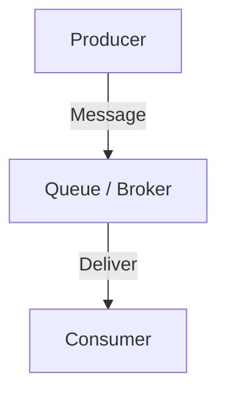
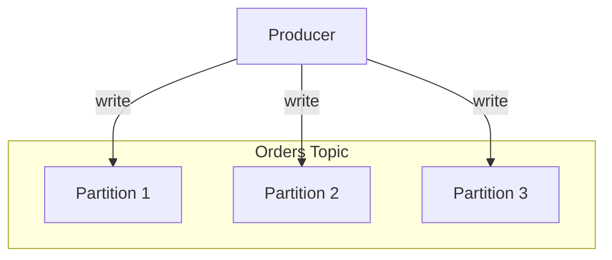
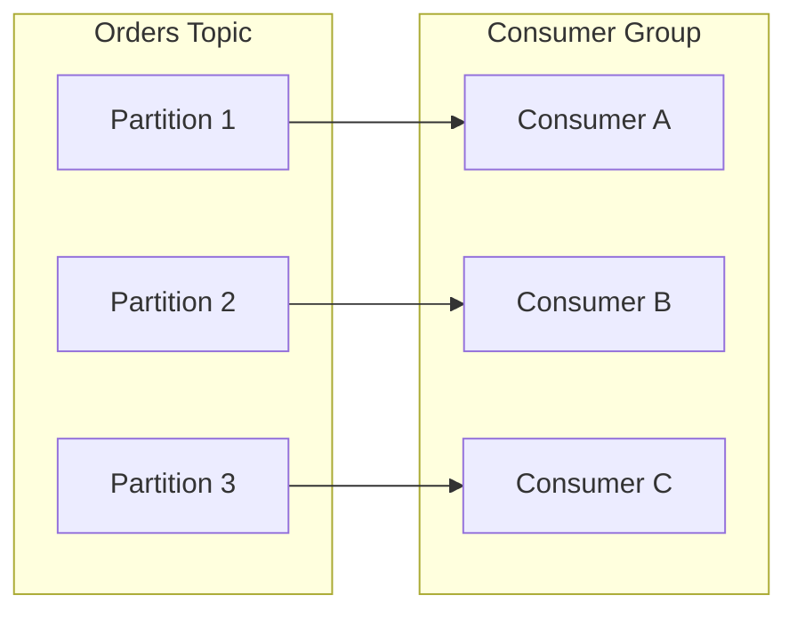
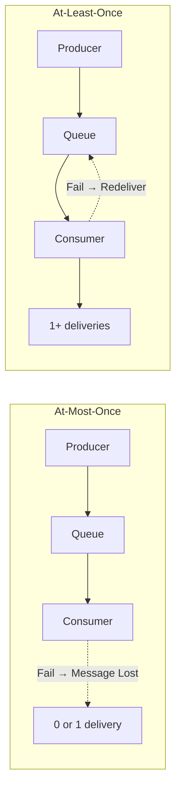
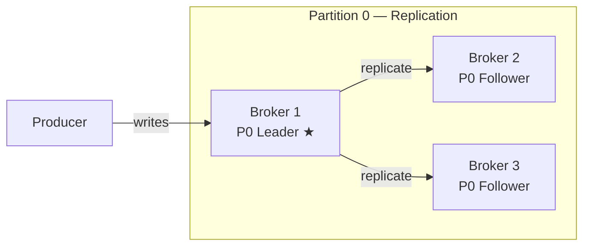
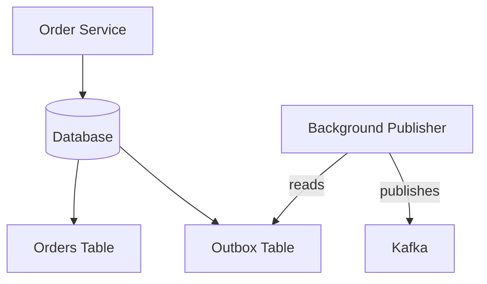
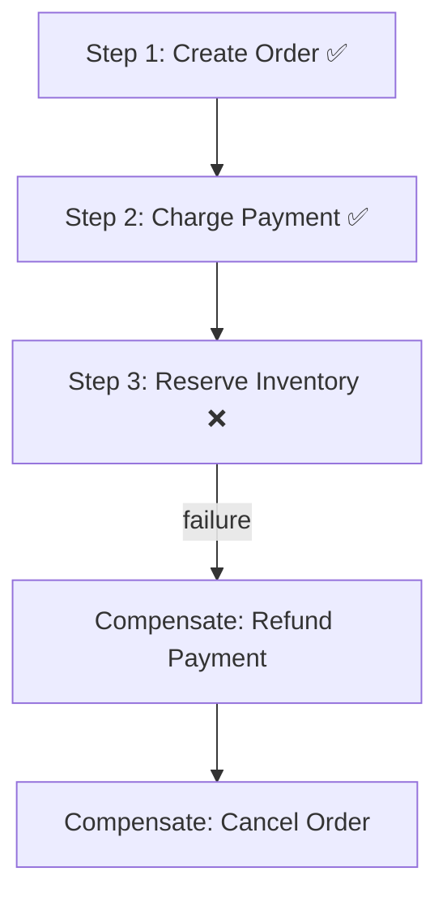

[← Back to Main README](../README.md) | [Previous: Real-Time Communication](04-REALTIME-COMMUNICATION.md) | [Next: API Architecture →](06-API-ARCHITECTURE.md)

---

# Phase 5 — Asynchronous APIs & Event-Driven Architecture

---

## Quick Reference Card

| Concept | One-Liner |
|---|---|
| **Message Queue** | A system that stores messages until another system processes them |
| **Producer** | Creates and publishes messages |
| **Consumer** | Receives and processes messages |
| **Broker** | Stores, delivers messages, handles failures (Kafka, RabbitMQ, SQS) |
| **ACK** | Consumer tells broker: "I processed message successfully" |
| **Decoupling** | Producer doesn't care if consumer is up or down |
| **Buffering** | Queue absorbs traffic spikes like a shock absorber |
| **Kafka** | Distributed, partitioned, replicated, replayable immutable event log |
| **RabbitMQ** | Smart post office — complex routing, job/task distribution |
| **SQS** | AWS managed queue-as-a-service — simple, reliable, serverless friendly |
| **At-Most-Once** | No duplicates, possible loss |
| **At-Least-Once** | No loss, duplicates possible |
| **Exactly-Once** | Nearly impossible; achieved via At-Least-Once + Idempotent Consumers |
| **DLQ** | Dead Letter Queue — hospital ICU for permanently failing messages |
| **Exponential Backoff** | Increase retry delay gradually (1s → 2s → 4s → 8s) |
| **Event Sourcing** | Store all events, derive current state by replaying them |
| **CQRS** | Separate read and write models |
| **Outbox Pattern** | Avoid dual-write problems with atomic DB + outbox writes |
| **Saga Pattern** | Distributed transactions via local transactions + compensations |

---

## Table of Contents

### Part 1 — Message Queue Fundamentals
- [Why Message Queues Exist](#why-message-queues-exist)
- [Queue Analogy](#queue-analogy)
- [What is a Message Queue?](#what-is-a-message-queue)
- [The 3 Most Important Actors](#the-3-most-important-actors)
- [First Architecture](#first-architecture)
- [Decoupling](#decoupling)
- [Message Structure](#message-structure)
- [Queue Benefits](#queue-benefits)
- [Important Concept: Asynchronous Processing](#important-concept)
- [Ordering](#ordering)
- [Durability](#durability)
- [Message Lifecycle](#message-lifecycle)
- [What Is ACK?](#what-is-ack)
- [Queue vs Database](#queue-vs-database)
- [Queue vs API Call](#queue-vs-api-call)
- [Real Company Examples](#real-company-examples)

### Part 2 — Kafka vs RabbitMQ vs SQS
- [Why Multiple Queue Systems Exist](#kafka-vs-rabbitmq-vs-sqs--zero--hero)
- [The Evolution of Messaging Systems](#1-the-evolution-of-messaging-systems)
- [The Messaging Family Tree](#2-the-messaging-family-tree)
- [RabbitMQ Mental Model](#3-rabbitmq-mental-model)
- [Kafka Mental Model](#4-kafka-mental-model)
- [SQS Mental Model](#5-sqs-mental-model)
- [First Big Comparison](#first-big-comparison)
- [Kafka Deep Dive (Basics)](#6-kafka-deep-dive)
- [Consumer Groups](#7-consumer-groups)
- [RabbitMQ Deep Dive](#8-rabbitmq-deep-dive)
- [SQS Deep Dive](#9-sqs-deep-dive)
- [Ordering Comparison](#10-ordering)
- [Durability Comparison](#11-durability)
- [Decision Framework](#decision-framework)

### Part 3 — Delivery Guarantees, Retries & Dead Letter Queues
- [The Perfect World vs Real World](#1-the-perfect-world-vs-real-world)
- [The Three Delivery Guarantees](#2-the-three-delivery-guarantees)
- [At-Most-Once](#3-at-most-once)
- [At-Least-Once](#4-at-least-once)
- [Exactly-Once](#5-exactly-once)
- [Why Exactly-Once Is Hard](#6-why-exactly-once-is-hard)
- [The Exactly-Once Myth](#7-the-exactly-once-myth)
- [Idempotent Consumers](#8-idempotent-consumers)
- [Retries](#9-retries)
- [Exponential Backoff](#10-exponential-backoff)
- [Poison Messages](#11-poison-messages)
- [Dead Letter Queue (DLQ)](#12-dead-letter-queue-dlq)
- [Retry + DLQ Pattern](#13-retry--dlq-pattern)
- [Real Company Examples (Delivery)](#14-real-company-examples)
- [Interview Scenario](#15-interview-scenario)
- [Delivery Guarantees Cheat Sheet](#delivery-guarantees-cheat-sheet)

### Part 4 — Kafka Deep Dive
- [Why LinkedIn Created Kafka](#1-why-linkedin-created-kafka)
- [Kafka's Big Idea](#2-kafkas-big-idea)
- [Kafka Architecture Overview](#3-kafka-architecture-overview)
- [What is a Broker?](#4-what-is-a-broker)
- [What is a Topic?](#5-what-is-a-topic)
- [The Most Important Concept: Partition](#6-the-most-important-concept-partition)
- [Offsets](#7-offsets)
- [Consumer Groups (Deep Dive)](#8-consumer-groups)
- [Why Consumer Groups Are Amazing](#9-why-consumer-groups-are-amazing)
- [Replication](#10-replication)
- [Leader and Followers](#11-leader-and-followers)
- [Broker Failure](#12-broker-failure)
- [Retention](#13-retention)
- [Replay](#14-replay)
- [Rebalancing](#15-rebalancing)
- [Ordering Guarantees](#16-ordering-guarantees)
- [Throughput](#17-throughput)

### Part 5 — Event-Driven Architecture, Event Sourcing, CQRS, Outbox & Saga
- [Why Event-Driven Architecture Exists](#why-event-driven-architecture-exists)
- [Event-Driven Thinking](#event-driven-thinking)
- [Event vs Command](#event-vs-command)
- [Choreography vs Orchestration](#choreography-vs-orchestration)
- [Event Sourcing](#event-sourcing)
- [CQRS](#cqrs)
- [Outbox Pattern](#outbox-pattern)
- [Saga Pattern](#saga-pattern)

---

# Part 1 — Message Queue Fundamentals

---

## Phase 5.1

We now enter Phase 5.1 — Message Queues Deep Dive.
And honestly?
This is where many engineers have their biggest "Aha!" moment in System Design.
Because until now, almost everything we've learned was:

```
Client asks
Server responds
```

REST
GraphQL
gRPC
WebSocket

That's called:
**Direct Communication**

Today we'll learn a completely different mindset:
**Indirect Communication**

---

## Why Message Queues Exist

Let's start with a simple problem.
Imagine Amazon.
Customer places order.

### Naive Architecture

```
Order Service
|
+--> Payment Service
|
+--> Email Service
|
+--> Inventory Service
|
+--> Analytics Service
|
+--> Recommendation Service
```

Flow:

```
Create Order
↓
Charge Payment
↓
Send Email
↓
Update Inventory
↓
Update Analytics
↓
Update Recommendation
```

Everything happens synchronously.

**Question:**
What if:

```
Email Service is down?
```

Should customer fail to place order?
Of course not.

**Question:**
What if:

```
Analytics Service is slow?
```

Should customer wait?
No.

**Question:**
What if:

```
Recommendation Service crashes?
```

Should checkout fail?
Again no.

**This is the problem queues solve.**

---

## Queue Analogy

Think about a bank.
Without queue:

```
Every customer
rushes to one teller.
```

Chaos.

With queue:

```
Customer takes token.
Waits.
Processed later.
```

Orderly.

Software queue works similarly.

---

## What is a Message Queue?

Simple definition:

```
A system that stores messages
until another system processes them.
```

Architecture:

```
Producer
|
Message
|
Queue
|
Consumer
```

### Diagram



```
Producer
|
V

+---------+
| Queue   |
+---------+

|
V

Consumer
```

---

## The 3 Most Important Actors

Memorise these.

### Producer

Creates message.
Example:

```
Order Service
```

creates:

```
OrderCreated
```

event.

Producer:

```
Produces messages.
```

### Queue / Broker

Stores messages.
Think:

```
Temporary Post Office
```

Examples:

```
Kafka
RabbitMQ
SQS
```

Broker responsibility:

```
Store messages
Deliver messages
Handle failures
```

### Consumer

Processes message.
Example:

```
Email Service
```

consumes:

```
OrderCreated
```

and sends email.

Consumer:

```
Consumes message.
```

---

## First Architecture

Customer orders product.

### Without Queue

```
Client
|
V
Order Service
|
+--> Email Service
|
+--> Analytics
|
+--> Inventory
```

### With Queue

```
Client
|
V
Order Service
|
V

Queue

|
+--> Email Service

|
+--> Analytics

|
+--> Inventory
```

Much cleaner.

---

## Decoupling

Most important queue benefit.

Without queue:

```
Order Service
depends on
Email Service
```

Email down?

```
Order impacted.
```

With queue:

```
Order Service
doesn't care.

Message stored.

Email service processes later.
```

This is called:
**Decoupling**

### Real Example

Instagram.
You like a photo.

Should Instagram immediately:

```
Update like count
Send notification
Update feed ranking
Update analytics
Update recommendation engine
```

in same request?
Very expensive.

Instead:

```
Like Event
|
V
Queue
```

Consumers:

```
Notification System
Analytics
Feed Ranking
Recommendations
```

All separate.

---

## Message Structure

Typically:

```json
{
  "eventId": "123",
  "eventType": "OrderCreated",
  "userId": "456"
}
```

This is a message.

---

## Queue Benefits

### Benefit 1

**Reliability**

Consumer crashes?
Message remains.

Example:

```
Email Service down.
```

Queue stores messages.

Email service recovers.
Messages processed.

Nothing lost.

### Benefit 2

**Traffic Smoothing**
Huge concept.

Imagine:

```
Black Friday
```

Amazon receives:

```
100,000 orders
within 1 minute
```

Without queue:

```
Everything overloaded.
```

With queue:

```
Orders enter queue.
Consumers process gradually.
```

This is called:
**Buffering**

### Queue as Shock Absorber

Think:

```
Car Suspension
```

Road bumps.

Suspension absorbs shock.

Queue absorbs traffic spikes.

### Diagram

```
Huge Traffic
|
V

+---------+
| Queue   |
+---------+

|
V

Steady Consumers
```

---

## Important Concept

**Asynchronous Processing**
Without queue:

```
Caller waits.
```

With queue:

```
Caller continues immediately.
```

Example:

```
Upload Video
```

Do we want user waiting:

```
10 minutes
```

for transcoding?
No.

Better:

```
Upload
↓
Store file
↓
Queue Job
↓
Return Success
```

Background workers process later.

---

## Ordering

Another critical concept.

Imagine bank transactions.

Messages:

```
Deposit ₹1000
Withdraw ₹500
```

Order matters.
Correct:

```
Deposit
Then
Withdraw
```

Wrong:

```
Withdraw
Then
Deposit
```

Many queue systems provide:

```
Ordering guarantees
```

under certain conditions.

We'll study this deeply in Kafka.

---

## Durability

Suppose broker crashes.

**Question:**
Do messages disappear?

Bad queue:

```
Yes
```

Good queue:

```
No
```

Messages persisted to disk.

This property is called:
**Durability**

---

## Message Lifecycle

Let's trace one.

**Step 1**
Order Created.
Producer:

```
Publishes message.
```

**Step 2**
Queue stores message.

**Step 3**
Consumer receives.

**Step 4**
Consumer processes.

**Step 5**
Consumer acknowledges success.

Diagram:

```
Producer
|
Publish
|
Queue
|
Consume
|
Consumer
|
ACK
```

---

## What Is ACK?

ACK means:

```
Acknowledgement
```

Consumer tells broker:

```
I processed message successfully.
```

Then broker removes it.

### What If Consumer Crashes?

Interesting.

Consumer receives message.
Then crashes.

No ACK sent.

Broker says:

```
Maybe processing failed.
```

and redelivers.

This improves reliability.

---

## Queue vs Database

Many beginners ask:

```
Can database be queue?
```

Technically yes.
But not ideal.

Database purpose:

```
Store data forever.
```

Queue purpose:

```
Move work between systems.
```

Different goals.

---

## Queue vs API Call

REST/gRPC:

```
Need answer now.
```

Queue:

```
Answer can come later.
```

Rule:

```
Need immediate response?
→ REST / GraphQL / gRPC

Can happen later?
→ Queue
```

---

## Real Company Examples

### Amazon Order

```
Order Created
↓
Queue
↓
Email
↓
Analytics
↓
Shipping
```

### Netflix

```
User watched movie
↓
Event Queue
↓
Recommendations
↓
Analytics
↓
Reporting
```

### Instagram

```
Like Post
↓
Like Event
↓
Notification
↓
Feed Ranking
↓
Analytics
```

### Uber

```
Ride Completed
↓
Queue
↓
Billing
↓
Driver Earnings
↓
Analytics
↓
Receipts
```

---

### What We've Learned

You now understand:

```
✅ Why queues exist
✅ Producer
✅ Consumer
✅ Broker
✅ Message
✅ ACK
✅ Ordering
✅ Durability
✅ Decoupling
✅ Buffering
✅ Traffic Smoothing
✅ Asynchronous Processing
```

---

### The Next Big Question

Now that we understand why queues exist, the next lesson becomes:
**Kafka vs RabbitMQ vs SQS**
We'll answer:

```
Why do we need different queue systems?
Kafka stores messages differently.
RabbitMQ routes messages differently.
SQS is fully managed.
When should you use each?
What are Topics?
What are Partitions?
What are Consumer Groups?
What are Offsets?
```

This is where Phase 5 becomes truly powerful and connects directly to real-world systems like Netflix, Uber, Instagram, LinkedIn and Amazon.

---

# Part 2 — Kafka vs RabbitMQ vs SQS

---

## Kafka vs RabbitMQ vs SQS — Zero → Hero

Before learning Kafka, RabbitMQ, and SQS individually, we need to answer:
"Why do multiple queue systems even exist?"
Because they are solving different problems.
Many beginners think:

```
Kafka
RabbitMQ
SQS

= same thing
```

This is like saying:

```
Car
Truck
Motorcycle

= same thing
```

Technically all move people/things.
But optimized for different use cases.

---

### 1. The Evolution of Messaging Systems

**Stage 1 — Direct Calls**

```
Order Service
|
V
Email Service
```

Problems:

```
Tight coupling
Failures propagate
No buffering
No retries
```

**Stage 2 — Message Queue**

```
Order Service
|
V
Message Queue
|
V
Email Service
```

Better.
Now services are decoupled.

But then new challenges appear:

```
Millions of messages
Billions of events
Realtime analytics
Event replay
Multiple consumers
Ordering
```

That's where different systems emerged.

---

### 2. The Messaging Family Tree

Think of three families:

```
Traditional Message Brokers
|
RabbitMQ

Event Streaming Platforms
|
Kafka

Cloud Managed Queues
|
SQS
```

---

### 3. RabbitMQ Mental Model

Think:
**Smart Post Office**
RabbitMQ was designed around:

```
Deliver work to workers.
```

Example:

```
Send Email
Generate PDF
Resize Image
Process Payment
```

Architecture:

```
Producer
|
RabbitMQ
|
Consumer
```

Goal:

```
Deliver message reliably.
```

#### Real Example

User uploads image.

```
Upload Service
|
V
RabbitMQ
|
V
Image Processor
```

Image gets resized later.
Perfect use case.

#### RabbitMQ Philosophy

```
Task Distribution
Work Queue
Job Processing
```

Think:

```
Who should do the work?
```

---

### 4. Kafka Mental Model

Kafka is completely different.
Think:
**Flight Recorder**
or
**Immutable Event Log**

Instead of:

```
Deliver message then forget.
```

Kafka thinks:

```
Store all events.
Keep them.
Allow replay.
```

Example:
Netflix.
User watched movie.
Event:

```
MovieWatched
```

Consumers:

```
Analytics
Recommendation Engine
Fraud Detection
Reporting
ML Training
```

All want the same event.

Kafka shines here.

#### Event Log Analogy

Imagine a notebook.
Every event recorded.

```
Event 1
Event 2
Event 3
Event 4
```

Nobody erases old events immediately.

Consumers can read:

```
Now
Tomorrow
Next Week
```

from the same log.

This is Kafka's superpower.

---

### 5. SQS Mental Model

Think:
**Managed Queue as a Service**
Amazon says:

```
Don't manage servers.
We manage queue.
You just use it.
```

Architecture:

```
Producer
|
V
Amazon SQS
|
V
Consumer
```

You're paying AWS to handle:

```
Scaling
Availability
Durability
```

#### SQS Philosophy

```
Simple
Reliable
Serverless Friendly
Cloud Native
```

---

### First Big Comparison

| Feature | RabbitMQ | Kafka | SQS |
|---|---|---|---|
| Main Goal | Work Queue | Event Streaming | Managed Queue |
| Replay Events | Limited | Yes | Limited |
| Ordering | Good | Excellent within partition | FIFO option |
| Operations Overhead | Medium | High | Low |
| Cloud Managed | Not by default | Not by default | Yes |
| Learning Curve | Medium | High | Easy |

---

### 6. Kafka Deep Dive

This is the most important system design queue.

#### What is Kafka?

Kafka is:

```
Distributed Event Streaming Platform
```

Forget the complex definition.
Think:

```
Massive Event Log
```

Example events:

```
UserCreated
CourseCompleted
VideoViewed
PaymentSucceeded
RideCompleted
```

Kafka stores them.

#### Kafka Core Components

You must master these.

```
Producer
Topic
Partition
Offset
Consumer
Consumer Group
Broker
```

#### Producer

Creates events.
Example:

```
Order Service
```

publishes:

```
OrderCreated
```

Producer:

```
Produces events.
```

#### Topic

Think:
**Category**

Example:

```
orders
payments
notifications
courses
```

Each is a topic.

Architecture:

```
Producer
|
orders topic
|
Consumers
```

#### Partition

Most important Kafka concept.

**Question:**
How does Kafka scale to billions of messages?
**Answer:**

```
Partitions
```

Imagine topic:

```
orders
```

Instead of:

```
One giant file.
```

Create:

```
Partition 1
Partition 2
Partition 3
```



Diagram:

```
Orders Topic

+-------------+
| Partition 1 |
+-------------+

+-------------+
| Partition 2 |
+-------------+

+-------------+
| Partition 3 |
+-------------+
```

Now writes happen in parallel.
Massive scalability.

#### Offset

Think:
**Line Number**

Partition:

```
Message 0
Message 1
Message 2
Message 3
```

The numbers are offsets.

Kafka can say:

```
Consumer read
up to Offset 999.
```

Very important because:

```
Consumers track progress using offsets.
```

---

### 7. Consumer Groups

This is where Kafka becomes powerful.

Imagine:

```
10 million order events
```

Need multiple consumers.

Consumer Group:

```
Consumer A
Consumer B
Consumer C
```

working together.

Kafka distributes partitions.
Example:

```
Partition 1 -> Consumer A
Partition 2 -> Consumer B
Partition 3 -> Consumer C
```

Parallel processing.



#### Netflix Example

Event:

```
Movie Watched
```

Consumer Group 1:

```
Analytics
```

Consumer Group 2:

```
Recommendations
```

Consumer Group 3:

```
Billing
```

All read same events independently.

This is difficult with classic queues.
Kafka handles it beautifully.

---

### 8. RabbitMQ Deep Dive

RabbitMQ focuses on routing.

Important components:

```
Producer
Exchange
Queue
Consumer
```

#### Exchange

Unique RabbitMQ concept.
Think:
**Traffic Controller**

Producer sends:

```
Message
```

to exchange.

Exchange decides:

```
Which queue gets it?
```

Architecture:

```
Producer
|
Exchange
|
Queue
|
Consumer
```

#### Exchange Types

You don't need to memorise everything yet.
Just understand ideas.

**Direct Exchange**

```
Message goes
to exactly matching queue.
```

**Fanout Exchange**

```
Send to all queues.
```

Example:

```
OrderCreated
```

goes to:

```
Email Queue
Analytics Queue
Audit Queue
```

**Topic Exchange**
Routing using patterns.
Example:

```
order.created
order.cancelled
payment.completed
```

Flexible routing.

#### RabbitMQ Strength

```
Complex routing
Job processing
Worker queues
```

Excellent.

---

### 9. SQS Deep Dive

AWS version of managed queues.

Two queue types exist.

#### Standard Queue

Fast.
Huge scale.

But:

```
Messages may arrive multiple times.
Order not guaranteed.
```

#### FIFO Queue

FIFO:

```
First In First Out
```

Meaning:

```
Message 1
Message 2
Message 3
```

processed in order.

More expensive.
Lower throughput.

#### Visibility Timeout

Important SQS concept.

Consumer gets message.

SQS hides it temporarily.

If consumer succeeds:

```
Delete message.
```

If consumer crashes:
Message becomes visible again.
Processed later.
Improves reliability.

---

### 10. Ordering

One of the hardest distributed system topics.

Suppose:

```
Deposit ₹100
Withdraw ₹50
```

Wrong order gives wrong result.

**RabbitMQ:**

```
Can preserve ordering in queue.
```

**Kafka:**

```
Ordering guaranteed
within a partition.
```

Important interview statement.

**SQS Standard:**

```
Ordering not guaranteed.
```

**SQS FIFO:**

```
Ordering guaranteed.
```

---

### 11. Durability

**Question:**
Broker crashes.
Do messages survive?

**Kafka:**

```
Stored on disk.
Replicated.
```

Very durable.

**RabbitMQ:**

```
Can persist messages.
```

**SQS:**

```
AWS manages durability.
```

---

### Decision Framework

**Use RabbitMQ When:**

```
Task queues
Job processing
Complex routing
Email workers
Image processing
```

**Use Kafka When:**

```
Event streaming
Analytics
Recommendations
Audit trails
Large-scale events
Replay capability
```

**Use SQS When:**

```
AWS ecosystem
Serverless apps
Simple queueing
Minimal operations
```

---

### Real Company Examples

**Uber**

```
Ride Events
Location Events
Analytics

→ Kafka
```

**Netflix**

```
Viewing Events
Recommendations
Analytics

→ Kafka
```

**E-commerce Platform**

```
Image Resize
Invoice Generation
Email Sending

→ RabbitMQ
```

**AWS Lambda Architecture**

```
Upload Event
|
V
SQS
|
V
Lambda
```

Very common.

---

### What We've Completed Today

```
✅ Why different queue systems exist
✅ RabbitMQ mental model
✅ Kafka mental model
✅ SQS mental model
✅ Topic
✅ Partition
✅ Offset
✅ Consumer Group
✅ Exchange
✅ Standard Queue
✅ FIFO Queue
✅ Ordering
✅ Durability
```

---

### Next Lesson (One of the Most Important in Distributed Systems)

Before going deeper into Kafka internals, we need to learn:

```
At Most Once
At Least Once
Exactly Once
The Exactly Once Myth
Dead Letter Queues (DLQ)
Poison Messages
Retry Strategies
```

This is where you'll finally understand:

```
Why duplicate messages happen
Why messages get lost
Why "exactly once" is almost never truly guaranteed
How Netflix/Uber/Amazon build reliable event systems
```

And this topic separates mid-level engineers from senior distributed systems engineers.

---

# Part 3 — Delivery Guarantees, Retries & Dead Letter Queues

---

Now we are entering a topic that separates:

```
Backend Developer
↓
Distributed Systems Engineer
```

Today we'll learn:
**Delivery Guarantees, Exactly-Once Myth, Retries & Dead Letter Queues**
This topic answers questions like:

```
Can messages be lost?
Can messages be duplicated?
Can we guarantee exactly once delivery?
What happens when consumers crash?
How do Netflix, Uber, Amazon handle failures?
```

---

### 1. The Perfect World vs Real World

Imagine:

```
Order Service
|
V
Queue
|
V
Email Service
```

Order created:

```
Order #123
```

Message sent:

```json
{
  "event": "OrderCreated",
  "orderId": 123
}
```

Simple.

**Question:**
What if during processing:

```
Consumer crashes?
Network fails?
Broker restarts?
Database hangs?
```

Now things become complicated.

---

### 2. The Three Delivery Guarantees

Every messaging system ultimately offers some variation of:

```
1. At-Most-Once
2. At-Least-Once
3. Exactly-Once
```



---

### 3. At-Most-Once

Meaning:

```
Message delivered
0 or 1 times.
```

Never more than once.

Diagram:

```
Producer
|
V
Queue
|
V
Consumer
```

If failure happens:

```
Message may disappear.
```

#### Example

Message:

```
Send Analytics Event
```

Consumer crashes.
Message lost forever.

Result:

```
No duplicates
But possible data loss
```

Think:

```
Better to lose
than duplicate.
```

Suitable for:

```
Metrics
Analytics
Monitoring
```

where losing an occasional message is acceptable.

---

### 4. At-Least-Once

The most common guarantee.
Meaning:

```
Message delivered
one or more times.
```

Key idea:

```
Never lose message.
```

Even if that means:

```
Deliver twice.
```

Flow:

```
Message Delivered
Consumer Crashes
ACK not received
Broker Redelivers
```

Now consumer sees:

```
Same message twice.
```

Diagram:

```
Producer
|
Queue
|
Consumer

Message
↓
Processed
↓
Crash
↓
Redelivery
↓
Processed Again
```

Result:

```
No message loss
Duplicates possible
```

This is what:

```
Kafka
RabbitMQ
SQS
```

commonly provide.

#### Real Example

Order confirmation email.

Message:

```
Send Email
```

Consumer processes.
Email sent.

Before ACK:

```
Process crashes.
```

Broker thinks:

```
Maybe not processed.
```

Redelivers.

Customer gets:

```
Two identical emails.
```

Not ideal.
But:

```
Better than no email.
```

---

### 5. Exactly-Once

The dream.
Everybody wants:

```
Delivered once
Processed once
No duplicates
No loss
```

Sounds wonderful.

The problem:
Distributed systems are messy.

Imagine:

```
Consumer processes message.
Database updated.
ACK being sent.
Network dies.
```

Question:

```
Did ACK arrive?
Did it not?
```

Nobody knows.

Welcome to distributed systems.

---

### 6. Why Exactly-Once Is Hard

Imagine:
Message:

```
Add ₹100 to account
```

Consumer:

```
Balance = 1000
Add 100
Balance = 1100
```

Success.

Now ACK gets lost.

Broker thinks:

```
Processing failed.
```

Re-delivers.

Consumer:

```
Adds another ₹100
```

Balance:

```
1200
```

Wrong.

This is why exactly-once is hard.

---

### 7. The Exactly-Once Myth

Senior engineers know:

```
True exactly-once delivery
is nearly impossible
across an entire distributed system.
```

What systems actually achieve is:

```
Exactly-once EFFECT
```

through clever design.

Meaning:

```
Message may arrive twice.
Processing produces same result.
```

This leads to our next important concept:
**Idempotency**

---

### 8. Idempotent Consumers

Consumer should handle duplicates safely.

Example:

```json
{
  "eventId": "abc123",
  "orderId": 999
}
```

Consumer stores:

```
Already Processed Events
```

Table:

```
abc123
```

If same message arrives again:

```
Ignore it.
```

Result:

```
Delivered Twice
Processed Once
```

Perfect.

#### Banking Example

Bad Consumer:

```
Add ₹100
```

twice.
Wrong.

Good Consumer:

```
Transaction ID = tx123
Already processed?
YES
Ignore.
```

Correct.

#### Golden Rule

Most production systems prefer:

```
At-Least-Once Delivery
+
Idempotent Consumers
```

This gives:

```
Practically Exactly Once
```

without impossible guarantees.

---

### 9. Retries

Failures are normal.

Example:

```
Email service unavailable
```

Should we immediately give up?
No.

Retry.

Flow:

```
Failure
↓
Wait
↓
Retry
```

Often:

```
Transient Errors
```

disappear after a few seconds.

#### Example

```
Database temporarily slow
Network hiccup
Service restarting
```

Retry works.

---

### 10. Exponential Backoff

Very important.
Bad:

```
Retry
Retry
Retry
Retry
Retry
```

immediately.

Could overwhelm service.

Better:

```
Try 1 → wait 1 sec
Try 2 → wait 2 sec
Try 3 → wait 4 sec
Try 4 → wait 8 sec
```

This is:
**Exponential Backoff**

Used almost everywhere.

---

### 11. Poison Messages

Now a dangerous scenario.

Message:

```json
{
  "email": null
}
```

Email Service expects:

```
Valid email.
```

Every processing attempt fails.

Retry 1:

```
Fail
```

Retry 2:

```
Fail
```

Retry 3:

```
Fail
```

Forever.

This is called:
**Poison Message**

A message that can never succeed.

#### Problem

Without protection:

```
Queue blocked
Consumers waste resources
Infinite retry loop
```

---

### 12. Dead Letter Queue (DLQ)

Solution.

Architecture:

```
Main Queue
|
V
Consumer
```

Message fails repeatedly.

After N retries:

```
Move Message
```

to:
**Dead Letter Queue**

Diagram:

```
Main Queue
|
V
Consumer

Fail
Fail
Fail
Fail

|
V

Dead Letter Queue
```

Think:

```
Hospital ICU
```

for bad messages.

#### Why DLQ Is Valuable

Without DLQ:

```
Bad message
blocks work.
```

With DLQ:

```
Bad message isolated.
System continues.
```

#### Real Example

Order Service:

```json
{
  "orderId": null
}
```

Consumer fails.

After:

```
5 retries
```

move to:

```
orders-dlq
```

Engineers investigate later.

---

### 13. Retry + DLQ Pattern

Most common production pattern.

Flow:

```
Message
↓
Try
↓
Fail
↓
Retry
↓
Retry
↓
Retry
↓
Still Fails
↓
DLQ
```

Found everywhere:

```
Kafka
RabbitMQ
SQS
Azure Service Bus
Google Pub/Sub
```

---

### 14. Real Company Examples

#### Amazon

Order created.

Inventory service unavailable.
Retry.

Still unavailable.
Retry.

Eventually process succeeds.

Without retry:

```
Order lost.
```

#### Netflix

Viewing event.

Analytics consumer down.
Messages retained.
Processed later.
No event loss.

#### Uber

Ride completed.

Billing temporarily unavailable.
Retry.

Eventually billing succeeds.

#### Banking

Payment event.

Delivered multiple times.

Consumer checks:

```
Transaction ID
```

Avoid duplicates.

---

### 15. Interview Scenario

Interviewer asks:

```
Design Payment Processing System
```

Senior engineer should immediately think:

```
At-Least-Once Delivery
Idempotency
Retries
DLQ
Message Ordering
Deduplication
```

Not just:

```
Kafka
Database
Microservices
```

---

### The Most Important Mental Model

Never think:

```
Messages are delivered perfectly.
```

Think:

```
Messages can:

Arrive late
Arrive twice
Arrive out of order
Never arrive
Be retried
Be replayed
```

Build systems accordingly.

---

### Delivery Guarantees Cheat Sheet

**At-Most-Once**

```
No duplicates
Possible loss
```

**At-Least-Once**

```
No loss
Duplicates possible
```

**Exactly-Once**

```
Very difficult

Usually implemented through:
At-Least-Once
+
Idempotent Processing
```

**DLQ**

```
Store permanently failing messages.
```

**Exponential Backoff**

```
Increase retry delay gradually.
```

| Guarantee | Message Loss? | Duplicates? | Complexity | Use Case |
|---|---|---|---|---|
| At-Most-Once | Possible | No | Low | Metrics, Analytics |
| At-Least-Once | No | Possible | Medium | Emails, Orders (with idempotency) |
| Exactly-Once | No | No | Very High | Practically achieved via idempotency |

---

### Phase 5 Progress

Completed:

```
✅ Queue Fundamentals
✅ Producer
✅ Consumer
✅ Broker
✅ Ordering
✅ Durability
✅ Kafka Basics
✅ RabbitMQ Basics
✅ SQS Basics
✅ Delivery Guarantees
✅ Exactly Once Myth
✅ Retries
✅ DLQ
✅ Idempotent Consumers
```

---

### Next Very Important Topic

We are now ready for:
**Kafka Deep Dive**
Where we'll cover:

```
✅ Topics
✅ Partitions
✅ Brokers
✅ Replication
✅ Leaders & Followers
✅ Consumer Groups
✅ Rebalancing
✅ Retention
✅ Event Replay
✅ Why Netflix, Uber, LinkedIn rely heavily on Kafka
```

This is one of the most important topics in modern distributed systems and system design interviews.

---

# Part 4 — Kafka Deep Dive

---

We are now entering the heart of Kafka.
If REST was the foundation of APIs, then Kafka is one of the foundations of modern event-driven systems.
Companies like:

```
Netflix
Uber
LinkedIn (Kafka's creator)
Amazon
Airbnb
Microsoft
```

all rely heavily on Kafka-like systems.
Today we'll cover:

```
✅ Kafka Architecture
✅ Brokers
✅ Topics
✅ Partitions
✅ Replication
✅ Leaders & Followers
✅ Consumer Groups
✅ Rebalancing
✅ Retention
✅ Replay
✅ Why Kafka scales so well
```

---

### 1. Why LinkedIn Created Kafka

Imagine LinkedIn.
Every second:

```
Profile views
Likes
Comments
Messages
Job applications
Notifications
Searches
```

Millions of events.
Traditional queues struggled with:

```
Scale
Throughput
Replay
Analytics
Multiple consumers
```

LinkedIn needed something different.
They wanted:

```
Store huge numbers of events
Allow many systems to read them
Allow replay later
Scale horizontally
```

That became:
**Kafka**

---

### 2. Kafka's Big Idea

Traditional queue thinks:

```
Deliver message
Remove message
```

Kafka thinks:

```
Store event log
Let consumers decide
when to read
```

Think:

```
RabbitMQ = Post Office
Kafka = Immutable Diary
```

---

### 3. Kafka Architecture Overview

```
Producer
|
V

Kafka Cluster

|
V

Consumers
```

More detailed:

```
Producer
|
V

Topic
|
Partitions
|
Brokers
|
Consumer Groups
```

---

### 4. What is a Broker?

A broker is simply:

```
Kafka Server
```

Example cluster:

```
Broker 1
Broker 2
Broker 3
```

Diagram:

```
+----------+
| Broker 1 |
+----------+

+----------+
| Broker 2 |
+----------+

+----------+
| Broker 3 |
+----------+
```

Together:

```
Kafka Cluster
```

---

### 5. What is a Topic?

A topic is:

```
Category of Events
```

Examples:

```
orders
payments
notifications
course-completions
```

Imagine Netflix.
Topics:

```
movie-watched
search-events
recommendations
subscription-events
```

Each event goes to a topic.

---

### 6. The Most Important Concept: Partition

This is where Kafka becomes powerful.
Most interview questions eventually reach partitions.

Imagine:

```
orders topic
```

with:

```
100 million messages
```

One file would be too slow.

Kafka divides topic into:

```
Partition 0
Partition 1
Partition 2
```

Diagram:

```
Orders Topic

P0

P1

P2
```

Each partition is:

```
An append-only log.
```

Messages are added at the end.

Example:

```
Partition 0

Message A
Message B
Message C
```

#### Why Partitions Matter

Partitions provide:

```
Parallel writes
Parallel reads
Horizontal scaling
```

Without partitions:

```
One writer
One reader
```

With partitions:

```
Many writers
Many readers
```

---

### 7. Offsets

Inside a partition:

```
Offset 0
Offset 1
Offset 2
Offset 3
```

Like line numbers.

Example:

```
Offset 0 -> OrderCreated
Offset 1 -> OrderPaid
Offset 2 -> OrderShipped
```

Offsets uniquely identify position.

Visual:

```
Partition

[0]
[1]
[2]
[3]
[4]
```

Consumers track progress using offsets.

---

### 8. Consumer Groups

One of Kafka's greatest ideas.
Imagine:

```
Orders Topic
1 billion events
```

One consumer is too slow.

Create consumer group:

```
Consumer A
Consumer B
Consumer C
```

Kafka distributes partitions.

Example:

```
P0 -> Consumer A
P1 -> Consumer B
P2 -> Consumer C
```

Parallel processing.

#### Very Important Rule

Within one consumer group:

```
One partition
→ One consumer
```

at a time.

Meaning:

```
Ordering preserved.
```

---

### 9. Why Consumer Groups Are Amazing

Imagine event:

```
CourseCompleted
```

Need:

```
Analytics
Certificates
Recommendations
Notifications
```

All systems need same event.

Consumer Groups solve this.

```
Consumer Group A
→ Analytics

Consumer Group B
→ Certificates

Consumer Group C
→ Recommendations
```

Each reads same topic independently.

---

### 10. Replication

Now let's think like a reliability engineer.

What if:

```
Broker 1 dies?
```

Do messages disappear?

Solution:
**Replication**

Kafka copies partitions.
Example:

```
Partition 0

Leader    -> Broker 1
Follower  -> Broker 2
Follower  -> Broker 3
```



Diagram:

```
Broker 1
P0 Leader

Broker 2
P0 Replica

Broker 3
P0 Replica
```

Now data exists multiple times.

---

### 11. Leader and Followers

Extremely important.

Each partition has:

```
One Leader
Multiple Followers
```

Example:

```
P0

Leader:
Broker 1

Followers:
Broker 2
Broker 3
```

Writes always go to:

```
Leader
```

Followers copy data.

This simplifies consistency.

---

### 12. Broker Failure

Broker 1 crashes.

Current:

```
P0 Leader
```

was:

```
Broker 1
```

Kafka elects:

```
Broker 2
```

as new leader.

Cluster continues.

This is why Kafka is resilient.

---

### 13. Retention

Traditional queues:

```
Consume
Delete
```

Kafka:

```
Consume
Keep
```

for some period.

Example:

```
Keep events 7 days.
```

Or:

```
Keep for 30 days.
```

Or:

```
Keep forever.
```

This is called:
**Retention Policy**

#### Why Retention Matters

Because of:
**Replay**
One of Kafka's superpowers.

---

### 14. Replay

Imagine:
Analytics service broken yesterday.

Events still stored.

Analytics consumer can say:

```
Start from
Offset 0
```

Again.

Kafka replays events.

Diagram:

```
Today
Consumed offset 1000

Later
Restart from offset 0
Replay entire history
```

This is almost impossible with many traditional queues.

#### Replay Example

Netflix launches new recommendation engine.
Need:

```
Last 30 days
of viewing history.
```

Kafka already has:

```
MovieWatched events
```

stored.

New consumer starts reading.
No need to generate data again.
Amazing.

---

### 15. Rebalancing

Another important interview topic.

Consumer Group:

```
Consumer A
Consumer B
```

Partitions:

```
P0
P1
```

Mapping:

```
A -> P0
B -> P1
```

Add:

```
Consumer C
```

Kafka redistributes work.
This is:
**Rebalancing**

New mapping:

```
A -> P0
B -> P1
C -> future partitions
```

(or balanced differently depending on partition count)

#### Why Rebalancing Matters

Without it:

```
Some consumers overloaded.
Others idle.
```

Kafka keeps work balanced.

---

### 16. Ordering Guarantees

Interview classic.

**Question:**
Does Kafka guarantee ordering?
**Answer:**

```
Within a partition:
YES

Across partitions:
NO
```

Important example:
Partition 0:

```
A
B
C
```

Ordering preserved.

Across partitions:

```
P0 -> A
P1 -> X
P0 -> B
P1 -> Y
```

No global ordering.

#### How Companies Preserve Order

Use key-based routing.
Example:

```
User123 events
```

always go to:

```
Same partition.
```

Then order preserved.

---

### 17. Throughput

Kafka is famous for throughput.
Can process:

```
Millions of events/sec
```

with proper infrastructure.

Why?

```
Sequential disk writes
Partitions
Batching
Replication
```

All designed for scale.

#### Netflix Example

Event:

```
MovieWatched
```

Millions per second.

Consumers:

```
Analytics
Recommendations
Fraud Detection
Reporting
```

Kafka handles this elegantly.

#### Uber Example

Events:

```
Driver Location
Ride Started
Ride Completed
Payment Processed
```

Thousands/seconds globally.
Kafka is a natural fit.

#### Instagram Example

Events:

```
Post Liked
Comment Added
Story Viewed
Followed User
```

All become event streams.

---

### Kafka Mental Model

If you remember only one thing:
Think of Kafka as:

```
Distributed
Partitioned
Replicated
Replayable
Immutable Event Log
```

Not just a queue.

---

### What You've Learned Today

```
✅ Kafka Cluster
✅ Broker
✅ Topic
✅ Partition
✅ Offset
✅ Consumer Group
✅ Leader
✅ Follower
✅ Replication
✅ Rebalancing
✅ Retention
✅ Replay
✅ Ordering
✅ Throughput
```

---

### Phase 5 Progress

```
Queue Fundamentals ✅
Kafka Fundamentals ✅
RabbitMQ Fundamentals ✅
SQS Fundamentals ✅
Delivery Guarantees ✅
Retries ✅
DLQ ✅
Exactly Once Myth ✅
```

At this point, you've covered roughly 85–90% of Phase 5.

---

### Next Lesson (Very Important)

Before moving to Phase 6, there's one missing advanced async topic:

```
✅ Event-Driven Architecture Deep Dive
✅ Event Sourcing
✅ CQRS
✅ Outbox Pattern
✅ Choreography vs Orchestration
✅ Saga Pattern Introduction
```

This is where queues/events connect directly with microservices and distributed transactions, and it's a major bridge into advanced system design.

---

# Part 5 — Event-Driven Architecture, Event Sourcing, CQRS, Outbox & Saga

---

We are now entering one of the most advanced and important parts of asynchronous systems:
**Event-Driven Architecture (EDA), Event Sourcing, CQRS, Saga, and Outbox**
This is where everything we've learned so far finally connects:

```
REST
GraphQL
gRPC
Queues
Kafka
Retries
DLQ
Microservices
```

Many Senior+ system design interviews eventually lead here.

---

## Phase 5.2 — Event-Driven Architecture

Let's start with the fundamental question:

### Why Event-Driven Architecture Exists

Imagine an e-commerce platform.
Customer places an order.
Traditional flow:

```
Order Service
|
+--> Payment Service
|
+--> Inventory Service
|
+--> Email Service
|
+--> Analytics Service
```

Everything is tightly connected.
Problem:

```
Inventory down?
Order fails.

Email slow?
Order slow.

Analytics broken?
Maybe checkout affected.
```

Not ideal.

---

### Event-Driven Thinking

Instead of saying:

```
Call Service B.
Call Service C.
Call Service D.
```

We say:

```
Something happened.
```

This is the key mindset shift.

Example:
Instead of:

```
Order Service
|
+--> Call Email
|
+--> Call Analytics
```

publish event:

```
OrderCreated
```

and let others react.

Architecture:

```
Order Service
|
V
OrderCreated Event
|
V
Kafka
|
+-----+-----+------+
|     |     |
V     V     V

Email Analytics Inventory
```

---

### Event vs Command

Extremely important distinction.

**Command**
Means:

```
Do this.
```

Example:

```
SendEmail()
```

**Event**
Means:

```
This happened.
```

Example:

```
OrderCreated
```

Commands are:

```
Instruction-oriented
```

Events are:

```
Fact-oriented
```

Senior engineers love event-driven systems because:

```
Facts don't change.
Actions may.
```

#### Example

Bad:

```
SendEmail
```

specific.

Good:

```
OrderCreated
```

Many services can decide what to do.

---

### Choreography vs Orchestration

One of the most common interview topics.

#### Choreography

Imagine a dance.
No central controller.
Everyone knows their role.

Architecture:

```
OrderCreated Event
|
V

Payment Service reacts
Inventory Service reacts
Email Service reacts
```

No boss.
No coordinator.

Advantages:

```
Loose coupling
Simple scaling
Highly distributed
```

Disadvantages:

```
Hard to understand overall flow
Debugging becomes difficult
```

#### Orchestration

Now introduce a coordinator.

Architecture:

```
Order Orchestrator
|
+--> Payment
|
+--> Inventory
|
+--> Email
```

Benefits:

```
Easy to understand
Central control
```

Downside:

```
Coordinator becomes important component
```

---

### Event Sourcing

One of the most powerful distributed system patterns.

Normal systems store:
**Current State**
Example:

```
Bank Account
Balance = ₹5000
```

**Question:**
How did balance become ₹5000?
Unknown.
History lost.

#### Event Sourcing Thinking

Store:

```
Deposit ₹1000
Deposit ₹2000
Withdraw ₹500
Deposit ₹2500
```

Current balance is derived.

Architecture:

```
Events
|
V

Event Store
```

Current state:

```
Replay events
↓
Balance = ₹5000
```

#### Banking Example

Event log:

```
Deposit(1000)
Withdraw(200)
Deposit(300)
```

To reconstruct account:

```
Start at 0
+1000
-200
+300
```

Result:

```
1100
```

#### Why Event Sourcing Is Powerful

Benefits:

```
Complete audit history
Replay possible
Time travel debugging
Perfect event history
```

Used in:

```
FinTech
Banking
Audit-heavy systems
Trading systems
```

#### Event Store

Think:

```
Database of events
```

instead of:

```
Database of objects
```

Traditional DB:

```
User table
Order table
```

Event Sourcing:

```
UserCreated
UserUpdated
OrderPlaced
OrderCancelled
```

#### Problem With Event Sourcing

Suppose:

```
10 years of events
```

Need current balance.

Replay:

```
1 million events
```

Too slow.

#### Snapshot

Solution.
Store:

```
Current balance = ₹5000
```

as checkpoint.

Then replay only recent events.

---

### CQRS

**Command Query Responsibility Segregation.**
Huge name.
Simple idea.

Most systems use:

```
Same DB
for Reads & Writes
```

CQRS says:

```
Separate them.
```

Architecture:

```
Commands
|
Write Model
|
Events
|
Read Model
|
Queries
```

#### Example

Instagram.
Writes:

```
Like Post
Create Comment
Upload Story
```

Reads:

```
View Feed
View Profile
Search Users
```

Read traffic:

```
Millions/sec
```

Write traffic:

```
Much smaller
```

Separate them.

#### CQRS Analogy

Restaurant.

Kitchen:

```
Creates food
```

Write model.

Menu Desk:

```
Shows food
```

Read model.

Different responsibilities.

---

### Outbox Pattern

One of the most important microservice patterns.
Interview favourite.

Let's see a problem.

Order Service:

```
Save order
Publish OrderCreated event
```

Step 1 succeeds.
Order saved.

Step 2 fails.
Kafka unavailable.

Result:

```
Order exists
Event missing
```

Disaster.

#### Dual Write Problem

Writing to:

```
Database
AND
Kafka
```

simultaneously is dangerous.

#### Outbox Solution

Within same DB transaction:
Save:

```
Order
```

and

```
Outbox Event
```

together.

Example:

```
Orders Table
Outbox Table
```

Both committed atomically.

Then background worker:

```
Reads Outbox
Publishes to Kafka
```



Architecture:

```
Order Service
|
V
Database
|
+--> Orders
|
+--> Outbox
|
V
Background Publisher
|
V
Kafka
```

This pattern is everywhere.

---

### Distributed Transactions Problem

Imagine:

```
Order Service
Payment Service
Inventory Service
```

Customer places order.
Need:

```
Charge card
Reserve inventory
Create order
```

If payment succeeds
but inventory fails:

```
What now?
```

Welcome to distributed transactions.

---

### Saga Pattern

The modern solution.
Instead of:

```
One global transaction
```

Use:

```
Many local transactions
```

with compensation.

#### Example:

**Step 1**
Create order.
Success.

**Step 2**
Charge payment.
Success.

**Step 3**
Reserve inventory.
Fails.

**Compensation:**

```
Refund payment
Cancel order
```



Diagram:

```
Order Created
|
Payment Charged
|
Inventory Failed
|
Refund Payment
|
Cancel Order
```

#### Why Sagas Exist

Traditional databases support:

```
BEGIN
COMMIT
ROLLBACK
```

Across microservices:
Very difficult.

Saga gives:

```
Business-level rollback.
```

---

### Architecture Summary

**Event Driven**

```
Something happened
```

**Event Sourcing**

```
Store all events
```

**CQRS**

```
Separate reads and writes
```

**Outbox**

```
Avoid dual-write problems
```

**Saga**

```
Distributed transaction with compensations
```

---

### Real Company Examples

**Netflix**

```
Viewing events
Recommendations
Analytics
Notifications

→ Event Driven
```

**Uber**

```
Ride Started
Ride Completed
Driver Paid

→ Events + Saga
```

**Amazon**

```
Order
Payment
Inventory
Shipping

→ Saga + Outbox
```

**Banking**

```
Ledger
Transactions
Audit

→ Event Sourcing
```

---

## Phase 5 Status Update

You have now completed:

```
✅ Queue Fundamentals
✅ Kafka Fundamentals
✅ RabbitMQ Fundamentals
✅ SQS Fundamentals
✅ Delivery Guarantees
✅ Exactly Once Myth
✅ DLQ
✅ Retries
✅ Event-Driven Architecture
✅ Event Sourcing
✅ CQRS
✅ Outbox Pattern
✅ Saga Pattern
```

### Phase 5 Completion

```
Phase 5 — Asynchronous APIs

~95% COMPLETE ✅
```

The only remaining advanced pieces (which we'll naturally cover later as part of system design) are deeper implementation details.

---

## What Comes Next?

Now we're ready for:
**Phase 6 — API Architecture in Distributed Systems**
And the ideal starting point is:

```
API Gateway Deep Dive
```

because it connects everything we've learned:

```
REST
GraphQL
gRPC
Authentication
Rate Limiting
Caching
Service Routing
Observability
Microservices
```

and forms the front door of almost every modern distributed system.

---

[← Back to Main README](../README.md) | [Previous: Real-Time Communication](04-REALTIME-COMMUNICATION.md) | [Next: API Architecture →](06-API-ARCHITECTURE.md)
