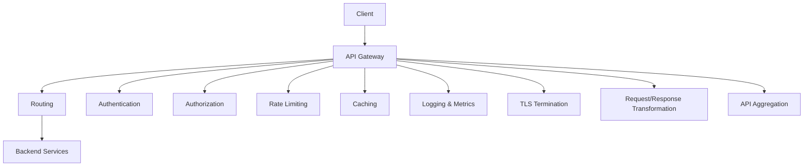
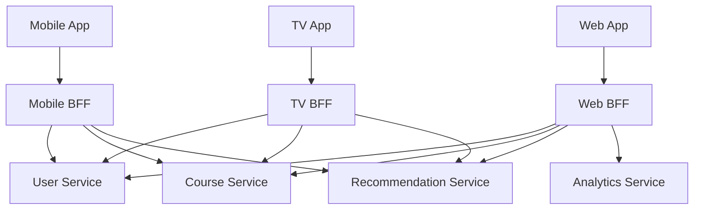
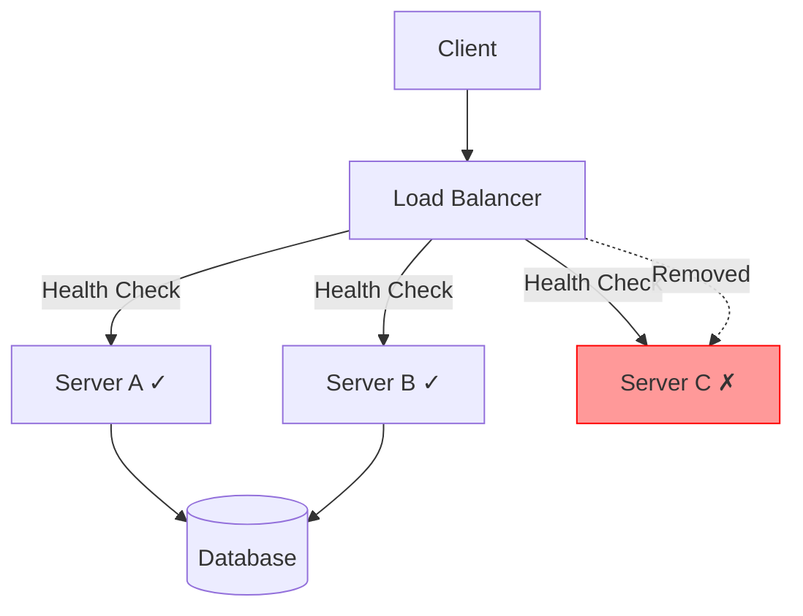
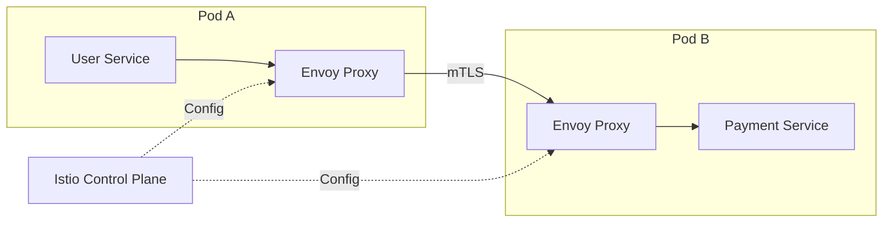
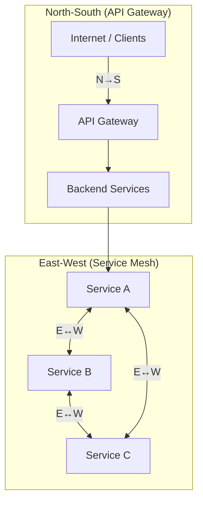
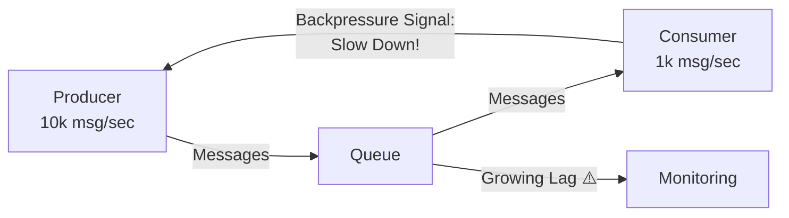

[← Back to Main README](../README.md) | [Previous: Async APIs](05-ASYNC-APIS.md) | [Next: Senior Design Guide →](07-SENIOR-DESIGN-GUIDE.md)

---

# Phase 6 — API Architecture in Distributed Systems

> **Quick Reference Card**
>
> | Concept | Purpose | Key Tools |
> |---------|---------|-----------|
> | API Gateway | Single entry point, cross-cutting concerns | NGINX, Kong, AWS API GW, Envoy |
> | BFF | Frontend-specific backend layer | Node.js, GraphQL, custom services |
> | Load Balancer | Distribute traffic across servers | AWS ALB/NLB, NGINX, HAProxy |
> | Service Mesh | Service-to-service communication | Istio, Envoy, Linkerd, Consul |
> | OpenAPI/Swagger | API contract & documentation | Swagger UI, Codegen, Editor |
> | Backpressure | Protect overloaded consumers | Kafka lag, reactive streams, bulkheads |

---

## Table of Contents

- [Phase 6.1: API Gateway Deep Dive](#phase-61--api-gateway-deep-dive-zero--hero)
  - [The Problem API Gateways Solve](#1-the-problem-api-gateways-solve)
  - [API Gateway Solution](#3-api-gateway-solution)
  - [Core Responsibilities](#5-core-responsibilities)
  - [Routing](#6-routing)
  - [Authentication](#7-authentication)
  - [Authorization](#8-authorization)
  - [Rate Limiting](#9-rate-limiting)
  - [TLS Termination](#10-tls-termination)
  - [Caching](#11-caching)
  - [Logging & Metrics](#12-logging)
  - [Request/Response Transformation](#14-request-transformation)
  - [API Aggregation](#16-api-aggregation)
  - [Gateway Failure & High Availability](#17-gateway-failure)
  - [Popular Technologies](#18-popular-api-gateway-technologies)
- [Phase 6.2: Backend For Frontend (BFF)](#phase-62--backend-for-frontend-bff--zero--hero)
  - [The Problem BFF Solves](#1-the-problem-bff-solves-1)
  - [What is BFF?](#3-what-is-bff)
  - [Mobile BFF Example](#7-mobile-bff-example)
  - [Web BFF Example](#8-web-bff-example)
  - [GraphQL BFF](#11-graphql-bff)
  - [Netflix & Spotify Examples](#12-netflix-example)
  - [BFF vs API Gateway](#14-bff-vs-api-gateway)
  - [Combined Architecture](#15-combined-architecture)
- [Phase 6.3: Load Balancers](#phase-63--load-balancers-zero--hero)
  - [What is a Load Balancer?](#2-what-is-a-load-balancer)
  - [Layer 4 vs Layer 7](#9-layer-4-vs-layer-7)
  - [Load Balancing Algorithms](#10-load-balancing-algorithms)
  - [Sticky Sessions](#14-sticky-sessions)
  - [Health Checks](#15-health-checks)
  - [Consistent Hashing](#18-consistent-hashing)
- [Phase 6.4: Service Mesh](#phase-64--service-mesh-zero--hero)
  - [The Problem Service Mesh Solves](#1-the-problem-service-mesh-solves)
  - [Sidecar Pattern](#4-sidecar-pattern)
  - [Envoy & Istio](#7-envoy)
  - [Data Plane vs Control Plane](#9-data-plane-vs-control-plane)
  - [mTLS](#10-mtls)
  - [Traffic Splitting & Canary](#13-traffic-splitting)
  - [North-South vs East-West](#north-south-vs-east-west)
  - [API Gateway vs Service Mesh](#19-api-gateway-vs-service-mesh)
- [Phase 6.5: OpenAPI & Swagger](#phase-65--openapi--swagger-zero--hero)
  - [The Problem OpenAPI Solves](#1-the-problem-openapi-solves)
  - [What is OpenAPI?](#2-what-is-openapi)
  - [OpenAPI Example](#5-openapi-example)
  - [Code Generation](#10-code-generation)
  - [Design-First Development](#12-design-first-development)
  - [API Contract](#14-api-contract)
- [Phase 6.6: Backpressure & Flow Control](#phase-66--backpressure--flow-control-zero--hero)
  - [Producer Faster Than Consumer](#2-producer-faster-than-consumer)
  - [What is Backpressure?](#3-what-is-backpressure)
  - [Rate Limiting vs Backpressure](#10-rate-limiting-vs-backpressure)
  - [Load Shedding](#12-load-shedding)
  - [Priority Queues](#13-priority-queues)
  - [Bulkhead Pattern](#14-bulkhead-pattern)
  - [Kafka Lag](#16-kafka-lag)
  - [Reactive Systems](#17-reactive-systems)

---

## Phase 6.1 — API Gateway Deep Dive (Zero → Hero)

We're learning the platform that makes APIs work at scale.

This is one of the most important concepts in modern system design.
Every company you know uses some variation of an API Gateway:

```
Netflix
Amazon
Uber
Microsoft
Google
Airbnb
Spotify
Instagram
```

### 1. The Problem API Gateways Solve

Let's start simple.
Imagine a system with only one service.

```
Mobile App
    |
    V
User Service
```

Simple.
No gateway needed.

Now the company grows.
You add:

```
User Service
Course Service
Payment Service
Search Service
Notification Service
Recommendation Service
```

Architecture becomes:

```
         Client
           |
+-----------+-----------+
|           |           |
V           V           V

User      Course    Payment
Service   Service   Service

Search    Notification  Recommendation
Service   Service       Service
```

Question:
How does the mobile app know:

```
Which service?
Which URL?
Which version?
Which authentication mechanism?
```

Very messy.

### 2. Life Without Gateway

Client may need:

```http
GET /users/123
GET /courses/456
POST /payments
GET /recommendations
```

And every service may have:

```
Different domain
Different authentication
Different deployment
```

Client becomes complicated.

### 3. API Gateway Solution

Introduce:

```
ONE FRONT DOOR
```

Architecture:

```
        Client
          |
          V
  +---------------+
  |  API Gateway  |
  +-------+-------+
          |
  +---------+---------+
  |         |         |
User     Course   Payment
Service  Service  Service
```

Now clients only know:

```
api.company.com
```

Everything else is hidden.

### 4. API Gateway Mental Model

Think of a hotel.

Without receptionist:

```
Guest searches:
  Room Service
  Housekeeping
  Maintenance
  Restaurant
  Spa
```

Chaos.

With receptionist:

```
Guest talks to one person.
Receptionist routes requests.
```

API Gateway is the receptionist.

### 5. Core Responsibilities

Most gateways perform these jobs:

```
Routing
Authentication
Authorization
Rate Limiting
Caching
Logging
Metrics
TLS Termination
Request Transformation
Response Transformation
```

Let's learn each.



### 6. Routing

Most basic responsibility.

Example:

```http
GET /users/123
```

Gateway decides:

```
Send to User Service
```

Example:

```http
GET /courses/456
```

Gateway decides:

```
Send to Course Service
```

Diagram:

```
  Client
    |
    V
  Gateway
    |
  +--+--+
  |     |
  V     V
User  Course
```

### 7. Authentication

Instead of every service checking tokens.
Gateway checks once.

Flow:

```
Client
  |
JWT Token
  |
Gateway
```

Valid token?

```
YES
```

Forward request.

Invalid token?

```http
401 Unauthorized
```

Return immediately.

Benefits:

```
Services become simpler.
```

### 8. Authorization

Authentication asks:

```
Who are you?
```

Authorization asks:

```
What are you allowed to do?
```

Example:

```
Admin Users
Normal Users
```

Request:

```http
DELETE /users/123
```

Gateway checks role.

Not admin?

```http
403 Forbidden
```

Request never reaches service.

### 9. Rate Limiting

You learned this during REST.
Now see where it often lives.

Imagine attacker sends:

```
1 million requests/minute
```

Gateway protects backend.

Rules:

```
100 req/min
1000 req/hr
5000 req/day
```

If exceeded:

```http
429 Too Many Requests
```

Without gateway:

```
Every service must implement manually.
```

With gateway:

```
One place.
```

### 10. TLS Termination

Users access:

```
HTTPS
```

TLS encryption is expensive.
Rather than every service handling TLS:
Gateway handles it.

Flow:

```
Client
  |
HTTPS
  |
Gateway
  |
Internal network
  |
HTTP / gRPC
```

Benefits:

```
Simpler backend services.
```

### 11. Caching

Many APIs are read-heavy.
Example:

```
Course Details
Product Details
Profile Data
```

Gateway can cache.

Request:

```http
GET /courses/123
```

First request:

```
Gateway -> Service
```

Next 1000 requests:

```
Gateway Cache
```

Service untouched.

### 12. Logging

Every request passes through gateway.
Perfect place to record:

```
User ID
IP
Endpoint
Status Code
Latency
```

Example log:

```
GET /courses/123
200 OK
180ms
```

Very useful during incidents.

### 13. Metrics

Gateway collects:

```
Request Count
Error Rate
P95 Latency
Traffic Volume
Requests Per Second
```

Example:

```
/search
Error Rate = 40%
```

Engineers investigate immediately.

### 14. Request Transformation

Gateway can modify requests.

Example:
Client sends:

```json
{
  "courseId": 123
}
```

Backend expects:

```json
{
  "id": 123
}
```

Gateway transforms format.

Useful for:

```
Legacy systems
Version migration
Adapter patterns
```

### 15. Response Transformation

Gateway can also modify responses.

Backend:

```json
{
  "firstName": "Irfan",
  "lastName": "Mohammad"
}
```

Gateway:

```json
{
  "fullName": "Irfan Mohammad"
}
```

Clients see consistent response.

### 16. API Aggregation

Very important.
Without gateway:
Profile Screen may call:

```
User Service
Course Service
Recommendation Service
```

3 requests.

Gateway can aggregate.

Client:

```http
GET /profile
```

Gateway:

```
Calls User Service
Calls Course Service
Calls Recommendation Service
```

Returns one response.

Diagram:

```
    Client
      |
      V
    Gateway
      |
  +--+--+--+
  |  |  |  |
User Course Rec
```

This concept leads directly into:
Backend For Frontend (BFF)
which we'll cover next.

### 17. Gateway Failure

Question:
What if gateway dies?
Everything dies.
It's now a critical component.

This is:

```
Single Point of Failure
```

Solution:
Multiple gateway instances.

```
  Load Balancer
       |
  +-----+-----+
  |     |     |
 GW1   GW2   GW3
```

Highly available.

### 18. Popular API Gateway Technologies

Examples:

```
NGINX
Kong
AWS API Gateway
Azure API Management
Apigee
Envoy
```

In Kubernetes ecosystems:

```
Envoy
Istio
NGINX Ingress
```

are common.

### 19. Real System Example

Learning Platform Architecture:

```
      Mobile App
          |
          V
  +----------------+
  |  API Gateway   |
  +----------------+
          |
  +------+------+------+
  |      |      |      |
User   Course  Progress
Svc    Svc     Svc
                |
                V
         Kafka / Events
                |
                V
         Analytics
         Recommendations
```

### Junior vs Senior Thinking

Junior sees:

```
Gateway routes requests.
```

Senior sees:

```
Gateway
  Authentication
  Rate Limiting
  Caching
  Observability
  Routing
  Aggregation
  Security
  Traffic Policies
```

### Key Interview Rule

When interviewer says:

```
Design Netflix
Design Amazon
Design Skillsoft
Design Instagram
```

Almost always include:

```
Load Balancer
     |
API Gateway
     |
Microservices
```

near the front of the architecture.

### What You've Learned (6.1)

```
✅ Why API Gateways exist
✅ Routing
✅ Authentication
✅ Authorization
✅ Rate Limiting
✅ TLS Termination
✅ Caching
✅ Logging
✅ Metrics
✅ Request Transformation
✅ Response Transformation
✅ API Aggregation
✅ High Availability
```

---

## Phase 6.2 — Backend For Frontend (BFF) — Zero → Hero

This topic explains why companies like:

```
Netflix
Spotify
Amazon
Airbnb
Microsoft
Instagram
```

often do not let all frontend clients directly consume the same APIs.

### 1. The Problem BFF Solves

Let's build a learning platform.
We have:

```
User Service
Course Service
Progress Service
Recommendation Service
Certificate Service
```

Architecture:

```
Mobile App
Web App
    |
    V
API Gateway
    |
    V
Microservices
```

Looks good.

Imagine the mobile app opens:

```
Home Screen
```

Needs:

```
User Name
Continue Learning
Recommended Courses
Progress Summary
```

This data lives in:

```
User Service
Course Service
Progress Service
Recommendation Service
```

Without BFF:

```
Mobile
  |
  +--> User API
  |
  +--> Progress API
  |
  +--> Course API
  |
  +--> Recommendation API
```

Many requests.

### 2. Why This Becomes Painful

Now product team says:

Mobile Home Screen:

```
Show only 5 recommendations.
```

Web Dashboard:

```
Show 20 recommendations.
```

Tablet App:

```
Show 10 recommendations.
```

Question:
Should backend services know about:

```
Mobile Layout?
Web Layout?
Tablet Layout?
```

No.

Backend services should focus on:

```
Business logic
```

not UI requirements.

### 3. What is BFF?

BFF means:
Backend For Frontend

A backend layer dedicated to a specific frontend.

Think:

```
Frontend-specific API layer.
```

Architecture:

```
Mobile App        Web App
    |                |
Mobile BFF       Web BFF
    |                |
Microservices    Microservices
```

Each frontend gets its own backend.



### 4. Hotel Analogy

Imagine a hotel.

Business Traveller wants:

```
Fast Check-in
WiFi
Meeting Room
```

Family Traveller wants:

```
Big Room
Kids Area
Restaurant
```

Hotel services are same.
But experiences differ.

BFF works similarly.
Same backend services.
Different frontend experiences.

### 5. Architecture Without BFF

```
Mobile
Web
TV App
    |
API Gateway
    |
+-----------+-----------+
User      Course    Progress
```

Every client calls services directly.

Problems:

```
Many requests
Over-fetching
Under-fetching
Frontend coupling
```

### 6. Architecture With BFF

```
Mobile          Web
  |               |
Mobile BFF     Web BFF
  |               |
Microservices  Microservices
```

Each BFF:

```
Aggregates data
Transforms data
Optimises responses
```

for its client.

### 7. Mobile BFF Example

Mobile Home Page needs:

```
User
Continue Learning
5 Recommendations
```

Mobile calls:

```http
GET /home
```

Mobile BFF performs:

```
User Service
Progress Service
Recommendation Service
```

Returns:

```json
{
  "user": "Irfan",
  "continueLearning": ["..."],
  "recommendations": ["5 courses"]
}
```

Single request.
Optimised for mobile.

### 8. Web BFF Example

Web dashboard requires more information.

Web BFF returns:

```json
{
  "user": "Irfan",
  "continueLearning": ["..."],
  "recommendations": ["20 courses"],
  "certificates": ["..."],
  "analytics": ["..."]
}
```

Different response.
Same underlying services.

### 9. Why Mobile and Web Differ

Think about constraints.

**Mobile** Needs:

```
Low bandwidth
Low latency
Small payloads
Battery efficiency
```

**Web** Can tolerate:

```
Larger payloads
More data
Complex dashboards
```

BFF customises accordingly.

### 10. BFF as Aggregator

One of the biggest uses.

Without BFF:

```
Mobile
  → User API
  → Progress API
  → Rec API
  → Certificate API
```

4 requests.

With BFF:

```
Mobile
  → Home API
```

1 request.

Internally:

```
BFF
  → User Service
  → Progress Service
  → Rec Service
  → Certificate Service
```

This improves performance.

### 11. GraphQL BFF

Very common today.

Architecture:

```
Frontend
    |
GraphQL BFF
    |
Microservices
```

GraphQL acts as:

```
Aggregation Layer
```

Client asks:

```graphql
query {
  user {
    name
  }
  progress {
    score
  }
  recommendations {
    title
  }
}
```

GraphQL BFF gathers data.
Single response.

This pattern is extremely popular.

### 12. Netflix Example

Netflix has:

```
TV Apps
Mobile Apps
Web Apps
Game Consoles
```

Each device behaves differently.

Smart TV may need:

```
Large images
Video previews
```

Mobile:

```
Compressed payload
Fewer recommendations
```

Separate BFFs allow optimisation.

### 13. Spotify Example

Spotify frontend:

```
iOS
Android
Desktop
Web
```

Different screens.
Different experiences.

Backend services remain:

```
Playlist
Search
Recommendations
Playback
```

BFF adapts results.

### 14. BFF vs API Gateway

This interview question appears frequently.

| Aspect | API Gateway | BFF |
|--------|-------------|-----|
| **Purpose** | Cross-cutting concerns | Frontend-specific needs |
| **Focus** | Security, Routing, Traffic | User Experience, Payload Shape, Screen Data |
| **Examples** | Routing, Authentication, Rate Limiting, Caching, Logging | Aggregation, Transformation, UI optimised payloads |
| **Memory Trick** | Platform concerns | Frontend concerns |

Visual Comparison:

```
Client          Client
  |               |
Gateway         BFF
  |               |
Microservices   Microservices
```

Gateway focuses on:

```
Security
Routing
Traffic
```

BFF focuses on:

```
User Experience
Payload Shape
Screen Data
```

### 15. Combined Architecture

Real companies often use both.

```
Mobile       Web
  |            |
Mobile BFF  Web BFF
  |            |
  +-----+------+
        |
   API Gateway
        |
        V
+-------+-------+
User  Course  Rec
```

### 16. Risks of BFF

Everything has trade-offs.

**Duplicate Logic**
Multiple BFFs may contain:

```
Similar code
```

**Maintenance Cost**
More services.
More deployments.
More monitoring.

**Team Ownership**
Need clear ownership.
Example:

```
Mobile Team owns Mobile BFF
Web Team owns Web BFF
```

### 17. When NOT to Use BFF

Small startup:

```
1 frontend
2 backend services
```

No BFF needed.

Example:

```
Simple internal tool
```

Likely unnecessary.

Use BFF when:

```
Multiple frontend types
Large scale
Different UI needs
Complex aggregation
```

### 18. Interview Architecture Pattern

When designing:

```
Netflix
Amazon
Spotify
Skillsoft
Instagram
```

A strong answer often looks like:

```
Client
  ↓
BFF
  ↓
API Gateway
  ↓
Microservices
  ↓
Kafka / Events
  ↓
Databases
```

---

## Phase 6.3 — Load Balancers (Zero → Hero)

Almost every architecture we've drawn so far secretly assumes that:

```
One server is not enough.
```

The next question becomes:

```
If I have 100 servers,
How do I decide
which server receives a request?
```

That is exactly what a Load Balancer solves.

### 1. The Problem

Imagine Skillsoft has:

```
1 Application Server
```

Architecture:

```
Users
  |
  V
Server
```

Initially:

```
100 users
```

Everything works.

Then company grows.
Traffic becomes:

```
10,000 users
100,000 users
1 million users
```

One server cannot handle everything.

Solution:
Add more servers.

```
Server A
Server B
Server C
```

Great.

Now a new problem appears.
Question:

```
How do users know
which server to call?
```

Without load balancer:

```
User 1 -> Server A
User 2 -> Server B
User 3 -> Server C
```

Who decides?
Very difficult.

### 2. What is a Load Balancer?

Simple definition:

```
A Load Balancer distributes
traffic across multiple servers.
```

Architecture:

```
    Client
      |
      V
  Load Balancer
      |
  +--+--+
  A  B  C
```

Think:

```
Traffic Manager
```

for servers.

### 3. Restaurant Analogy

Imagine a restaurant.

Without host:

```
Everyone chooses random table.
Some tables full.
Some empty.
```

Chaos.

With host:

```
Host seats customers intelligently.
```

Better experience.

Load Balancer = Restaurant Host

### 4. Benefits of Load Balancers

They provide:

```
Traffic Distribution
High Availability
Fault Tolerance
Scalability
```

Let's understand each.

### 5. Traffic Distribution

Suppose:

```
1000 requests
```

arrive.

Without LB:

```
Server A handles all.
```

Server crashes.

With LB:

```
333 -> Server A
333 -> Server B
334 -> Server C
```

Balanced.

### 6. High Availability

Huge concept.

Imagine:

```
Server B dies.
```

Without LB:

```
Users hitting B fail.
```

With LB:

```
Stop sending traffic to B.
```

Route to:

```
A
C
```

Users may not even notice.

### 7. Fault Tolerance

Load balancers continuously ask:

```
Are you healthy?
Are you healthy?
Are you healthy?
```

These are:
**Health Checks**

Server response:

```
200 OK
```

Healthy.

No response?

```
Remove server from pool.
```

### 8. Horizontal Scaling

One server:

```
100 RPS
```

(Requests Per Second)

Need:

```
1000 RPS
```

Add:

```
10 Servers
```

Load balancer distributes traffic.

This is:
**Horizontal Scaling**

**Vertical vs Horizontal Scaling**

Vertical:

```
Bigger machine.
```

More CPU.
More RAM.

Horizontal:

```
More machines.
```

Load balancer required.

Most internet-scale systems prefer:

```
Horizontal Scaling
```



### 9. Layer 4 vs Layer 7

Very common interview question.

#### Layer 4 Load Balancer

Works at:

```
Transport Layer
TCP / UDP
```

Knows:

```
IP Address
Port
```

Does NOT understand:

```
HTTP Path
Cookies
Headers
```

Example:

```
TCP traffic arrives.
Forward somewhere.
```

Think:

```
Fast traffic cop.
```

Examples:

```
AWS NLB
HAProxy TCP Mode
```

#### Layer 7 Load Balancer

Works at:

```
Application Layer
```

Understands:

```
HTTP
HTTPS
Headers
Cookies
URLs
```

Can make smart decisions.

Example:

```http
/users/*
```

Go to:

```
User Service
```

Example:

```http
/courses/*
```

Go to:

```
Course Service
```

Think:

```
Intelligent traffic manager.
```

Examples:

```
NGINX
AWS ALB
Envoy
```

#### L4 vs L7 Comparison

| Feature | Layer 4 | Layer 7 |
|---------|---------|---------|
| **OSI Layer** | Transport | Application |
| **Protocols** | TCP/UDP | HTTP/HTTPS |
| **Awareness** | IP + Port | URLs, Headers, Cookies |
| **Speed** | Fast | Slightly slower |
| **Routing** | Simple forwarding | Content-based routing |
| **Examples** | AWS NLB, HAProxy TCP | NGINX, AWS ALB, Envoy |

### 10. Load Balancing Algorithms

How does LB decide where to send a request?
Several strategies exist.

#### Round Robin

Most famous.

Requests processed:

```
A
B
C
A
B
C
```

Diagram:

```
1 -> A
2 -> B
3 -> C
4 -> A
5 -> B
```

Simple.
Widely used.

Round Robin Example:
Servers identical.

```
A
B
C
```

Perfect distribution.

### 11. Weighted Round Robin

What if:

```
A = Powerful
B = Medium
C = Small
```

Need:

```
A gets more traffic.
```

Weights:

```
A = 5
B = 3
C = 1
```

Traffic allocation:

```
A receives most requests.
```

Useful when server capacities differ.

### 12. Least Connections

Question:
Why send traffic to busiest server?

Instead:
Send request to:

```
Server with
fewest active connections.
```

Example:

```
A = 100 connections
B = 20 connections
C = 10 connections
```

New request:

```
Send to C.
```

Why?
Least loaded.

Popular for:

```
Long-running requests
Streaming
WebSockets
```

### 13. IP Hash

Route based on client IP.

Example:

```
User A -> Server 1
User B -> Server 2
```

Consistent mapping.

Useful for:

```
Session affinity
```

### 14. Sticky Sessions

Important interview topic.

Suppose:

```
Login session stored in server memory.
```

Request 1:

```
Server A
```

Login successful.

Request 2:

```
Server B
```

User appears logged out.

Problem:
Session exists only on A.

Solution:
**Sticky Sessions**

Load balancer remembers:

```
User X
  → Server A
```

All requests go to same server.

#### Why Sticky Sessions Are Dangerous

Suppose:

```
Server A crashes.
```

Session gone.

Modern systems prefer:
**Centralised Session Store (Redis)**
instead.

Then:

```
Any server can serve user.
```

### 15. Health Checks

How does LB know:

```
Server healthy?
```

Periodically calls:

```http
/health
```

Response:

```
200 OK
```

No response?

```
Remove from rotation.
```

### 16. CDN vs Load Balancer

Very common confusion.

**CDN:**

```
Moves content closer
to user.
```

Examples:

```
Images
Videos
Static Files
```

**Load Balancer:**

```
Distributes traffic
across servers.
```

Different jobs.

### 17. Real Architecture

Modern application:

```
Users
  |
  V
CDN
  |
  V
Load Balancer
  |
  V
API Gateway
  |
  V
Microservices
```

### 18. Consistent Hashing

Advanced but important.

Imagine:

```
Cache Server A
Cache Server B
Cache Server C
```

If one server added:
Normal hashing causes:

```
Most keys move.
```

Bad.

Consistent Hashing:

```
Minimal movement.
```

Used heavily in:

```
Redis Clusters
CDNs
Distributed Caches
```

We'll revisit later in caching/sharding topics.

### 19. Real Company Examples

**Netflix:**

```
Global Load Balancers
Regional Load Balancers
Service Load Balancers
```

Multiple layers.

**Amazon:**

```
ALB
NLB
Gateway LB
```

Every service behind load balancing.

**Google:**

```
Massive global traffic routing
Load balancing + geo routing
```

**WhatsApp:**

```
Connection Servers
Load Balancers
```

Distribute millions of active connections.

### Interview Architecture Pattern

A good system design diagram often begins like:

```
Users
  |
  V
CDN
  |
  V
Load Balancer
  |
  V
API Gateway
  |
  V
Microservices
```

This is almost muscle memory for system design interviews.

### What You've Learned (6.3)

```
✅ Why Load Balancers exist
✅ Traffic Distribution
✅ High Availability
✅ Fault Tolerance
✅ Health Checks
✅ Horizontal Scaling
✅ Layer 4 vs Layer 7
✅ Round Robin
✅ Weighted Round Robin
✅ Least Connections
✅ Sticky Sessions
✅ CDN vs Load Balancer
✅ Consistent Hashing
```

---

## Phase 6.4 — Service Mesh (Zero → Hero)

If API Gateway manages:

```
Client → Backend
```

then Service Mesh manages:

```
Backend → Backend
```

This is an important distinction.

### 1. The Problem Service Mesh Solves

Imagine a system with:

```
User Service
Course Service
Payment Service
Recommendation Service
Notification Service
Analytics Service
```

Architecture:

```
User Service
  |
  +--> Course Service
  |
  +--> Payment Service
  |
  +--> Notification Service
```

Looks okay.

Now imagine:

```
50 services
100 services
500 services
```

Every team must implement:

```
Retries
Timeouts
Load Balancing
TLS
Certificates
Metrics
Tracing
Logging
Circuit Breakers
```

inside every service.

Question:

```
Should every team write
networking code repeatedly?
```

No.

This creates:

```
Duplicate code
Inconsistent behaviour
Security risks
Maintenance nightmare
```

### 2. Service Mesh Idea

Move networking concerns outside application code.

Instead of:

```
Business Logic
+
Networking Logic
```

inside service,
we separate them.

Before:

```
User Service
  Business Logic
  Retry Logic
  TLS Logic
  Metrics Logic
  Load Balancing
```

After:

```
User Service
    |
Sidecar Proxy
```

Business code stays clean.

### 3. What Is a Service Mesh?

Simple definition:

```
A dedicated infrastructure layer
that handles service-to-service communication.
```

Think:

```
API Gateway
for internal traffic.
```

### 4. Sidecar Pattern

The most important Service Mesh concept.

Each service gets:

```
Application Container
+
Sidecar Proxy
```

Example:

```
+----------------------+
|    User Service      |
+----------------------+
+----------------------+
|    Envoy Sidecar     |
+----------------------+
```

And:

```
+----------------------+
|   Payment Service    |
+----------------------+
+----------------------+
|    Envoy Sidecar     |
+----------------------+
```



### 5. How Communication Changes

Without Mesh:

```
User Service
    |
    V
Payment Service
```

Direct communication.

With Mesh:

```
User Service
    |
    V
Envoy Proxy
    |
    V
Envoy Proxy
    |
    V
Payment Service
```

Applications never talk directly.
The proxies do.

### 6. The Sidecar Analogy

Imagine travelling abroad.
Instead of every employee learning:

```
French
German
Japanese
```

each employee gets:

```
Professional Interpreter
```

Employee focuses on:

```
Business conversation.
```

Interpreter handles:

```
Language
Protocols
Translation
```

Service Mesh = Network Interpreter.

### 7. Envoy

The most popular data-plane proxy.
Created by Lyft.
Used by:

```
Google
Microsoft
Airbnb
Netflix
Many Kubernetes platforms
```

Envoy handles:

```
Routing
Retries
Timeouts
Load Balancing
mTLS
Metrics
```

Think:

```
Envoy = Smart Network Proxy
```

### 8. Istio

Most famous Service Mesh platform.

Think:

```
Istio  = Control Plane
Envoy  = Data Plane
```

Analogy:

```
Istio  = Air Traffic Control
Envoy  = Individual Aircraft
```

Istio gives central control.
Envoy executes the rules.

### 9. Data Plane vs Control Plane

Interview favourite.

#### Data Plane

Handles actual traffic.

Example:

```
Service A
    ↓
  Envoy
    ↓
Service B
```

Data plane processes requests.

#### Control Plane

Configures proxies.

Example:

```
Enable retries
Enable mTLS
Add routing rule
```

Control plane pushes configuration.

### 10. mTLS

One of the biggest reasons Service Mesh exists.

You already know TLS:

```
Browser
  |
HTTPS
  |
Server
```

But internally?

```
Service A
Service B
Service C
```

Should they trust each other?

Use:
**mTLS** — Mutual TLS

Normal TLS:

```
Server proves identity.
```

mTLS:

```
Server proves identity
AND
Client proves identity.
```

Both authenticate each other.

#### Example

Without mTLS:

```
Compromised service
can pretend to be another service.
```

With mTLS:

```
Certificate required.
```

Greater security.

### 11. Retries

Suppose:

```
Payment Service
```

fails occasionally.

Without Mesh:
Every application writes:

```
Retry logic.
```

With Mesh:
Envoy handles retries.

Configuration:

```
Retry 3 times
```

All services get same behaviour.

### 12. Circuit Breakers

You've learned this already.

Traditionally:

```
Application code
implements breaker.
```

Mesh can implement:

```
Circuit Breakers
```

centrally.

Benefits:

```
Consistent behaviour
```

across system.

### 13. Traffic Splitting

Powerful feature.

Version 1:

```
Course Service V1
```

Version 2:

```
Course Service V2
```

Want:

```
95% → V1
 5% → V2
```

for testing.

Mesh handles it.

Diagram:

```
  Traffic
    |
95% → V1
 5% → V2
```

Called:

```
Canary Deployment
```

### 14. Blue-Green Deployment

Another common pattern.

Two environments:

```
Blue
Green
```

Current users:

```
Blue
```

New version:

```
Green
```

Want instant switch?
Service Mesh routes traffic.

### 15. Observability

Huge Service Mesh benefit.

Every request passes through Envoy.

Metrics automatically collected:

```
Latency
Error Rate
Request Count
Traffic Volume
```

Without modifying applications.

### 16. Distributed Tracing

Imagine request path:

```
Gateway
  ↓
User Service
  ↓
Course Service
  ↓
Recommendation Service
  ↓
Database
```

Where is latency?

Without tracing:

```
Hard to know.
```

Mesh provides:

```
Request trace
```

across services.

Very useful during incidents.

### 17. Service Discovery

Question:
How does User Service find:

```
Payment Service?
```

IPs constantly change.
Especially in Kubernetes.

Service Mesh integrates with:

```
Service Discovery
```

and dynamically routes traffic.

Applications never need hard-coded IPs.

### 18. Real Architecture

Without Mesh:

```
App
  |
Networking Logic
```

inside every service.

With Mesh:

```
User Service       Payment Service       Course Service
     |                   |                     |
   Envoy              Envoy                 Envoy
```

All networking concerns centralized.

### 19. API Gateway vs Service Mesh

Very common interview question.

| Aspect | API Gateway | Service Mesh |
|--------|-------------|--------------|
| **Manages** | External traffic | Internal traffic |
| **Direction** | Client → Backend | Service → Service |
| **Responsibilities** | Auth, Rate Limiting, Routing, API Aggregation | mTLS, Retries, Tracing, Load Balancing, Circuit Breakers |
| **Traffic Type** | North-South | East-West |

Easy memory trick:

```
Gateway = North-South Traffic
Mesh    = East-West Traffic
```

### North-South vs East-West



**North-South:**

```
Internet
  ↓
Backend
```

Gateway territory.

**East-West:**

```
Service
  ↓
Service
```

Mesh territory.

### 20. When NOT to Use Service Mesh

Small startup:

```
5 services
```

Probably unnecessary.

A mesh adds:

```
Complexity
Operational cost
Learning curve
```

Usually valuable when:

```
Large microservice architecture
Dozens+
or
Hundreds of services
```

### Real Companies

**Uber:**

```
Service Mesh + Envoy
```

for massive microservice communication.

**Airbnb:**
Uses Envoy heavily.

**Microsoft:**
Uses service-mesh style networking in many large distributed platforms.

**Kubernetes Ecosystem:**
Common tools:

```
Istio
Linkerd
Consul Connect
Kuma
```

### What You've Learned (6.4)

```
✅ Why Service Mesh exists
✅ Sidecar Pattern
✅ Envoy
✅ Istio
✅ Data Plane
✅ Control Plane
✅ mTLS
✅ Retries
✅ Circuit Breakers
✅ Traffic Splitting
✅ Canary Deployments
✅ Blue-Green Deployments
✅ Distributed Tracing
✅ Observability
✅ Service Discovery
✅ API Gateway vs Service Mesh
```

---

## Phase 6.5 — OpenAPI & Swagger (Zero → Hero)

Interestingly, this is also highly relevant to your day-to-day work. I found several internal references where your teams discuss Swagger/OpenAPI documentation, API gateways, automated API publishing, and ensuring API documentation coverage across endpoints. For example, your OE Automation team discussed standardising Swagger/OpenAPI documentation and using it for API gateway automation.

### 1. The Problem OpenAPI Solves

Imagine you're building:

```
Users API
```

You create:

```http
GET /users
GET /users/{id}
POST /users
```

Now frontend asks:

```
What fields come back?
What status codes exist?
What auth is required?
What errors can occur?
```

Imagine:

```
5 frontend developers
10 backend developers
QA team
Mobile team
Partner team
```

All asking questions.
Chaos.

#### Before OpenAPI

Backend says:

```
Trust me bro,
the API returns this.
```

Frontend says:

```
Actually it returns something else.
```

QA says:

```
Which response is correct?
```

This creates:

```
Miscommunication
Broken integrations
Documentation drift
```

### 2. What is OpenAPI?

Officially:

```
OpenAPI Specification (OAS)
```

defines a standard machine-readable description of an API. It allows humans and tools to understand the API without reading the source code.

Think:

```
OpenAPI = Blueprint of the API
```

### 3. What is Swagger?

This confuses almost everyone.

Many people say:

```
Swagger = OpenAPI
```

Not exactly.

Relationship:

```
OpenAPI = Specification
Swagger = Tooling
```

Examples:

```
Swagger UI
Swagger Editor
Swagger Codegen
```

work with OpenAPI definitions.

#### Simple Analogy

Think:

```
OpenAPI = Blueprint
Swagger = Architect's tools
```

### 4. What Does OpenAPI Describe?

An OpenAPI file describes:

```
Endpoints
Methods
Parameters
Headers
Request Body
Responses
Authentication
Schemas
```

This is explicitly how OpenAPI is used internally as well, where endpoint documentation is stored in OpenAPI/Swagger definitions.

#### Example

API:

```http
GET /users/123
```

OpenAPI can describe:

```
Path
Method
Input
Output
Errors
```

### 5. OpenAPI Example

A simplified YAML file:

```yaml
openapi: 3.0.0

paths:
  /users:
    get:
      summary: Get Users
      responses:
        '200':
          description: Success
```

This becomes:

```
Machine-readable
Human-readable
```

simultaneously.

### 6. Why YAML?

Most developers write OpenAPI using YAML because it is easier than JSON.

JSON:

```json
{
  "name": "Irfan"
}
```

YAML:

```yaml
name: Irfan
```

Much cleaner.

### 7. Major Sections

Most OpenAPI specs contain:

```
Info
Servers
Paths
Schemas
Security
```

#### Info Section

Metadata.

Example:

```yaml
info:
  title: Users API
  version: 1.0
```

#### Servers Section

Where API lives.

```yaml
servers:
  - url: https://api.company.com
```

#### Paths Section

Most important section.
Contains endpoints.

```yaml
paths:
  /users:
```

#### Schemas

Defines data types.

Example User:

```yaml
User:
  id: number
  name: string
  email: string
```

Think:

```
Class Definition
for APIs
```

### 8. Interactive Documentation

One of OpenAPI's superpowers.

Swagger UI can generate:

```
Beautiful API Documentation
```

automatically from the spec.

Instead of:

```
Writing documentation manually.
```

You get:

```
Search
Examples
Schemas
Try-it-out buttons
```

automatically.

#### Real Example

Your OE Automation discussions mention:

```
/api-docs
/swagger.json
```

to expose interactive API documentation.

### 9. Try It Out

Swagger UI enables:

```
Enter Parameters
Click Execute
See Real Response
```

directly from browser.

No Postman needed.

### 10. Code Generation

Massive productivity benefit.

OpenAPI definitions can generate:

```
Java SDK
TypeScript SDK
Python SDK
Go SDK
Server Stubs
```

automatically.

#### Before OpenAPI

Frontend manually writes:

```
API Clients
```

Problem:

```
Typos
Missing fields
Version mismatch
```

#### After OpenAPI

Generate SDK.
Everything stays consistent.

### 11. Server Stub Generation

Backend can generate server stubs from spec.

Design first.
Implement later.

This creates:

```
Contract First Development
```

### 12. Design-First Development

Old approach:

```
Write Code
Then Document
```

Documentation becomes outdated.

Modern approach:

```
Design API
Create OpenAPI Spec
Generate Code
Implement Logic
```

OpenAPI drives development.

### 13. Validation

OpenAPI can validate:

```
Requests
Responses
Headers
Payloads
```

Example:
Frontend sends:

```json
{
  "username": 123
}
```

Schema expects:

```
string
```

Validation fails.

Many bugs disappear early.

### 14. API Contract

Most important mindset.

OpenAPI becomes:
**API Contract**

Analogy:

```
Rental Agreement
```

Backend promises:

```
Input
Output
Status Codes
```

Frontend trusts contract.

Everyone builds independently.

### 15. Versioning

API evolves.

Example:

```
v1
v2
v3
```

OpenAPI allows versioned contracts.
This reduces surprises during upgrades.

### 16. Testing

QA teams can automatically generate tests using OpenAPI documentation. I even found internal QA work investigating test-case generation from Swagger/OpenAPI specs.

Benefits:

```
Coverage
Consistency
Automation
```

### 17. OpenAPI Lifecycle

Real production flow:

```
Design API
     |
OpenAPI Spec
     |
Code Generation
     |
Implementation
     |
Swagger UI
     |
Testing
     |
Gateway Publication
```

Your internal documentation also describes automated flows where Swagger/OpenAPI specifications are uploaded into documentation platforms and used in API publishing pipelines.

### 18. OpenAPI vs GraphQL Schema

Another common interview question.

**OpenAPI:**

```
REST APIs
```

describes:

```
Endpoints
```

**GraphQL:**

```
GraphQL APIs
```

describes:

```
Types
Queries
Mutations
```

Both are contracts.
Different paradigms.

### Senior Engineer Perspective

Junior thinks:

```
Swagger = Documentation
```

Senior thinks:

```
API Contract
Code Generation
Validation
Documentation
Testing
SDK Generation
Gateway Integration
```

### What You've Learned (6.5)

```
✅ OpenAPI
✅ Swagger
✅ API Contracts
✅ YAML Specs
✅ Schemas
✅ Interactive Documentation
✅ Code Generation
✅ Server Stub Generation
✅ Design First Development
✅ Validation
✅ Testing
✅ Versioning
```

---

## Phase 6.6 — Backpressure & Flow Control (Zero → Hero)

This is the final major topic of Phase 6.
After this, you'll have completed the entire:

```
API Architecture Layer
```

and we'll move into the Expert Layer (Phase 7).

### 1. The Core Problem

Imagine a restaurant.
You have:

```
100 customers arriving per minute
```

but only:

```
10 meals produced per minute
```

Question:
What happens?

The queue grows.

```
100 arrive
 10 leave
 90 remain

Next minute:
100 arrive
 10 leave
180 remain
```

Eventually:

```
Kitchen collapses
```

This exact problem happens in software.

### 2. Producer Faster Than Consumer

Architecture:

```
Producer
    |
    V
  Queue
    |
    V
Consumer
```

Producer speed:

```
10,000 messages/sec
```

Consumer speed:

```
1,000 messages/sec
```

Queue grows by:

```
9,000 messages/sec
```

Soon:

```
Memory exhausted
Storage exhausted
Latency explodes
```

This is where:
**Backpressure**
becomes necessary.

### 3. What is Backpressure?

Simple definition:

```
Backpressure is a mechanism
that slows producers down
when consumers cannot keep up.
```

Think:

```
Consumer says:
"Stop.
 I am overwhelmed."
```

Diagram:

```
Producer
    |
  Messages
    |
  Queue
    |
Consumer
    ↑
Slow Down Signal
```



### 4. Traffic Analogy

Imagine a highway.

Cars entering:

```
10,000/hour
```

Road capacity:

```
2,000/hour
```

Result:

```
Traffic jam
```

Solution:

```
Toll gate controls entry rate.
```

Backpressure is that toll gate.

### 5. Why Backpressure Matters

Without backpressure:

```
Memory fills
CPU spikes
Latency rises
Queues become enormous
System crashes
```

With backpressure:

```
System remains stable.
```

Maybe slower.
But alive.

### 6. Queue Growth Problem

Suppose:

```
Kafka Topic
```

receives:

```
100k events/sec
```

Consumers handle:

```
20k/sec
```

Difference:

```
80k/sec backlog
```

Queue size keeps growing.

After hours:

```
Billions of events pending.
```

This is not sustainable.

### 7. Flow Control

Closely related concept.

Think:

```
Backpressure = Protection Strategy
Flow Control = Traffic Management Strategy
```

Flow control decides:

```
How much data can be sent
at a time.
```

Example:

```
Send 100 messages
Wait
Send next batch
```

instead of:

```
Send 1 million immediately
```

### 8. TCP Already Uses Flow Control

Interesting observation.
You've already learned one flow-control system.

TCP provides:

```
Sliding Window
```

Receiver says:

```
I can currently accept
10 KB more.
```

Sender respects the limit.

This is flow control.

Backpressure exists even at the networking layer.

### 9. API Example

Imagine:

```
Recommendation Service
```

becomes slow.

Traffic:

```
20,000 req/sec
```

Service capacity:

```
2,000 req/sec
```

Without protection:

```
Service collapses.
```

### 10. Rate Limiting vs Backpressure

Extremely important interview question.

| Aspect | Rate Limiting | Backpressure |
|--------|---------------|--------------|
| **Controlled by** | System Owner | System overload |
| **Purpose** | Abuse prevention | Protect overloaded system |
| **Trigger** | Policy (always enforced) | Emergency (triggered by load) |
| **Example** | 100 requests/minute per user | Consumer signals producer to slow down |
| **Memory Trick** | Policy | Emergency Response |

### 11. What Happens Under Overload?

System choices:

**Option A:**
Accept everything.

Result:

```
OOM
Crash
Timeouts
```

Bad.

**Option B:**
Reject some requests.

Result:

```
System survives.
```

Much better.

### 12. Load Shedding

Another important concept.

Meaning:

```
Intentionally drop work
to save system.
```

Example:

Capacity:

```
10k req/sec
```

Incoming:

```
50k req/sec
```

Load shed:

```
40k rejected
10k processed
```

System remains healthy.

#### Real Example

During a massive traffic spike:

```
Recommendations
```

might be dropped.

But:

```
Payments
```

must continue.

### 13. Priority Queues

Not all work is equal.

Example:

```
Payment Processing
Recommendation Refresh
Analytics Event
```

If overloaded:

```
Process: Payment First
```

Delay:

```
Analytics
```

This is prioritisation.

#### Uber Example

Critical:

```
Ride Request
```

Non-critical:

```
Analytics Event
```

Under overload:

```
Keep rides.
Drop analytics.
```

### 14. Bulkhead Pattern

Named after ship design.

Ships have compartments.
If one floods:

```
Whole ship doesn't sink.
```

Software equivalent:

```
Separate resources.
```

Example:

```
Payment Thread Pool
Recommendation Thread Pool
```

Recommendation overload?

```
Payments unaffected.
```

Diagram:

```
System
+-----------+
| Payments  |
+-----------+
+-----------+
|  Search   |
+-----------+
+-----------+
| Analytics |
+-----------+
```

Isolation.

### 15. Queue Length Monitoring

Senior engineers monitor:

```
Queue Size
Lag
Processing Rate
```

Example:

```
Kafka Consumer Lag
```

Consumer processed:

```
Offset 100
```

Topic latest:

```
Offset 10000
```

Lag:

```
9900
```

Huge warning sign.

### 16. Kafka Lag

Most important Kafka metric.

Producer:

```
1000 messages/sec
```

Consumer:

```
100 messages/sec
```

Lag grows.

Meaning:

```
Consumer behind.
```

Teams monitor lag aggressively.

### 17. Reactive Systems

Some systems support true backpressure.

Consumer explicitly says:

```
Give me only
100 items.
```

Producer sends:

```
100
```

Consumer processes.
Then requests:

```
Next 100
```

This pull-based model naturally controls flow.

Used in:

```
Reactive Streams
RxJava
Project Reactor
Akka Streams
```

### 18. Real Netflix Scenario

Suppose:

```
Viewing Events
```

suddenly spike.

Without protection:

```
Recommendation System dies.
```

Netflix-style design:

```
Kafka Buffers Events
Consumer Groups Scale
Lag Monitored
Load Shed if Necessary
```

System survives.

### 19. Real Amazon Scenario

Black Friday.

Traffic:

```
10x normal
```

Critical Services:

```
Checkout
Payment
```

Protected.

Lower Priority:

```
Recommendations
Email Campaigns
```

may be delayed.

Business survives.

### 20. Real WhatsApp Scenario

Massive event:

```
World Cup Final
```

Traffic spikes.

Critical:

```
Message Delivery
```

Less Critical:

```
Presence Updates
Analytics
```

might be degraded.

Priorities matter.

### Reliability Hierarchy

When overload happens:

```
1. Apply Flow Control
2. Trigger Backpressure
3. Scale Consumers
4. Load Shed
5. Prioritise Critical Work
6. Use Bulkheads
```

### Cheat Sheet

| Concept | Definition |
|---------|------------|
| **Backpressure** | Slow producers when consumers overloaded |
| **Flow Control** | Control rate of data transfer |
| **Rate Limiting** | Restrict usage by policy |
| **Load Shedding** | Drop work intentionally |
| **Bulkhead** | Isolate failures |
| **Consumer Lag** | How far consumer is behind |

---

## Phase 6 Completion ✅

You have now completed:

```
✅ API Gateway
✅ BFF
✅ Load Balancers
✅ Service Mesh
✅ OpenAPI
✅ Backpressure
✅ Authentication
✅ Authorization
✅ Circuit Breakers
✅ Retries
✅ Observability
```

### Roadmap Status

```
Phase 0 ✅ Fundamentals
Phase 1 ✅ REST
Phase 2 ✅ RPC / gRPC
Phase 3 ✅ GraphQL
Phase 4 ✅ Realtime Systems
Phase 5 ✅ Async APIs
Phase 6 ✅ API Architecture
```

That means you've completed approximately:

```
~90% of the roadmap
```

### Next Major Phase

We are now ready for:
**Phase 7 — Expert-Level API & Distributed System Design**

We'll cover:

```
✅ API Evolution
✅ Backward Compatibility
✅ Schema Evolution
✅ Consumer Driven Contracts
✅ Multi-Region APIs
✅ Latency Budgets
✅ Cross-Service Transactions
✅ API Monetisation
✅ Abuse Prevention
✅ Production Incidents
✅ Staff/Principal-Level Design Thinking
```

And this is where system design moves from:

```
How systems work
```

to:

```
How large organisations safely evolve systems for years.
```

This is the final stretch from Senior Engineer → Staff/Principal-level architecture thinking.

---

[← Back to Main README](../README.md) | [Previous: Async APIs](05-ASYNC-APIS.md) | [Next: Senior Design Guide →](07-SENIOR-DESIGN-GUIDE.md)
