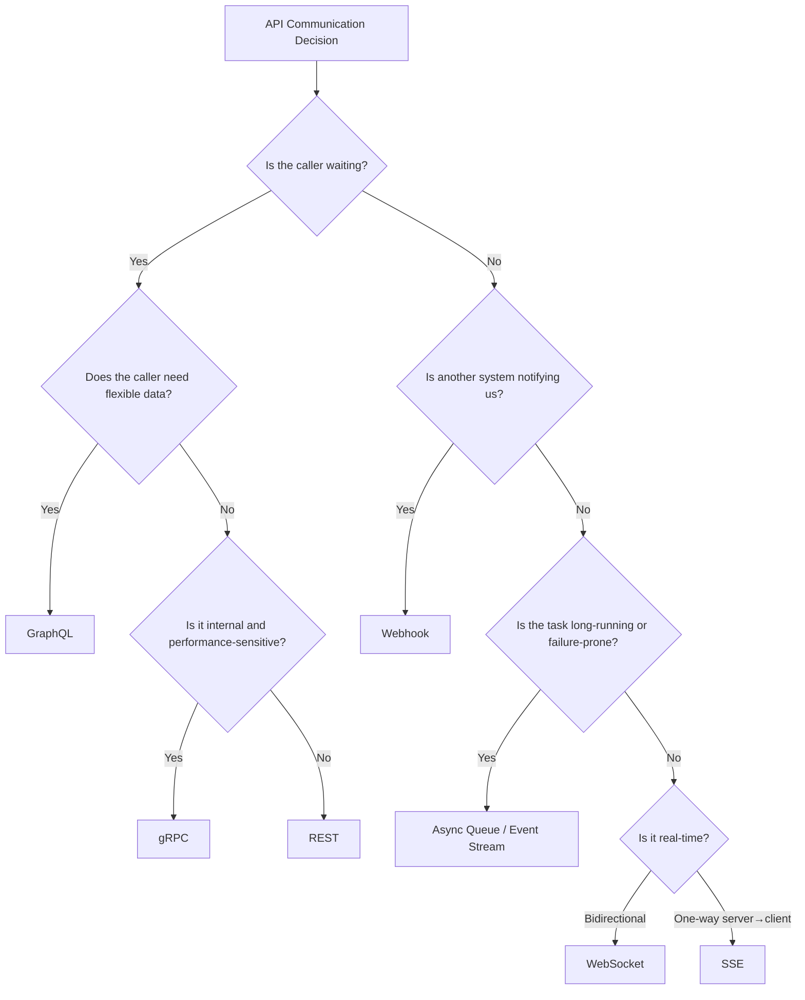
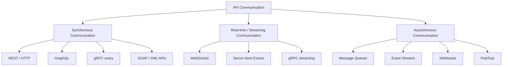
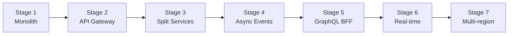
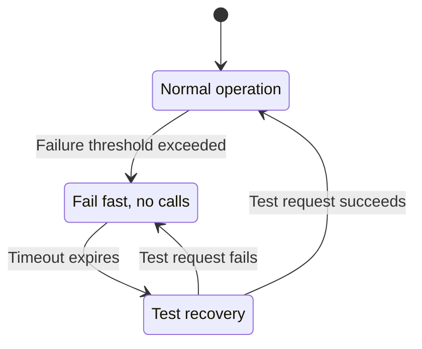
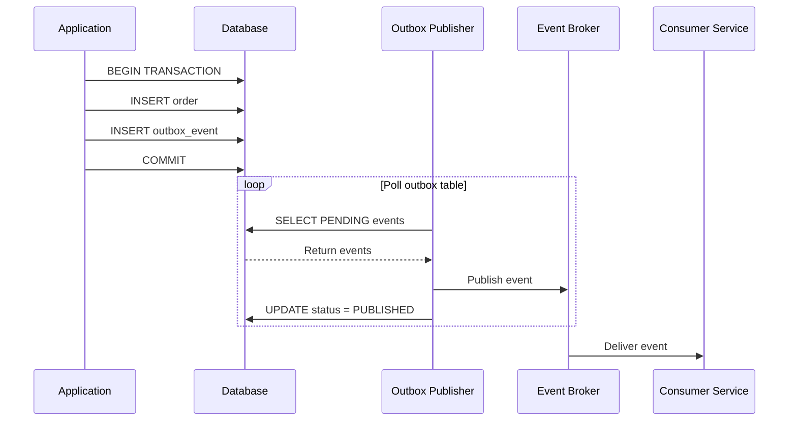
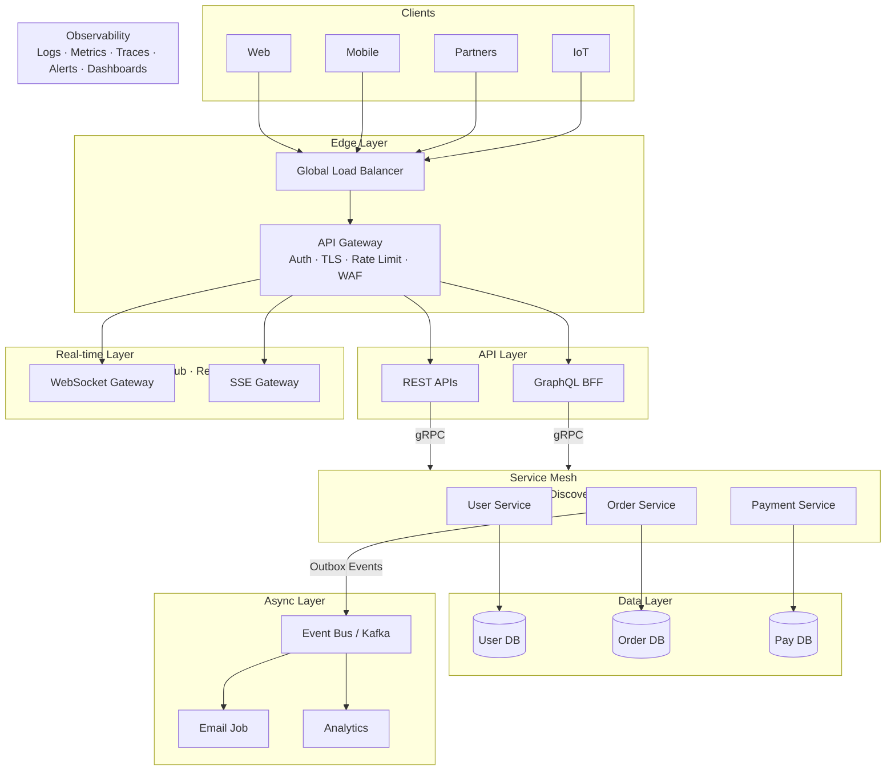

[← Back to Main README](../README.md) | [Previous: API Architecture](06-API-ARCHITECTURE.md)

---

# 07 — Senior API Design Guide: Comprehensive Decision Framework

> A zero-to-hero reference on API communication methods — from "what is an API call?" to how senior engineers choose between REST, GraphQL, gRPC, WebSockets, SSE, Webhooks, and asynchronous messaging in real production systems.

I also checked internal enterprise material and found relevant API design references, including Designing Data-Intensive Applications, an internal Customer Data API design, and System Design Performance Considerations. The strongest internal reminder is this: REST is very strong for public/debuggable APIs, while RPC-style frameworks such as gRPC are often better for internal service-to-service calls where performance and contract control matter. [Designing...plications | PDF]

---

## Quick Reference Card



### Decision Matrix

| Use case                           | Best choice                        | Why                                 |
| ---------------------------------- | ---------------------------------- | ----------------------------------- |
| Public CRUD API                    | REST                               | universal, cacheable, easy to debug |
| Mobile app needing flexible data   | GraphQL                            | avoids over/under-fetching          |
| Internal microservices             | gRPC                               | fast, typed, efficient              |
| Chat / gaming / live collaboration | WebSocket                          | bidirectional low-latency           |
| Server-to-browser updates only     | SSE                                | simpler than WebSocket              |
| Long-running export                | REST + async job + polling/webhook | avoids request timeout              |
| Background task                    | Queue                              | decoupled retryable work            |
| Analytics/events pipeline          | Event stream                       | replayable ordered event log        |
| External event notification        | Webhook                            | push-based integration              |
| Legacy enterprise integration      | SOAP                               | formal XML contract                 |

---

## Table of Contents

- [1. First Principles: What Does "API Communication" Mean?](#1-first-principles-what-does-api-communication-mean)
- [2. The API Communication Landscape](#2-the-api-communication-landscape)
- [3. Requirement Clarification: How to Approach This in Interviews](#3-requirement-clarification-how-to-approach-this-in-interviews)
  - [3.1 Functional Requirements](#31-functional-requirements)
  - [3.2 Non-Functional Requirements](#32-non-functional-requirements)
- [4. Estimation Framework for API Communication](#4-estimation-framework-for-api-communication)
  - [4.1 QPS Estimation](#41-qps-estimation)
  - [4.2 Bandwidth Estimation](#42-bandwidth-estimation)
  - [4.3 Connection Estimation for Real-Time APIs](#43-connection-estimation-for-real-time-apis)
  - [4.4 Async Queue Estimation](#44-async-queue-estimation)
- [5. Beginner Level: REST / HTTP APIs](#5-beginner-level-rest--http-apis)
  - [5.1 What is REST?](#51-what-is-rest)
  - [5.2 REST Example](#52-rest-example)
  - [5.3 REST API Endpoint Design](#53-rest-api-endpoint-design)
  - [5.4 REST Status Codes](#54-rest-status-codes)
  - [5.5 REST Strengths](#55-rest-strengths)
  - [5.6 REST Weaknesses](#56-rest-weaknesses)
- [6. Intermediate Level: GraphQL APIs](#6-intermediate-level-graphql-apis)
  - [6.1 What is GraphQL?](#61-what-is-graphql)
  - [6.2 Why GraphQL Exists](#62-why-graphql-exists)
  - [6.3 GraphQL Strengths](#63-graphql-strengths)
  - [6.4 GraphQL Weaknesses](#64-graphql-weaknesses)
  - [6.5 GraphQL N+1 Problem](#65-graphql-n1-problem)
  - [6.6 When to Choose GraphQL](#66-when-to-choose-graphql)
- [7. Advanced Level: gRPC](#7-advanced-level-grpc)
  - [7.1 What is gRPC?](#71-what-is-grpc)
  - [7.2 gRPC Communication Patterns](#72-grpc-communication-patterns)
  - [7.3 Why gRPC is Fast](#73-why-grpc-is-fast)
  - [7.4 gRPC Strengths](#74-grpc-strengths)
  - [7.5 gRPC Weaknesses](#75-grpc-weaknesses)
  - [7.6 Protobuf Compatibility Rules](#76-protobuf-compatibility-rules)
  - [7.7 When to Choose gRPC](#77-when-to-choose-grpc)
- [8. Real-Time Communication: WebSockets](#8-real-time-communication-websockets)
  - [8.1 What is WebSocket?](#81-what-is-websocket)
  - [8.2 WebSocket Example](#82-websocket-example)
  - [8.3 WebSocket Use Cases](#83-websocket-use-cases)
  - [8.4 WebSocket Challenges](#84-websocket-challenges)
  - [8.5 WebSocket Scaling Design](#85-websocket-scaling-design)
- [9. Server-Sent Events: One-Way Streaming](#9-server-sent-events-one-way-streaming)
  - [9.1 What is SSE?](#91-what-is-sse)
  - [9.2 SSE Example](#92-sse-example)
  - [9.3 When to Use SSE](#93-when-to-use-sse)
- [10. Webhooks: "Call Me When It Happens"](#10-webhooks-call-me-when-it-happens)
  - [10.1 What is a Webhook?](#101-what-is-a-webhook)
  - [10.2 Webhook Receiver Pseudo-Code](#102-webhook-receiver-pseudo-code)
  - [10.3 Webhook Design Principles](#103-webhook-design-principles)
  - [10.4 When to Use Webhooks](#104-when-to-use-webhooks)
- [11. Asynchronous Messaging: Queues and Event Streams](#11-asynchronous-messaging-queues-and-event-streams)
  - [11.1 Why Async Communication Exists](#111-why-async-communication-exists)
  - [11.2 Queue vs Stream](#112-queue-vs-stream)
  - [11.3 Queue Use Cases](#113-queue-use-cases)
  - [11.4 Stream Use Cases](#114-stream-use-cases)
  - [11.5 Async Pseudo-Code](#115-async-pseudo-code)
  - [11.6 Async Strengths](#116-async-strengths)
  - [11.7 Async Weaknesses](#117-async-weaknesses)
- [12. SOAP and XML APIs](#12-soap-and-xml-apis)
- [13. API Communication Decision Matrix](#13-api-communication-decision-matrix)
  - [13.1 Quick Selection Table](#131-quick-selection-table)
  - [13.2 Senior-Level Rule](#132-senior-level-rule)
- [14. Step-by-Step Evolution: Monolith to Distributed API Platform](#14-step-by-step-evolution-monolith-to-distributed-api-platform)
- [15. API Data Models and Contracts](#15-api-data-models-and-contracts)
  - [15.1 REST Contract](#151-rest-contract)
  - [15.2 GraphQL Schema](#152-graphql-schema)
  - [15.3 gRPC Contract](#153-grpc-contract)
  - [15.4 Event Contract](#154-event-contract)
- [16. Sharding Strategies for API Communication Systems](#16-sharding-strategies-for-api-communication-systems)
  - [16.1 API Server Sharding](#161-api-server-sharding)
  - [16.2 WebSocket Sharding](#162-websocket-sharding)
  - [16.3 Kafka/Event Stream Sharding](#163-kafkaevent-stream-sharding)
  - [16.4 Multi-Tenant API Sharding](#164-multi-tenant-api-sharding)
- [17. Caching Strategies by Communication Method](#17-caching-strategies-by-communication-method)
  - [17.1 REST Caching](#171-rest-caching)
  - [17.2 GraphQL Caching](#172-graphql-caching)
  - [17.3 gRPC Caching](#173-grpc-caching)
  - [17.4 WebSocket Caching](#174-websocket-caching)
  - [17.5 Async/Event Caching](#175-asyncevent-caching)
- [18. Load Balancing Strategies](#18-load-balancing-strategies)
  - [18.1 REST/GraphQL](#181-restgraphql)
  - [18.2 gRPC](#182-grpc)
  - [18.3 WebSocket](#183-websocket)
  - [18.4 Queue Consumers](#184-queue-consumers)
- [19. Consistency Models](#19-consistency-models)
  - [19.1 Synchronous APIs](#191-synchronous-apis)
  - [19.2 Async APIs](#192-async-apis)
  - [19.3 Ordering Guarantees](#193-ordering-guarantees)
  - [19.4 Idempotency](#194-idempotency)
- [20. Fault Tolerance Patterns](#20-fault-tolerance-patterns)
  - [20.1 Timeouts](#201-timeouts)
  - [20.2 Retries with Exponential Backoff](#202-retries-with-exponential-backoff)
  - [20.3 Circuit Breaker](#203-circuit-breaker)
  - [20.4 Bulkheads](#204-bulkheads)
  - [20.5 Graceful Degradation](#205-graceful-degradation)
  - [20.6 Dead-Letter Queue](#206-dead-letter-queue)
- [21. Security Design](#21-security-design)
  - [21.1 Authentication](#211-authentication)
  - [21.2 Authorisation](#212-authorisation)
  - [21.3 Rate Limiting](#213-rate-limiting)
  - [21.4 Input Validation](#214-input-validation)
  - [21.5 Webhook Security](#215-webhook-security)
  - [21.6 WebSocket Security](#216-websocket-security)
- [22. Observability and Monitoring](#22-observability-and-monitoring)
  - [22.1 REST/GraphQL/gRPC Metrics](#221-restgraphqlgrpc-metrics)
  - [22.2 WebSocket Metrics](#222-websocket-metrics)
  - [22.3 Queue/Event Metrics](#223-queueevent-metrics)
  - [22.4 Distributed Tracing](#224-distributed-tracing)
- [23. API Versioning and Evolution](#23-api-versioning-and-evolution)
  - [23.1 REST Versioning](#231-rest-versioning)
  - [23.2 GraphQL Evolution](#232-graphql-evolution)
  - [23.3 gRPC Evolution](#233-grpc-evolution)
  - [23.4 Event Evolution](#234-event-evolution)
- [24. API Communication Failure Modes and Edge Cases](#24-api-communication-failure-modes-and-edge-cases)
  - [24.1 REST/HTTP Failure Modes](#241-resthttp-failure-modes)
  - [24.2 GraphQL Failure Modes](#242-graphql-failure-modes)
  - [24.3 gRPC Failure Modes](#243-grpc-failure-modes)
  - [24.4 WebSocket Failure Modes](#244-websocket-failure-modes)
  - [24.5 Async Messaging Failure Modes](#245-async-messaging-failure-modes)
- [25. The Outbox Pattern: Critical for Reliable Events](#25-the-outbox-pattern-critical-for-reliable-events)
- [26. Polling vs Long Polling vs SSE vs WebSocket](#26-polling-vs-long-polling-vs-sse-vs-websocket)
- [27. Concrete Node.js Mini-Design: One System Using Multiple Methods](#27-concrete-nodejs-mini-design-one-system-using-multiple-methods)
- [28. Redis vs Kafka vs RabbitMQ vs Cassandra in API Communication](#28-redis-vs-kafka-vs-rabbitmq-vs-cassandra-in-api-communication)
- [29. Final Polished Architecture Diagram](#29-final-polished-architecture-diagram)
- [30. Interview-Ready Explanation](#30-interview-ready-explanation)
- [31. Real-World Lessons and Pitfalls](#31-real-world-lessons-and-pitfalls)
- [32. Final Cheat Sheet](#32-final-cheat-sheet)
- [33. Hero-Level Mental Model](#33-hero-level-mental-model)

---

## 1. First Principles: What Does "API Communication" Mean?

An API communication method is the way two software components talk to each other.

Think of it like human communication:

| Human analogy                                       | API equivalent              |
| --------------------------------------------------- | --------------------------- |
| Asking a question and waiting for an answer         | REST / GraphQL / gRPC unary |
| Calling someone on the phone                        | WebSocket / streaming       |
| Leaving a message and getting a reply later         | Queue / async messaging     |
| Asking someone to notify you when something happens | Webhook                     |
| News channel broadcasting updates                   | Server-Sent Events          |

In system design, choosing the communication method is not just a coding decision. It affects:

- latency
- scalability
- failure handling
- developer experience
- deployment complexity
- browser/mobile compatibility
- caching
- observability
- backward compatibility
- cost

A senior engineer does not say: "REST is best" or "gRPC is faster, so use gRPC everywhere."

A senior engineer asks:

> Who is calling whom, how often, how quickly do they need a response, how reliable must delivery be, and who controls the client?

---

## 2. The API Communication Landscape

At a high level, API communication methods fall into two big categories:



The main design choice is:

> Should the caller wait for the response now, or should the work happen later?

---

## 3. Requirement Clarification: How to Approach This in Interviews

If an interviewer says:

> "Design API communication between services"

or

> "Which API protocol would you choose?"

Start with these requirements.

### 3.1 Functional Requirements

Ask:

- Who are the consumers?
  - browser?
  - mobile app?
  - backend service?
  - external partner?
  - IoT device?
  - internal worker?
- What operations are required?
  - CRUD?
  - search?
  - streaming updates?
  - bulk export?
  - notifications?
  - long-running jobs?
- Is the interaction request/response or event-driven?
  - "Get user profile" → synchronous
  - "Export 10 GB report" → asynchronous
  - "Show live stock price" → streaming
  - "Call me when payment succeeds" → webhook/event
- Is the API public or internal?
  - public APIs need simplicity, stability, documentation, versioning
  - internal APIs can use stronger contracts, binary protocols, stricter deployment coordination
- Are clients controlled by us?
  - controlled clients: easier to evolve
  - external clients: backward compatibility becomes much harder

Designing Data-Intensive Applications notes that REST is strong for experimentation and debugging because it works with browsers, curl, mainstream languages, and existing proxies/load balancers/caching/debugging tools; it also notes that RPC frameworks are commonly used for services owned by the same organisation, often within the same datacentre. [Designing...plications | PDF]

### 3.2 Non-Functional Requirements

Ask:

| Requirement        | Why it matters                                                              |
| ------------------ | --------------------------------------------------------------------------- |
| Latency            | gRPC/WebSocket may be better for low-latency internal or real-time flows    |
| Throughput         | binary protocols and batching may matter                                    |
| Availability       | async queues help absorb failures                                           |
| Consistency        | sync APIs give immediate outcome; async events may be eventually consistent |
| Cacheability       | REST over HTTP is very strong here                                          |
| Ordering           | event streams need partitions and keys                                      |
| Delivery guarantee | at-most-once, at-least-once, exactly-once-like semantics                    |
| Payload size       | GraphQL/gRPC can reduce over-fetching or encoding overhead                  |
| Security           | auth, rate limits, schema validation, replay protection                     |
| Observability      | tracing across sync + async calls becomes critical                          |
| Evolvability       | schemas, versioning, compatibility rules                                    |

The internal System Design Performance Considerations page highlights workload characteristics, latency, peak throughput, concurrency, caching, async queues, backpressure, bandwidth usage, retries, tracing, alerting, and graceful degradation as key performance design concerns. [System Des...iderations | Confluence (skillsoftdev)]

---

## 4. Estimation Framework for API Communication

For "API communication methods", estimations are less about storage and more about traffic, latency, concurrency, bandwidth, and failure tolerance.

Let's use a sample large-scale platform:

```
Users: 100M registered
DAU: 10M
Peak active users: 1M
Average API calls/user/day: 100
Total API calls/day = 10M × 100 = 1B calls/day
Average payload response: 5 KB
Peak factor: 5x
Availability target: 99.99%
```

### 4.1 QPS Estimation

```
1B calls/day
= 1,000,000,000 / 86,400
≈ 11,574 requests/second average

Peak QPS = 11,574 × 5
≈ 57,870 requests/second
```

So now you design for around:

```
~60K peak QPS
```

### 4.2 Bandwidth Estimation

```
Average response = 5 KB
Peak QPS = 60K

Bandwidth = 60,000 × 5 KB
= 300,000 KB/s
≈ 300 MB/s outgoing
```

If responses are 50 KB instead of 5 KB:

```
60,000 × 50 KB = 3 GB/s outgoing
```

This is why over-fetching matters. GraphQL, pagination, compression, caching, and CDN design can significantly reduce bandwidth.

### 4.3 Connection Estimation for Real-Time APIs

Suppose a chat/live notification system:

```
DAU = 10M
Peak connected users = 1M
Each WebSocket connection memory overhead = 50 KB
Memory required = 1M × 50 KB = 50 GB
```

But that is only connection state. You also need:

- connection load balancers
- heartbeat/ping-pong
- reconnect handling
- fanout service
- presence store
- message broker
- regional routing

WebSocket is not "just one API endpoint". It becomes a connection platform.

### 4.4 Async Queue Estimation

Suppose 1B API calls/day and 5% create events:

```
Events/day = 50M
Average event size = 2 KB
Daily event volume = 100 GB/day
```

If retention is 7 days:

```
700 GB raw event data
```

With replication factor 3:

```
2.1 TB cluster storage
```

This is why Kafka/RabbitMQ/SQS-like systems require storage, partitioning, retention, and replay planning.

---

## 5. Beginner Level: REST / HTTP APIs

### 5.1 What is REST?

REST is a resource-oriented API style, usually built over HTTP.

Example:

```http
GET /users/123
POST /orders
PATCH /orders/999
DELETE /sessions/current
```

REST maps business resources to URLs:

```
/users
/orders
/payments
/products
```

And actions to HTTP methods:

| HTTP method | Meaning          |
| ----------- | ---------------- |
| GET         | read             |
| POST        | create / command |
| PUT         | replace          |
| PATCH       | partial update   |
| DELETE      | delete           |

REST is usually the best default when:

- API is public
- browser/mobile clients need easy access
- third-party developers consume it
- HTTP caching matters
- debugging with curl/Postman/browser matters
- operations are CRUD-like
- simplicity matters more than maximum performance

Designing Data-Intensive Applications explicitly highlights REST's practical advantages: browser/curl debugging, mainstream language support, and a broad ecosystem of servers, caches, load balancers, proxies, firewalls, monitoring, debugging, and testing tools. [Designing...plications | PDF]

### 5.2 REST Example

```http
GET /v1/users/123
Authorization: Bearer <token>
Accept: application/json
```

Response:

```json
{
  "id": "123",
  "name": "Irfan",
  "email": "irfan@example.com"
}
```

### 5.3 REST API Endpoint Design

Good:

```
GET    /v1/users/{userId}
GET    /v1/users/{userId}/orders
POST   /v1/orders
PATCH  /v1/orders/{orderId}
DELETE /v1/orders/{orderId}
```

Avoid:

```
GET  /getUser
POST /createNewOrderNow
POST /deleteOrder
```

Why? Because REST works best when URL = resource and method = operation.

### 5.4 REST Status Codes

| Code | Meaning                       |
| ---- | ----------------------------- |
| 200  | success                       |
| 201  | created                       |
| 202  | accepted for async processing |
| 204  | success, no body              |
| 400  | bad input                     |
| 401  | unauthenticated               |
| 403  | forbidden                     |
| 404  | not found                     |
| 409  | conflict                      |
| 422  | semantic validation error     |
| 429  | rate limited                  |
| 500  | server error                  |
| 503  | temporarily unavailable       |

### 5.5 REST Strengths

- simple
- universal
- works naturally with browsers
- excellent tooling
- HTTP caching support
- easy debugging
- good for public APIs
- easy to version

### 5.6 REST Weaknesses

- over-fetching: server sends more data than needed
- under-fetching: client needs multiple calls
- no built-in strong schema unless using OpenAPI
- hard for real-time bidirectional updates
- JSON can be verbose
- many small REST calls can increase latency

---

## 6. Intermediate Level: GraphQL APIs

### 6.1 What is GraphQL?

GraphQL is a query language and runtime for APIs. The client asks for exactly the fields it wants.

The official GraphQL site describes GraphQL as an open-source query language for APIs and a server-side runtime with a strongly typed schema; it is not tied to a specific database or storage engine. [graphql.org]

Example:

```graphql
query {
  user(id: "123") {
    name
    orders {
      id
      total
    }
  }
}
```

Response:

```json
{
  "data": {
    "user": {
      "name": "Irfan",
      "orders": [
        { "id": "o1", "total": 100 },
        { "id": "o2", "total": 250 }
      ]
    }
  }
}
```

### 6.2 Why GraphQL Exists

Imagine a mobile screen needs:

```
user name
profile image
last 3 orders
cart count
recommendations
```

With REST, you may call:

```
GET /users/123
GET /users/123/orders?limit=3
GET /users/123/cart
GET /recommendations?userId=123
```

With GraphQL:

```graphql
query HomePage($userId: ID!) {
  user(id: $userId) {
    name
    profileImage
    orders(limit: 3) {
      id
      total
    }
    cart {
      count
    }
    recommendations {
      id
      title
    }
  }
}
```

One request. Exact fields.

### 6.3 GraphQL Strengths

- client asks for exact data
- reduces over-fetching
- reduces under-fetching
- strong schema
- great for complex UIs
- useful for mobile apps
- frontend teams can move faster
- can aggregate many backend services behind one graph

### 6.4 GraphQL Weaknesses

- caching is harder than REST
- query complexity can overload backend
- N+1 query problem
- authorisation must be field-aware
- observability can be harder because every request hits the same endpoint
- file uploads are not as natural
- rate limiting by endpoint is less useful

### 6.5 GraphQL N+1 Problem

Bad resolver pattern:

```javascript
const resolvers = {
  Query: {
    users: () => db.users.findMany(),
  },
  User: {
    orders: (user) => db.orders.findMany({ userId: user.id }),
  },
};
```

If 100 users are returned, this may call orders 100 times.

Fix with batching:

```javascript
const DataLoader = require("dataloader");

const orderLoader = new DataLoader(async (userIds) => {
  const orders = await db.orders.findMany({
    userId: { in: userIds },
  });

  return userIds.map((id) => orders.filter((order) => order.userId === id));
});
```

### 6.6 When to Choose GraphQL

Choose GraphQL when:

- UI has complex nested data
- mobile bandwidth matters
- clients need different shapes of data
- you want a single API gateway over many services
- frontend and backend teams need a flexible contract

Avoid GraphQL when:

- simple CRUD is enough
- HTTP caching is very important
- public third-party simplicity matters most
- your team is not ready for query complexity control

---

## 7. Advanced Level: gRPC

### 7.1 What is gRPC?

gRPC is a high-performance RPC framework. Instead of thinking in resources like REST, you think in service methods.

The official gRPC introduction says a client application can directly call a method on a server application on a different machine as if it were local; gRPC defines services, methods, parameters, and return types, and by default uses Protocol Buffers as its interface definition language and message interchange format. [grpc.io]

Example service:

```protobuf
syntax = "proto3";

service UserService {
  rpc GetUser (GetUserRequest) returns (User);
  rpc ListUsers (ListUsersRequest) returns (stream User);
}

message GetUserRequest {
  string user_id = 1;
}

message User {
  string id = 1;
  string name = 2;
  string email = 3;
}
```

### 7.2 gRPC Communication Patterns

gRPC supports:

```
1. Unary
   client -> request
   server -> response

2. Server streaming
   client -> request
   server -> stream of responses

3. Client streaming
   client -> stream of requests
   server -> response

4. Bidirectional streaming
   client <-> server streams
```

### 7.3 Why gRPC is Fast

gRPC commonly uses:

- HTTP/2
- Protocol Buffers
- binary serialisation
- multiplexed streams
- generated clients
- strong contracts

The gRPC HTTP/2 protocol documentation describes gRPC requests and responses as HTTP/2 framed streams with request headers and length-prefixed messages. [github.com]

### 7.4 gRPC Strengths

- excellent for internal microservices
- strong type contracts
- generated clients/servers
- efficient binary payloads
- supports streaming
- supports deadlines and cancellation
- good for polyglot backend systems
- better performance for high-frequency internal calls

### 7.5 gRPC Weaknesses

- less browser-friendly than REST/GraphQL
- harder to debug manually
- needs code generation
- protobuf evolution rules must be respected
- load balancing and observability require correct setup
- public API adoption may be harder for third parties

### 7.6 Protobuf Compatibility Rules

Important rules:

```protobuf
message User {
  string id = 1;
  string name = 2;

  // Safe: adding optional/new field
  string profile_image_url = 3;
}
```

Never casually reuse field numbers:

```protobuf
// Bad: field number 2 used to mean name earlier
int32 age = 2;
```

Once deployed, field numbers are part of the wire contract.

### 7.7 When to Choose gRPC

Choose gRPC when:

- backend service-to-service communication
- low latency required
- high QPS internal calls
- strongly typed contracts matter
- both client and server are controlled by your organisation
- streaming is useful
- payload size matters

Avoid gRPC when:

- public developer ecosystem matters more
- browser access is primary
- simple CRUD API is enough
- team lacks operational maturity for gRPC tooling

Designing Data-Intensive Applications says custom RPC protocols with binary encoding can achieve better performance than generic JSON over REST, while REST remains strong for public APIs because of its tooling and accessibility. [Designing...plications | PDF]

---

## 8. Real-Time Communication: WebSockets

### 8.1 What is WebSocket?

WebSocket gives a persistent, bidirectional connection between client and server.

The WebSocket RFC says the protocol enables two-way communication between a client and remote host, uses an opening handshake followed by message framing over TCP, and is designed for browser applications that need two-way communication without opening multiple HTTP connections. [rfc-editor.org]

Basic flow:

```
Client sends HTTP Upgrade request
Server accepts
Connection becomes WebSocket
Both sides can send messages anytime
```

### 8.2 WebSocket Example

Server:

```javascript
const WebSocket = require("ws");

const server = new WebSocket.Server({ port: 8080 });

server.on("connection", (socket) => {
  socket.on("message", (message) => {
    console.log("Received:", message.toString());
    socket.send(JSON.stringify({ type: "ack" }));
  });

  socket.send(JSON.stringify({ type: "welcome" }));
});
```

Client:

```javascript
const socket = new WebSocket("wss://api.example.com/live");

socket.onmessage = (event) => {
  console.log("Received:", event.data);
};

socket.onopen = () => {
  socket.send(JSON.stringify({ type: "subscribe", roomId: "r1" }));
};
```

### 8.3 WebSocket Use Cases

Use WebSocket for:

- chat
- multiplayer gaming
- collaborative editing
- live dashboards
- trading systems
- real-time notifications
- presence
- typing indicators

### 8.4 WebSocket Challenges

WebSocket is powerful, but production use is harder:

- sticky sessions may be needed
- connection state must be distributed
- load balancers must support long-lived connections
- idle timeout handling is required
- heartbeat/ping-pong needed
- reconnect logic required
- message ordering and deduplication needed
- horizontal scaling requires pub/sub or brokers
- backpressure handling is critical

### 8.5 WebSocket Scaling Design

```
Client
  |
  v
Global Load Balancer
  |
  v
Regional WebSocket Gateway
  |
  +--> Connection Registry Redis
  |
  +--> Pub/Sub Broker Kafka/Redis Streams/NATS
  |
  +--> Message Service
  |
  +--> Notification Service
```

If user A sends a message to user B:

```
1. User A sends message over WebSocket.
2. Gateway authenticates and forwards to Message Service.
3. Message Service persists message.
4. Event published to broker.
5. WebSocket gateway owning User B receives event.
6. Gateway pushes message to User B.
```

---

## 9. Server-Sent Events: One-Way Streaming

### 9.1 What is SSE?

Server-Sent Events allow the server to push events to the browser over HTTP.

MDN explains that with server-sent events, a server can push new data to a web page at any time; these messages are treated as events and data inside the page. [developer....ozilla.org]

Unlike WebSocket:

```
SSE: server -> client only
WebSocket: client <-> server
```

### 9.2 SSE Example

Server:

```javascript
app.get("/events", (req, res) => {
  res.setHeader("Content-Type", "text/event-stream");
  res.setHeader("Cache-Control", "no-cache");
  res.setHeader("Connection", "keep-alive");

  const interval = setInterval(() => {
    res.write(`data: ${JSON.stringify({ time: Date.now() })}\n\n`);
  }, 1000);

  req.on("close", () => {
    clearInterval(interval);
  });
});
```

Client:

```javascript
const events = new EventSource("/events");

events.onmessage = (event) => {
  console.log("Server event:", JSON.parse(event.data));
};
```

### 9.3 When to Use SSE

Use SSE for:

- live notifications
- dashboard updates
- build logs
- stock price feed
- order status updates
- AI response streaming
- server-to-browser progress updates

Avoid SSE when:

- client must send frequent messages to server
- binary data is needed
- bidirectional communication is required

MDN notes that SSE is a one-way connection and also warns that without HTTP/2, SSE can hit low browser/domain connection limits. [developer....ozilla.org]

---

## 10. Webhooks: "Call Me When It Happens"

### 10.1 What is a Webhook?

A webhook is an HTTP callback.

Instead of polling:

```
Client repeatedly asks:
"Is payment done?"
"Is payment done?"
"Is payment done?"
```

Webhook model:

```
Payment service calls your URL when payment is done.
```

Example:

```http
POST /webhooks/payment
Content-Type: application/json
X-Signature: sha256=abc123

{
  "eventId": "evt_123",
  "type": "payment.succeeded",
  "paymentId": "pay_456"
}
```

### 10.2 Webhook Receiver Pseudo-Code

```javascript
app.post("/webhooks/payment", async (req, res) => {
  const signature = req.headers["x-signature"];

  if (!verifySignature(req.rawBody, signature)) {
    return res.status(401).send("Invalid signature");
  }

  const event = req.body;

  const alreadyProcessed = await db.webhookEvents.findOne({
    eventId: event.eventId,
  });

  if (alreadyProcessed) {
    return res.status(200).send("Duplicate ignored");
  }

  await db.transaction(async (tx) => {
    await tx.webhookEvents.insert({ eventId: event.eventId });

    if (event.type === "payment.succeeded") {
      await tx.orders.update({
        paymentId: event.paymentId,
        status: "PAID",
      });
    }
  });

  res.status(200).send("OK");
});
```

### 10.3 Webhook Design Principles

Always implement:

- signature verification
- idempotency
- retry-safe processing
- event deduplication
- fast acknowledgement
- dead-letter handling
- replay support
- event versioning

### 10.4 When to Use Webhooks

Use webhooks when:

- external system must notify your system
- response does not need to be immediate
- client cannot keep a connection open
- event-driven integration is required

Examples:

- payment success
- shipment update
- GitHub push event
- email delivered
- invoice paid

---

## 11. Asynchronous Messaging: Queues and Event Streams

### 11.1 Why Async Communication Exists

Synchronous call:

```
Order Service -> Payment Service -> Inventory Service -> Email Service
```

If Email Service is down, should order creation fail?

Usually no.

So we use async events:

```
Order Service creates order
Order Service publishes OrderCreated event
Payment, Inventory, Email services consume independently
```

### 11.2 Queue vs Stream

| Concept             | Queue                          | Stream                        |
| ------------------- | ------------------------------ | ----------------------------- |
| Example             | RabbitMQ, SQS                  | Kafka, Pulsar                 |
| Message consumption | usually removed after consumed | retained for time/size        |
| Replay              | limited                        | strong replay model           |
| Ordering            | queue-dependent                | partition-based               |
| Best for            | tasks/jobs                     | event history/logs            |
| Consumer model      | workers compete                | consumer groups track offsets |

### 11.3 Queue Use Cases

- send email
- resize image
- process video
- generate report
- retry failed payment
- background jobs

### 11.4 Stream Use Cases

- user activity events
- audit logs
- analytics pipeline
- CDC/database change events
- fraud detection
- event sourcing
- real-time recommendations

### 11.5 Async Pseudo-Code

Producer:

```javascript
await eventBus.publish("order.created", {
  eventId: "evt_123",
  orderId: "ord_456",
  userId: "user_789",
  createdAt: new Date().toISOString(),
});
```

Consumer:

```javascript
eventBus.subscribe("order.created", async (event) => {
  if (await alreadyProcessed(event.eventId)) {
    return;
  }

  await sendOrderConfirmationEmail(event.userId, event.orderId);
  await markProcessed(event.eventId);
});
```

### 11.6 Async Strengths

- decoupling
- better fault isolation
- handles spikes
- enables retries
- improves perceived latency
- supports eventual consistency
- enables multiple consumers

### 11.7 Async Weaknesses

- harder debugging
- eventual consistency
- duplicate events possible
- ordering challenges
- retry storms
- poison messages
- schema evolution required
- distributed tracing is harder

System Design Performance Considerations specifically calls out asynchronous workloads, queues, scaling partitions, backpressure, retry strategies, graceful degradation, and tracing as key system design concerns. [System Des...iderations | Confluence (skillsoftdev)]

---

## 12. SOAP and XML APIs

SOAP is older but still exists in:

- banking
- enterprise systems
- government systems
- legacy integrations
- strict contract environments

SOAP uses XML and WSDL contracts.

Strengths:

- formal contract
- strong enterprise tooling
- standards around security/reliability

Weaknesses:

- verbose XML
- harder for modern web/mobile
- less ergonomic than REST/GraphQL
- heavier payloads

In modern interviews, mention SOAP briefly as legacy/enterprise, but focus deeply on REST, GraphQL, gRPC, WebSocket, SSE, and async messaging.

---

## 13. API Communication Decision Matrix

### 13.1 Quick Selection Table

| Use case                           | Best choice                        | Why                                 |
| ---------------------------------- | ---------------------------------- | ----------------------------------- |
| Public CRUD API                    | REST                               | universal, cacheable, easy to debug |
| Mobile app needing flexible data   | GraphQL                            | avoids over/under-fetching          |
| Internal microservices             | gRPC                               | fast, typed, efficient              |
| Chat / gaming / live collaboration | WebSocket                          | bidirectional low-latency           |
| Server-to-browser updates only     | SSE                                | simpler than WebSocket              |
| Long-running export                | REST + async job + polling/webhook | avoids request timeout              |
| Background task                    | Queue                              | decoupled retryable work            |
| Analytics/events pipeline          | Event stream                       | replayable ordered event log        |
| External event notification        | Webhook                            | push-based integration              |
| Legacy enterprise integration      | SOAP                               | formal XML contract                 |

### 13.2 Senior-Level Rule

```
Public API?
  Use REST first.
  Use GraphQL if clients need flexible nested data.

Internal service-to-service?
  Use gRPC if performance/type-safety matters.
  Use REST if simplicity/interoperability matters.

Real-time bidirectional?
  Use WebSocket.

Real-time server-to-client only?
  Use SSE.

Long-running or unreliable dependency?
  Use async queue/event stream.

External event notification?
  Use webhook.
```

---

## 14. Step-by-Step Evolution: Monolith to Distributed API Platform

Let's design the communication layer of an e-commerce platform.



### Stage 1: Simple Monolith

```
Browser/Mobile
      |
      v
Monolith REST API
      |
      v
   Database
```

Endpoints:

```
GET  /products
GET  /products/{id}
POST /orders
GET  /orders/{id}
```

This is good when:

- early product
- one team
- low scale
- simple domain
- easy deployment

Problems as scale grows:

- API code becomes large
- slower deployments
- team conflicts
- one database bottleneck
- hard to isolate failures

### Stage 2: Add API Gateway

```
  Clients
    |
    v
API Gateway
    |
    v
  Monolith
```

Gateway responsibilities:

- authentication
- TLS termination
- routing
- rate limiting
- request logging
- response compression
- API key validation
- WAF rules

### Stage 3: Split Services

```
       Clients
         |
         v
     API Gateway
         |
    +---------+---------+---------+
    |         |         |         |
    v         v         v         v
User Svc  Product Svc  Order Svc  Payment Svc
```

At this point you need to choose internal communication.

Simple option:

```
Gateway -> services via REST
```

Better for high-frequency internal calls:

```
Services -> services via gRPC
```

### Stage 4: Add Async Events

```
Order Service
  |
  +--> writes order DB
  |
  +--> publishes OrderCreated event
       |
       +--> Payment Consumer
       +--> Inventory Consumer
       +--> Email Consumer
       +--> Analytics Consumer
```

Now non-critical work does not block order creation.

### Stage 5: Add GraphQL for Frontend

```
Web/Mobile
    |
    v
GraphQL BFF
    |
    +--> User Service
    +--> Product Service
    +--> Order Service
```

BFF = Backend for Frontend.

This helps mobile/web screens fetch exactly the data they need.

### Stage 6: Add Real-Time Updates

```
      Client
        |
        v
WebSocket Gateway
        |
        v
Notification/Event Broker
```

Used for:

- order status changed
- delivery updates
- live support chat
- inventory alert

### Stage 7: Multi-Region and Resilience

```
Global DNS / Traffic Manager
         |
    +----+----+
    |         |
    v         v
Region A   Region B
  |          |
  +--> API Gateway    +--> API Gateway
  +--> Services       +--> Services
  +--> DB replicas    +--> DB replicas
```

Need:

- regional failover
- idempotency
- API retries
- circuit breakers
- data replication
- observability
- rate limits
- degradation mode

---

## 15. API Data Models and Contracts

### 15.1 REST Contract

Use OpenAPI.

```yaml
paths:
  /v1/orders/{orderId}:
    get:
      summary: Get order by ID
      parameters:
        - name: orderId
          in: path
          required: true
          schema:
            type: string
      responses:
        "200":
          description: Order found
        "404":
          description: Order not found
```

### 15.2 GraphQL Schema

```graphql
type Query {
  order(id: ID!): Order
}

type Order {
  id: ID!
  status: OrderStatus!
  total: Float!
  items: [OrderItem!]!
}

type OrderItem {
  productId: ID!
  quantity: Int!
}

enum OrderStatus {
  CREATED
  PAID
  SHIPPED
  DELIVERED
}
```

### 15.3 gRPC Contract

```protobuf
syntax = "proto3";

package orders;

service OrderService {
  rpc GetOrder (GetOrderRequest) returns (Order);
  rpc CreateOrder (CreateOrderRequest) returns (CreateOrderResponse);
}

message GetOrderRequest {
  string order_id = 1;
}

message Order {
  string id = 1;
  string status = 2;
  double total = 3;
}
```

### 15.4 Event Contract

```json
{
  "eventId": "evt_123",
  "eventType": "order.created",
  "eventVersion": 1,
  "occurredAt": "2026-06-25T10:00:00Z",
  "payload": {
    "orderId": "ord_456",
    "userId": "user_789"
  }
}
```

Event design best practices:

- include event ID
- include event type
- include version
- include timestamp
- include producer name
- avoid huge payloads
- make consumers idempotent
- never rely on exactly-once delivery blindly

---

## 16. Sharding Strategies for API Communication Systems

APIs themselves are stateless where possible, but supporting systems need sharding.

### 16.1 API Server Sharding

Usually API servers are horizontally scaled behind load balancers:

```
Load Balancer
    |
    +--> API Server 1
    +--> API Server 2
    +--> API Server 3
```

Stateless API servers are easiest to scale.

Avoid storing session state in API server memory.

Use:

- JWT
- distributed session store
- Redis
- database
- sticky sessions only when unavoidable

### 16.2 WebSocket Sharding

WebSocket has connection state.

Shard by:

```
userId -> gateway node
roomId -> pub/sub channel
region -> nearest data centre
```

Possible registry:

```
userId -> connectionId -> gatewayNode
```

Example:

```json
{
  "user_123": {
    "connectionId": "conn_abc",
    "gatewayNode": "ws-node-7",
    "region": "ap-south"
  }
}
```

### 16.3 Kafka/Event Stream Sharding

Partition by key:

```
orderId for order events
userId for user activity
tenantId for multi-tenant events
```

If ordering matters per order:

```
partitionKey = orderId
```

If ordering matters per user:

```
partitionKey = userId
```

Wrong partition key can destroy ordering guarantees.

### 16.4 Multi-Tenant API Sharding

For SaaS:

```
tenantId -> shard
```

Common design:

```
/organizations/{orgId}/resources
```

The internal Customer Data API design uses URLs namespaced by organisation, route groups behind a shared API gateway, OAuth/API keys, and route groups for table metadata, table groups, and async exports. [Customer Data API | Confluence (skillsoftdev)]

That internal design is a good real-world-style example of:

- tenant isolation
- constrained API surface
- async-only exports
- path-level organisation scoping
- whitelist-based access
- avoiding free-form SQL exposure

The same Customer Data API design explicitly constrains customers to discovery, table group management, and async exports; it states customers cannot run free-form SQL queries, and all export requests are async-only. [Customer Data API | Confluence (skillsoftdev)]

---

## 17. Caching Strategies by Communication Method

### 17.1 REST Caching

REST is strongest for HTTP caching.

Use:

```http
Cache-Control: public, max-age=300
ETag: "abc123"
Last-Modified: Wed, 25 Jun 2026 10:00:00 GMT
```

Client sends:

```http
If-None-Match: "abc123"
```

Server responds:

```http
304 Not Modified
```

Good for:

- product catalogues
- static metadata
- public content
- configuration
- search filters

Avoid caching:

- personalised sensitive data
- rapidly changing data unless TTL is acceptable
- auth-specific responses without correct Vary headers

### 17.2 GraphQL Caching

Harder because every query may be unique.

Strategies:

- persisted queries
- normalized client cache
- field-level caching
- DataLoader batching
- CDN caching for persisted GET queries
- query cost analysis

### 17.3 gRPC Caching

Not naturally HTTP-cache-friendly.

Usually cache at application level:

```
Service -> Redis -> DB
```

Good for internal hot data.

### 17.4 WebSocket Caching

WebSocket is not usually cached.

Instead use:

- latest state in Redis
- replay from event log
- presence cache
- message history DB

### 17.5 Async/Event Caching

Consumers may maintain materialised views.

Example:

```
Order events -> Consumer -> Read model table
```

This is CQRS-style:

```
Write model: events/commands
Read model: optimised query tables
```

---

## 18. Load Balancing Strategies

### 18.1 REST/GraphQL

Easy:

```
L7 Load Balancer -> stateless API servers
```

Use:

- round-robin
- least connections
- latency aware routing
- regional routing
- health checks

### 18.2 gRPC

Needs HTTP/2-aware load balancing.

Challenges:

- long-lived HTTP/2 connections
- many requests multiplexed on one connection
- naive L4 balancing may unevenly distribute load

Solutions:

- client-side load balancing
- xDS/service mesh
- Envoy
- endpoint discovery
- per-request L7 balancing

### 18.3 WebSocket

Challenges:

- long-lived connections
- balancing happens mostly at connection time
- node failure drops many clients
- sticky routing may be needed

Use:

- dedicated WebSocket gateways
- connection draining
- heartbeat
- reconnect with jitter
- distributed pub/sub
- regional affinity

### 18.4 Queue Consumers

Balance via consumer groups/workers:

```
Queue
  |
  +--> Worker 1
  +--> Worker 2
  +--> Worker 3
```

Need:

- autoscaling by queue depth
- max retry count
- dead-letter queue
- poison message isolation

---

## 19. Consistency Models

### 19.1 Synchronous APIs

REST/gRPC usually provide immediate response:

```
POST /orders -> 201 Created
```

The client expects the order exists immediately.

Consistency can still be:

- strong within one database
- read-after-write if same primary
- eventual if replicas are used

### 19.2 Async APIs

Async event-driven systems are usually eventually consistent.

Example:

```
Order created now.
Email sent later.
Analytics updated later.
Recommendation model updated much later.
```

The skill is knowing what must be synchronous and what can be async.

| Operation                                  | Sync or async?                                  |
| ------------------------------------------ | ----------------------------------------------- |
| Validate payment before order confirmation | Sync or carefully orchestrated                  |
| Send confirmation email                    | Async                                           |
| Update analytics                           | Async                                           |
| Deduct inventory                           | Depends on business correctness                 |
| Notify warehouse                           | Async but reliable                              |
| Fraud check                                | Sometimes sync, sometimes async with hold state |

### 19.3 Ordering Guarantees

If you need:

```
OrderCreated -> OrderPaid -> OrderShipped
```

Use same partition key:

```
partitionKey = orderId
```

Otherwise events may arrive out of order.

### 19.4 Idempotency

Every retryable API should support idempotency.

Request:

```http
POST /v1/payments
Idempotency-Key: req_abc_123
```

Server stores:

```
idempotency_key -> response/result
```

Pseudo-code:

```javascript
async function createPayment(req) {
  const key = req.headers["idempotency-key"];

  const existing = await db.idempotency.findOne({ key });
  if (existing) {
    return existing.response;
  }

  const result = await db.transaction(async (tx) => {
    const payment = await tx.payments.insert(req.body);
    await tx.idempotency.insert({ key, response: payment });
    return payment;
  });

  return result;
}
```

---

## 20. Fault Tolerance Patterns

### 20.1 Timeouts

Never wait forever.

```javascript
const controller = new AbortController();

setTimeout(() => controller.abort(), 1000);

await fetch("https://api.example.com/users/123", {
  signal: controller.signal,
});
```

### 20.2 Retries with Exponential Backoff

Bad:

```
retry immediately 100 times
```

Good:

```
retry after 100ms, 200ms, 400ms, 800ms + jitter
```

Pseudo-code:

```javascript
async function retryWithBackoff(fn, maxAttempts = 3) {
  for (let attempt = 1; attempt <= maxAttempts; attempt++) {
    try {
      return await fn();
    } catch (err) {
      if (attempt === maxAttempts) throw err;

      const delay = Math.min(1000, 100 * 2 ** attempt);
      const jitter = Math.random() * 100;

      await sleep(delay + jitter);
    }
  }
}
```

### 20.3 Circuit Breaker

If Payment Service is failing, stop hammering it.

States:



Pseudo-code:

```javascript
if (circuitBreaker.isOpen("payment-service")) {
  throw new Error("Payment service temporarily unavailable");
}

try {
  const response = await callPaymentService();
  circuitBreaker.recordSuccess("payment-service");
  return response;
} catch (err) {
  circuitBreaker.recordFailure("payment-service");
  throw err;
}
```

### 20.4 Bulkheads

Separate resource pools.

Example:

```
Payment thread pool
Search thread pool
Recommendation thread pool
```

If recommendations fail, payments should not be blocked.

### 20.5 Graceful Degradation

If Recommendation Service fails:

```json
{
  "products": [],
  "recommendations": [],
  "message": "Recommendations temporarily unavailable"
}
```

Do not fail the whole homepage.

### 20.6 Dead-Letter Queue

If message fails repeatedly:

```
Main queue -> retry -> retry -> retry -> DLQ
```

Then inspect and replay manually/automatically.

---

## 21. Security Design

### 21.1 Authentication

Common methods:

- OAuth 2.0
- OpenID Connect
- JWT
- API keys
- mTLS for internal services
- session cookies for web apps

### 21.2 Authorisation

Ask:

```
Who is the user?
What tenant/org do they belong to?
Can they access this resource?
Can they perform this action?
```

Example tenant validation:

```javascript
if (req.user.orgId !== req.params.orgId) {
  return res.status(403).json({ error: "Forbidden" });
}
```

The internal Customer Data API design uses OAuth/API keys, path validation for {orgId}, and table whitelisting to prevent cross-tenant access and access to unauthorised data. [Customer Data API | Confluence (skillsoftdev)]

### 21.3 Rate Limiting

Examples:

```
100 requests/minute per user
1,000 requests/minute per API key
10 export jobs/hour per organisation
```

Algorithms:

- fixed window
- sliding window
- token bucket
- leaky bucket

### 21.4 Input Validation

Always validate:

- path params
- query params
- request body
- headers
- file uploads
- event payloads

### 21.5 Webhook Security

- HMAC signature
- timestamp validation
- replay prevention
- allowlisted URLs if registering callbacks
- no internal IP callbacks
- idempotency

### 21.6 WebSocket Security

- use wss://
- authenticate before accepting subscription
- validate every message
- enforce payload size limits
- rate limit messages
- protect against unauthorised room subscription
- handle origin checks for browser clients

---

## 22. Observability and Monitoring

For every API method, track RED metrics:

```
Rate
Errors
Duration
```

Also track USE metrics for infrastructure:

```
Utilisation
Saturation
Errors
```

### 22.1 REST/GraphQL/gRPC Metrics

Track:

- QPS
- P50/P95/P99 latency
- 4xx rate
- 5xx rate
- timeout rate
- retry rate
- payload size
- DB latency
- cache hit ratio
- upstream dependency latency

### 22.2 WebSocket Metrics

Track:

- active connections
- connection duration
- reconnect rate
- messages/sec
- dropped messages
- heartbeat failures
- fanout latency
- per-node connection count

### 22.3 Queue/Event Metrics

Track:

- queue depth
- consumer lag
- retry count
- DLQ count
- processing latency
- event age
- partition skew
- publish failure rate

### 22.4 Distributed Tracing

Every request/event should carry:

```
traceId
spanId
correlationId
userId / tenantId where safe
requestId
```

Example HTTP headers:

```http
X-Request-Id: req_123
traceparent: 00-4bf92f3577b34da6a3ce929d0e0e4736-00f067aa0ba902b7-00
```

System Design Performance Considerations calls out monitoring, alerting, real-time monitoring, and distributed tracing tools such as OpenTelemetry/Jaeger as important for identifying bottlenecks. [System Des...iderations | Confluence (skillsoftdev)]

---

## 23. API Versioning and Evolution

### 23.1 REST Versioning

Common:

```
/v1/users
/v2/users
```

Or header-based:

```http
Accept: application/vnd.company.v2+json
```

Designing Data-Intensive Applications notes that API versioning has no single agreed approach, and common REST approaches include putting a version number in the URL or in the HTTP Accept header. [Designing...plications | PDF]

### 23.2 GraphQL Evolution

GraphQL often avoids versioning by:

- adding fields
- deprecating old fields
- keeping existing fields stable

Example:

```graphql
type User {
  id: ID!
  name: String!
  fullName: String! @deprecated(reason: "Use name instead")
}
```

### 23.3 gRPC Evolution

Safe changes:

- add new field numbers
- add optional fields
- add new RPC methods

Dangerous changes:

- reuse field numbers
- change field type
- remove required behaviour
- change semantic meaning

### 23.4 Event Evolution

Use event version:

```json
{
  "eventType": "order.created",
  "eventVersion": 2
}
```

Consumers should tolerate unknown fields.

---

## 24. API Communication Failure Modes and Edge Cases

### 24.1 REST/HTTP Failure Modes

| Failure                     | Handling                          |
| --------------------------- | --------------------------------- |
| Duplicate POST due to retry | Idempotency key                   |
| Partial timeout             | request status endpoint           |
| Large payload               | pagination/compression/upload URL |
| Hot endpoint overload       | rate limit/cache                  |
| Downstream failure          | circuit breaker/fallback          |
| Client retry storm          | backoff + jitter                  |

### 24.2 GraphQL Failure Modes

| Failure                       | Handling                           |
| ----------------------------- | ---------------------------------- |
| Expensive nested query        | query depth limit                  |
| N+1 DB calls                  | DataLoader/batching                |
| Field-level data leak         | resolver authorisation             |
| Single endpoint hides metrics | operation name tracking            |
| Huge response                 | pagination/connection pattern      |
| Cache misses                  | persisted queries/normalised cache |

### 24.3 gRPC Failure Modes

| Failure                      | Handling                     |
| ---------------------------- | ---------------------------- |
| client/server proto mismatch | compatibility rules          |
| long-lived HTTP/2 imbalance  | L7 load balancing            |
| deadline exceeded            | deadlines/cancellation       |
| proxy incompatibility        | validated infra path         |
| hard debugging               | reflection/logging/grpcurl   |
| retry unsafe methods         | idempotency and retry config |

### 24.4 WebSocket Failure Modes

| Failure           | Handling                 |
| ----------------- | ------------------------ |
| node dies         | reconnect + resubscribe  |
| missed messages   | sequence numbers/replay  |
| connection leak   | heartbeat/idle timeout   |
| hot room fanout   | room sharding            |
| slow client       | backpressure/drop policy |
| duplicate message | message IDs              |

### 24.5 Async Messaging Failure Modes

| Failure            | Handling                    |
| ------------------ | --------------------------- |
| duplicate event    | idempotent consumer         |
| poison message     | DLQ                         |
| consumer lag       | autoscale/partitioning      |
| out-of-order event | partition key/version check |
| event schema break | schema registry/versioning  |
| broker outage      | local outbox/retry          |

---

## 25. The Outbox Pattern: Critical for Reliable Events

Problem:

```
Order saved to DB, but event publish fails.
```

Then other services never know order was created.

Solution: transactional outbox.



```
Same DB transaction:
  1. Insert order
  2. Insert outbox event

Background publisher:
  1. Reads outbox table
  2. Publishes to broker
  3. Marks event as published
```

Schema:

```sql
CREATE TABLE outbox_events (
  id UUID PRIMARY KEY,
  aggregate_type TEXT NOT NULL,
  aggregate_id TEXT NOT NULL,
  event_type TEXT NOT NULL,
  payload JSONB NOT NULL,
  status TEXT NOT NULL DEFAULT 'PENDING',
  created_at TIMESTAMP NOT NULL DEFAULT now(),
  published_at TIMESTAMP
);
```

Pseudo-code:

```javascript
await db.transaction(async (tx) => {
  const order = await tx.orders.insert({
    userId,
    total,
    status: "CREATED",
  });

  await tx.outboxEvents.insert({
    id: crypto.randomUUID(),
    aggregateType: "Order",
    aggregateId: order.id,
    eventType: "order.created",
    payload: { orderId: order.id, userId },
  });
});
```

Publisher:

```javascript
const events = await db.outboxEvents.findMany({
  status: "PENDING",
  limit: 100,
});

for (const event of events) {
  await broker.publish(event.eventType, event.payload);
  await db.outboxEvents.update(event.id, {
    status: "PUBLISHED",
    publishedAt: new Date(),
  });
}
```

This is a hero-level pattern because it closes the gap between database writes and event publishing.

---

## 26. Polling vs Long Polling vs SSE vs WebSocket

### 26.1 Short Polling

```
Client asks every 5 seconds: "Any update?"
```

Simple but wasteful.

### 26.2 Long Polling

```
Client asks.
Server waits until update or timeout.
Client immediately asks again.
```

Better than short polling, but still request/response overhead.

### 26.3 SSE

```
Client opens one HTTP connection.
Server streams updates.
```

Good for one-way updates.

### 26.4 WebSocket

```
Client and server keep one bidirectional connection.
Both can send anytime.
```

Best for bidirectional real-time.

### 26.5 Decision

| Need                         | Pick           |
| ---------------------------- | -------------- |
| occasional status check      | polling        |
| simple near-real-time        | long polling   |
| server updates only          | SSE            |
| full bidirectional real-time | WebSocket      |
| backend streaming            | gRPC streaming |

---

## 27. Concrete Node.js Mini-Design: One System Using Multiple Methods

Imagine a learning platform.

### 27.1 REST for Public Resources

```javascript
app.get("/v1/courses/:courseId", async (req, res) => {
  const course = await courseService.getCourse(req.params.courseId);

  if (!course) {
    return res.status(404).json({ error: "Course not found" });
  }

  res.set("Cache-Control", "public, max-age=300");
  return res.json(course);
});
```

### 27.2 GraphQL for Personalised Dashboard

```graphql
type Query {
  learnerDashboard(userId: ID!): LearnerDashboard!
}

type LearnerDashboard {
  user: User!
  assignedCourses: [Course!]!
  progress: [ProgressItem!]!
  recommendations: [Course!]!
}
```

### 27.3 gRPC for Internal Progress Service

```protobuf
service ProgressService {
  rpc GetProgress (GetProgressRequest) returns (GetProgressResponse);
}

message GetProgressRequest {
  string user_id = 1;
}

message GetProgressResponse {
  repeated CourseProgress progress = 1;
}

message CourseProgress {
  string course_id = 1;
  int32 percent_complete = 2;
}
```

### 27.4 Queue for Certificate Generation

```javascript
await queue.publish("certificate.generate", {
  userId,
  courseId,
  completedAt: new Date().toISOString(),
});
```

### 27.5 WebSocket/SSE for Live Progress

```javascript
socket.send(
  JSON.stringify({
    type: "progress.updated",
    courseId,
    percentage: 80,
  }),
);
```

This is how real systems evolve. You do not choose one method for everything. You choose based on interaction type.

---

## 28. Redis vs Kafka vs RabbitMQ vs Cassandra in API Communication

### 28.1 Redis

Best for:

- caching
- session store
- rate limiting
- WebSocket presence
- short-lived pub/sub
- distributed locks with care

Not ideal for:

- long durable event history
- replay-heavy event streaming
- large persistent logs

### 28.2 Kafka

Best for:

- high-throughput event streams
- replayable logs
- analytics pipelines
- event sourcing-ish patterns
- multiple independent consumers
- ordered events per partition

Not ideal for:

- simple low-volume task queues
- per-message complex routing
- very small teams needing simplicity

### 28.3 RabbitMQ

Best for:

- task queues
- routing patterns
- work distribution
- retries
- dead-letter exchanges
- command-style asynchronous jobs

Not ideal for:

- long-term replayable event log
- very high-retention analytics streams

### 28.4 Cassandra

Cassandra is not an API communication method. It is a distributed database often used when:

- high write throughput is needed
- horizontal scaling matters
- multi-region availability matters
- query patterns are known upfront

Could be used behind APIs, for example storing:

- messages
- activity events
- time-series data
- notification history

But you would not compare Cassandra directly to gRPC or REST. You would compare Cassandra to DynamoDB/ScyllaDB/HBase for storage needs.

### 28.5 Choosing Between Them

| Problem                           | Better choice               |
| --------------------------------- | --------------------------- |
| Cache GET /products               | Redis                       |
| Rate limit API key                | Redis                       |
| Send email job                    | RabbitMQ/SQS                |
| Stream click events               | Kafka                       |
| Store high-volume chat messages   | Cassandra/DynamoDB/ScyllaDB |
| Maintain WebSocket presence       | Redis                       |
| Replay order events for analytics | Kafka                       |

---

## 29. Final Polished Architecture Diagram

Here is a production-grade API communication architecture:



```
┌──────────────────────────────┐
│           Clients            │
│ Web | Mobile | Partners | IoT │
└───────────────┬──────────────┘
                │
                v
┌──────────────────────┐
│  Global Load Balancer │
└──────────┬───────────┘
           │
           v
┌───────────────────────────────┐
│         API Gateway           │
│ Auth | TLS | Rate Limit | WAF │
└───────┬───────────┬───────────┘
        │           │
  REST/HTTP         GraphQL
        │           │
        v           v
┌────────────┐ ┌──────────────┐
│  REST APIs │ │ GraphQL BFF  │
└─────┬──────┘ └──────┬───────┘
      │                │
      │ gRPC/internal  │ gRPC/internal
      v                v
┌────────────────────────────────────────┐
│           Service Mesh                 │
│ mTLS | Discovery | Retries | Tracing   │
└──────┬───────────┬───────────┬─────────┘
       │           │           │
       v           v           v
┌──────────┐ ┌──────────┐ ┌──────────┐
│ User Svc │ │ Order Svc│ │  Pay Svc │
└────┬─────┘ └────┬─────┘ └────┬─────┘
     │             │             │
     v             v             v
┌────────┐   ┌────────┐   ┌────────┐
│User DB │   │Order DB│   │ Pay DB │
└────────┘   └────────┘   └────────┘
                   │
                   │ Outbox Events
                   v
         ┌─────────────────┐
         │ Event Bus/Kafka │
         └───┬─────┬───────┘
             │     │
             v     v
      ┌──────────┐ ┌────────────┐
      │ Email Job│ │ Analytics  │
      └──────────┘ └────────────┘

┌──────────────────────────────────────────────────┐
│              Real-time Layer                      │
│      WebSocket Gateway / SSE Gateway             │
│  Presence Redis | Pub/Sub | Reconnect | Fanout   │
└──────────────────────────────────────────────────┘

┌──────────────────────────────────────────────────┐
│              Observability                        │
│  Logs | Metrics | Traces | Alerts | Dashboards   │
└──────────────────────────────────────────────────┘
```

---

## 30. Interview-Ready Explanation

If asked, "How do you choose API communication methods?", answer like this:

> I first identify the caller and interaction pattern. For public, resource-oriented APIs, I would normally start with REST because it is simple, cacheable, debuggable, and universally supported. For complex frontend screens, especially mobile, I would consider GraphQL to avoid over-fetching and under-fetching. For internal service-to-service communication where both sides are controlled and latency matters, I would consider gRPC because it gives strong contracts, binary serialisation, HTTP/2 multiplexing, and streaming. For bidirectional real-time features like chat or collaboration, I would use WebSockets. For one-way server push, I would prefer SSE if it fits. For long-running, unreliable, or non-critical workflows, I would use asynchronous queues or event streams. For external event notifications, I would use webhooks with signature verification and idempotency.

Then continue:

> I would also design for failure: timeouts, retries with backoff, circuit breakers, idempotency keys, rate limits, schema versioning, observability, and dead-letter queues. I would keep API servers stateless where possible and use API gateways/service mesh for cross-cutting concerns like authentication, rate limiting, TLS, tracing, and routing.

That sounds senior.

---

## 31. Real-World Lessons and Pitfalls

### 31.1 Do Not Use One Protocol Everywhere

A common beginner mistake is choosing one favourite technology everywhere.

Bad:

```
Use WebSocket for all APIs.
Use gRPC for public browser APIs.
Use GraphQL for simple admin CRUD.
Use REST for high-volume internal streaming.
```

Better:

```
Use the simplest method that satisfies the requirement.
```

### 31.2 REST is Not "Old"; It is Still Excellent

REST remains excellent for public APIs because:

- easy to test
- easy to document
- works with browsers
- works with curl/Postman
- easy for third parties
- cache-friendly

Designing Data-Intensive Applications reinforces this by highlighting REST's ecosystem advantage across servers, caches, load balancers, proxies, firewalls, monitoring, debugging, and testing tools. [Designing...plications | PDF]

### 31.3 gRPC is Not Automatically Better

gRPC can be faster and safer internally, but it adds:

- schema/codegen workflow
- protobuf compatibility discipline
- infra complexity
- debugging complexity

Use it where those trade-offs are worth it.

### 31.4 GraphQL Needs Guardrails

Without guardrails, GraphQL can become dangerous:

```graphql
query {
  users {
    friends {
      friends {
        friends {
          friends {
            name
          }
        }
      }
    }
  }
}
```

Use:

- depth limits
- complexity scoring
- persisted queries
- resolver batching
- field-level auth

### 31.5 WebSocket Needs Production Thinking

A toy WebSocket demo is easy. A production WebSocket platform is hard.

You need:

- reconnect support
- sequence numbers
- replay/missed message handling
- backpressure
- connection draining
- regional routing
- fanout architecture

### 31.6 Async Means Duplicates Are Normal

Assume every event can be delivered more than once.

Design consumers like:

```
If already processed eventId, ignore.
Else process and record eventId.
```

### 31.7 Long-Running Work Should Not Be Normal HTTP Blocking

Bad:

```
POST /exports
Request waits 10 minutes
```

Good:

```
POST /exports -> 202 Accepted + jobId
GET /exports/{jobId} -> status
GET /exports/{jobId}/files -> result
```

The internal Customer Data API design follows this pattern by making export requests async-only and returning a job/export identifier for later status and file retrieval. [Customer Data API | Confluence (skillsoftdev)]

---

## 32. Final Cheat Sheet

```
REST:
  Best for public CRUD APIs, simple integrations, caching, external clients.

GraphQL:
  Best for complex UI/mobile data fetching where clients need flexible shapes.

gRPC:
  Best for internal microservices, low latency, strong contracts, streaming.

WebSocket:
  Best for bidirectional real-time communication.

SSE:
  Best for one-way server-to-client streaming.

Webhook:
  Best for external systems notifying your system about events.

Queue:
  Best for background jobs and decoupled task processing.

Event stream:
  Best for durable, replayable, high-throughput event pipelines.

SOAP:
  Best for legacy/enterprise systems requiring strict XML contracts.
```

---

## 33. Hero-Level Mental Model

When you design API communication, always classify the interaction:

```
Is the caller waiting?
  Yes -> REST / GraphQL / gRPC

Does the caller need flexible data?
  Yes -> GraphQL

Is it internal and performance-sensitive?
  Yes -> gRPC

Is it real-time bidirectional?
  Yes -> WebSocket

Is it real-time one-way?
  Yes -> SSE

Is the task long-running or failure-prone?
  Yes -> async queue/event stream

Is another system notifying us?
  Yes -> webhook
```

Then design for:

```
Contract
Security
Latency
Scale
Failure
Retry
Idempotency
Versioning
Observability
Cost
Developer experience
```

That is the complete senior system design thought process for API communication methods.

---

> **Phase 7 — Expert API Design** is coming soon and will cover: API Evolution, Consumer-Driven Contracts, Multi-Region APIs, Latency Budgets, Distributed Transactions, API Abuse Mitigation, and Production Incidents.
