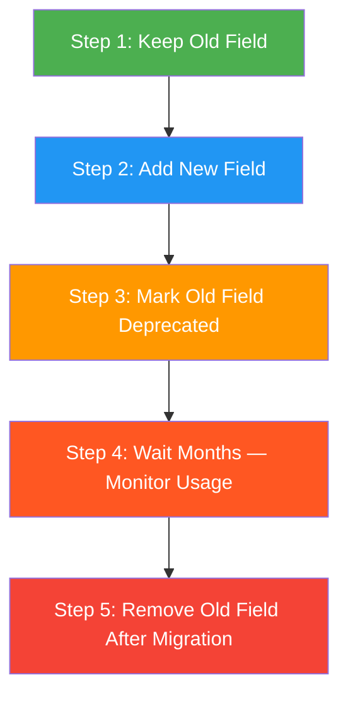
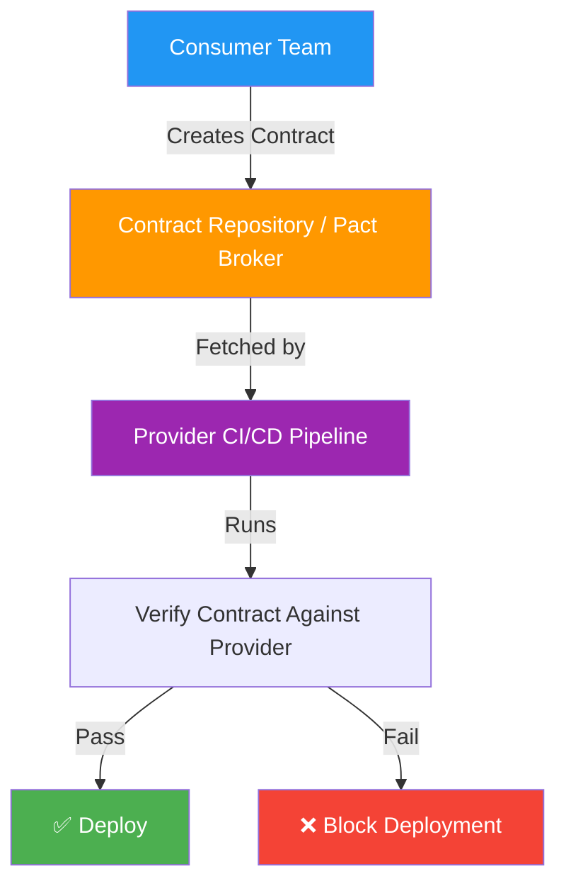
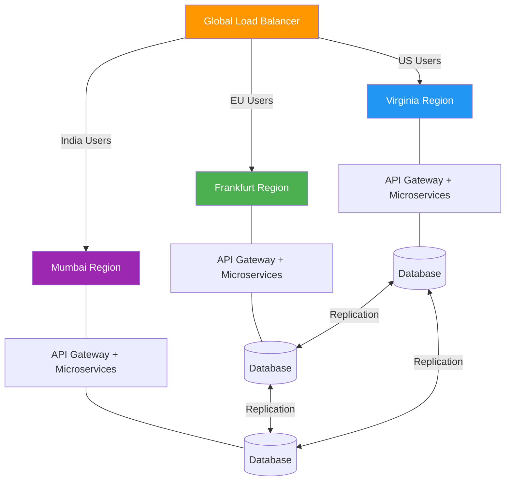
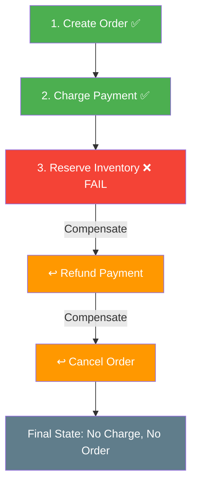
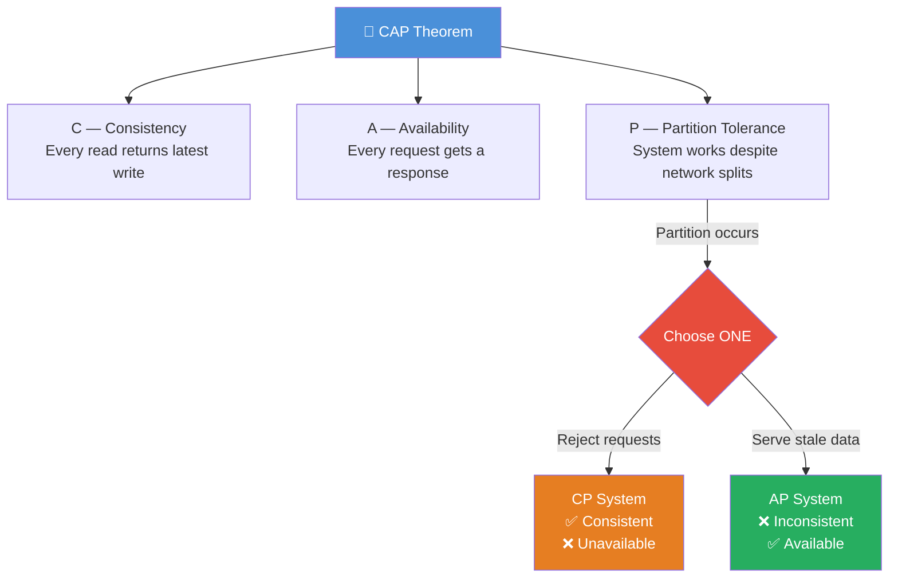
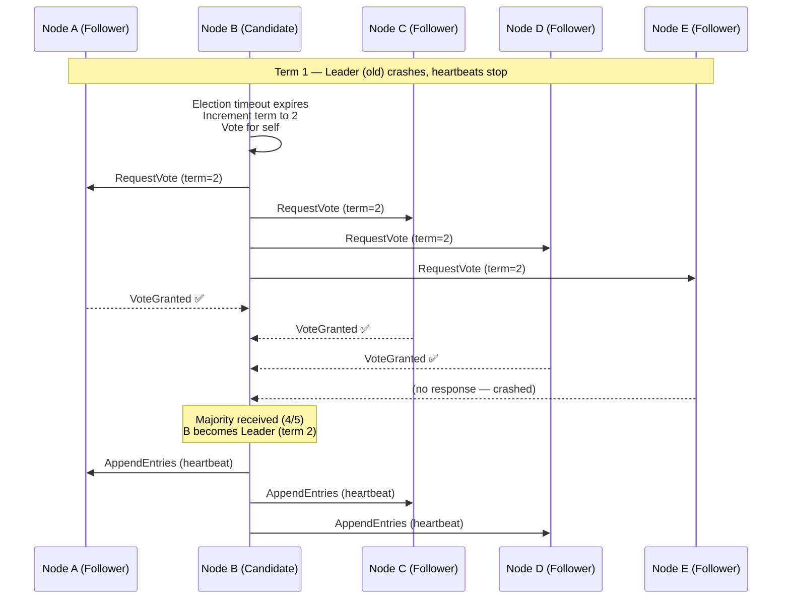
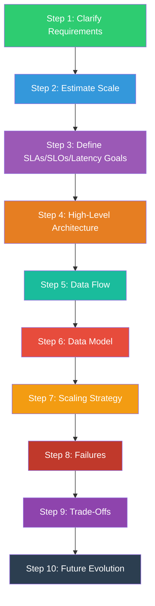

[← Back to Main README](../README.md) | [Previous: Senior Design Guide](07-SENIOR-DESIGN-GUIDE.md)

# Phase 7 — Expert-Level API & Distributed System Design

---

## Quick Reference Card

| Module | Topic | Key Concepts |
|--------|-------|-------------|
| 7.1 | API Evolution & Backward Compatibility | Breaking vs non-breaking changes, Postel's Law, deprecation strategy, schema evolution |
| 7.2 | Consumer-Driven Contracts (CDC) & Pact | CDC flow, Pact framework, provider verification, CI/CD contract gates |
| 7.3 | Multi-Region APIs & Global Architecture | Geo DNS, active-active vs active-passive, replication lag, RTO/RPO |
| 7.4 | Latency Budgets, SLI, SLO, SLA & Error Budgets | P50/P95/P99, tail latency, burn rate, reliability hierarchy |
| 7.5 | Distributed Transactions (2PC vs Saga vs Outbox) | 2PC, Saga (choreography vs orchestration), Outbox/Inbox patterns, idempotency |
| 7.6 | API Abuse Prevention & Production Incidents | DDoS, retry storms, cache stampedes, thundering herd, credential stuffing |
| 7.7 | Consensus & Coordination (Paxos, Raft, ZAB) | Leader election, distributed consensus, split-brain prevention |
| 7.8 | API Observability & Distributed Tracing | OpenTelemetry, trace propagation, correlation IDs, structured logging |
| 7.9 | Chaos Engineering & Resilience Testing | Fault injection, GameDay exercises, steady-state hypothesis |
| 7.10 | Platform Thinking & API Governance | API standards, developer portals, internal platforms, governance at scale |

---

## Table of Contents

### Part 1 — Modules 7.1–7.5 *(this document)*

- [7.1 — API Evolution & Backward Compatibility](#phase-71--api-evolution--backward-compatibility)
  - [1. The Biggest Myth in Software](#1-the-biggest-myth-in-software)
  - [2. APIs Are Contracts](#2-apis-are-contracts)
  - [3. Backward Compatibility](#3-backward-compatibility)
  - [4. Forward Compatibility](#4-forward-compatibility)
  - [5. Safe Changes (Usually Non-Breaking)](#5-safe-changes-usually-non-breaking)
  - [6. Dangerous Changes (Breaking)](#6-dangerous-changes-breaking)
  - [7. Postel's Law](#7-postels-law)
  - [8. The Evolution Ladder](#8-the-evolution-ladder)
  - [9. Deprecation](#9-deprecation)
  - [10. Versioning](#10-versioning)
  - [11. Real Skillsoft Example](#11-real-skillsoft-example)
  - [12. Schema Evolution](#12-schema-evolution)
  - [13. Contract Testing](#13-contract-testing)
  - [14. Consumer-Driven Contracts (Preview)](#14-consumer-driven-contracts-preview)
  - [Senior Engineer Rulebook](#senior-engineer-rulebook)
  - [Expert Mental Model](#expert-mental-model)
- [7.2 — Consumer-Driven Contracts (CDC) & Pact](#phase-72--consumer-driven-contracts-cdc--pact-zero--hero)
  - [1. The Traditional Problem](#1-the-traditional-problem)
  - [2. Traditional Testing Gap](#2-traditional-testing-gap)
  - [3. What Is a Contract?](#3-what-is-a-contract)
  - [4. Consumer-Driven Contract](#4-consumer-driven-contract)
  - [5. Why Consumer-Driven?](#5-why-consumer-driven)
  - [6. Contract Testing Flow](#6-contract-testing-flow)
  - [7. Simple Architecture](#7-simple-architecture)
  - [8. Pact](#8-pact)
  - [9. Example Contract](#9-example-contract)
  - [10. Consumer Test](#10-consumer-test)
  - [11. CI/CD Integration](#11-cicd-integration)
  - [12. Why Large Companies Love CDC](#12-why-large-companies-love-cdc)
  - [13. Consumer vs Provider Responsibilities](#13-consumer-vs-provider-responsibilities)
  - [14. Safe API Evolution with CDC](#14-safe-api-evolution-with-cdc)
  - [15. CDC vs End-to-End Tests](#15-cdc-vs-end-to-end-tests)
  - [16. CDC vs OpenAPI](#16-cdc-vs-openapi)
  - [17. Real Example — Mobile App](#17-real-example--mobile-app)
  - [18. Real Example — Kafka Events](#18-real-example--kafka-events)
  - [19. The Staff Engineer Mental Model](#19-the-staff-engineer-mental-model)
  - [Consumer-Driven Contract Cheat Sheet](#consumer-driven-contract-cheat-sheet)
- [7.3 — Multi-Region APIs & Global Architecture](#phase-73--multi-region-apis--global-architecture-zero--hero)
  - [1. Why One Region Is Not Enough](#1-why-one-region-is-not-enough)
  - [2. The Latency Problem](#2-the-latency-problem)
  - [3. Global Users Need Global Infrastructure](#3-global-users-need-global-infrastructure)
  - [4. What Is a Region?](#4-what-is-a-region)
  - [5. Global API Architecture](#5-global-api-architecture)
  - [6. Geo DNS](#6-geo-dns)
  - [7. Global Load Balancer](#7-global-load-balancer)
  - [8. Disaster Recovery](#8-disaster-recovery)
  - [9. Active-Passive Architecture](#9-active-passive-architecture)
  - [10. Active-Active Architecture](#10-active-active-architecture)
  - [11. The Data Problem](#11-the-data-problem)
  - [12. Replication](#12-replication)
  - [13. Replication Lag](#13-replication-lag)
  - [14. CAP Thinking Appears](#14-cap-thinking-appears)
  - [15. Read Replicas](#15-read-replicas)
  - [16. Multi-Master](#16-multi-master)
  - [17. Netflix Example](#17-netflix-example)
  - [18. Amazon Example](#18-amazon-example)
  - [19. RTO and RPO](#19-rto-and-rpo)
  - [20. Global Architecture Example](#20-global-architecture-example)
  - [Active-Passive vs Active-Active](#active-passive-vs-active-active)
  - [Multi-Region Cheat Sheet](#multi-region-cheat-sheet)
- [7.4 — Latency Budgets, SLI, SLO, SLA & Error Budgets](#phase-74--latency-budgets-sli-slo-sla--error-budgets)
  - [1. Why This Topic Exists](#1-why-this-topic-exists)
  - [2. The Reliability Ladder](#2-the-reliability-ladder)
  - [3. What is an SLI?](#3-what-is-an-sli)
  - [4. What is an SLO?](#4-what-is-an-slo)
  - [5. What is an SLA?](#5-what-is-an-sla)
  - [6. The Most Misunderstood Thing](#6-the-most-misunderstood-thing)
  - [7. Latency](#7-latency)
  - [8. Why Average Latency Lies](#8-why-average-latency-lies)
  - [9. P50](#9-p50)
  - [10. P95](#10-p95)
  - [11. P99](#11-p99)
  - [12. Tail Latency](#12-tail-latency)
  - [13. Latency Budget](#13-latency-budget)
  - [14. Why Latency Budgets Matter](#14-why-latency-budgets-matter)
  - [15. Error Budgets](#15-error-budgets)
  - [16. Why Error Budgets Are Powerful](#16-why-error-budgets-are-powerful)
  - [17. Burn Rate](#17-burn-rate)
  - [18. Netflix Example](#18-netflix-example-1)
  - [19. Amazon Example](#19-amazon-example-1)
  - [20. Staff Engineer Mental Model](#20-staff-engineer-mental-model)
  - [Reliability Cheat Sheet](#reliability-cheat-sheet)
- [7.5 — Distributed Transactions (2PC vs Saga vs Outbox)](#phase-75--distributed-transactions-2pc-vs-saga-vs-outbox)
  - [1. The Problem](#1-the-problem)
  - [2. Amazon Example](#2-amazon-example)
  - [3. Why We Can't Use Normal Transactions](#3-why-we-cant-use-normal-transactions)
  - [4. The Dream Solution](#4-the-dream-solution)
  - [5. Two-Phase Commit (2PC)](#5-two-phase-commit-2pc)
  - [6. 2PC Prepare Phase](#6-2pc-prepare-phase)
  - [7. 2PC Commit Phase](#7-2pc-commit-phase)
  - [8. Why 2PC Sounds Great](#8-why-2pc-sounds-great)
  - [9. Why 2PC Is Rare Today](#9-why-2pc-is-rare-today)
  - [10. Modern Solution: Saga Pattern](#10-modern-solution-saga-pattern)
  - [11. Saga Concept](#11-saga-concept)
  - [12. Amazon Saga Example](#12-amazon-saga-example)
  - [13. Saga Flow](#13-saga-flow)
  - [14. Why Sagas Scale Better](#14-why-sagas-scale-better)
  - [15. Choreography Saga](#15-choreography-saga)
  - [16. Choreography Pros & Cons](#16-choreography-pros--cons)
  - [17. Orchestration Saga](#17-orchestration-saga)
  - [18. Choreography vs Orchestration](#18-choreography-vs-orchestration)
  - [19. The Outbox Problem Revisited](#19-the-outbox-problem-revisited)
  - [20. Outbox Pattern](#20-outbox-pattern)
  - [21. Inbox Pattern](#21-inbox-pattern)
  - [22. Payment System Example](#22-payment-system-example)
  - [23. What Large Companies Use](#23-what-large-companies-use)
  - [24. Staff Engineer Mental Model](#24-staff-engineer-mental-model)
  - [Decision Framework](#decision-framework)
  - [Distributed Transactions Cheat Sheet](#distributed-transactions-cheat-sheet)

### Part 2 — Modules 7.6–7.10 *(to be appended)*

- 7.6 — API Abuse Prevention & Production Incidents
- 7.7 — Consensus & Coordination (Paxos, Raft, ZAB)
- 7.8 — API Observability & Distributed Tracing
- 7.9 — Chaos Engineering & Resilience Testing
- 7.10 — Platform Thinking & API Governance

---

Welcome to the beginning of the Expert Layer.
Up to now you've learned:

```
How APIs work
How microservices communicate
How events flow
How systems scale
How systems remain reliable
```

Phase 7 answers a different question:

> "How do systems survive for 5–10 years while hundreds of teams continuously change them?"

This is where Staff/Principal engineers spend a lot of their time.

---

## Phase 7.1 — API Evolution & Backward Compatibility

This is arguably the most important topic in the entire Expert Phase.
Because the hardest part of software isn't:

```
Building V1
```

It's:

```
Changing V1
without breaking everyone.
```

### 1. The Biggest Myth in Software

Junior Engineer thinking:

```
Need new field?
Just change API.
```

Reality:
Imagine you own:

```http
GET /users/123
```

Used by:

```
Mobile App
Web App
Partner Integrations
Internal Tools
Analytics Pipelines
```

Maybe:

```
100+ consumers
```

depend on it.

Now you rename:

```json
{
  "username": "irfan"
}
```

to

```json
{
  "user_name": "irfan"
}
```

Seems tiny.
But suddenly:

```
Mobile crashes
Partner integration fails
Reports break
Support tickets appear
```

One field changed.
Many systems break.

### 2. APIs Are Contracts

The most important mindset shift.
Think:

```
API = Legal Contract
```

When you publish:

```http
GET /users/{id}
```

you are promising:

```
URL
Fields
Types
Behaviour
Status Codes
```

Consumers trust that contract.

Changing it carelessly is like:

```
Changing a signed agreement.
```

### 3. Backward Compatibility

Definition:

```
Old clients continue working
with new server versions.
```

**Example**

Old client expects:

```json
{
  "id": 1,
  "name": "Irfan"
}
```

New server returns:

```json
{
  "id": 1,
  "name": "Irfan",
  "email": "x@y.com"
}
```

Old client still works.
Perfect.
This is a backward-compatible change.

### 4. Forward Compatibility

Opposite direction.
Definition:

```
New clients can still work
with old servers.
```

Not always required.
But important in some systems.
Especially:

```
Kafka
Protobuf
Schema Registry
```

environments.

### 5. Safe Changes (Usually Non-Breaking)

These are your friends.

**Add Optional Fields**

Before:

```json
{
  "id": 1,
  "name": "Irfan"
}
```

After:

```json
{
  "id": 1,
  "name": "Irfan",
  "email": "x@y.com"
}
```

Safe. Existing clients ignore unknown fields.

**Add New Endpoints**

Before:

```
/users
```

After:

```
/users
/user-preferences
```

Safe. Old endpoint still exists.

**Add Optional Query Parameters**

Safe:

```http
GET /courses?category=backend
```

while old calls still work.

### 6. Dangerous Changes (Breaking)

These are the ones that wake engineers up at 2:00 AM.

**Remove Field**

Before:

```json
{
  "name": "Irfan"
}
```

After:

```json
{}
```

Client breaks.

**Rename Field**

Before:

```json
{ "username": "irfan" }
```

After:

```json
{ "user_name": "irfan" }
```

Breaking.

**Change Type**

Before:

```json
{ "id": "123" }
```

After:

```json
{ "id": 123 }
```

Also breaking.

**Change Meaning**

Most dangerous.
Before:

```
ACTIVE
```

means:

```
User can log in
```

After:

```
ACTIVE
```

means:

```
Subscription active
```

Same value.
Different meaning.
Huge bug potential.

### 7. Postel's Law

One of the most valuable API design principles.
Remember:

```
Be conservative in what you send.
Be liberal in what you accept.
```

A common interpretation in APIs is:
Server:

```
Send stable predictable data.
```

Client:

```
Ignore unknown fields.
```

This dramatically reduces breakage.

### 8. The Evolution Ladder

When adding a feature:

**Bad:**

```
Remove old thing
Add new thing
```

**Better:**

**Step 1**

```
Keep old field
```

**Step 2**

```
Add new field
```

**Step 3**

```
Mark old field deprecated
```

**Step 4**

```
Wait months
```

**Step 5**

```
Remove old field
```

after migration.



### 9. Deprecation

Important Staff-level concept.
Deprecation means:

```
Still supported
But scheduled for removal
```

Example:

```json
{
  "username": "irfan",    // deprecated
  "displayName": "Irfan"
}
```

Consumers migrate gradually.
No emergency.

### 10. Versioning

Sometimes compatibility isn't enough.
You need:

```
Breaking changes.
```

Then version.

Common approach:

```
/v1/users
/v2/users
```

Architecture:

```
Client A   |   V
v1

Client B   |   V
v2
```

Both run temporarily.

**Problem With Versioning**

Many teams believe:

```
Version everything.
```

Bad idea.

Soon:

```
v1
v2
v3
v4
v5
```

Need maintenance.
Huge cost.

Expert rule:

```
Use additive changes first.
Version only when necessary.
```

### 11. Real Skillsoft Example

I found an internal architecture note titled Ensuring API Backward Compatibility that specifically discusses checking compatibility between old and new Swagger specifications and using contract testing frameworks such as Pact.

This is exactly what mature organisations do:

```
New API Change
    ↓
Compatibility Check
    ↓
Contract Tests
    ↓
Deployment
```

### 12. Schema Evolution

Huge concept.
Especially for:

```
Kafka
Protobuf
Avro
gRPC
```

Suppose:

**Version 1**

```protobuf
message User {
  string name = 1;
}
```

**Version 2**

```protobuf
message User {
  string name = 1;
  string email = 2;
}
```

Safe.

Why?
Old consumers ignore:

```
email
```

This is schema evolution. A similar concept is described in Designing Data-Intensive Applications, where field tags are preserved and new fields are added safely.

### 13. Contract Testing

New API deployed.
Question:

```
Will consumers still work?
```

Traditional testing:

```
Provider tests itself.
```

Problem:
Consumer expectations unknown.

Solution:
**Contract Testing**

Consumer says:

```
I expect this response.
```

Provider must satisfy it.

Internal architecture guidance explicitly references Pact-style contract testing for compatibility validation.

### 14. Consumer-Driven Contracts (Preview)

This becomes our next main topic.
Idea:

```
Consumers define expectations.
Providers verify them automatically.
```

Instead of:

```
Provider guessing.
```

### Senior Engineer Rulebook

Whenever changing an API:
Ask:

```
Can I add instead of change?
Can I deprecate instead of remove?
Can I preserve behaviour?
Can old clients still work?
Can I contract-test it?
```

### Expert Mental Model

Junior Engineer:

```
Build API.
```

Senior Engineer:

```
Build API.
```

Staff Engineer:

```
Design API
so it can evolve safely
for the next 5 years.
```

### Phase 7.1 Progress

Completed:

```
✅ API Evolution
✅ Backward Compatibility
✅ Forward Compatibility
✅ Breaking vs Non-Breaking Changes
✅ Deprecation Strategy
✅ Versioning Strategy
✅ Schema Evolution
✅ Contract Testing (Introduction)
```

### Next Lesson

The natural next topic is:
**Consumer Driven Contracts (Pact) — Zero → Hero**

Where we'll answer:

```
Who owns the contract?
How do hundreds of teams deploy independently?
How does Netflix avoid team-to-team breakages?
How do CI/CD pipelines detect API breaks automatically?
```

This is one of the defining skills of Staff-level API architecture. 🚀

---

We now move to one of the most Staff/Principal-level topics in API and distributed-system design.

## Phase 7.2 — Consumer-Driven Contracts (CDC) & Pact (Zero → Hero)

This topic solves a very painful problem:

```
Team A owns User Service
Team B owns Mobile App
Team C owns Recommendations
Team D owns Reporting
```

Question:

```
How does Team A safely deploy changes
without breaking Teams B, C and D?
```

At small scale:

```
Talk to everyone.
```

At large scale:

```
Impossible.
```

This is why Consumer-Driven Contracts were invented.

### 1. The Traditional Problem

Imagine User Service.
Response:

```json
{
  "id": 123,
  "name": "Irfan"
}
```

Mobile App expects:

```json
{
  "id": 123,
  "name": "Irfan"
}
```

Everything works.

Now User Service team deploys:

```json
{
  "id": 123,
  "fullName": "Irfan"
}
```

and removes:

```json
name
```

Backend tests pass.
User Service is happy.

Mobile App crashes.

Why?
Because provider tested itself.
Not consumers.

### 2. Traditional Testing Gap

Most teams do:

```
Unit Tests
Integration Tests
API Tests
```

Question:

```
Do those tests know
what mobile app expects?
```

Usually:

```
NO
```

That's the problem.

### 3. What Is a Contract?

Think:

```
Agreement
```

between:

```
Provider
and
Consumer
```

Example:
Provider promises:

```json
{
  "id": "number",
  "name": "string"
}
```

Consumer depends on:

```
id
name
```

That agreement is:
**Contract**

### 4. Consumer-Driven Contract

Traditional thinking:

```
Provider defines API.
```

CDC thinking:

```
Consumer defines expectations.
```

This is a huge shift.

Instead of provider saying:

```
Here is my API.
```

Consumer says:

```
These are the fields
I absolutely require.
```

### 5. Why Consumer-Driven?

Because consumers know:

```
What they actually use.
```

Example response:

```json
{
  "id": 123,
  "name": "Irfan",
  "email": "x@y.com",
  "country": "India",
  "timezone": "IST"
}
```

Mobile app only uses:

```
id
name
```

Removing:

```
email
```

is harmless.

Removing:

```
name
```

breaks mobile.

Only consumer truly knows this.

### 6. Contract Testing Flow

Consumer creates contract.
Example:

```
GET /user/123
must return:
  id
  name
```

Stored as contract file.

Provider CI pipeline executes:

```
Verify Contract
```

before deployment.

If contract fails:

```
Deployment blocked.
```

Amazing safety net.

### 7. Simple Architecture

```
Consumer
    |
Creates Contract
    |
    V
Contract Repository
    |
    V
Provider CI/CD
    |
Verify Contract
    |
Pass / Fail
```



### 8. Pact

The most famous CDC framework.
Think:

```
JUnit
for API contracts
```

Pact helps:

```
Generate contracts
Store contracts
Verify contracts
Integrate with CI/CD
```

Widely used.

### 9. Example Contract

Consumer says:

```json
{
  "request": {
      "method": "GET",
      "path": "/users/123"
  },
  "response": {
      "status": 200,
      "body": {
         "id": 123,
         "name": "Irfan"
      }
  }
}
```

Meaning:

```
I expect:
  status 200
  id
  name
```

Provider must satisfy this.

### 10. Consumer Test

Mobile Team writes:

```
Get User
Expect name field.
```

Contract generated.

Provider automatically verifies.

No meetings required.

### 11. CI/CD Integration

Real-world flow:

Developer changes API.

```
user.name
    ↓
user.fullName
```

CI runs:

```
Contract Verification
```

Result:

```
FAILED
```

Because mobile depends on:

```
name
```

Breaking deploy prevented.

### 12. Why Large Companies Love CDC

Imagine:

```
300 microservices
100 teams
```

Manual communication impossible.

CDC provides:

```
Automatic compatibility checks.
```

Without needing:

```
Emails
Meetings
Spreadsheets
```

### 13. Consumer vs Provider Responsibilities

**Consumer**
Defines:

```
What it expects.
```

Example:

```
Need:
  id
  name
```

**Provider**
Guarantees:

```
Contract still valid.
```

Simple separation.

### 14. Safe API Evolution with CDC

Suppose provider adds:

```json
{
  "email": "..."
}
```

Consumer doesn't care.

Contract still passes.

Safe deployment.

Now provider removes:

```json
{
  "name": "..."
}
```

Contract fails.

Deployment blocked.

Exactly what we want.

### 15. CDC vs End-to-End Tests

Very common interview question.

**End-To-End Tests**
Test:

```
Entire system.
```

Problems:

```
Slow
Fragile
Expensive
```

**Contract Tests**
Test:

```
Agreement only.
```

Benefits:

```
Fast
Focused
Stable
```

Most mature organisations use both.

### 16. CDC vs OpenAPI

Another common confusion.

OpenAPI:

```
Describes API.
```

Consumer-Driven Contracts:

```
Validate expectations.
```

Think:

```
OpenAPI = Blueprint
CDC = Safety Inspector
```

### 17. Real Example — Mobile App

Consumer contract:

```
GET /profile
needs:
  name
  progress
```

Backend engineer removes:

```
progress
```

CI result:

```
Contract Failed
```

Problem caught before production.

### 18. Real Example — Kafka Events

CDC is not only for REST.

Event:

```json
{
  "orderId": 123,
  "amount": 100
}
```

Consumer expects:

```
orderId
```

Producer removes field.

Contract test fails.

Protects event consumers too.

### 19. The Staff Engineer Mental Model

Junior:

```
My service works.
```

Senior:

```
My service works
with today's consumers.
```

Staff Engineer:

```
My service can evolve safely
without coordinating
hundreds of teams.
```

That's exactly what CDC enables.

### Contract Evolution Strategy

When changing APIs:

```
1. Add new fields
2. Keep old fields
3. Deprecate old fields
4. Monitor usage
5. Remove only after contracts pass
```

### Consumer-Driven Contract Cheat Sheet

**OpenAPI**

```
What API looks like.
```

**Contract**

```
The agreement.
```

**CDC**

```
Consumer defines expectations.
```

**Pact**

```
Framework for CDC.
```

**Provider Verification**

```
Provider proves
it satisfies contracts.
```

**Main Benefit**

```
Safe independent deployments.
```

### Phase 7.2 Progress

Completed:

```
✅ API Evolution
✅ Backward Compatibility
✅ Schema Evolution
✅ Versioning Strategy
✅ Contract Testing
✅ Consumer-Driven Contracts (CDC)
✅ Pact
```

### Next Topic (Major Staff-Level Concept)

The natural next step is:
**Multi-Region APIs & Global Architectures**

We'll cover:

```
✅ Why one datacenter is not enough
✅ Active-Active
✅ Active-Passive
✅ Geo-DNS
✅ Global Load Balancers
✅ Data Replication
✅ Consistency vs Availability
✅ Netflix/Amazon-style global APIs
✅ Disaster Recovery
✅ RTO / RPO
```

This is where systems move from:

```
Works
```

to:

```
Works for the entire world.
```

---

## Phase 7.3 — Multi-Region APIs & Global Architecture (Zero → Hero)

Up until now, almost every architecture we've discussed secretly assumed:

```
One Region
One Datacenter
One Cloud Location
```

But what happens when your users are everywhere?

```
India
USA
Europe
Australia
Japan
Brazil
```

Now we need to think globally.

### 1. Why One Region Is Not Enough

Imagine Skillsoft runs only in:

```
US East
```

Datacenter:

```
Virginia
```

User in Hyderabad accesses:

```
api.skillsoft.com
```

Request path:

```
India
  ↓
Undersea Cable
  ↓
US East
  ↓
Response
```

Problems:

```
Higher latency
Region outages
Disaster risk
Poor user experience
```

### 2. The Latency Problem

User in Virginia:

```
20 ms
```

User in Hyderabad:

```
200–300 ms
```

User opens page.
Page needs:

```
10 API calls
```

Suddenly:

```
10 × 250 ms
≈ 2.5 seconds
```

User notices slowness.

### 3. Global Users Need Global Infrastructure

Solution:
Deploy closer to users.

Example:

```
US East
Europe
India
Singapore
```

Architecture:

```
Users
    |
Nearest Region
    |
API
```

Now Indian users go to:

```
Mumbai
```

instead of:

```
Virginia
```

Much faster.

### 4. What Is a Region?

Think:

```
Large Datacenter Area
```

Examples:

```
AWS Mumbai
AWS Virginia
AWS Frankfurt
Azure Central India
Azure East US
```

Each region contains:

```
Servers
Databases
Storage
Networking
```

### 5. Global API Architecture

Instead of:

```
Users
   |
Virginia
```

we use:

```
Users
   |
Global Routing
   |
+----+----+----+
US  EU  India
```

Question:

```
How does user reach nearest region?
```

This leads to:
**Geo Routing**

### 6. Geo DNS

Simple idea:
DNS returns different answers depending on user location.

User in India:

```
api.company.com
```

DNS returns:

```
Mumbai IP
```

User in Germany:

```
api.company.com
```

DNS returns:

```
Frankfurt IP
```

Diagram:

```
India User
      |
DNS
      |
Mumbai

Germany User
      |
DNS
      |
Frankfurt
```

### 7. Global Load Balancer

DNS alone is not enough.
Modern systems often use:

```
Global Load Balancer
```

It considers:

```
Location
Latency
Health
Traffic
```

Example:
If Mumbai fails:

```
Route India users
to Singapore
```

Automatically.

### 8. Disaster Recovery

Huge topic.
Question:

```
What if region dies?
```

And yes—
entire regions do fail.

Possible causes:

```
Power failure
Network outage
Cloud issue
Natural disaster
Operator mistake
```

Need backup plan.

### 9. Active-Passive Architecture

Simplest multi-region design.

Architecture:

```
Primary Region
    ↓
Backup Region
```

Example:

```
Virginia
    ↓
Frankfurt
```

Normal traffic:

```
Virginia
```

Failure:

```
Switch to Frankfurt
```

Diagram:

```
Users
  |
Virginia (Active)
Frankfurt (Passive)
```

**Advantages**

```
Simple
Cheaper
```

**Disadvantages**

```
Backup sits mostly idle
Failover takes time
```

### 10. Active-Active Architecture

More advanced.

Both regions serve traffic.
Example:

```
Virginia
Mumbai
```

Both active.

Architecture:

```
US Users
    ↓
Virginia

India Users
    ↓
Mumbai
```

Benefits:

```
Lower latency
Better utilisation
Regional resilience
```

Challenges:

```
Data consistency
Replication
```



### 11. The Data Problem

Multi-region isn't hard because of servers.
It's hard because of:
**Data**

Imagine:
User changes profile in:

```
Mumbai
```

Another request hits:

```
Virginia
```

Question:

```
Does Virginia have latest data?
```

Now we enter distributed-systems territory.

### 12. Replication

Regions exchange data.

Architecture:

```
Mumbai Database
        |
Replication
        |
Virginia Database
```

Goal:

```
Keep regions synchronized.
```

Question:
Instantly?
Not always.

### 13. Replication Lag

Suppose:

```
Update profile
```

in Mumbai.

Replication takes:

```
2 seconds
```

User immediately accesses:

```
Virginia
```

Still sees old data.

This is:
**Replication Lag**

### 14. CAP Thinking Appears

You've not formally studied CAP yet, but you're now seeing the problem.
Want:

```
Consistency
Availability
Partition Tolerance
```

Global systems constantly trade these.
We'll go deeper later.
For now remember:

```
Global scale = Consistency challenges.
```

### 15. Read Replicas

Common pattern.

One region handles writes.
Many regions handle reads.

Architecture:

```
Primary DB
    ↓
Replicas
  US
  EU
  India
```

Useful for:

```
Heavy read traffic.
```

Examples:

```
Profiles
Courses
Product Catalogs
```

### 16. Multi-Master

Advanced pattern.
Multiple regions can write.

Example:

```
Mumbai writes
Virginia writes
```

simultaneously.

Powerful.
But dangerous.

Question:

```
Same record changed
in two regions?
```

Who wins?
Conflict resolution needed.

### 17. Netflix Example

Users worldwide.
Need:

```
Video Metadata
Recommendations
Playback APIs
```

close to users.

Netflix uses:

```
Global routing
Regional services
Replication
```

to minimise latency.

### 18. Amazon Example

Order APIs.

Need:

```
Regional proximity
Disaster resilience
```

If one region fails:

```
Business continues.
```

That's the goal.

### 19. RTO and RPO

Critical production terms.
Interview favourites.

**RTO**
Recovery Time Objective
Meaning:

```
How fast must system recover?
```

Example:

```
RTO = 15 minutes
```

Region failure.
Must recover within:

```
15 minutes
```

**RPO**
Recovery Point Objective
Meaning:

```
How much data loss acceptable?
```

Example:

```
RPO = 0
```

Lose:

```
Nothing
```

Example:

```
RPO = 5 minutes
```

Can lose up to:

```
5 minutes of data
```

**Banking Example**
Typically:

```
RPO ≈ 0
```

**Analytics Example**
Maybe:

```
RPO = 10 minutes
```

acceptable.

### 20. Global Architecture Example

```
          Global Load Balancer
                    |
     +--------------+--------------+
     |                             |
     V                             V
Mumbai Region             Virginia Region
API Gateway               API Gateway
     |                        |
Microservices            Microservices
     |                        |
Database <----Replication----> Database
```

### Active-Passive vs Active-Active

| Aspect | Active-Passive | Active-Active |
|--------|---------------|---------------|
| Traffic | One serves traffic, one waits | Both serve traffic |
| Pros | Simple | Fast, highly available |
| Cons | Less utilisation | Data consistency harder |
| Best For | Cost-sensitive, simpler workloads | Low-latency, global-scale systems |

### Multi-Region Cheat Sheet

| Concept | Definition |
|---------|-----------|
| **Geo DNS** | Nearest region selection. |
| **Global Load Balancer** | Latency-aware routing. |
| **Replication** | Data copied between regions. |
| **Replication Lag** | Delay before updates appear everywhere. |
| **Active-Passive** | Primary + Backup. |
| **Active-Active** | Multiple active regions. |
| **RTO** | Maximum acceptable recovery time. |
| **RPO** | Maximum acceptable data loss. |

### Phase 7.3 Progress

Completed:

```
✅ API Evolution
✅ Backward Compatibility
✅ Schema Evolution
✅ Consumer-Driven Contracts
✅ Pact
✅ Multi-Region APIs
✅ Active-Passive
✅ Active-Active
✅ Geo Routing
✅ RTO
✅ RPO
```

### Next Lesson (One of the Hardest Topics)

Now we move into:
**Latency Budgets, SLI, SLA, and SLO**

You'll learn:

```
Why 100ms matters
Latency budgeting
P50 / P95 / P99
Tail latency
Error budgets
SLI
SLO
SLA
How Netflix, Google and Microsoft measure reliability
```

This is where architecture becomes engineering science rather than just drawing boxes. 🔥📈

---

You've now reached the point where many engineers stop talking about:

```
APIs
Microservices
Databases
```

and start talking about:

```
User Experience
Reliability
Business Impact
```

This is where Google SRE, Netflix, Amazon, and Microsoft operate.

## Phase 7.4 — Latency Budgets, SLI, SLO, SLA & Error Budgets

Interestingly, I found internal engineering material that discusses:

```
API Latency SLOs
p95 latency targets
Error budgets
Availability targets
```

For example, one architecture document proposes:

```
API Latency: p95 < 300ms
Frontend Availability: 99.9%
```

with explicit SLOs and error-budget calculations.

### 1. Why This Topic Exists

Imagine:

```
Login API
```

works perfectly.

But response time is:

```
8 seconds.
```

Question:

```
Is system healthy?
```

Technically:

```
YES
```

Business answer:

```
NO
```

Users hate it.

This is why reliability engineering focuses on:

```
Availability
Latency
Error Rate
Throughput
```

rather than:

```
"Does code run?"
```

### 2. The Reliability Ladder

Most organizations measure:

```
Metric
   ↓
SLI
   ↓
SLO
   ↓
SLA
```

This hierarchy also appears in internal reliability discussions.

### 3. What is an SLI?

**Service Level Indicator**
Definition:

```
A measured metric.
```

Think:

```
Actual observed reality.
```

Examples:

```
Latency
Availability
Error Rate
Throughput
```

Internal examples explicitly mention:

```
Request latency
Error rate
Throughput
Availability
```

as SLIs.

**Example**

API requests:

```
1000 total
990 successful
10 failed
```

Availability SLI:

```
99%
```

That is merely:

```
Measurement
```

Not a goal.

### 4. What is an SLO?

**Service Level Objective**
Definition:

```
The target
for an SLI.
```

Example:
SLI:

```
Availability
```

Goal:

```
99.9%
```

SLO:

```
Availability >= 99.9%
```

Internal reliability planning documents define SLOs similarly, including availability and latency objectives.

**Example**

SLO:

```
p95 latency < 300ms
```

for a critical API.

### 5. What is an SLA?

**Service Level Agreement**
This is different.

SLA is:

```
Contractual promise.
```

Example:

```
99.9% uptime
```

for a customer-facing service.

Unlike SLO:

```
Lawyers care.
Customers care.
```

Breaking an SLA can mean:

```
Credits
Refunds
Penalties
```

Easy memory trick:

```
SLI = Measurement
SLO = Internal Goal
SLA = External Promise
```

### 6. The Most Misunderstood Thing

Many engineers think:

```
SLA = SLO
```

Wrong.

Example:
Internal target:

```
99.95%
```

Public promise:

```
99.9%
```

Why?
Because you want safety margin.

### 7. Latency

Now let's discuss one of the most important metrics in distributed systems.

Latency means:

```
How long something takes.
```

Example:

```
User clicks Login
    ↓
Response arrives
    ↓
300 ms
```

Latency:

```
300ms
```

### 8. Why Average Latency Lies

Imagine:

```
999 requests = 100ms
1 request = 10 seconds
```

Average looks decent.
But:

```
One user is furious.
```

The average hides pain.

This is why modern systems use:

```
Percentiles
```

rather than averages.

### 9. P50

P50 means:

```
Median
```

Interpretation:

```
50% faster
50% slower
```

Represents:

```
Typical user.
```

**Example**

P50:

```
100ms
```

Means:

```
Half of requests
finish within 100ms.
```

### 10. P95

Most important percentile.

P95 means:

```
95% of requests
finished within this time.
```

Example:

```
P95 = 300ms
```

Meaning:

```
95% of users
≤ 300ms
```

This is why many SLOs use:

```
P95
```

instead of average latency.

### 11. P99

Now things become interesting.

P99:

```
99% of requests
finished within this value.
```

Represents:

```
Worst user experience
excluding extreme outliers.
```

Many performance teams monitor:

```
P50
P95
P99
```

together. Internal monitoring recommendations specifically highlight these percentiles.

### 12. Tail Latency

Interview favourite.

Most users:

```
100ms
```

Some users:

```
10 seconds
```

Those slow requests live in:

```
P95
P99
```

This is:
**Tail Latency**

Tail latency often matters more than averages.

### 13. Latency Budget

One of the most Staff-level concepts.

Suppose:
Goal:

```
Page Load < 500ms
```

Where is the time spent?

Maybe:

```
Network   = 50ms
Gateway   = 20ms
User API  = 100ms
Course API = 150ms
Database  = 100ms
Buffer    = 80ms
```

Total:

```
500ms
```

This breakdown is:
**Latency Budget**

Think:

```
Time Budget
```

for each component.

### 14. Why Latency Budgets Matter

Without budgets:

```
Each team optimises locally.
```

User team says:

```
300ms is fine.
```

Course team says:

```
300ms is fine.
```

Combined:

```
600ms+
```

User experience suffers.

Budgets force coordination.

### 15. Error Budgets

One of Google's greatest ideas.
I found internal documentation explicitly discussing error-budget calculations alongside SLOs.

Example:
SLO:

```
99.9% availability
```

Meaning:

```
0.1% failure allowed
```

That:

```
0.1%
```

is your:
**Error Budget**

**Example**

Requests/month:

```
1,000,000
```

Allowed failures:

```
0.1%
= 1000 failures
```

Budget:

```
1000 failures
```

### 16. Why Error Budgets Are Powerful

Traditional thinking:

```
Zero failures.
```

Impossible.

Google SRE thinking:

```
Accept small controlled failures.
Move faster.
```

If error budget remains:

```
Deploy aggressively.
```

If budget exhausted:

```
Stop shipping features.
Fix reliability.
```

Balance:

```
Innovation
and
Stability
```

### 17. Burn Rate

Important advanced concept.

Question:

```
How fast
are we consuming
our error budget?
```

Example:
Allowed:

```
1000 failures
```

Consumed:

```
800 failures
```

in one day.

Danger.

Burn rate:

```
High.
```

Internal monitoring plans mention SLO burn-rate visualisations and alerts.

### 18. Netflix Example

Imagine:

```
Video Metadata API
```

SLO:

```
P95 < 150ms
```

Monitoring:

```
P50
P95
P99
```

If P99 suddenly increases:

```
Investigate.
```

Before customers complain.

### 19. Amazon Example

Checkout API.

Requirements:

```
Availability > 99.99%
P95 < 200ms
```

If latency rises:

```
Revenue affected.
```

That's why latency becomes a business metric.

### 20. Staff Engineer Mental Model

Junior:

```
API works.
```

Senior:

```
API scales.
```

Staff:

```
API meets its SLOs,
protects error budgets,
and delivers predictable
user experience.
```

### Reliability Cheat Sheet

| Concept | Definition | Example |
|---------|-----------|---------|
| **SLI** | Measurement | Latency, Availability, Error Rate |
| **SLO** | Target | 99.9% availability |
| **SLA** | Customer promise | Contractual uptime guarantee |
| **P50** | Typical user | Median latency |
| **P95** | Almost all users | 95th percentile latency |
| **P99** | Slowest meaningful users | 99th percentile latency |
| **Tail Latency** | Worst part of latency distribution | P95+ outliers |
| **Error Budget** | Allowed failure amount | 0.1% of requests |
| **Burn Rate** | How quickly error budget is consumed | 800/1000 in one day |

### Phase 7.4 Progress

Completed:

```
✅ API Evolution
✅ Backward Compatibility
✅ Consumer Driven Contracts
✅ Multi-Region APIs
✅ Active-Active / Active-Passive
✅ RTO / RPO
✅ SLI
✅ SLO
✅ SLA
✅ Error Budgets
✅ Latency Budgets
✅ P50 / P95 / P99
```

### Next Topic (Extremely Important)

Next we'll tackle:
**Distributed Transactions — 2PC vs Saga vs Outbox**

This is where you'll finally understand:

```
Why payment systems are hard
Why "commit" becomes difficult
Why Uber rides, Amazon orders,
  and banking systems use Sagas
How distributed consistency actually works
```

This is one of the most frequently asked Staff-level system design topics. 🚀

---

## Phase 7.5 — Distributed Transactions (2PC vs Saga vs Outbox)

This topic answers the question:

> "How do you keep multiple services consistent when there is no single database transaction?"

This is the foundation behind:

```
Amazon Orders
Uber Rides
Booking Systems
Payment Systems
Banking Workflows
```

### 1. The Problem

In a monolith with one database:

```sql
BEGIN
  Create Order
  Charge Payment
  Reserve Inventory
COMMIT
```

If anything fails:

```sql
ROLLBACK
```

Everything returns to a safe state.
Easy.

Now imagine microservices:

```
Order Service
Payment Service
Inventory Service
Notification Service
```

Each owns:

```
Its own database.
```

Question:

```
How do you rollback
across four different databases?
```

That's the distributed transaction problem.

### 2. Amazon Example

Customer buys a laptop.
Steps:

```
Create Order
    ↓
Charge Credit Card
    ↓
Reserve Inventory
    ↓
Create Shipment
```

What if:

```
Payment succeeds
Inventory fails
```

Now you have:

```
Customer charged
No inventory
```

Bad.

### 3. Why We Can't Use Normal Transactions

Database transactions work because:

```
One database
```

controls everything.

Microservices:

```
Many databases
Many service owners
Many failure points
```

No single system controls all state.

### 4. The Dream Solution

Engineers originally thought:

```
Let's make
one big transaction
across services.
```

This became:
**Two-Phase Commit (2PC)**

### 5. Two-Phase Commit (2PC)

Idea:

```
Coordinator controls everyone.
```

Participants:

```
Order Service
Payment Service
Inventory Service
```

Coordinator asks:

```
Can you commit?
```

Everyone replies:

```
YES
```

or

```
NO
```

This is:
**Phase 1 — Prepare**

### 6. 2PC Prepare Phase

Coordinator:

```
Payment:
  Can you commit?
Inventory:
  Can you commit?
Order:
  Can you commit?
```

If all say:

```
YES
```

Continue.

Otherwise:

```
Abort.
```

### 7. 2PC Commit Phase

If everyone prepared successfully:
Coordinator sends:

```
COMMIT
```

to everyone.

Diagram:

```
Coordinator
    ↓
Prepare
    ↓
All Yes
    ↓
Commit
```

### 8. Why 2PC Sounds Great

Benefits:

```
Strong consistency
All-or-nothing behaviour
Transaction semantics
```

Looks perfect.

### 9. Why 2PC Is Rare Today

Real-world problems:

**Problem 1**
Coordinator failure.

Example:

```
Participants prepared.
Coordinator dies.
```

Everyone waits.
System can block.

**Problem 2**
Latency.

Every service must wait.

Instead of:

```
Fast local transaction
```

we get:

```
Network round trips
Cross-region waits
Locks
```

**Problem 3**
Scalability.

Large systems hate:

```
Global coordination.
```

This is why most large internet companies avoid 2PC.

### 10. Modern Solution: Saga Pattern

Instead of:

```
One huge transaction
```

use:

```
Many local transactions
```

plus:

```
Compensation.
```

### 11. Saga Concept

Each service commits independently.
If later step fails:

```
Undo previous work.
```

Think:

```
Business rollback
```

instead of

```
Database rollback.
```

### 12. Amazon Saga Example

**Step 1**

```
Create Order
```

Success.

**Step 2**

```
Charge Payment
```

Success.

**Step 3**

```
Reserve Inventory
```

Fails.

**Compensation:**

```
Refund Payment
Cancel Order
```

Final state:

```
No charge.
No order.
```

### 13. Saga Flow

```
Create Order
    ↓
Charge Payment
    ↓
Reserve Inventory
    ↓
Fail
    ↓
Refund Payment
    ↓
Cancel Order
```

Notice:

```
Compensation
not rollback.
```

Very important distinction.



### 14. Why Sagas Scale Better

Each service owns:

```
Its own transaction.
```

No global lock.
No global coordinator controlling databases.

Benefits:

```
Scalable
Cloud friendly
Microservice friendly
```

This is why most modern systems prefer sagas.

### 15. Choreography Saga

First implementation style.

No central controller.
Services react to events.

Flow:

```
OrderCreated
    ↓
Payment Service reacts
    ↓
PaymentSucceeded
    ↓
Inventory Service reacts
    ↓
InventoryFailed
```

Then:

```
Payment Service
issues refund
```

Everything driven by events.

### 16. Choreography Pros & Cons

**Advantages:**

```
Loose coupling
Highly distributed
```

**Problems:**

```
Hard to understand
Complex debugging
Event chains become huge
```

### 17. Orchestration Saga

Introduce:

```
Saga Orchestrator
```

Coordinator knows workflow.

Flow:

```
Orchestrator
    ↓
Create Order
    ↓
Charge Payment
    ↓
Reserve Inventory
```

Failure?

Orchestrator issues:

```
Refund Payment
Cancel Order
```

Much easier to reason about.

### 18. Choreography vs Orchestration

**Choreography**

```
Services talk through events.
```

Think:

```
Jazz musicians
```

improvising.

**Orchestration**

```
One coordinator directs flow.
```

Think:

```
Orchestra conductor.
```

### 19. The Outbox Problem Revisited

We touched this earlier.
Now let's see why it's critical.

Order Service:

```
Save Order
Publish Event
```

Question:
What if:

```
Save Order succeeds
Publish Event fails
```

Now:

```
Order exists
Nobody knows about it
```

Bad.

### 20. Outbox Pattern

Solution:
Within the same DB transaction:

```
Save Order
Save Outbox Event
```

Commit together.

Tables:

```
Orders
Outbox
```

Later:

```
Outbox Publisher
    ↓
Kafka
```

Now event publication becomes reliable.

### 21. Inbox Pattern

A related advanced pattern.

Problem:

```
Message arrives twice.
```

(at-least-once delivery)

Consumer records:

```
Message ID
```

in Inbox table.

Already processed?

```
Ignore.
```

This provides:

```
Idempotency
```

for consumers.

### 22. Payment System Example

Imagine:

```
PaymentCompleted
```

arrives twice.

Without inbox:

```
Charge twice.
```

Catastrophic.

With inbox:

```
Transaction ID seen.
Ignore duplicate.
```

Safe.

### 23. What Large Companies Use

**Banking**
Often:

```
Saga
Outbox
Inbox
Idempotent Commands
```

**Amazon**
Often:

```
Saga
Compensation
Event-Driven Workflows
```

**Uber**
Ride completion:

```
Billing
Receipts
Driver Earnings
Promotions
```

All coordinated through workflow/saga-style processing.

### 24. Staff Engineer Mental Model

Junior:

```
Use transaction.
```

Senior:

```
Need distributed transaction.
```

Staff:

```
Avoid distributed locking.
Prefer local transactions.
Use Saga + Outbox + Idempotency.
```

### Decision Framework

**Use 2PC When**

```
Strong consistency required
Small controlled environment
Limited scale
```

**Use Saga When**

```
Microservices
Cloud systems
Business workflows
Large scale
```

**Always Consider**

```
Outbox
Inbox
Idempotency
Retries
Compensations
```

### Distributed Transactions Cheat Sheet

| Pattern | Description | Trade-off |
|---------|------------|-----------|
| **2PC** | Global transaction | Strong consistency, poor scalability |
| **Saga** | Local transactions + compensations | Highly scalable, eventual consistency |
| **Choreography** | Event-driven workflow | Loose coupling, hard to debug |
| **Orchestration** | Central workflow controller | Easy to reason about, single coordinator |
| **Outbox** | Reliable event publishing | Guaranteed delivery with DB transaction |
| **Inbox** | Duplicate protection | Idempotent consumers |

### Phase 7.5 Progress

Completed:

```
✅ API Evolution
✅ CDC / Pact
✅ Multi-Region APIs
✅ Active-Active / Active-Passive
✅ SLI / SLO / SLA
✅ Error Budgets
✅ Latency Budgets
✅ Distributed Transactions
✅ 2PC
✅ Saga
✅ Outbox
✅ Inbox
✅ Choreography
✅ Orchestration
```

We are now around 80% through Phase 7.

### Next Topic

The next major Staff/Principal-level topic is:

```
API Abuse Prevention & Production Incidents
```

where we'll cover:

```
DDoS attacks
Retry storms
Cache stampedes
Thundering herd problems
Credential stuffing
Rate-limit architecture
Circuit-breaker failures
Real production outage patterns
```

This is where you'll learn how systems fail in the real world—and how elite engineers design systems to survive. 🚀

---

We are now entering the final category of knowledge that separates:

```
Senior Engineer
from
Staff / Principal Engineer
```

Up to now we learned:

```
How systems are built
How systems scale
How systems communicate
```

Now we learn:

```
How systems fail.
```

And more importantly:

```
How elite engineers ensure they survive failures.
```

---

## Phase 7.6 — API Abuse Prevention & Production Incidents

This is where real-world engineering begins.

Most outages are not caused by:

```
Bad algorithms
```

They are caused by:

```
Unexpected traffic
Dependency failures
Retry storms
Cache failures
Human mistakes
```

### 1. The Reliability Mindset

Junior Engineer asks:

```
Will it work?
```

Senior Engineer asks:

```
Will it scale?
```

Staff Engineer asks:

```
How will it fail?
```

and

```
What happens after it fails?
```

### 2. DDoS Attacks

One of the oldest internet problems.

DDoS means: **Distributed Denial of Service**

Goal:

```
Overwhelm system
with traffic.
```

Example:

Normal:

```
10,000 req/sec
```

Attack:

```
2,000,000 req/sec
```

Result:

```
CPU exhausted
Memory exhausted
Network saturated
```

Legitimate users cannot access service.

### 3. DDoS Protection Layers

Typical architecture:

```
Users
  |
CDN
  |
WAF
  |
Load Balancer
  |
API Gateway
  |
Services
```

Each layer absorbs traffic.

Examples:

```
Cloudflare
Azure Front Door
AWS Shield
```

### 4. Credential Stuffing

Very common attack.

Attacker obtains:

```
Millions of leaked passwords.
```

Then attempts:

```
Login
Login
Login
Login
```

across many accounts.

Goal:

```
Account takeover.
```

Protection:

```
Rate limiting
MFA
Bot detection
Account lockouts
```

### 5. API Abuse

Not all abuse is malicious.

Example: Partner integrates poorly.

Bug:

```
Calls API every second.
```

instead of:

```
Every minute.
```

Traffic explodes.

Protection:

```
Quotas
Rate limits
Usage tiers
```

### 6. Rate Limiting Revisited

We learned this earlier. Now let's see production usage.

Example:

```
100 requests/minute
```

per user.

If exceeded:

```http
HTTP 429 Too Many Requests
```

Benefits:

```
Fairness
Abuse prevention
Protection
```

### 7. Retry Storm

One of the most famous outage patterns.

Imagine:

```
Database becomes slow.
```

Service tries:

```
Retry.
```

Thousands of services retry.

Traffic multiplies.

Example:

```
Original traffic: 10,000 req/sec
Retries:          50,000 req/sec
```

Database now fails harder.

This creates: **Retry Storm**

### 8. Why Retry Storms Are Dangerous

Normally:

```
Slow database
```

might recover.

Retries create:

```
Feedback loop
```

More retries → More load → More failures → More retries

Result:

```
Total collapse.
```

### 9. Retry Storm Protection

Always use:

```
Exponential Backoff
Jitter
Circuit Breakers
```

Instead of:

```
Retry immediately.
```

Add randomness:

```
1 sec
2 sec
4 sec
8 sec
```

This spreads load.

### 10. Cache Stampede

Extremely common.

Suppose cache entry expires.

Popular product:

```
iPhone
```

Cache key:

```
product:iphone
```

At expiry:

```
100,000 users
```

request page.

Cache misses.

Every request hits database.

Database suddenly receives:

```
100,000 requests.
```

Database may crash.

This is: **Cache Stampede**

### 11. Cache Stampede Solution

Common techniques:

**Request Coalescing** — First request: Refresh cache. Everyone else waits. Only one DB query.

**Early Refresh** — Refresh cache before expiry.

**Stale-While-Revalidate** — Serve cached data. Refresh in background. Very common pattern.

### 12. Thundering Herd

Closely related.

Imagine:

```
500 servers
```

waiting for:

```
Database
```

Database recovers.

All 500 reconnect simultaneously.

Traffic spike.

Database crashes again.

This is: **Thundering Herd**

### 13. Prevention

Use:

```
Random delays
Jitter
Gradual recovery
```

Instead of:

```
Everyone reconnect immediately.
```

### 14. Circuit Breaker Failure

Remember circuit breakers?

Traffic:

```
Service A
    ↓
Service B
```

Service B unhealthy.

Circuit opens. Good.

Problem: When service recovers:

```
Millions of requests
```

rush back.

Possible second outage.

Need:

```
Half-open mode
Gradual testing
```

before full traffic returns.

### 15. Resource Exhaustion

Most outages eventually become:

```
CPU
Memory
Threads
Connections
Disk
Network
```

exhaustion.

Example:

```
Connection Pool
Size = 100
```

Requests:

```
500 active
```

400 wait. Latency rises.

System appears "slow".

### 16. Bulkhead Pattern Revisited

Suppose:

```
Recommendations fail.
```

Should:

```
Payments fail?
```

No.

Separate:

```
Connection Pools
Thread Pools
Queues
```

for critical systems.

Then one failure remains isolated.

### 17. Cascading Failure

Most dangerous failure type.

Initial problem:

```
Search Service slow.
```

Service A waits. Service B waits. Threads exhausted. Queues fill. More services slow.

Soon:

```
Entire platform failing.
```

Single issue. Massive impact.


### 18. Preventing Cascading Failures

Tools we've already learned:

```
Timeouts
Circuit Breakers
Backpressure
Load Shedding
Bulkheads
```

This is why we learned those topics.

### 19. Chaos Engineering

Very advanced concept. Popularised by Netflix.

Question:

```
What if server dies?
```

Don't guess. Test it.

Netflix created:

```
Chaos Monkey
```

Tool randomly kills servers.

If system survives:

```
Architecture is resilient.
```

If not:

```
Fix design.
```

### 20. Incident Response

When outage happens, elite teams focus on:

```
Mitigation first
Root cause later
```

Wrong approach:

```
Need perfect explanation.
```

while users suffer.

Correct:

```
Restore service
Reduce impact
Then investigate
```

### 21. Postmortems

After incident, document:

```
What happened?
Why?
Impact?
Detection?
Resolution?
Prevention?
```

Important:

```
Blameless culture.
```

Focus on:

```
Systems
```

not

```
People.
```

### Real-World Failure Patterns

**Amazon** — Retry Storms during dependency issues.

**Netflix** — Chaos Engineering to prevent surprises.

**Large Social Platforms** — Cache Stampedes, Thundering Herds during traffic spikes.

**Banking Platforms** — Strict rate limits, Circuit breakers, Bulkheads for critical flows.

### Production Incident Cheat Sheet

| Incident | Description |
|----------|-------------|
| **DDoS** | Too much traffic |
| **Credential Stuffing** | Mass login attempts |
| **Retry Storm** | Retries amplify outage |
| **Cache Stampede** | Expired cache overwhelms DB |
| **Thundering Herd** | Everyone retries simultaneously |
| **Cascading Failure** | One failure spreads everywhere |
| **Chaos Engineering** | Break things intentionally |
| **Postmortem** | Learn from incidents |

### Phase 7.6 Progress

Completed:

```
✅ API Evolution
✅ Backward Compatibility
✅ Consumer Driven Contracts
✅ Multi-Region APIs
✅ SLI / SLO / SLA
✅ Error Budgets
✅ Latency Budgets
✅ Distributed Transactions
✅ Saga
✅ Outbox
✅ Abuse Prevention
✅ Production Incidents
✅ Retry Storms
✅ Cache Stampedes
✅ Thundering Herds
✅ Cascading Failures
✅ Chaos Engineering
```

---

## Phase 7.7 — CAP Theorem & Consistency Models (Zero → Hero)

You have already seen pieces of this topic when we talked about:

```
Multi-Region Systems
Active-Active
Replication
Distributed Transactions
Saga
Network Partitions
```

Now we connect everything together.

### 1. The Distributed Systems Dream

Every company wants:

```
Always Correct
Always Available
Never Fails
```

Sounds great.

Imagine:

```
Mumbai
Virginia
Frankfurt
```

all serving traffic. Users can:

```
Read
Write
Update
```

from anywhere.

Requirement:

```
Latest data
100% uptime
Survive network failures
```

Question:

```
Can we have all three?
```

CAP says:

```
No.
```

### 2. What CAP Stands For

CAP:

```
C = Consistency
A = Availability
P = Partition Tolerance
```



### 3. Consistency (C)

Meaning:

```
Every user sees
the latest write.
```

Example: User updates profile:

```
Name = Irfan
```

Immediately after:

```
Any region
Any server
Any database replica
```

returns:

```
Irfan
```

No stale data. Strong consistency.

### 4. Availability (A)

Meaning:

```
Every request
gets a response.
```

Even during failures.

User queries:

```http
GET /profile
```

System always responds. Maybe old data. But responds.

### 5. Partition Tolerance (P)

Most important part. Partition means:

```
Network communication fails.
```

Example:

```
Mumbai ❌ Cannot reach ❌ Virginia
```

The regions are alive. Network is broken. This is a **network partition**.

### 6. The Key Insight

Many beginners think:

```
Choose any 2 of 3.
```

Modern interpretation:

```
Partitions will happen.
```

You don't get to choose P. When the network breaks, you must choose between:

```
Consistency
or
Availability
```

### 7. The Banking Example

Imagine:

```
Account Balance = ₹1000
```

Mumbai updates:

```
Balance = ₹500
```

Network partition occurs. Virginia still has:

```
Balance = ₹1000
```

Now a customer reads balance from Virginia.

What should happen?

**Option 1 — Consistency**

System says:

```
I don't know
which balance is correct.
```

Reject request.

User gets:

```
Error
Timeout
Try Later
```

Correctness preserved. Availability lost.

This is: **CP** — Consistency + Partition Tolerance

### 8. Option 2 — Availability

Virginia responds:

```
₹1000
```

Even though it's stale.

Availability preserved. Consistency lost.

This is: **AP** — Availability + Partition Tolerance

### 9. CP Systems

Choose:

```
Correctness first.
```

Examples often include:

```
Banking
Payments
Ledgers
Inventory
```

Rule:

```
Better to reject request
than return wrong data.
```

### 10. AP Systems

Choose:

```
Availability first.
```

Examples:

```
Social Feeds
Likes
Analytics
Recommendations
```

Rule:

```
Better to show slightly old data
than fail entirely.
```

**Instagram Analogy** — Imagine Like Count shows 1200 instead of 1201 for two seconds. Nobody cares. Showing an error? Users care. AP makes sense.

### 11. The Biggest Interview Mistake

Wrong answer:

```
CAP = pick any two.
```

Better answer:

```
Network partitions are inevitable.
During a partition,
you must choose consistency or availability.
```

### 12. Eventual Consistency

Now we reach one of the most important concepts.

Definition:

```
Data may be temporarily inconsistent,
but eventually converges.
```

Example:

```
Mumbai = 500
Virginia = 1000
```

A few seconds later:

```
Both = 500
```

Eventually:

```
All replicas agree.
```

### 13. Strong Consistency vs Eventual Consistency

| Property | Strong Consistency | Eventual Consistency |
|----------|-------------------|---------------------|
| **Value** | Always latest value | Maybe stale, eventually correct |
| **Pros** | Simple reasoning, correct data | Fast, highly available |
| **Cons** | Higher latency, lower availability | Temporary inconsistency |

### 14. Read-Your-Writes Consistency

A practical middle ground.

User updates:

```
Profile Name
```

Immediately refreshes page.

Expectation:

```
See own update.
```

Even if other users still see old data.

Very common product requirement.

### 15. Monotonic Reads

Another useful model.

If user sees:

```
Version 5
```

They should never later see:

```
Version 4
```

Even if replication is delayed.

### 16. Quorum Reads & Writes

Used by many distributed databases. Concept:

```
3 replicas
```

Write:

```
Need 2 acknowledgements
```

Read:

```
Need 2 replicas
```

Helps balance:

```
Consistency
Availability
```

Common in highly distributed databases.

### 17. Real-World Design Choices

**Amazon Checkout** — Typically CP-ish behaviour because charging the wrong amount is unacceptable.

**Netflix Recommendations** — Often AP-ish behaviour because a slight recommendation delay is acceptable.

**Banking Ledger** — Strong consistency preferred.

**Social Feeds** — Eventual consistency commonly acceptable.

### 18. CAP vs Reality

Interesting fact: CAP is historically influential, but modern distributed-system experts often consider it a simplified model. Real systems involve many more trade-offs than the theorem describes.

### 19. The Staff Engineer Mental Model

Junior:

```
Database stores data.
```

Senior:

```
Database replicates data.
```

Staff:

```
What consistency guarantee
does the business actually need?
```

Because:

```
Payments
≠ Recommendations
≠ Analytics
≠ User Preferences
```

Each may choose a different consistency model.

### CAP Cheat Sheet

| Concept | Description |
|---------|-------------|
| **Consistency** | Latest data always visible |
| **Availability** | Always return a response |
| **Partition Tolerance** | Survive network failures |
| **CP** | Correctness over uptime |
| **AP** | Uptime over immediate correctness |
| **Strong Consistency** | Always latest value |
| **Eventual Consistency** | Maybe stale now, correct later |
| **Read-Your-Writes** | You always see your own updates |
| **Quorum** | Majority agreement |

### Phase 7.7 Progress

Completed:

```
✅ API Evolution
✅ CDC / Pact
✅ Multi-Region APIs
✅ SLI / SLO / SLA
✅ Error Budgets
✅ Distributed Transactions
✅ Saga Patterns
✅ Production Failures
✅ CAP Theorem
✅ Eventual Consistency
✅ Consistency Models
✅ Quorum Concepts
```

### Next Topic (Final Major Expert Topic)

Now we should move to: **Consensus, Raft, Paxos & Leader Election**

This is the topic behind:

```
Kafka Leaders
ZooKeeper
etcd
Kubernetes
MongoDB Elections
Distributed Locks
```

and answers the hardest question in distributed systems:

```
How do multiple machines
agree on one truth?
```

That topic is the crown jewel of distributed-systems engineering. 👑🔥

---

## Phase 7.8 — Consensus, Raft, Paxos & Leader Election

This topic answers one of the hardest questions in system design:

```
How do multiple machines agree on one truth,
even when machines crash,
messages are delayed,
and networks fail?
```

This is the foundation behind systems like:

```
Kafka controller election
ZooKeeper
etcd
Kubernetes control plane
MongoDB primary elections
distributed locks
replicated databases
configuration stores
```

### 1. Why Consensus Exists

Imagine a distributed database with three replicas:

```
Node A
Node B
Node C
```

They all store:

```
User balance = ₹1000
```

Now a write comes:

```
Withdraw ₹500
```

Question:

```
Who decides that this write is valid?
Who decides the order of writes?
Who becomes primary?
What if the primary crashes?
What if two nodes both think they are primary?
```

This is the problem consensus solves.

### 2. The Simple Definition

Consensus means:

```
Multiple machines agree on one decision.
```

That decision could be:

```
Who is the leader?
Which value is committed?
What is the next log entry?
Which configuration is active?
```

### 3. Why Consensus Is Hard

In one machine:

```
Memory is shared.
Clock is local.
Function calls are fast.
Failures are usually obvious.
```

In distributed systems:

```
No shared memory.
Messages can be delayed.
Messages can be lost.
Nodes can crash.
Networks can partition.
Clocks may drift.
```

### 4. The Two Generals Problem

This is the classic intuition. Two generals are on different hills. They need to coordinate an attack. They can only send messengers. But messengers may be captured.

So:

```
General A: Attack at 8?
General B: Yes.
General A: Did you receive my confirmation?
General B: Did you receive my acknowledgement?
...
```

This creates infinite uncertainty.

### 5. FLP Impossibility — The Scary Theory

FLP says, in a fully asynchronous distributed system, consensus cannot be guaranteed if even one node can crash.

Do not panic. The practical meaning is:

```
You cannot build a perfect consensus system
that always makes progress
under every possible failure/timing scenario.
```

So real systems make practical assumptions:

```
Timeouts
heartbeats
majority quorums
failure detectors
leader election
```

### 6. Failure Detection

Before electing a new leader, nodes need to suspect that the old leader is dead. But this is hard.

If a node does not respond, is it:

```
Dead?
Slow?
Network partitioned?
Overloaded?
Paused by GC?
```

### 7. Heartbeats

A common solution:

```
Leader sends heartbeat.
Followers expect heartbeat.
If heartbeat missing for long enough,
followers start election.
```

### 8. The Split-Brain Problem

Split brain means:

```
Two nodes both think they are leader.
```

Example:

```
Node A thinks it is leader.
Node B also thinks it is leader.
```

Now both accept writes.

Result:

```
Data divergence.
Corruption.
Inconsistent state.
```

### 9. Majority Quorum — The Core Trick

Consensus systems usually rely on majority.

Example:

```
3 nodes → majority = 2
5 nodes → majority = 3
7 nodes → majority = 4
```

Why? Because two majorities must overlap.

For a 5-node cluster:

```
Majority A = 3 nodes
Majority B = 3 nodes
```

They must share at least one node. That overlapping node helps prevent two conflicting decisions.

### 10. Replicated State Machine

This is the most important mental model.

Imagine every node has:

```
Same initial state
+ Same commands
+ Same order
= Same final state
```

Example:

```
Initial balance = ₹1000
Command 1: withdraw ₹100
Command 2: deposit ₹50
Command 3: withdraw ₹200
```

If all nodes apply the same commands in the same order, they end at the same result.

### 11. Total Order Broadcast

Total order broadcast means:

```
All nodes deliver the same messages
in the same order.
```

This is extremely important for databases. Total order broadcast is equivalent to repeated rounds of consensus, with each consensus decision corresponding to one message delivery.

### 12. Leader Election

Leader election means:

```
Nodes choose one coordinator.
```

That leader usually:

```
Accepts writes.
Orders operations.
Replicates logs.
Coordinates followers.
```

### 13. Why Leader Election Is Needed

Suppose old leader crashes.

Without leader election:

```
Writes stop forever.
```

With leader election:

```
Followers detect failure.
They vote.
A new leader is chosen.
System continues.
```

But the system must avoid split brain. So election requires:

```
terms / epochs
majority votes
stale leader detection
```

### 14. Epochs / Terms

A term is like:

```
Version number of leadership.
```

Example:

```
Term 1 → Node A leader
Term 2 → Node B leader
Term 3 → Node C leader
```

Higher term wins. If old leader from term 1 appears again, nodes reject it because they already know term 2 or term 3 exists.

### 15. Raft — The Understandable Consensus Algorithm

Raft was designed to be easier to understand than Paxos while providing equivalent fault tolerance and performance. Raft manages a replicated log, produces a result equivalent to Multi-Paxos, is as efficient as Paxos, but is structured differently to be more understandable. It separates consensus into leader election, log replication and safety.

### 16. Raft Node States

A Raft node can be:

```
Follower
Candidate
Leader
```

### 17. Raft Leader Election — Step by Step

Imagine a 5-node cluster:

```
A B C D E
```

Initially all are followers. Leader sends heartbeats.

If followers stop receiving heartbeats:

```
Election timeout expires.
```

Then one follower becomes candidate.

Flow:

```
1. Follower times out.
2. Becomes candidate.
3. Increments term.
4. Votes for itself.
5. Sends RequestVote RPCs.
6. If majority votes yes, becomes leader.
7. Starts sending heartbeats.
```



### 18. Raft Log Replication

Once a leader is elected:

```
Client sends write to leader.
Leader appends command to log.
Leader sends log entry to followers.
Followers append entry.
Once majority replicate it, leader commits it.
Then nodes apply it to state machine.
```

### 19. Why Majority Commit Matters

If an entry is stored on majority, then even if some nodes crash, the committed entry will survive in the cluster.

Example:

```
5 nodes
Entry replicated to 3 nodes
2 nodes crash
At least 1 surviving majority node has the committed entry
```

This is the basis of safety.

### 20. Raft Heartbeats

Raft uses AppendEntries for replication, and also as heartbeat. If no new writes exist, leader still sends empty AppendEntries.

Purpose:

```
I am alive.
Do not start election.
```

### 21. Raft Safety Properties

Raft ensures:

```
Only one leader per term.
Logs match consistently.
Committed entries are preserved.
State machines do not apply conflicting commands.
```

### 22. Paxos — The Classic Algorithm

Paxos is older and very influential. Paxos solves the same core problem:

```
How do unreliable distributed nodes agree on one value?
```

### 23. Paxos Roles

Paxos has:

```
Proposers
Acceptors
Learners
```

Proposers propose values. Acceptors participate in choosing a value. Learners learn the chosen value.

### 24. Paxos Safety Requirements

Paxos wants:

```
Only proposed values can be chosen.
Only one value is chosen.
A process never learns a value was chosen unless it really was.
```

### 25. Paxos vs Raft

| Topic | Paxos | Raft |
|-------|-------|------|
| **Age** | Older | Newer |
| **Main reputation** | Mathematically elegant but hard to understand | Designed for understandability |
| **Structure** | More abstract | Decomposed into leader election, log replication, safety |
| **Practical systems** | Many variants exist | Used widely where clear leadership/log replication fits |
| **Learning path** | Harder first | Easier first |

### 26. ZooKeeper and Zab

ZooKeeper uses a quorum-based approach and a protocol called Zab. ZooKeeper uses a quorum-based approach to ensure consistency across a distributed ensemble, with one leader at a time, committed changes replicated to a majority, and availability as long as a majority of servers are operational.

### 27. etcd and Raft

etcd is important because Kubernetes uses etcd as its consistent key-value store. etcd uses the Raft consensus protocol to replicate operations across cluster members and describes leader election, log replication, configuration changes, snapshots and linearizable reads as parts of its implementation.

### 28. Why Kubernetes Cares

Kubernetes needs a reliable control-plane store. It must agree on things like:

```
Pods
Deployments
ConfigMaps
Secrets
Cluster state
```

If cluster state diverges, Kubernetes becomes unsafe. So systems like etcd use consensus to maintain consistent cluster state.

### 29. Real-World Uses of Consensus

Consensus appears in:

```
Leader election
replicated logs
distributed locks
metadata stores
configuration stores
cluster membership
primary elections
strongly consistent databases
```

### 30. Consensus vs Eventual Consistency

Do not confuse them.

**Consensus**

```
We must agree before proceeding.
```

Example:

```
Who is leader?
What is committed log entry?
```

**Eventual consistency**

```
We can temporarily disagree,
then converge later.
```

Example:

```
Like counts
analytics
feed updates
recommendations
```

Use consensus when correctness matters more than latency/availability. Use eventual consistency when availability and scale matter more.

### 31. Why Consensus Is Expensive

Consensus usually needs:

```
Majority communication
disk persistence
leader election
heartbeats
timeouts
log replication
```

So it adds latency. This is why you should not use consensus everywhere.

### 32. Where Not to Use Consensus

Avoid consensus for:

```
Every like count
every analytics event
every recommendation update
every non-critical cache update
```

Use it for:

```
metadata
configuration
locks
leader election
financial-state decisions
critical ordering
```

### 33. Staff Engineer Mental Model

Junior engineer:

```
Use database.
```

Senior engineer:

```
Replicate database.
```

Staff engineer:

```
Which operations require agreement,
which can be eventually consistent,
and what happens during partitions?
```

That is the true design skill.

### 34. ASCII Diagram — Raft Cluster

```
                 Client Write
                      |
                      v
                +-----------+
                | Leader A  |
                +-----------+
                 /    |     \
                /     |      \ AppendEntries
               v      v       v AppendEntries
        +-----------+ +-----------+ +-----------+
        |Follower B | |Follower C | |Follower D |
        +-----------+ +-----------+ +-----------+

Commit happens when majority acknowledge.
```

### 35. ASCII Diagram — Leader Failure

```
Initial:
A = Leader
B,C,D,E = Followers

A crashes.
B times out.
B becomes Candidate.
B requests votes.
B gets majority:
B,C,D vote yes.
B becomes new Leader.
```

### 36. Cheat Sheet

| Concept | Description |
|---------|-------------|
| **Consensus** | Nodes agree on one value or sequence |
| **Leader Election** | Choose one coordinator |
| **Quorum** | Majority required for decision |
| **Raft** | Understandable consensus algorithm. Leader election + log replication + safety |
| **Paxos** | Classic consensus algorithm. Powerful but harder to understand |
| **Term / Epoch** | Leadership version number |
| **Heartbeat** | Leader says: I am alive |
| **Split Brain** | Two leaders at same time. Very dangerous |
| **Replicated Log** | Same ordered commands on all nodes |

### Phase 7.8 Progress

Completed:

```
✅ API Evolution
✅ Backward Compatibility
✅ Consumer-Driven Contracts
✅ Multi-Region APIs
✅ SLI / SLO / SLA
✅ Error Budgets
✅ Latency Budgets
✅ Distributed Transactions
✅ Saga / Outbox / Inbox
✅ Abuse Prevention
✅ Production Incidents
✅ CAP Theorem
✅ Consistency Models
✅ Consensus
✅ Raft
✅ Paxos
✅ Leader Election
```

At this point, you are well into Staff/Principal-level distributed systems concepts.

### What Comes Next

The next natural topic is:

```
API Monetisation + Design Interview Patterns
```

That will connect all the theory into practical interview and real-business design thinking:

```
pricing tiers
quotas
usage metering
API keys
billing
rate limits by plan
tenant isolation
how to present designs in interviews
trade-off communication
```

This will help you turn all this deep knowledge into polished system-design answers.

---

## Phase 7.9 — API Monetisation & Multi-Tenant Architecture

This is the world of:

```
Stripe
OpenAI
Twilio
Google Maps
GitHub
AWS APIs
Azure APIs
```

Every API business eventually needs:

```
Authentication
Billing
Metering
Quotas
Plans
Usage Tracking
```

### 1. The Problem

Suppose you build:

```
AI API
```

Anybody can call:

```http
POST /chat
```

Question:

```
How do you stop one customer
from sending
10 billion requests?
```

Question:

```
How do you know
who should pay?
```

Question:

```
How do you offer:
Free
Pro
Enterprise
```

plans?

That's API monetisation.

### 2. API Key

Most API businesses start here. Client receives:

```
API_KEY
```

Example:

```
sk_live_xxxxxxxxx
```

Request:

```http
GET /courses
Authorization: API_KEY
```

Purpose:

```
Identify customer
```

Not necessarily:

```
User authentication
```

Think:

```
Application identity
```

### 3. API Key Lifecycle

```
Generate
Store
Rotate
Revoke
```

Example:

```
Key leaked?
```

Solution:

```
Revoke key
Generate new key
```

Exactly like:

```
Changing password
```

### 4. Multi-Tenant Systems

One of the most important SaaS concepts.

Suppose Skillsoft serves:

```
Company A
Company B
Company C
```

Question:

```
Do we deploy
separate infrastructure
for every customer?
```

Usually:

```
No.
```

Instead:

```
One platform
Many customers
```

This is: **Multi-Tenancy**

### 5. Tenant

Definition:

```
One customer
```

Examples:

```
Microsoft
Google
Netflix
```

could be tenants.

Think:

```
Apartment Building
```

Building:

```
Platform
```

Apartment:

```
Tenant
```

### 6. Tenant Isolation

Critical concept.

Question:

```
Can Company A
read Company B's data?
```

Answer:

```
Absolutely not.
```

Every request must carry:

```
Tenant Identity
```

Example:

```json
{
   "tenantId": "skillsoft",
   "userId": "123"
}
```

All queries filtered.

### 7. Levels of Isolation

Three common models.

**Shared Database**

```
One database
tenant_id column
```

Example:

```sql
Users
id    tenant_id    name
```

Cheapest.

**Separate Schema**

```
One database
Separate schemas
```

Better isolation.

**Separate Database**

```
Database per customer
```

Highest isolation. Highest cost.

### 8. Pricing Models

How APIs make money.

**Per Request**

Example:

```
$1 per 1,000 calls
```

Used by:

```
Maps
Messaging
AI APIs
```

**Subscription**

Example:

```
Pro Plan
$50/month
```

Unlimited usage within limits.

**Hybrid**

Example:

```
$50/month
+ usage above limit
```

Very common.

### 9. Metering

Question:

```
How much did customer use?
```

Need:

```
Usage Tracking
```

Example:

```
Customer A
50,002 requests
```

Store:

```
timestamp
tenant
endpoint
units
```

Basis of billing.

### 10. Quotas

Plan limits.

Free Plan:

```
1,000 requests/day
```

Pro:

```
100,000/day
```

Enterprise:

```
Unlimited
```

When exceeded:

```http
HTTP 429 Too Many Requests
```

### 11. Rate Limits vs Quotas

Common interview question.

| Concept | Controls | Example |
|---------|----------|---------|
| **Rate Limit** | Speed | 10 requests/sec |
| **Quota** | Total usage | 100,000/month |

Easy trick:

```
Rate Limit = Velocity
Quota = Volume
```

### 12. Usage Analytics

Businesses track:

```
Top Customers
Top APIs
Revenue
Errors
Traffic Growth
```

Questions:

```
Who consumes most API calls?
Which endpoint costs most?
```

This drives pricing strategy.

### 13. Cost Allocation

API business faces:

```
Compute
Storage
Network
AI Tokens
```

costs.

Need to know:

```
Which customer created cost?
```

Hence:

```
Tenant-based metering
```

### 14. OpenAI Example

Conceptually:

```
Customer
    ↓
API Key
    ↓
Usage Metering
    ↓
Token Counting
    ↓
Billing
```

Without metering:

```
No billing.
```

### 15. Stripe Example

Every API request tied to:

```
Account
Plan
Consumption
```

This enables:

```
Invoices
Reporting
Billing
```

### 16. Enterprise Features

Enterprise customers often need:

```
Higher rate limits
Audit logs
Dedicated support
SLA guarantees
Private networking
```

Notice:

```
Technology
+ Business
```

together.

### 17. Staff Engineer Thinking

Junior:

```
Build API.
```

Senior:

```
Scale API.
```

Staff:

```
Secure API.
Monetise API.
Operate API.
Cost-control API.
```

### Real Architecture

```
Customer
    |
API Gateway
    |
Auth
    |
Rate Limiter
    |
Quota Checker
    |
Usage Metering
    |
Service
    |
Billing Pipeline
```

### Interview Pattern

If interviewer asks:

```
Design Stripe API
Design Twilio API
Design OpenAI API
Design Maps API
```

You must discuss:

```
Authentication
API Keys
Rate Limits
Quotas
Metering
Billing
Tenant Isolation
```

Not just:

```
Databases
```

### Multi-Tenant Cheat Sheet

| Concept | Description |
|---------|-------------|
| **Tenant** | Customer |
| **Multi-Tenant** | Many customers share platform |
| **Tenant Isolation** | Customers cannot access each other's data |
| **Metering** | Measure usage |
| **Quota** | Total allowed usage |
| **Rate Limit** | How fast usage can happen |
| **Billing** | Convert usage into revenue |

### Phase 7.9 Progress

Completed:

```
✅ API Evolution
✅ CDC / Pact
✅ Multi-Region Systems
✅ SLI / SLO / SLA
✅ Distributed Transactions
✅ Saga / Outbox
✅ CAP Theorem
✅ Consistency Models
✅ Consensus
✅ Paxos
✅ Raft
✅ Leader Election
✅ Production Incidents
✅ API Monetisation
✅ Multi-Tenant Architecture
```

### What's Left? (Final Stretch)

Only a few topics remain before you've effectively completed a Staff/Principal-level distributed systems roadmap:

```
✅ Design Interview Frameworks
✅ How Staff Engineers Think
✅ Trade-off Communication
✅ Architecture Decision Records (ADR)
✅ System Design Case Studies
   - WhatsApp
   - Instagram
   - YouTube
   - Uber
   - Netflix
   - OpenAI
```

My recommendation: next we do "How Staff Engineers Think During System Design Interviews", because it ties together everything you've learned into a practical decision-making framework. 🚀

---

## Phase 7.10 — How Staff Engineers Think During System Design

You've reached the point where the technical topics start to converge.

You now know:

```
REST
GraphQL
gRPC
Kafka
Microservices
Caches
Load Balancers
CAP
Raft
Paxos
Sagas
Multi-Region Systems
SLOs
```

But here's the truth:

**Staff engineers are not promoted because they know more technologies.**

**They are promoted because they make better decisions.**

This may be the most valuable lesson in the entire roadmap.

### 1. Junior vs Senior vs Staff Thinking

**Junior Engineer** thinks:

```
How do I implement this?
```

Example:

```
Need notifications.
I'll write code.
```

**Senior Engineer** thinks:

```
How does it scale?
```

Example:

```
Use Kafka.
Add retries.
Add DLQ.
```

**Staff Engineer** thinks:

```
What problem are we solving?
What are the constraints?
What trade-offs matter?
What will break in 2 years?
```

Example — Product asks:

```
Build notifications.
```

Junior jumps to:

```
Kafka
```

Staff asks:

```
Volume?
Reliability requirements?
Latency requirements?
Cost targets?
Compliance requirements?
```

### 2. The First Rule

Never start with technology. Start with:

```
Requirements.
```

Bad answer:

```
Use Cassandra.
```

Good answer:

```
Let's understand:
Scale?
Availability?
Consistency?
Latency?
Budget?
```

### 3. Functional Requirements

Ask:

```
What must system do?
```

Example:

```
Send notifications
Retry failures
Track delivery
```

These become:

```
Features
```

### 4. Non-Functional Requirements

Most candidates miss these. Ask:

```
How fast?
How reliable?
How many users?
How much data?
```

Example:

```
10 notifications/day
vs
1 billion/day
```

Different architecture entirely.

### 5. Quantify Everything

Staff engineers love numbers.

Bad:

```
Large scale
```

Good:

```
100 million users
10M DAU
500k RPS
99.99% availability
```

Because numbers drive:

```
Databases
Caches
Sharding
Replication
```

### 6. Architecture Is Trade-Offs

There is no:

```
Perfect database
Perfect cache
Perfect architecture
```

Only:

```
Trade-offs
```

Example:

**Strong Consistency:**

```
Correct
Higher latency
```

**Eventual Consistency:**

```
Fast
May be stale
```

As we discussed in CAP and consistency models, distributed systems must choose the trade-off appropriate for the business requirement rather than pursuing every property simultaneously.

### 7. The Staff Question

Never ask:

```
What's best?
```

Ask:

```
Best for what?
```

Example: Database choice.

For:

```
Payments
```

Maybe:

```
Strong consistency
```

For:

```
Recommendations
```

Maybe:

```
High availability
```

Different solutions.

### 8. Design From Failure Backwards

Most engineers design:

```
Happy path.
```

Staff engineers design:

```
Failure path.
```

Questions:

```
What if DB dies?
What if region dies?
What if cache dies?
What if Kafka dies?
```

You've already learned:

```
Retry storms
Cache stampedes
Cascading failures
Leader failures
```

Those are the questions Staff engineers ask first.

### 9. Every Component Needs Ownership

A Staff engineer mentally maps:

```
Who owns it?
Who gets paged?
Who fixes it?
```

Example:

```
Kafka Cluster
```

Questions:

```
Who operates it?
How monitored?
SLO?
```

This is operational thinking.

### 10. The Cost Question

Many designs fail here.

Candidate designs:

```
Global Active-Active
Multi-region
Massive replication
```

Looks impressive.

Staff asks:

```
Cost?
```

Can business afford:

```
3x infrastructure?
5x network egress?
```

### 11. Latency Budget Thinking

Remember:

```
Frontend = 500ms budget
```

Staff engineer divides it:

```
Network  = 50ms
Gateway  = 30ms
Service  = 120ms
DB       = 150ms
Buffer   = remaining
```

This is exactly the latency-budget mindset used in reliability engineering and SLO planning.

### 12. Reliability Budget Thinking

Example:

```
99.9% SLO
```

Immediately think:

```
Error budget available.
```

Questions:

```
How consumed?
Who tracks it?
What if exhausted?
```

### 13. Evolution Thinking

Staff engineers assume:

```
System will change.
```

Question:

```
How do we add new fields?
How do we migrate schemas?
How do we add new regions?
How do we support old clients?
```

This is why we learned:

```
Backward Compatibility
CDC
Schema Evolution
```

### 14. The 5-Year Question

One of my favourite Staff-level questions. Before approving architecture:

```
Will this still work
5 years later?
```

Example:

```
Single giant database.
```

Works today.

Maybe doesn't work after:

```
500M users.
```

### 15. ADRs (Architecture Decision Records)

Staff engineers document decisions. Not:

```
Use Kafka.
```

But:

```
Why Kafka?
Alternatives considered?
Trade-offs?
Risks?
```

Simple ADR format:

```
Decision
Context
Alternatives
Consequences
```

Very powerful.

### 16. Interview Secret

Interviewers don't care whether you say:

```
MongoDB
Postgres
Cassandra
```

first.

They care whether you can explain:

```
Why.
```

The best answer:

```
Given the consistency requirements...
Given the write volume...
Given global latency...
I'd choose X.
```

### 17. The Staff Design Framework

When given any system-design question:



This single framework works for:

```
WhatsApp
Instagram
YouTube
Uber
Netflix
OpenAI
```

### Staff Engineer Mental Model

When looking at any system:

```
Requirements
    ↓
Scale
    ↓
Consistency
    ↓
Availability
    ↓
Latency
    ↓
Failures
    ↓
Cost
    ↓
Operations
    ↓
Evolution
```

### The Biggest Difference

Senior engineer asks:

```
Can it work?
```

Staff engineer asks:

```
Can it work
at scale,
under failures,
within budget,
for years,
while teams evolve it?
```

### Roadmap Status

You have now completed nearly all foundational and advanced distributed-systems topics:

```
✅ APIs
✅ Messaging
✅ Event Streaming
✅ Microservices
✅ Service Mesh
✅ OpenAPI
✅ Backpressure
✅ Multi-Region
✅ CAP
✅ Consistency Models
✅ Raft
✅ Paxos
✅ Sagas
✅ Outbox
✅ SLO/SLA
✅ Production Failures
✅ Multi-Tenant Architecture
✅ Staff Design Thinking
```

---

## 🚀 What Comes Next: Real-World System Design Case Studies

You have now completed the entire theoretical foundation — from API Fundamentals through Staff/Principal-level distributed systems design. Every concept, pattern, and trade-off discussed in Phases 0–7 converges in one final arena: **end-to-end system design**.

The next step is to apply everything you've learned to real-world case studies:

```
WhatsApp     — messaging at billions-scale
Instagram    — feed ranking, stories, real-time
Netflix      — streaming, recommendations, global CDN
Uber         — real-time matching, geo-distributed
YouTube      — video ingestion, transcoding, search
OpenAI       — AI inference, token metering, rate limiting
Twitter/X    — timeline fanout, trending, abuse prevention
```

Each case study will require you to combine:

```
Requirements gathering
Scale estimation
Data modelling
API design (REST / GraphQL / gRPC / WebSocket)
Consistency trade-offs (CAP / eventual / strong)
Failure handling (retry storms, cascading failures, circuit breakers)
Consensus & leader election (Raft / Paxos)
Multi-region architecture
SLOs, error budgets, latency budgets
Multi-tenant isolation & monetisation
Staff-level trade-off communication
Architecture Decision Records (ADRs)
```

This is where theory becomes practice — and where great engineers prove themselves. 🔥

---

[← Back to Main README](../README.md) | [Previous: Senior Design Guide](07-SENIOR-DESIGN-GUIDE.md)
