[← Back to Main README](../README.md) | [Previous: Expert Design](08-EXPERT-API-DESIGN.md)

# Real-World System Design Case Studies

This capstone document applies everything from Phases 0–7 to real-world systems at massive scale. Each case study dissects the API communication choices, data flows, and architectural patterns that power the world's most demanding platforms. Use these as blueprints for staff-level system design interviews and production architecture decisions.

---

## Quick Reference Card

| Case Study | Primary Protocols | Key Patterns | Phases |
|---|---|---|---|
| WhatsApp | WebSocket, Push, WebRTC, gRPC, Kafka | Presence, Offline delivery, Fanout, P2P | 1,3,4,5,6,7 |
| Instagram | GraphQL, REST, CDN, Kafka, gRPC | BFF, Feed fanout, Media pipeline, Event-driven | 1,2,3,5,6 |
| Netflix | REST, gRPC, CDN, Kafka, SSE | Multi-region, Chaos engineering, Adaptive streaming | 1,3,5,6,7 |
| Uber | WebSocket, gRPC, Kafka, REST | Saga, Real-time location, Matching, Surge | 1,3,4,5,7 |
| Twitter/X | REST, WebSocket, Kafka, Redis | Fan-out, Timeline, Trending, Rate limiting | 1,4,5,6,7 |
| YouTube | REST, CDN, Kafka, gRPC | Upload pipeline, Adaptive bitrate, Async processing | 1,5,6 |

---

## Table of Contents

1. [Case Study 1: Design WhatsApp](#case-study-1-design-whatsapp)
2. [Case Study 2: Design Instagram](#case-study-2-design-instagram)
3. [Case Study 3: Design Netflix](#case-study-3-design-netflix)
4. [Case Study 4: Design Uber](#case-study-4-design-uber)
5. [Case Study 5: Design Twitter/X](#case-study-5-design-twitterx)
6. [Case Study 6: Design YouTube](#case-study-6-design-youtube)
7. [How Other Systems Map](#how-other-systems-map)
8. [The Meta Pattern](#the-meta-pattern)

---

## Case Study 1: Design WhatsApp

> Real-time messaging platform supporting 1-to-1 chat, group chat, media sharing, voice/video calls, and offline delivery for 2 billion users.

---

### Functional Requirements

- 1-to-1 and group messaging
- Online/offline presence and last seen
- Typing indicators and read receipts
- Media sharing (images, videos, documents)
- Voice and video calls
- Push notifications for offline users
- Message history and sync across devices

### Non-Functional Requirements

- Message delivery latency < 200ms for online users
- 99.99% message delivery guarantee
- Support 2B registered users, 500M DAU
- Messages encrypted end-to-end
- Horizontal scalability
- Multi-region deployment

---

### Estimation

```
Messages/day:
  500M DAU × 40 messages/user = 20B messages/day

QPS:
  20B / 86,400 sec ≈ 230K msg/sec
  Peak (5×) ≈ 1.15M msg/sec

Storage:
  20B messages × 1KB avg = 20 TB/day
  30-day retention = 600 TB active storage

Connections:
  500M concurrent WebSocket connections
  Distributed across ~5,000 gateway nodes (100K conn/node)

Bandwidth:
  1.15M msg/sec × 1KB = 1.15 GB/sec (text only)
  Media adds 10-50× for uploads/downloads
```

---

### High-Level Architecture

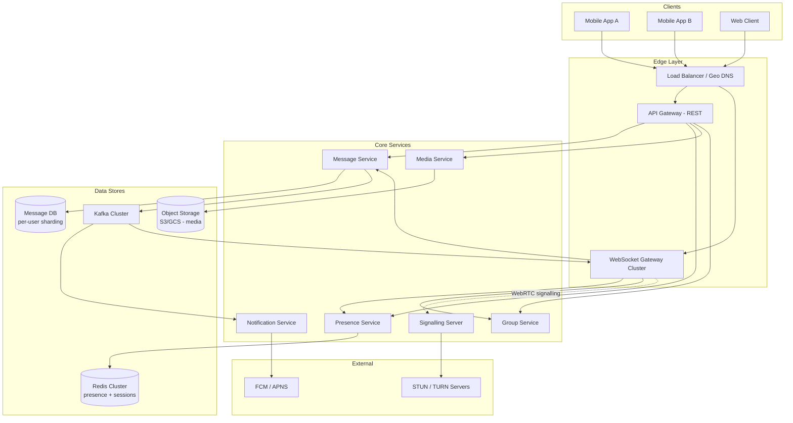

---

### API Communication Choices

| Interaction | Method | Why |
|---|---|---|
| Auth, profile, contacts | REST | CRUD, cacheable, public-facing (Phase 1) |
| Real-time messages | WebSocket | Bidirectional, low-latency, persistent (Phase 4) |
| Typing, presence, receipts | WebSocket | Real-time push, lightweight (Phase 4) |
| Offline notification | Push (FCM/APNS) | Wake device when app inactive (Phase 4.1) |
| Voice/video calls | WebRTC | P2P media, low latency (Phase 4.2) |
| Call signalling | WebSocket | Exchange ICE/SDP before P2P (Phase 4.2) |
| Internal services | gRPC | Fast, typed, streaming support (Phase 3) |
| Message fanout (groups) | Kafka | Async, scalable, ordered per partition (Phase 5) |
| Media upload | REST + pre-signed URL | Offload to object storage (Phase 6) |
| Analytics | Kafka events | Async, decoupled (Phase 5) |
| Business API webhooks | Webhook | External partner notifications (Phase 4) |

---

### Key Data Flows

#### Flow 1: Send Message (Recipient Online)

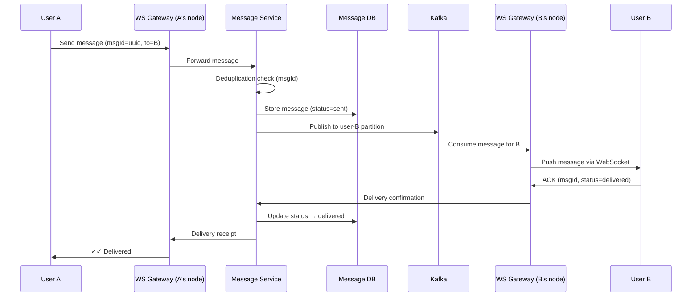

#### Flow 2: Send Message (Recipient Offline)

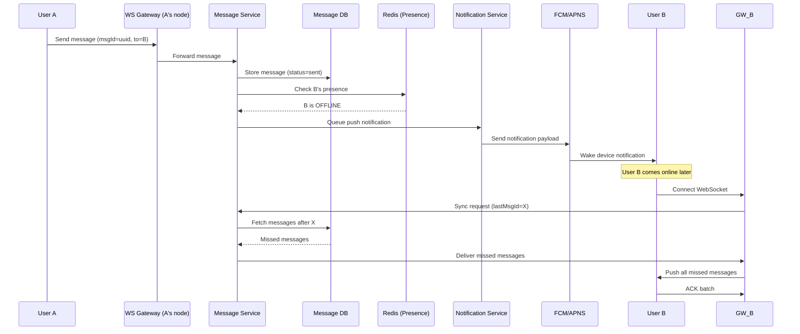

#### Flow 3: Voice Call Setup

```mermaid
sequenceDiagram
    participant A as User A
    participant SIG as Signalling Server
    participant B as User B
    participant STUN as STUN/TURN Server

    A->>SIG: Initiate call (to=B)
    SIG->>B: Incoming call notification
    B->>SIG: Accept call

    A->>STUN: Request STUN binding
    STUN-->>A: Public IP/port (srflx candidate)
    B->>STUN: Request STUN binding
    STUN-->>B: Public IP/port (srflx candidate)

    A->>SIG: Send ICE candidates + SDP offer
    SIG->>B: Forward ICE candidates + SDP offer
    B->>SIG: Send ICE candidates + SDP answer
    SIG->>A: Forward ICE candidates + SDP answer

    Note over A,B: ICE connectivity checks
    A<-->B: P2P media stream (audio/video)

    Note over A,B: If P2P fails → TURN relay
    A-->STUN: Relay via TURN
    STUN-->B: Relay via TURN
```

---

### Scaling Strategy

- **WebSocket Connections**: Sharded by `userId` across gateway nodes. Connection registry in Redis maps `userId → gatewayNode`. Consistent hashing for assignment.
- **Messages**: Sharded by `recipientId` — each user's messages colocated on one DB partition for fast sync queries.
- **Groups**: Fan-out via Kafka partitioned by `groupId`. Each group message produces N messages to member partitions.
- **Media**: Object storage (S3/GCS) for blobs + CDN for download acceleration. Pre-signed URLs bypass API layer.
- **Presence**: Redis cluster with TTL-based expiry (30s heartbeat). Pub/sub for presence change notifications.
- **Multi-region**: Connection gateways deployed in each region. Messages route cross-region via Kafka MirrorMaker. Geo DNS routes users to nearest gateway.

---

### Failure Modes & Handling

| Failure | Impact | Solution | Phase Reference |
|---|---|---|---|
| WebSocket disconnect | User misses messages | Reconnect + sync from last messageId | Phase 4 |
| Gateway node crash | Connected users dropped | Reconnect to different node, replay via stored messages | Phase 6.3 |
| Message delivered twice | Duplicate display | Message ID deduplication at client + server | Phase 7.5 |
| Push notification fails | User never notified | Retry with exponential backoff, DLQ monitoring | Phase 5, 7.6 |
| Kafka partition lag | Delayed group delivery | Monitor consumer lag, autoscale consumers | Phase 5, 6.6 |
| STUN/TURN failure | Call cannot connect | Fallback to TURN relay, regional TURN clusters | Phase 4.2 |
| Split brain in registry | Route to wrong gateway | Consensus-based registry or TTL-based expiry | Phase 7.8 |

---

### Concepts Applied

| Decision | Concept | Phase |
|---|---|---|
| WebSocket for messaging | Persistent bidirectional connection | Phase 4 |
| Push for offline | FCM/APNS wake device | Phase 4.1 |
| WebRTC for calls | P2P media, STUN/TURN/ICE | Phase 4.2 |
| Kafka for fanout | Async decoupled delivery | Phase 5 |
| gRPC internally | Fast typed service calls | Phase 3 |
| Message ID dedup | Idempotency | Phase 1, 7.5 |
| Presence in Redis | Distributed cache | Phase 6 |
| Sharding by userId | Horizontal scaling | Phase 6.3 |
| Multi-region routing | Geo DNS, regional gateways | Phase 7.3 |
| Error budget for delivery | SLO: 99.99% delivery | Phase 7.4 |

---

## Case Study 2: Design Instagram (Staff Engineer Version)

> Real-time photo/video sharing social platform supporting feed, stories, explore, DMs, and notifications for 2 billion users.

---

### Functional Requirements

- User registration, profiles, follow/unfollow
- Photo and video upload with filters
- Home feed (posts from followed users)
- Stories (ephemeral 24h content)
- Likes, comments, saves
- Notifications (likes, comments, follows, mentions)
- Direct messaging
- Search and explore (trending content)
- Reels (short-form video)

---

### Non-Functional Requirements

- Feed load time < 500ms
- Media upload < 3 seconds perceived
- Support 2B users, 500M DAU
- Read-heavy: 100:1 read/write ratio
- High availability (99.99%)
- Global low-latency access
- Eventually consistent feed (acceptable)

---

### Estimation

- Feed reads: 500M DAU × 10 opens/day = 5B feed loads/day
- QPS (feed): 5B / 86400 ≈ 58K/sec, peak 5x ≈ 290K/sec
- Posts created: 500M DAU × 0.5% active posters = 2.5M posts/day
- Storage per post: 500KB average (compressed image) → 2.5M × 500KB = 1.25TB/day
- Likes: 500M DAU × 20 likes/day = 10B likes/day → 115K/sec
- Notifications: ~5B/day

---

### High-Level Architecture

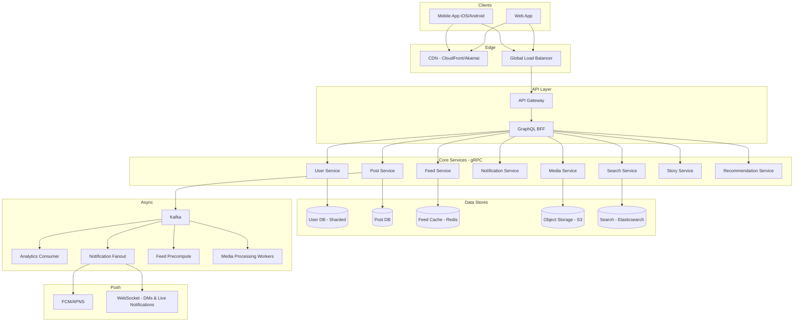

---

### API Communication Choices

| Interaction | Method | Why |
|---|---|---|
| Auth, profile CRUD | REST | Simple, cacheable, public (Phase 1) |
| Home feed, profile screen | GraphQL BFF | Avoids over/under-fetching for mobile (Phase 2) |
| Like, comment, follow | REST | Simple write operations (Phase 1) |
| Media upload | REST + pre-signed URL | Offload large file to object storage directly (Phase 6) |
| Feed ranking, recommendations | gRPC (internal) | Low-latency typed calls between services (Phase 3) |
| Direct messages | WebSocket | Real-time bidirectional (Phase 4) |
| Live notifications | SSE or WebSocket | Server push for likes/comments/follows (Phase 4) |
| Push (app closed) | FCM/APNS | Wake device for new activity (Phase 4.1) |
| Feed fanout | Kafka | Async distribution to follower feeds (Phase 5) |
| Media processing | Queue (SQS/Kafka) | Async resize, filter, thumbnail generation (Phase 5) |
| Analytics events | Kafka | View, like, scroll events streamed async (Phase 5) |
| Story expiry | Queue + TTL | Scheduled deletion after 24h (Phase 5) |

---

### Key Data Flows

#### Flow 1: Post a Photo

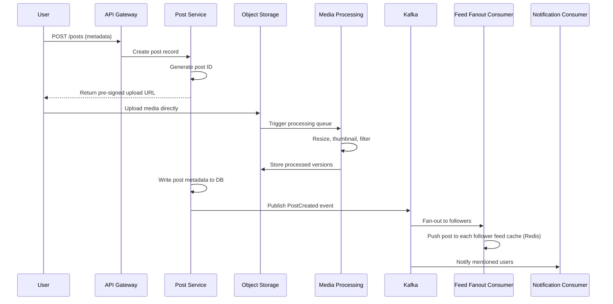

#### Flow 2: Load Home Feed

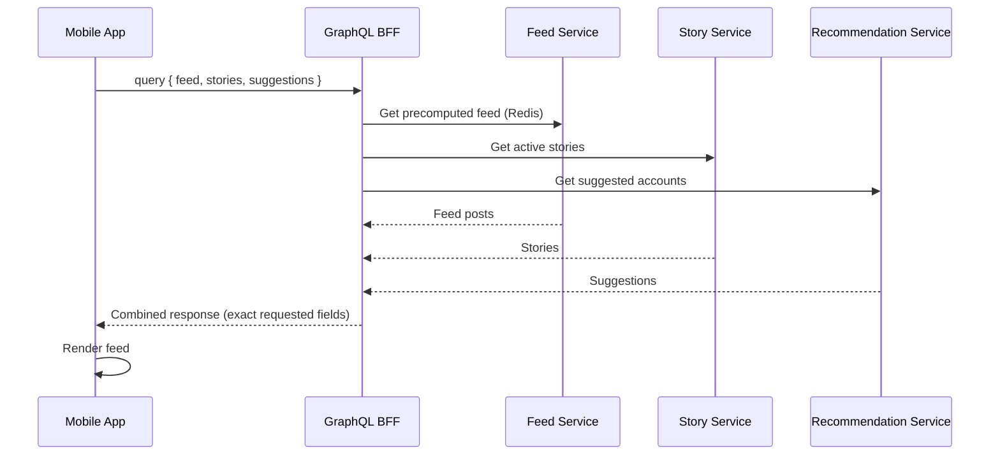

#### Flow 3: Like a Post

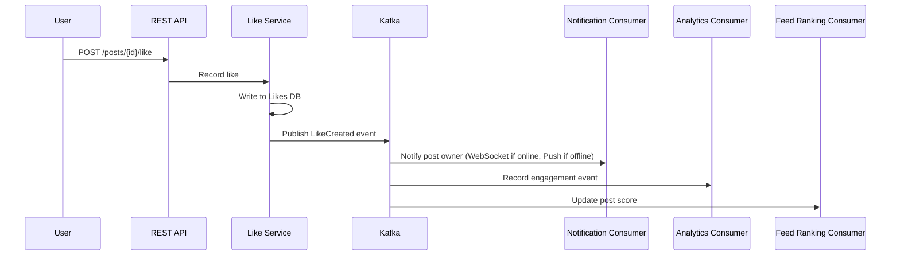

---

### Scaling Strategy

- **Feed**: Pre-computed feed stored in Redis (fan-out on write for normal users)
- **Celebrity problem**: Fan-out on read for users with >1M followers (hybrid approach)
- **Media**: Object Storage (S3) + CDN (CloudFront) for global delivery
- **Posts DB**: Sharded by userId (creator)
- **Feed Cache**: Sharded by userId (viewer)
- **Search**: Elasticsearch cluster with inverted indexes
- **Stories**: TTL-based auto-expiry, served from cache
- **Multi-region**: CDN edges globally, API in major regions

---

### Failure Modes & Handling

| Failure | Impact | Solution | Phase Reference |
|---|---|---|---|
| Feed fanout lag (celebrity posts) | Followers see delayed posts | Hybrid fanout: precompute for normal, pull for celebrities | Phase 5, 6.6 |
| Media processing fails | Post appears without image | Retry queue + DLQ, show placeholder until processed | Phase 5 |
| CDN cache miss | Slow media load | Origin fallback, pre-warm popular content | Phase 6.3 |
| GraphQL N+1 in feed | Feed API slow | DataLoader batching, resolver caching | Phase 2 |
| Notification storm (viral post) | Overwhelm notification service | Rate limit fanout, batch notifications | Phase 6.6, 7.6 |
| Like count inconsistency | Temporary wrong count | Eventually consistent, periodic reconciliation | Phase 7.7 |
| Search index lag | New posts not searchable immediately | Acceptable eventual consistency for search | Phase 7.7 |

---

### Concepts Applied

| Decision | Concept | Phase |
|---|---|---|
| GraphQL BFF for mobile | Client-driven data fetching | Phase 2 |
| Fan-out on write | Precompute feeds in cache | Phase 5 |
| Hybrid fanout for celebrities | Scale trade-off (read vs write) | Phase 5, 6.6 |
| Pre-signed URL upload | Offload media to storage | Phase 6 |
| CDN for media delivery | Edge caching | Phase 6.3 |
| Kafka for events | Decoupled async processing | Phase 5 |
| Eventually consistent likes | AP over CP for social metrics | Phase 7.7 |
| DataLoader in GraphQL | N+1 problem solution | Phase 2 |
| REST for writes | Idempotent, simple CRUD | Phase 1 |
| gRPC for ranking | Internal low-latency calls | Phase 3 |
| Push notifications | FCM/APNS for offline users | Phase 4.1 |
| Error budget for feed | SLO: 99.9% feed loads < 500ms | Phase 7.4 |

---

## Case Study 3: Design Netflix (Staff Engineer Version)

> Global video streaming platform with personalized recommendations, adaptive bitrate delivery, and multi-region resilience for 250M subscribers worldwide.

### Functional Requirements
- User registration, profiles (up to 5 per account)
- Browse catalogue (genres, trending, new releases)
- Search content
- Personalized recommendations ("Because you watched...")
- Play video (adaptive bitrate streaming)
- Continue watching / watchlist
- Download for offline
- Multi-device support

### Non-Functional Requirements
- Video start time < 2 seconds
- Zero buffering during playback (adaptive quality)
- Global availability: 99.99%
- Support 250M subscribers, 100M concurrent streams during peak
- Multi-region active-active deployment
- Content served from nearest edge (CDN)
- Recommendations refresh daily, real-time trending

### Estimation
- Concurrent viewers (peak): 100M
- Bandwidth per stream: 5 Mbps average → 100M × 5Mbps = 500 Tbps (served from CDN, not origin)
- API requests (browse/search): 250M × 20 requests/day = 5B/day → 58K QPS, peak 290K
- Viewing events: 100M streams × 1 event/minute = 100M events/min → 1.67M events/sec
- Catalogue size: 15K titles × 10MB metadata = 150GB (easily cached)
- Recommendation model: computed per user daily → 250M recommendation lists

### High-Level Architecture

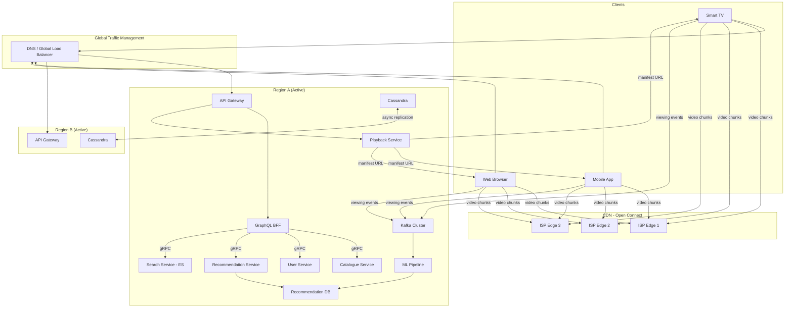

### API Communication Choices

| Interaction | Method | Why |
|---|---|---|
| Auth, profile, account | REST | CRUD, cacheable (Phase 1) |
| Homepage, browse screens | GraphQL BFF | Aggregate catalogue + recs + continue-watching (Phase 2) |
| Internal catalogue/recommendation | gRPC | Low-latency typed internal calls (Phase 3) |
| Search | REST or gRPC | Keyword → Elasticsearch via service (Phase 1, 3) |
| Play video | REST (manifest) + CDN (chunks) | Manifest URL from API, video from CDN edge (Phase 6.3) |
| Continue watching updates | SSE | Server pushes progress sync to other devices (Phase 4) |
| Viewing events | Kafka | Async stream for analytics and recommendations (Phase 5) |
| Recommendation pipeline | Kafka → Batch/Stream ML | Offline + near-real-time model updates (Phase 5) |
| Multi-region replication | Async DB replication | Eventually consistent across regions (Phase 7.3, 7.7) |
| Chaos testing | Internal tooling | Chaos Monkey, region failover drills (Phase 7.6) |

### Key Data Flows

#### Flow 1: Play Video

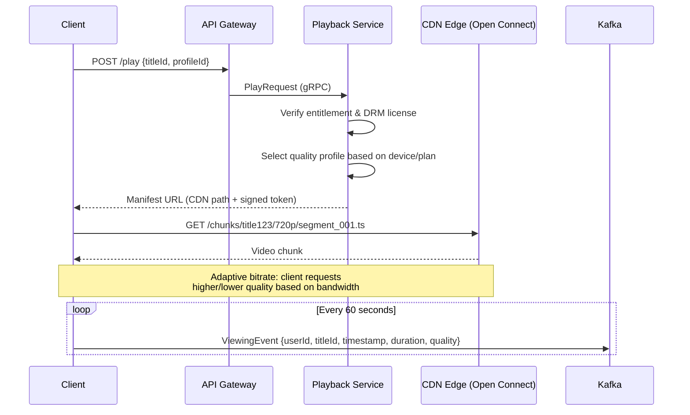

#### Flow 2: Load Homepage

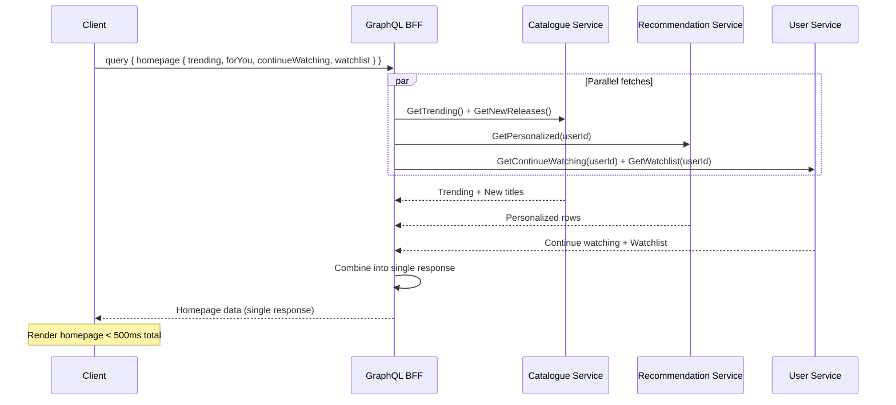

#### Flow 3: Viewing Event Pipeline

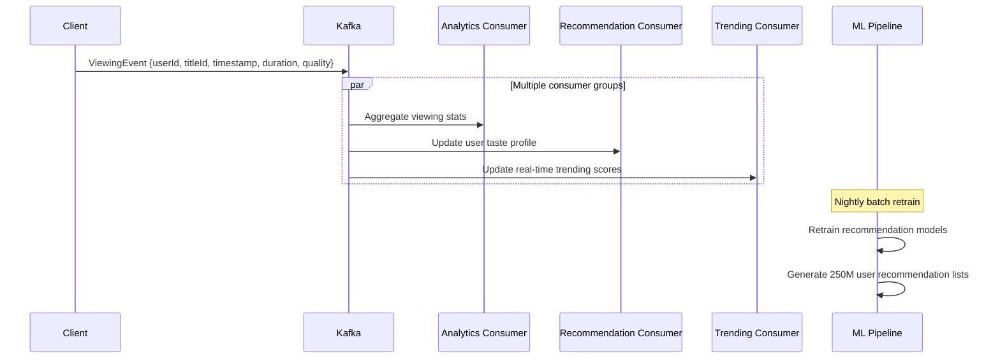

### Scaling Strategy
- **Video delivery**: CDN (Open Connect) - ISP-embedded appliances, video never hits origin at scale
- **Catalogue/metadata**: Heavily cached (Redis/Memcached), rarely changes
- **Recommendations**: Precomputed per user, stored in fast KV store, refreshed daily
- **Multi-region**: Active-active in 3+ AWS regions, Cassandra for cross-region replication
- **Search**: Elasticsearch cluster per region
- **Viewing events**: Kafka with hundreds of partitions, multiple consumer groups
- **Failover**: Region can absorb other region's traffic during outage

### Failure Modes & Handling

| Failure | Impact | Solution | Phase Reference |
|---|---|---|---|
| CDN edge down | Users in that ISP buffer | Fallback to next nearest edge, DNS failover | Phase 6.3, 7.3 |
| Region outage | Users in that region lose access | Active-active failover, DNS reroute to next region | Phase 7.3 |
| Recommendation service down | Homepage shows generic content | Graceful degradation: show cached/popular instead | Phase 7.6 |
| Kafka consumer lag | Recommendations stale, analytics delayed | Autoscale consumers, monitor lag | Phase 5, 6.6 |
| Cache stampede on new release | Metadata DB overwhelmed | Request coalescing, early refresh, stale-while-revalidate | Phase 7.6 |
| Cascading failure from slow service | Homepage latency spikes | Circuit breaker, bulkhead, timeout per service | Phase 7.6 |
| Database replication lag | User sees stale watchlist in another region | Read-your-writes consistency for critical data | Phase 7.7 |

### Concepts Applied

| Decision | Concept | Phase |
|---|---|---|
| CDN for video delivery | Edge caching, avoid origin | Phase 6.3 |
| GraphQL BFF for UI | Aggregate multiple services | Phase 2 |
| gRPC internally | Fast typed communication | Phase 3 |
| Kafka for events | High-throughput event streaming | Phase 5 |
| Active-active multi-region | Global availability, low latency | Phase 7.3 |
| Graceful degradation | Show cached/default on failure | Phase 7.6 |
| Chaos engineering | Proactively test failures | Phase 7.6 |
| Circuit breakers | Prevent cascading failures | Phase 6, 7.6 |
| Eventually consistent replication | AP choice for catalogue | Phase 7.7 |
| Latency budget | Homepage < 500ms total | Phase 7.4 |
| Error budget | 99.99% stream availability | Phase 7.4 |
| Adaptive bitrate | Client-side quality adaptation | Phase 4 (streaming concepts) |

---

## Case Study 4: Design Uber (Staff Engineer Version)

> Real-time ride-hailing platform with location tracking, driver matching, dynamic pricing, and distributed ride lifecycle management for millions of concurrent rides.

### Functional Requirements
- Rider: request ride, see nearby drivers, track ride, payment
- Driver: go online/offline, accept/reject rides, navigate, earnings
- Real-time location tracking (driver and rider)
- Matching algorithm (nearest available driver)
- Surge/dynamic pricing
- Ride lifecycle (request → match → pickup → trip → dropoff → payment)
- Trip history, ratings, receipts
- ETA calculation

### Non-Functional Requirements
- Match latency < 5 seconds
- Location update frequency: every 4 seconds per active driver
- Support: 5M concurrent rides, 20M active drivers
- 99.99% ride completion once matched
- Strong consistency for payments
- Eventually consistent for location/ETA
- Multi-city, multi-country deployment

### Estimation
- Active drivers sending location: 20M × 1 update/4sec = 5M location updates/sec
- Ride requests (peak): 100K/sec
- Trips completed/day: 20M
- Payment transactions: 20M/day
- Location storage: 5M/sec × 50 bytes = 250MB/sec → 21.6TB/day (hot data, short retention)

### High-Level Architecture

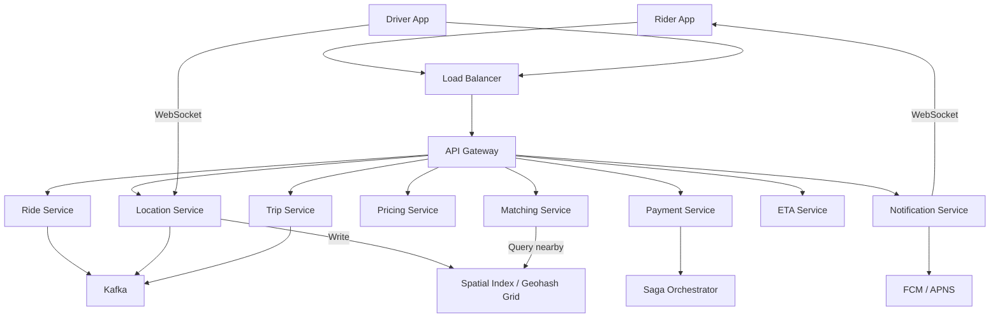

### API Communication Choices

| Interaction | Method | Why |
|---|---|---|
| Rider auth, profile, history | REST | CRUD operations (Phase 1) |
| Driver location updates | WebSocket | High-frequency bidirectional (Phase 4) |
| Rider location / ETA display | WebSocket or SSE | Real-time push to rider app (Phase 4) |
| Request ride | REST | Single request-response with idempotency key (Phase 1) |
| Driver-rider matching | gRPC (internal) | Low-latency service-to-service (Phase 3) |
| Pricing calculation | gRPC (internal) | Fast computation call (Phase 3) |
| Payment processing | Saga (orchestrated) | Distributed transaction across services (Phase 7.5) |
| Ride status updates | Push (FCM/APNS) + WebSocket | Notify rider of match/arrival/dropoff (Phase 4, 4.1) |
| Ride events | Kafka | trip.started, trip.completed async pipeline (Phase 5) |
| Receipt generation | Queue (async) | Generate PDF/email after trip (Phase 5) |
| Surge pricing broadcast | Event stream | Price updates to driver/rider apps (Phase 5) |

### Key Data Flows

#### Flow 1: Request a Ride (Saga Pattern)

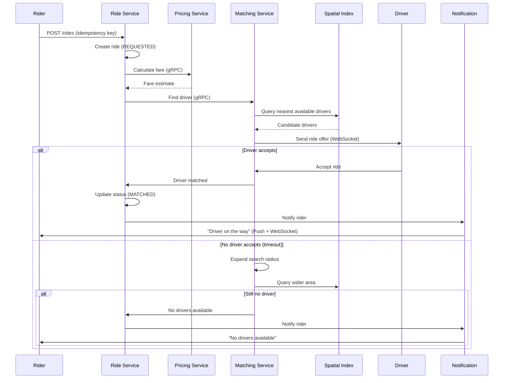

#### Flow 2: Real-Time Location Tracking

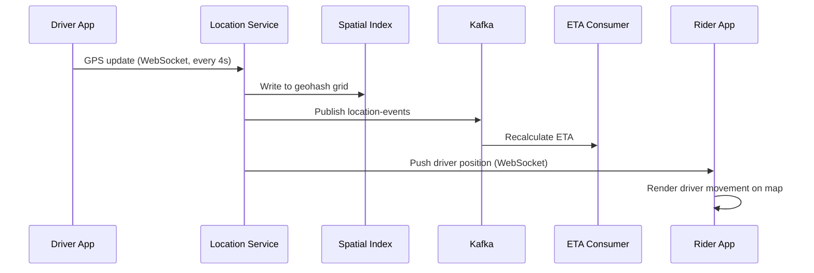

#### Flow 3: Trip Completion + Payment (Saga)

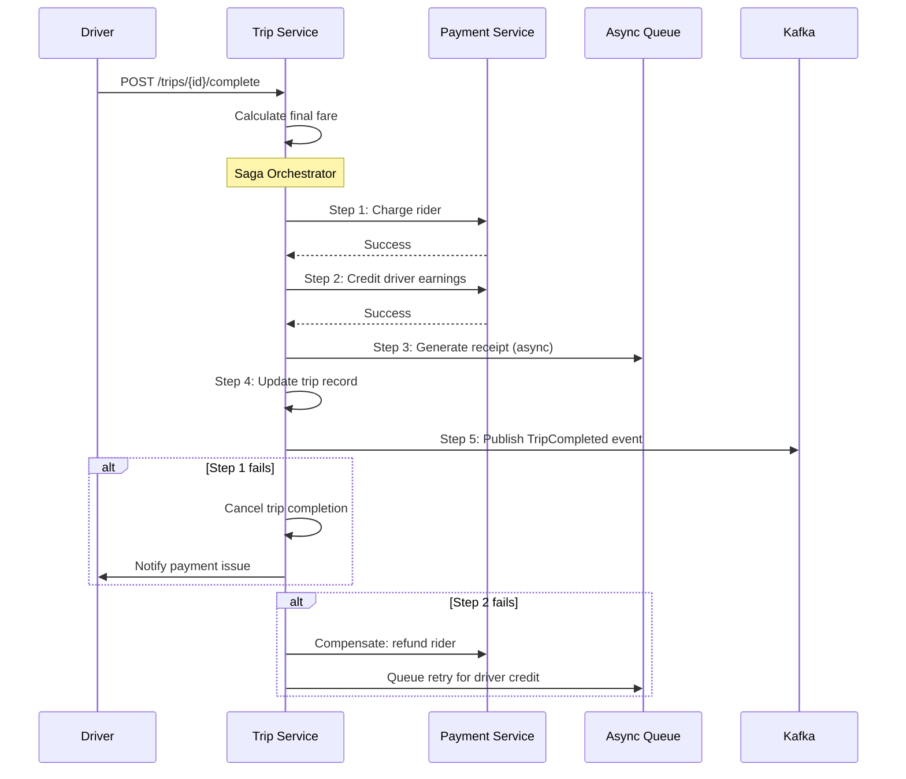

### Scaling Strategy
- **Location**: In-memory geospatial index (geohash grid), sharded by city/region
- **Matching**: Per-city matching service instances (city as sharding unit)
- **Rides**: Sharded by rideId
- **Payments**: Strong consistency (single-leader per payment shard)
- **Kafka**: Partitioned by driverId for location, rideId for ride events
- **Multi-city**: Each city operates semi-independently
- **ETA**: Precomputed road graph + real-time traffic overlay

### Failure Modes & Handling

| Failure | Impact | Solution | Phase Reference |
|---|---|---|---|
| Driver WebSocket disconnect | Location stale, rider sees frozen map | Timeout → mark driver offline after 30s silence | Phase 4 |
| Matching finds no driver | Rider waits indefinitely | Expand radius progressively, timeout with notification | Phase 6.6 |
| Payment fails after trip | Driver not paid | Saga compensation: retry payment, queue for manual resolution | Phase 7.5 |
| Location service overload | Matching uses stale positions | Backpressure, shed non-critical location writes | Phase 6.6 |
| Surge pricing service down | Incorrect pricing | Fallback to last known surge multiplier, graceful degradation | Phase 7.6 |
| Kafka consumer lag | Delayed receipts/analytics | Autoscale consumers, separate critical vs non-critical topics | Phase 5, 6.6 |
| Duplicate ride request | Rider charged twice | Idempotency key on ride creation | Phase 1 |

### Concepts Applied

| Decision | Concept | Phase |
|---|---|---|
| WebSocket for location | High-frequency real-time updates | Phase 4 |
| Saga for payment | Distributed transaction without 2PC | Phase 7.5 |
| Geospatial index | Efficient nearest-driver lookup | Phase 6 |
| Kafka for events | Async decoupled event pipeline | Phase 5 |
| gRPC for matching/pricing | Low-latency internal calls | Phase 3 |
| Idempotency key for rides | Prevent duplicate charges | Phase 1, 7.5 |
| Per-city sharding | Domain-based horizontal scaling | Phase 6.3 |
| Push + WebSocket | Ride status for online/offline riders | Phase 4, 4.1 |
| Backpressure on location | Protect system under load | Phase 6.6 |
| Circuit breaker for pricing | Prevent cascading failure | Phase 6, 7.6 |
| Compensation in Saga | Business rollback on failure | Phase 7.5 |

---

## Case Study 5: Design Twitter/X (Staff Engineer Version)

> Microblogging platform with timeline, real-time feed, trending topics, search, and fan-out challenges for 500M users.

### Functional Requirements
- Post tweets (text, media, links)
- Home timeline (tweets from followed users)
- User timeline (all tweets by one user)
- Follow/unfollow users
- Like, retweet, reply
- Trending topics
- Search (tweets, users, hashtags)
- Notifications
- Direct messages

### Non-Functional Requirements
- Timeline load < 300ms
- Tweet delivery to followers < 5 seconds
- 500M users, 200M DAU
- 500M tweets/day
- Highly available (AP for timeline, CP for DMs)
- Celebrity handles (50M+ followers) must not break system
- Global deployment

### Estimation
- Tweets/day: 500M → 5,800/sec, peak 30K/sec
- Timeline reads: 200M DAU × 20 reads/day = 4B/day → 46K/sec, peak 230K/sec
- Fan-out: Average user has 200 followers → 500M tweets × 200 = 100B feed insertions/day (if fan-out on write)
- Celebrity problem: 1 tweet by user with 50M followers = 50M fan-out operations
- Storage: 500M tweets × 500 bytes = 250GB/day tweets, media separate

### High-Level Architecture

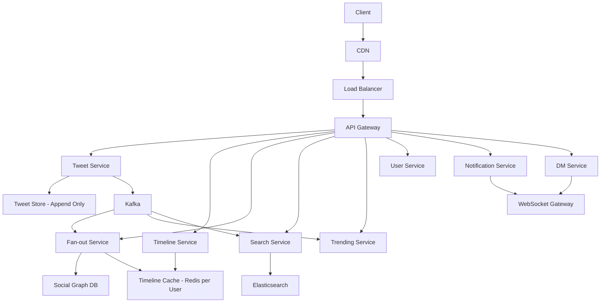

### API Communication Choices

| Interaction | Method | Why |
|---|---|---|
| Post tweet | REST (POST /tweets) | Write operation with idempotency (Phase 1) |
| Home timeline | REST (GET /timeline) | Read from precomputed cache (Phase 1) |
| Like, retweet | REST | Simple writes (Phase 1) |
| Real-time notifications | WebSocket | Live push for mentions, likes, retweets (Phase 4) |
| Direct messages | WebSocket | Real-time bidirectional (Phase 4) |
| Fan-out to followers | Kafka + workers | Async delivery to timeline caches (Phase 5) |
| Trending computation | Kafka Streams | Real-time aggregation pipeline (Phase 5) |
| Internal ranking/search | gRPC | Fast typed service calls (Phase 3) |
| Push (app closed) | FCM/APNS | Notify offline users (Phase 4.1) |
| Search indexing | Kafka → Elasticsearch | Async index updates (Phase 5) |

### Key Data Flows

#### Flow 1: Post a Tweet (Fan-out)

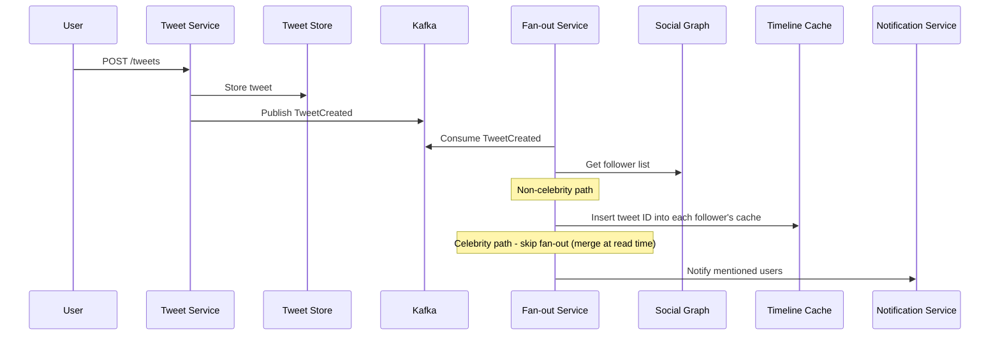

#### Flow 2: Load Home Timeline

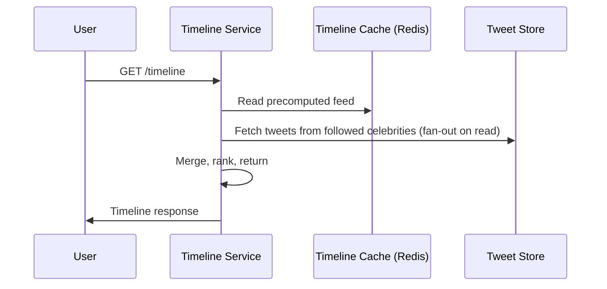

#### Flow 3: Trending Topics

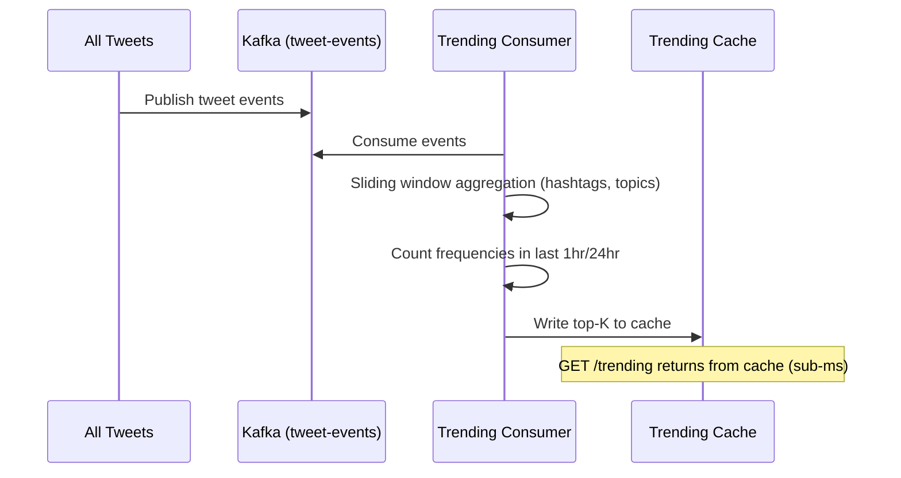

### Scaling Strategy
- **Timeline**: Fan-out on write for normal users (precompute into Redis)
- **Celebrity exception**: Fan-out on read (merge at query time) — hybrid approach
- **Tweet storage**: Append-only log, sharded by tweetId
- **Social graph**: Separate graph DB or adjacency list store, sharded by userId
- **Timeline cache**: Redis cluster, sharded by userId (viewer)
- **Search**: Elasticsearch cluster, near-real-time indexing via Kafka
- **Trending**: In-memory sliding window counters, served from cache
- **Rate limiting**: Per-user write limits (prevent spam), per-IP read limits

### Failure Modes & Handling

| Failure | Impact | Solution | Phase Reference |
|---|---|---|---|
| Fan-out lag for viral tweet | Followers see delayed tweet | Accept eventual consistency, prioritize active users | Phase 5, 7.7 |
| Timeline cache miss | Slow timeline load | Rebuild from tweet store + social graph on miss | Phase 6 |
| Celebrity fan-out explosion | System overwhelmed | Hybrid: fan-out on read for celebrities | Phase 5, 6.6 |
| Search index lag | New tweets not searchable | Acceptable ~10s delay, async indexing | Phase 7.7 |
| Trending manipulation (bots) | Fake trends | Bot detection, velocity checks, abuse ML | Phase 7.6 |
| DM delivery failure | Message lost | At-least-once + idempotent consumer + retry | Phase 5, 7.5 |
| Thundering herd on trending topic | Cache + DB overwhelm | Request coalescing, stale-while-revalidate | Phase 7.6 |

### Concepts Applied

| Decision | Concept | Phase |
|---|---|---|
| Fan-out on write | Precompute timelines | Phase 5 |
| Hybrid fan-out | Scale trade-off for celebrities | Phase 5, 6.6 |
| Kafka for event pipeline | Async decoupled processing | Phase 5 |
| Redis for timeline cache | Fast read path | Phase 6 |
| Rate limiting | Abuse prevention | Phase 6, 7.6 |
| Eventually consistent timeline | AP choice | Phase 7.7 |
| WebSocket for DMs | Real-time messaging | Phase 4 |
| Sliding window for trending | Stream processing | Phase 5 |
| Elasticsearch for search | Full-text search | Phase 6 |
| Idempotency for tweets | Prevent duplicate posts | Phase 1 |

---

## Case Study 6: Design YouTube (Staff Engineer Version)

> Video sharing platform with upload, processing, streaming, recommendations, and comments for 2.5B monthly active users.

### Functional Requirements
- Video upload (any format, up to 12 hours)
- Video processing (transcode to multiple resolutions/formats)
- Video streaming (adaptive bitrate)
- Search videos
- Recommendations ("Up next", homepage)
- Likes, comments, subscriptions
- Notifications (new video from subscribed channel)
- Live streaming
- Watch history, playlists

### Non-Functional Requirements
- Upload processing < 30 minutes for typical video
- Playback start < 2 seconds
- Support 2.5B MAU, 1B hours watched/day
- 500 hours of video uploaded every minute
- 99.99% playback availability
- Global CDN delivery
- Eventually consistent view counts

### Estimation
- Video uploads: 500 hours/min = 720K videos/day
- Transcoding: Each video → 5 resolutions × 3 formats = 15 versions → 720K × 15 = 10.8M transcoding jobs/day
- Concurrent viewers (peak): 100M
- Bandwidth: 100M × 4Mbps = 400 Tbps (from CDN)
- Storage growth: 500 hours/min × 60 min × 24hr × 1GB/hr = 720TB/day raw upload
- View events: 5B views/day → 58K events/sec
- Comments: 500M/day

### High-Level Architecture

```mermaid
graph TD
    Uploader --> US[Upload Service]
    US --> OS1[Object Storage - Raw Video]
    US --> K[Kafka]
    K --> TQ[Transcoding Queue]
    TQ --> TW[Transcoding Workers]
    TW --> OS2[Object Storage - Processed Videos]
    TW --> MS[Metadata Service]
    MS --> DB[Video Metadata DB]
    Viewer --> GW[API Gateway]
    GW --> VS[Video Service]
    GW --> SS[Search Service]
    GW --> RS[Recommendation Service]
    GW --> CS[Comment Service]
    GW --> SubS[Subscription Service]
    GW --> NS[Notification Service]
    VS --> CDN[CDN Edge Network]
    CDN --> Viewer
    K --> ViewPipeline[View Event Pipeline]
    K --> RecPipeline[Recommendation Pipeline]
    RecPipeline --> RecDB[Recommendation Cache]
```

### API Communication Choices

| Interaction | Method | Why |
|---|---|---|
| Upload video metadata | REST | CRUD for video info (Phase 1) |
| Upload video file | REST + resumable upload / pre-signed URL | Large file upload with resume support (Phase 6) |
| Transcoding jobs | Queue (SQS/Kafka) | Async heavy processing, retry on failure (Phase 5) |
| Play video | REST (manifest) + CDN (chunks) | Manifest from API, video from edge (Phase 6.3) |
| Homepage, search | GraphQL BFF or REST | Aggregate recs + trending + subscriptions (Phase 2) |
| Internal rec/search services | gRPC | Low-latency typed calls (Phase 3) |
| View/engagement events | Kafka | High-throughput async pipeline (Phase 5) |
| New video notifications | Kafka → Push (FCM/APNS) | Async fan-out to subscribers (Phase 4.1, 5) |
| Live streaming | WebSocket/RTMP ingest + HLS/DASH delivery | Real-time ingest, adaptive playback (Phase 4) |
| Comment notifications | WebSocket/SSE | Real-time for active viewers (Phase 4) |

### Key Data Flows

#### Flow 1: Upload and Process Video

```mermaid
sequenceDiagram
    participant C as Creator
    participant US as Upload Service
    participant OS as Object Storage
    participant K as Kafka
    participant TW as Transcoding Workers
    participant MS as Metadata Service
    participant NS as Notification Service

    C->>US: Request upload URL (resumable)
    US->>C: Return pre-signed upload URL
    C->>OS: Upload raw video (resumable, chunked)
    OS->>US: Upload complete callback
    US->>K: Publish VideoUploaded
    TW->>K: Consume VideoUploaded
    TW->>OS: Transcode to 5 resolutions
    TW->>MS: Update metadata (status: READY)
    NS->>K: Consume VideoReady
    NS->>NS: Notify subscribers via FCM/APNS
```

#### Flow 2: Watch a Video

```mermaid
sequenceDiagram
    participant V as Viewer
    participant VS as Video Service
    participant CDN as CDN Edge
    participant K as Kafka
    participant VC as View Count Consumer
    participant RC as Recommendation Consumer

    V->>VS: GET /videos/{id}
    VS->>V: Return metadata + manifest URL
    V->>CDN: Request video chunks (adaptive bitrate)
    CDN->>V: Serve video chunks
    V->>K: Send ViewEvent (userId, videoId, watchTime, quality)
    VC->>K: Consume ViewEvent
    VC->>VC: Increment count (eventually consistent)
    RC->>K: Consume ViewEvent
    RC->>RC: Update viewer's taste profile
```

#### Flow 3: Recommendation Pipeline

```mermaid
sequenceDiagram
    participant K as Kafka (ViewEvents)
    participant RT as Real-time Feature Pipeline
    participant Batch as Nightly Batch Job
    participant RS as Recommendation Service
    participant Cache as Rec Cache
    participant AB as A/B Testing

    K->>RT: Stream view events
    RT->>RT: Update user embedding in real-time
    Batch->>Batch: Retrain collaborative filtering models (nightly)
    RS->>RS: Compute top-N from model + user features
    RS->>Cache: Store precomputed recommendations
    AB->>AB: Route users to different models
    Note over Cache: Homepage/Up-next served from cache
```

### Scaling Strategy
- **Video storage**: Object storage (S3/GCS), essentially unlimited
- **CDN**: Global edge network (Google's network), video chunks cached at edge
- **Transcoding**: Horizontally scalable worker fleet, autoscale by queue depth
- **Metadata**: Sharded DB by videoId
- **View counts**: Eventually consistent counters (periodic batch aggregation)
- **Search**: Elasticsearch cluster with video metadata + captions
- **Recommendations**: Precomputed per user, served from fast KV store
- **Upload**: Resumable uploads (handle mobile disconnects gracefully)
- **Comments**: Sharded by videoId, paginated with cursor

### Failure Modes & Handling

| Failure | Impact | Solution | Phase Reference |
|---|---|---|---|
| Transcoding worker crash | Video stuck in processing | Message remains in queue, another worker picks up | Phase 5 |
| CDN edge failure | Viewers in region buffer | DNS failover to next nearest edge | Phase 6.3, 7.3 |
| Upload interrupted | Partial upload lost | Resumable upload — resume from last chunk | Phase 1 |
| View count inconsistency | Shows 1.2M vs 1.3M temporarily | Eventually consistent, batch reconcile hourly | Phase 7.7 |
| Recommendation service down | Homepage shows generic trending | Graceful degradation, fallback to popular/trending | Phase 7.6 |
| Notification storm (popular creator uploads) | Millions of push notifications | Queue-based fan-out, rate-limited delivery | Phase 5, 6.6 |
| Comment spam flood | Garbage comments | Rate limiting + ML spam detection | Phase 6, 7.6 |
| Kafka lag on view events | Stale recommendations, delayed analytics | Monitor lag, autoscale consumers | Phase 5, 6.6 |

### Concepts Applied

| Decision | Concept | Phase |
|---|---|---|
| Queue for transcoding | Async heavy processing, retry | Phase 5 |
| CDN for video delivery | Edge caching, global delivery | Phase 6.3 |
| Resumable upload | Handle unreliable networks | Phase 1 |
| Kafka for events | High-throughput event pipeline | Phase 5 |
| Eventually consistent counts | AP trade-off for non-critical data | Phase 7.7 |
| Graceful degradation for recs | Show popular on failure | Phase 7.6 |
| GraphQL BFF for homepage | Aggregate multiple services | Phase 2 |
| gRPC for internal | Fast typed service calls | Phase 3 |
| Push for notifications | FCM/APNS to subscribers | Phase 4.1 |
| Autoscale by queue depth | Reactive scaling | Phase 6.6 |
| Batch + streaming ML | Recommendation freshness | Phase 5 |

---

## How Other Systems Map

These systems are variations of the patterns above. A Staff Engineer recognises the building blocks:

### Amazon / Amazon Prime

| Component | Maps To | Pattern From |
|---|---|---|
| Product catalogue browse | Netflix (catalogue + CDN) | REST + Cache + CDN |
| Order placement | Uber (Saga lifecycle) | Saga Pattern (Phase 7.5) |
| Payment processing | Uber (Saga + idempotency) | Distributed transactions |
| Inventory management | Uber (real-time state) | Event-driven + strong consistency |
| Delivery tracking | Uber (location tracking) | WebSocket + push |
| Prime Video streaming | Netflix (exactly) | CDN + adaptive bitrate |
| Recommendations | Netflix (ML pipeline) | Kafka + batch ML |
| Order notifications | WhatsApp (push) | Kafka → FCM/APNS |

### LinkedIn

| Component | Maps To | Pattern From |
|---|---|---|
| Feed | Twitter/X (fan-out) | Hybrid fan-out on write/read |
| Connections | Twitter (social graph) | Graph DB + fan-out |
| Messaging | WhatsApp (WebSocket) | Persistent connection + offline queue |
| Job search | YouTube (search) | Elasticsearch |
| Notifications | Instagram (push + WebSocket) | Event-driven + push |
| Profile views | Instagram (analytics) | Kafka event pipeline |
| Skill endorsements | Twitter (likes) | Async event + counters |

### Snapchat

| Component | Maps To | Pattern From |
|---|---|---|
| Stories (ephemeral) | Instagram Stories | TTL-based expiry + CDN |
| Messaging | WhatsApp | WebSocket + push + offline delivery |
| Video/photo capture | Instagram (media upload) | Pre-signed URL + processing queue |
| Discover feed | Instagram Explore | Recommendation + CDN |
| Video calls | WhatsApp (WebRTC) | P2P + STUN/TURN |
| Snap Map (location) | Uber (location) | WebSocket + geospatial index |

### JioHotstar (Indian Streaming)

| Component | Maps To | Pattern From |
|---|---|---|
| Live cricket/sports | YouTube Live | RTMP ingest + HLS/DASH delivery |
| VOD streaming | Netflix (exactly) | CDN + adaptive bitrate |
| Massive concurrent viewers (100M+) | Netflix scale × 3 for live events | CDN + regional edge |
| Recommendations | Netflix | Kafka + ML pipeline |
| Multiple languages | YouTube (multi-track) | Manifest with language tracks |
| Ads insertion | YouTube (ad events) | Server-side ad stitching |
| Surge handling (IPL final) | Uber surge + Netflix peak | Autoscale + CDN pre-warm + load shed |

---

## The Meta Pattern

After studying all 6 case studies, a pattern emerges. Every large-scale system follows the same skeleton:

```mermaid
graph TB
    subgraph Edge ["Edge Layer"]
        CDN[CDN / Edge Cache]
        GLB[Global Load Balancer]
    end
    
    subgraph Gateway ["Gateway Layer"]
        GW[API Gateway<br/>Auth · Rate Limit · Route]
    end
    
    subgraph API ["API Layer"]
        REST[REST APIs<br/>Public CRUD]
        GQL[GraphQL BFF<br/>Mobile/Web Aggregation]
        WS[WebSocket Gateway<br/>Real-Time]
    end
    
    subgraph Services ["Service Layer"]
        S1[Domain Services<br/>gRPC Internal]
    end
    
    subgraph Async ["Async Layer"]
        K[Kafka / Event Bus]
        Q[Task Queues]
    end
    
    subgraph Data ["Data Layer"]
        DB[(Databases<br/>Sharded)]
        Cache[(Redis Cache)]
        Search[(Search Index)]
        Store[(Object Storage)]
    end
    
    subgraph Consumers ["Consumer Layer"]
        AN[Analytics]
        ML[ML / Recommendations]
        NF[Notifications]
        PROC[Processing Workers]
    end
    
    Edge --> Gateway --> API
    API --> Services
    Services --> Data
    Services --> Async
    Async --> Consumers
    WS -.->|Push| Edge
```

### The Universal Formula

Every system design interview answer can be structured as:

| Layer | Technology Choice | Why |
|---|---|---|
| **Edge** | CDN + Global LB | Low latency, absorb traffic |
| **Gateway** | API Gateway | Auth, rate limit, route |
| **Public API** | REST (CRUD) + GraphQL (aggregation) | Clients need both |
| **Real-time** | WebSocket/SSE | Push updates |
| **Internal** | gRPC | Fast, typed, streaming |
| **Async** | Kafka + Queues | Decouple, buffer, retry |
| **Data** | Sharded DB + Redis + Search | Scale reads and writes |
| **Storage** | Object Storage + CDN | Media, files, static |
| **Reliability** | Circuit breakers, retry, DLQ, Saga | Handle failures |
| **Observability** | Logs + Metrics + Traces | Detect and debug |
| **Evolution** | Versioning, CDC, Schema registry | Safe changes |

### The Staff Engineer Checklist (Use in Every Interview)

Before drawing ANY architecture:

```
1. REQUIREMENTS — What exactly must the system do?
2. ESTIMATION — How big is it? (QPS, storage, bandwidth)
3. API DESIGN — Which protocol for which interaction?
4. HIGH-LEVEL — Draw the architecture
5. DATA MODEL — Key entities and relationships
6. DATA FLOW — Trace critical operations end-to-end
7. SCALING — How does each component scale?
8. FAILURES — What breaks and how do we handle it?
9. TRADE-OFFS — What did we choose and why?
10. EVOLUTION — How does this change in 5 years?
```

This 10-step framework works for WhatsApp, Instagram, Netflix, Uber, Twitter, YouTube, Amazon, LinkedIn, Snapchat, JioHotstar, and any system you will ever be asked to design.

---

## The Journey is Complete

```
Phase 0: What is an API?
Phase 1: REST — the foundation
Phase 2: GraphQL — flexible data fetching  
Phase 3: gRPC — fast internal communication
Phase 4: Real-time — WebSocket, Push, WebRTC
Phase 5: Async — Kafka, Queues, Event-Driven
Phase 6: Architecture — Gateway, BFF, Mesh, LB
Phase 7: Expert — CAP, Raft, Saga, SLO, CDC
Phase 8: Case Studies — Everything combined
```

You now have the complete mental framework to:
- **Design** any distributed system
- **Choose** the right communication protocol for each interaction  
- **Handle** failures at every layer
- **Scale** from zero to billions of users
- **Evolve** systems safely over years
- **Communicate** trade-offs like a Staff Engineer

> *"Real systems do not use only one communication method. The expert-level mindset is knowing when to use each — and why."*

---

[← Back to Main README](../README.md) | [Previous: Expert Design](08-EXPERT-API-DESIGN.md)

---
